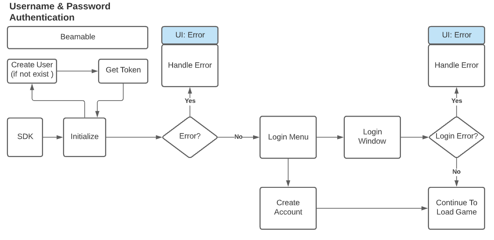

# Username / Password

Username and Password is a great way to provide cross platform authentication if you do not want social integration. In addition, you can use this method for allowing a player to signup for your game or service.

Beamable will create a user account for you when you initialize, but you can use this feature to also provide additional credentials for sign-in.

!!! info "UI & Edge Cases"
    Using a custom username and password feature in your game does require some additional work and considerations. You will have to create multiple screens for sign-up, auto sign-in, password recovery, and error handling.

Below is a simple username and password flow where, after initializing, we prompt the user for how they want to proceed. They have the option to create a new account or to log in. This example doesn't include flows for password recovery or account switching. However, those can be also implemented.

{: style="height:auto;width:600px"}

Using the username and password feature is easy. There are just a few APIs you need to know about to be ready to go. Read more here to learn how to use `AddEmail` and `RecoverAccountWithEmail` methods of the `PlayerAccounts` SDK.

## Declarations

The following code samples assume that you have already initialized the SDK.

```csharp
private BeamContext _beamContext;

private async void Start()
{
    _beamContext = BeamContext.Default;
    await _beamContext.OnReady;
    await _beamContext.Accounts.OnReady;
}
```

## Adding Email

The Beamable SDK always has an implicit account after the `BeamContext` has been created. Various credentials may be added to the account, such as an email and password.

```csharp
public async Promise AddEmail(string email, string password)
{
    var result = await _beamContext.Accounts.AddEmail(email, password);
    if (!result.isSuccess)
    {
        Debug.LogError($"Failed to add email, reason=[{result.error}]");
    }
}
```

!!! warning "Error Handling"
    Be sure to properly handle errors that may come from `AddEmail`. For example, such errors can occur if the email address is not unique.

## Login User

If an email and password have been added to an existing account, that account can be recovered by supplying the original credentials. In this code snippet, the `RecoverAccountWithEmail` function returns a operation handle that shows the recovered account before setting the current `BeamContext` to that account. The `operation.account` can be used to show the user information about the account before calling the `SwitchToAccount` function, which will change the `BeamContext`'s current account.

```csharp
public async Promise Login(string email, string password)
{
    var operation = await _beamContext.Accounts.RecoverAccountWithEmail(email, password);
    if (operation.isSuccess)
    {
        Debug.Log($"Found existing account, playerId=[{operation.account.GamerTag}]");
        operation.SwitchToAccount();
    }
    else
    {
        Debug.LogError($"Failed to recovery account via email, reason=[{operation.error}]");
    }
}
```

!!! warning "Error Handling"
    If login fails, you will get an error which you must handle appropriately. This can happen if the username and/or password are incorrect. More than likely, you would want to surface this error to the player via the UI.
