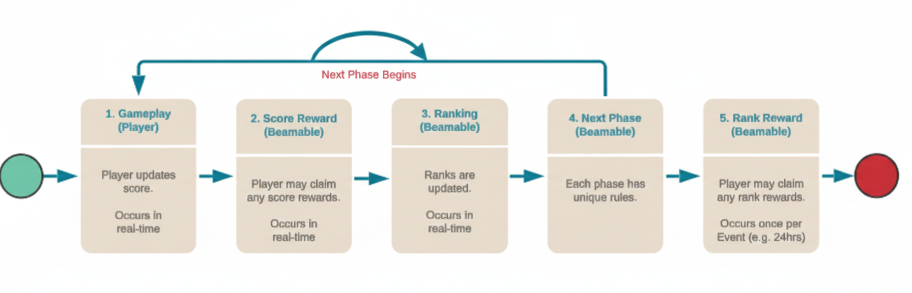
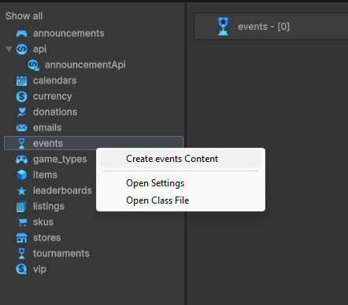
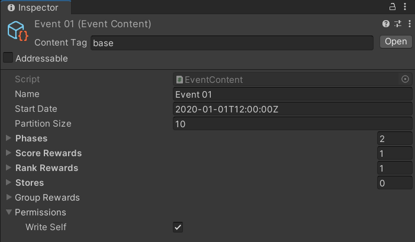
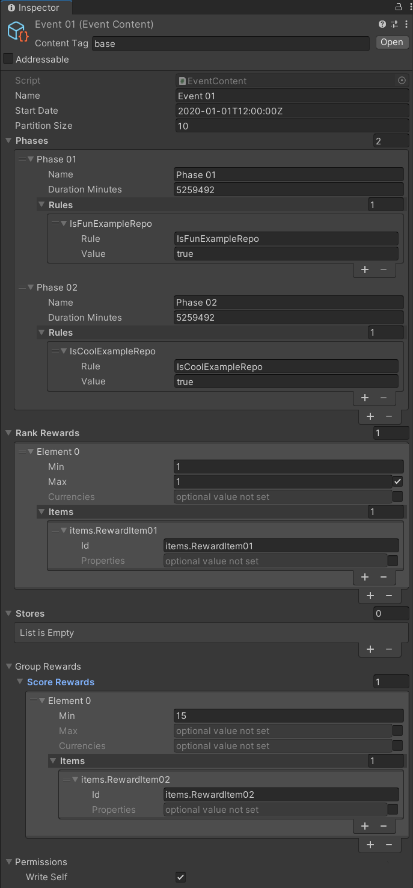
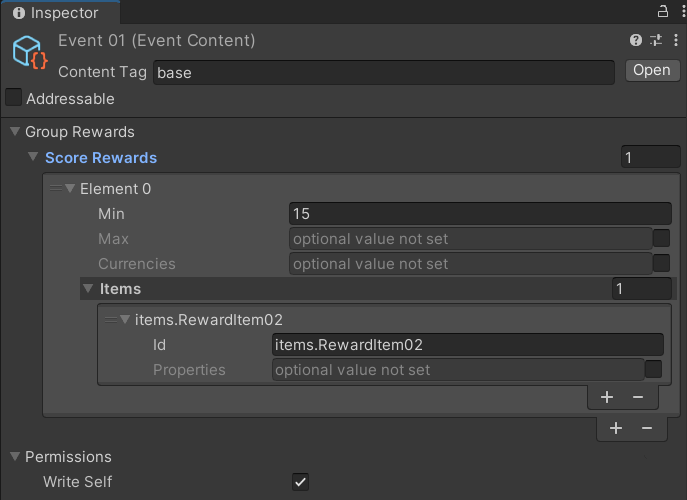

# Events - Overview

The Beamable **Events** feature allows game makers to create engaging time-limited competitions and activities for players.

The purpose of this feature is to allow the game maker to set up a one-time Events competition for players.

Events provide a powerful way to drive player engagement through time-limited challenges, competitions, and special activities that create urgency and community participation.

Beamable offers two main types of live events to engage your player community:

- **1. Tournaments** – Competitive events with structured phases and rankings. See [Tournament Flow](doc:tournaments-prefab) for more info.
- **2. Events** – Flexible time-limited activities and challenges. Continue reading below for more info.

Events provide an engaging user experience through time-limited activities that encourage regular gameplay and community participation.



Here is the glossary of Events competition terms:

| Term           | Meaning                                                                                                                                                                                                                                                              |
|----------------|----------------------------------------------------------------------------------------------------------------------------------------------------------------------------------------------------------------------------------------------------------------------|
| Partition Size | The number of Event players in **direct** competition (e.g., 50).                                                                                                                                                                                                    |
| Phase          | Each phase is a unique time period within the event.<br/><br/>_Example: Phase I could be "collect gems", whereas Phase II could be "collect swords" ⁠— these actions ultimately contribute to a single score on a [Leaderboard](doc:leaderboards-feature-overview)._ |
| Phase Duration | The duration of time between each phase (e.g., 24 Hrs). The sum duration of all phases is the Event duration.                                                                                                                                                        |
| Rank           | The position of a player score, relative to the game's community.                                                                                                                                                                                                    |
| Reward         | The extrinsic payoff to the player, calculated score and score rank.<br/><br/>_Note: Currency Content and/or Item Content may be rewarded._                                                                                                                          |
| Rule           | Rules that are applied to the player. See [Advanced](#advanced) for more info.                                                                                                                                                                                       |
| Score          | The in-game performance of a player, often represented as a number (e.g., "100" points).                                                                                                                                                                             |

## Events API

The `EventsServiceExample.cs` snippet demonstrates common API for Beamable's [EventService.cs](https://csharp.cdocs.beamable.com/latest/classBeamable_1_1Api_1_1Events_1_1EventsService.html).

EventsServiceExample.cs
```csharp
using System;
using System.Collections.Generic;
using System.Threading.Tasks;
using Beamable.Common;
using Beamable.Common.Api.Events;
using Beamable.Examples.Shared;
using UnityEngine;
using UnityEngine.Events;

namespace Beamable.Examples.Services.EventsService
{
   /// <summary>
   /// Holds data for use in the <see cref="EventsServiceExampleUI"/>.
   /// </summary>
   [System.Serializable]
   public class EventsServiceExampleData
   {
      public long Dbid = 0;
      public double Score = 0;
      public List<string> RunningEventsLogs = new List<string>();
      public List<string> SetScoreLogs = new List<string>();
      public List<string> ClaimLogs = new List<string>();

      public bool SetScoreButtonIsInteractable = true;
   }
   
   [System.Serializable]
   public class RefreshedUnityEvent : UnityEvent<EventsServiceExampleData> { }
   
   /// <summary>
   /// Demonstrates <see cref="EventsService"/>.
   /// </summary>
   public class EventsServiceExample : MonoBehaviour
   {
      //  Events  ---------------------------------------
      [HideInInspector]
      public RefreshedUnityEvent OnRefreshed = new RefreshedUnityEvent();
      
      
      //  Fields  ---------------------------------------
      private BeamContext _beamContext;
      private EventsServiceExampleData _data = new EventsServiceExampleData();

      
      //  Unity Methods  --------------------------------
      protected void Start()
      {
         Debug.Log($"Start()");

         SetupBeamable();
      }

      
      //  Methods  --------------------------------------
      private async void SetupBeamable()
      { 
         _beamContext = BeamContext.Default;
         await _beamContext.OnReady;

         _data.Dbid = _beamContext.PlayerId;
         Debug.Log($"beamContext.PlayerId = {_data.Dbid}");

         // Fetch All Events
         _beamContext.Api.EventsService.Subscribe(eventsGetResponse =>
         {
            _data.RunningEventsLogs.Clear();
            int index = 0;
            foreach (EventView eventView in eventsGetResponse.running)
            {
               index++;
               string endTime = $"{eventView.endTime.ToShortDateString()} at " +
                                $"{eventView.endTime.ToShortTimeString()}";
               
               string totalPhaseCount = eventView.allPhases.Count.ToString();
               string totalRulesCount = eventView.currentPhase.rules.Count.ToString();
               string currentPhase = eventView.currentPhase.name;
               _data.Score = eventView.score;
               double groupScore = eventView.groupRewards.groupScore;
               
               string eventLog = $"Event #{index}\n" +
                     $"\n\tname = {eventView.name}" + 
                     $"\n\tendTime = {endTime}" +
                     $"\n\ttotalPhaseCount = {totalPhaseCount}" +
                     $"\n\ttotalRulesCount = {totalRulesCount}" + 
                                 
                     $"\n\n  (Standard Events)" +
                     $"\n\tcurrentPhase = {currentPhase}" +
                     $"\n\tscore = {_data.Score}" +

                     $"\n\n  (Group Events)" +
                     $"\n\tgroupScore = {groupScore}";
               
               _data.RunningEventsLogs.Add(eventLog);
               _data.SetScoreButtonIsInteractable = true;
            }
            Refresh();
         });

         Refresh();
      }

      
      public async void SetScoreInEvents()
      {
         _data.SetScoreButtonIsInteractable = false;
         _data.Score += 1;
         
         // SetScore() in **ALL** events.
         // Typical usage is to SetScore() in just one event.
         EventsGetResponse eventsGetResponse = await _beamContext.Api.EventsService.GetCurrent();
         foreach (EventView eventView in eventsGetResponse.running)
         {
            Unit unit = await _beamContext.Api.EventsService.SetScore(
               eventView.id, _data.Score, false, new Dictionary<string, object>());

            string score = $"SetScore()" +
                         $"\n\tname = {eventView.name}" +
                         $"\n\tscore = {_data.Score}";
            _data.SetScoreLogs.Clear();
            _data.SetScoreLogs.Add(score);
         }
         
         Refresh();
         
         // HACK: Force refresh here (0.10.1)
         // wait (arbitrary milliseconds) for refresh to complete 
         _beamContext.Api.EventsService.Subscribable.ForceRefresh();
         await Task.Delay(300); 
         
         Refresh();
      }
      
      
      public async void ClaimRewardsInEvents()
      {
         _data.ClaimLogs.Clear();
         
         // Claim() in **ALL** events.
         // Typical usage is to Claim() in just one event.
         EventsGetResponse eventsGetResponse = await _beamContext.Api.EventsService.GetCurrent();
         foreach (EventView eventView in eventsGetResponse.running)
         {
            // STANDARD EVENTS
            // The systems supports scoreRewards (redeemable at any time)
            // and rankRewards (redeemable only at end of phase)
            // For this example, we'll honor only scoreRewards
            bool hasClaimableScoreReward = false;
            foreach (var eventReward in eventView.scoreRewards)
            {
               if (eventReward.earned && !eventReward.claimed)
               {
                  Debug.Log($"ClaimableScore. min = {eventReward.min}, " +
                            $"max = {eventReward.max}");
                  
                  hasClaimableScoreReward = true;
               }
            }
            
            // GROUP EVENTS
            // The systems supports scoreRewards (redeemable at any time)
            // and rankRewards (redeemable only at end of phase)
            // For this example, we'll honor only scoreRewards
            bool hasClaimableGroupScoreReward = false;
            if (eventView.groupRewards != null && eventView.groupRewards.scoreRewards != null)
            {
               foreach (var eventReward in eventView.groupRewards.scoreRewards)
               {
                  if (eventReward.earned && !eventReward.claimed)
                  {
                     Debug.Log($"ClaimableGroupScore. min = {eventReward.min}, " +
                               $"max = {eventReward.max}");
                  
                     hasClaimableGroupScoreReward = true;
                  }
               }
            }
            
            // Get value, or default
            double? groupScore = eventView?.groupRewards?.groupScore;
            groupScore = groupScore.HasValue ? groupScore.Value: 0;
            
            bool canClaim = hasClaimableScoreReward || hasClaimableGroupScoreReward;
            string claim = "";
            if (canClaim)
            {
               // Claim() fails if there is nothing to be claimed
               try
               {
                  EventClaimResponse eventClaimResponse = await 
                      _beamContext.Api.EventsService.Claim(eventView.id);
                  
                  // Get value, or default
                  int? groupScoreRewardsCount = eventClaimResponse.view.groupRewards?.scoreRewards?.Count;
                  groupScoreRewardsCount = groupScoreRewardsCount.HasValue ? groupScoreRewardsCount.Value: 0;

                  claim += $"Claim() Success\n" +
                           $"\n\tname = {eventView.name}" +
                           $"\n\tcanClaim= {canClaim}" +
                           $"\n\thasClaimableScoreReward = {hasClaimableScoreReward}" +
                           
                           $"\n\n  (Standard Events)" +
                           $"\n\trankRewards = {eventClaimResponse.view.rankRewards.Count}" +
                           $"\n\tscoreRewards = {eventClaimResponse.view.scoreRewards.Count}" +
                           
                           $"\n\n  (Group Events)" +
                           $"\n\tgroupScoreRewardsCount = {groupScoreRewardsCount}";
               }
               catch (Exception e)
               {
                  claim += $"Claim() Failed" +
                           $"\n\tname = {eventView.name}" +
                           $"\n\tcanClaim= {canClaim}" +
                           $"\n\thasClaimableScoreReward = {hasClaimableScoreReward}" +
                           $"\n\terror = {e.Message}";
               }
            }
            else
            {
               claim += $"Claim() not called." +
                        $"\n\tname = {eventView.name}" +
                        $"\n\tcanClaim= {canClaim}" +
                        $"\n\thasClaimableScoreReward = {hasClaimableScoreReward}";
            }
            

            _data.ClaimLogs.Add(claim);
     
         }
         Refresh();
      }
      
      
      public void Refresh()
      {
         string refreshLog = $"Refresh() ...\n" +
                             $"\n * RunningEventsLogs.Count = {_data.RunningEventsLogs.Count}" +
                             $"\n * SetScoreLogs.Count = {_data.SetScoreLogs.Count}" +
                             $"\n * ClaimLog.Count = {_data.ClaimLogs.Count}\n\n";
         //Debug.Log(refreshLog);
         
         // Send relevant data to the UI for rendering
         OnRefreshed?.Invoke(_data);
      }
   }
}
```

## Getting Started

Events, like many other Beamable features, are created, configured, and published via the [Content Manager](../profile-storage/content/content-unity.md#content-manager-editor). This guide is intended to show you how to create an event, configure its required (or optional) data, and publish it to your users.

Follow these steps to create and configure an event:

| Step                                                      | Detail                                                                                                                                                                                                                              |
|-----------------------------------------------------------|-------------------------------------------------------------------------------------------------------------------------------------------------------------------------------------------------------------------------------------|
| 1. Open the [Content Manager](doc:content-manager) Window | • Unity → Window → Beamable → Open Beam Content                                                                                                                                                                                     |
| 2. Create the "Event" content                             | <br/>• Select the content type in the list<br/>• Press the "Create" button<br/>• Populate the content name                       |
| 3. Select the "Event" asset                               | • Click the asset in the Content Manager Window<br/>• View the asset in the Unity Inspector Window                                                                                                                                  |
| 4. Populate all fields                                    | {: style="height:auto;width:300px"}<br/><br/>_Note: The few fields shown are the minimum requirement. See [Advanced](#advanced) for more info._ |
| 5. Save the Unity Project                                 | • Unity → File → Save Project<br/><br/>_Best Practice: If you are working on a team, commit to version control in this step._                                                                                                       |
| 6. Publish the content                                    | • Press the "Publish" button in the Content Manager Window                                                                                                                                                                          |

At this point, your event has been created and has been published live to players. To see how players can interact with the event, see the [Code](doc:events-code) section. Below are some more advanced topics, covering optional parameters for the events in your app.

In this image and tables are **example** name/value pairs to demonstrate how to populate the Event content object. The actual name and values used depend on the specific needs of the game project.

{: style="height:auto;width:400px"}

### Adding Rules

Event rules are optional and are not parsed by the client side. However, they are a powerful tool to use to create and maintain server-authoritative logic.

| Name           | Value               | Detail                                                                                                                                                                                                     |
|----------------|---------------------|------------------------------------------------------------------------------------------------------------------------------------------------------------------------------------------------------------|
| "collect_gems" | 10                  | Create custom client logic to parse the name and value.<br/><br/>Require that players meet this rule.<br/><br/>_Example: Limit which players may enter the Event or limit which players may claim rewards_ |
| "idle_content" | < some content id > | Create custom client logic to parse the name and value.<br/><br/>Require that players meet this rule.<br/><br/>_Example: Limit which players may enter the Event or limit which players may claim rewards_ |

### Adding Rewards

Event rewards are optional, but they are a fundamental part of marketing the live Event. Rewards encourage player participation.

The criteria for a reward may be either a certain score or a certain score rank.

The reward given to the player may be of currency type, of item type, or both.

| Name                  | Example Value | Example Result                                                              |
|-----------------------|---------------|-----------------------------------------------------------------------------|
| "currency.Currency01" | 10            | Each player who meets the criteria will earn 10 gems.                       |
| "items.BronzeArmor"   | 1             | Each player who meets the criteria will earn 1 Bronze Armor inventory item. |

### Adding Stores

Event stores are optional, but they are a fundamental part of monetizing a live event. Game makers can make a limited-time offer within in-game stores to encourage player purchase behavior. This creates effective monetization because there is urgency and sense of purpose to the related purchases.

Refer to the table below for an example of a limited store, where event-driven offers will be kept.

| Name       | Value                 | Detail                                                                                                                                                                      |
|------------|-----------------------|-----------------------------------------------------------------------------------------------------------------------------------------------------------------------------|
| "Store Id" | stores.LimitedStore01 | Each player in the Event will see a special "LimitedStore" version of the in-game store. Game makers can offer new items or can offer existing items at an exclusive price. |

### Adding Group Rewards

Typically, the event rewards (for the **standard** events described above) are based on the player's individual progress (score, rank, etc.) in the game and the reward is given to that individual.

However, with **group** events, rewards are based on group progress (that is, combined score of every group member). When a group event is rewarded, all **eligible** members of the group receive the reward — regardless of individual contribution to the event.

!!! warning "Important Notes"

    Here are some common issues and solutions:
    
    • To be eligible for a **group** reward, the player must join the group **before** the event begins. Or the player must be the creator of the group

See [Groups](doc:groups-feature-overview) for more information about creating and joining a group.


