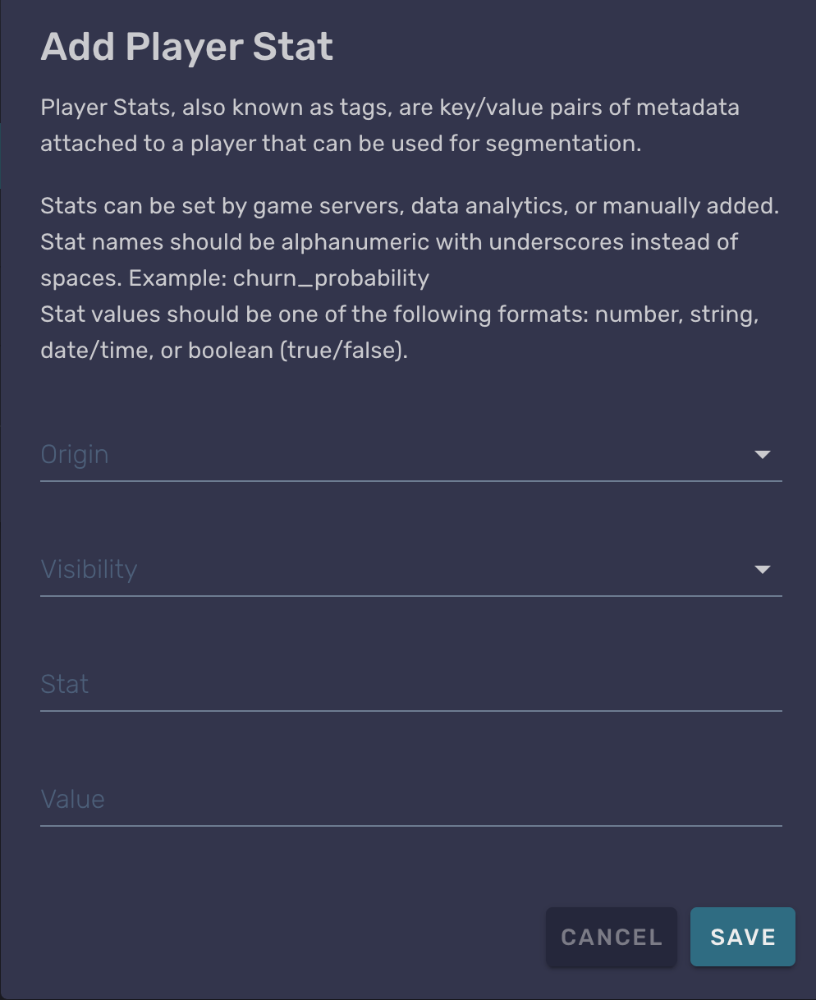
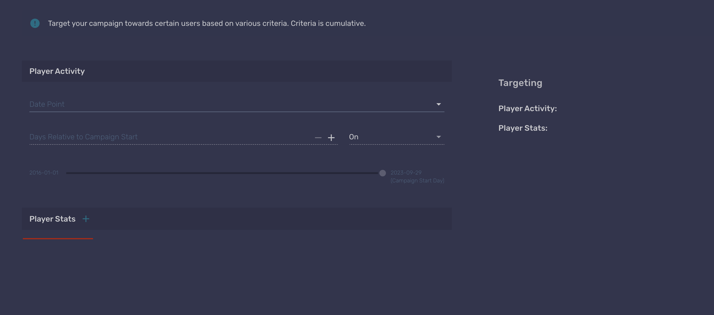
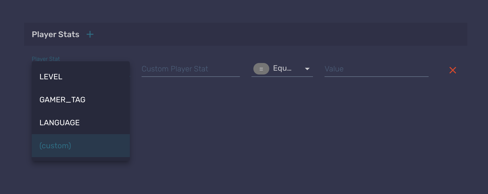
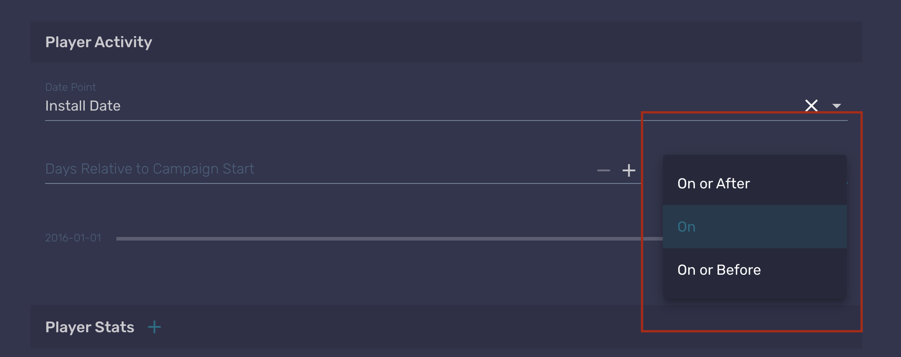

# Player Stats and Activities

Stats are a way for the Game Makers to create variables that can be used to determine players to receive campaigns [documentation](doc:campaigns) and other live ops events. These can be created in the portal page and you can use this [documentation](doc:stats) to check how it's done.

## Creating a Player Stat

A Player Stat can be created through the portal going for a specific player and creating it through the following popup:

{: style="height:auto;width:400px"}

The other way, and easier as well for doing this for all your players, is to set the stat through code, you can do it as in the example below.

```csharp
[Microservice("StatsTest")]
public class StatsTest : Microservice
{
  [ClientCallable]
  public async Task SetTestStat()
  {
    var stats = new Dictionary<string, string>
    {
      { "TEST_STAT", "test value" }
    };
    await Services.Stats.SetStats("public", stats);
  }
}
```

Values for stats are always strings, and you can do simple operations with them like `EQUALS` and `NOT EQUALS`. There are some stats that have numeric values, however these can only be set by Beamable's backend.

## Campaign with Stats

You can use Player Stats to define which players are going to receive a campaign. That can be done while creating a new campaign in the portal. In the following image you can see the stage in which this can be done.

{: style="height:auto;width:600px"}

When creating the stat, you will choose between a few automatic stats that are set by the backend. But you can choose to create a custom one, in which you will be prompted to enter the name of the stat and the value to be compared with. This conditional is going to be used to send the campaign only to those who match the stat criteria.

{: style="height:auto;width:400px"}

## Player Activities

These are used to create campaigns using time as parameters. For example, you can use the install date of players as a start point to trigger the campaign, by setting it to happen a few days after that time. The values that can be used as date points are:

- Install date
- Last session date
- Last purchase date

And as another parameter, you can set if you want the campaign to happen before and to the date point, only in the specified day or during and after that day, as showed in the image below.

{: style="height:auto;width:400px"}
