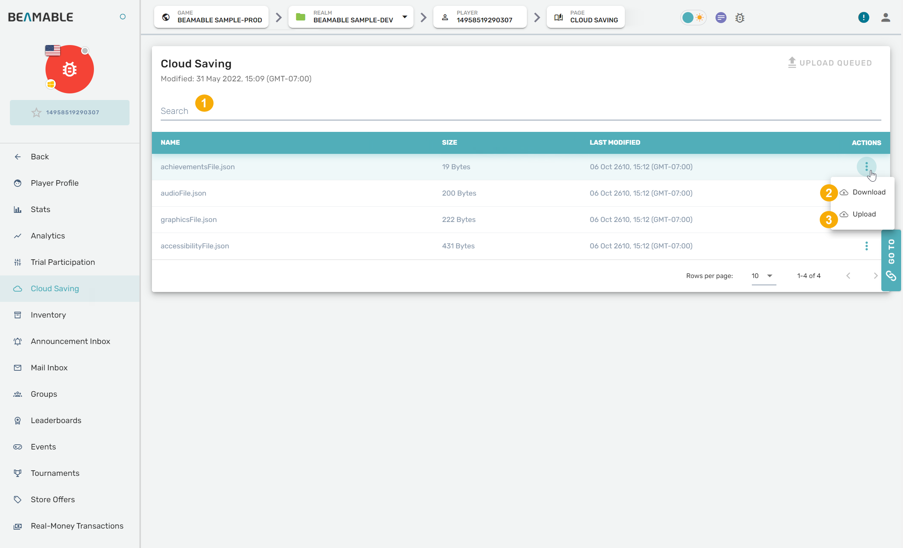

# Cloud Save - Overview

Beamable's **Cloud Save** feature provides secure, cross-platform storage for player game data. It enables players to seamlessly save their progress and access it across multiple devices, ensuring data persistence and continuity throughout their gaming experience.

**Key Benefits:**
- **Cross-Device Sync**: Players can switch between devices without losing progress
- **Automatic Conflict Resolution**: Handles data conflicts when multiple saves exist
- **Secure Storage**: Encrypted cloud storage with up to 5MB per file
- **Offline Support**: Local caching ensures gameplay continues without connectivity

!!! warning "Migrating from [Old Cloud Save Service](https://docs.beamable.com/docs/cloud-save-code)"

    If your application uses the old Cloud Save you must keep in mind some specifics when migrating to the new one:  
    • You cannot initialize both Services at the same time, the first one initialized will lock the other to be used.  
    • Both services share the same cloud storage, but the saved data are stored in different system paths. When you switch to the new one, it will automatically download your data.

### Cloud Save API

Unlike many Beamable Features, Cloud Save does not require the usage of a specific Beamable Feature Prefab. The main entry point to this feature is C# programming.

!!! info "Learning Fundamentals"

    For comprehensive learning about Beamable fundamentals, we recommend the following resources:
    
    • See [Beamable: Asynchronous Programming](https://docs.beamable.com/docs/guides-overview#asynchronous-programming) for more info

_Note: This API is demonstrated in the `CloudSavingServiceExample.cs` below._

| Method Name | Detail |
|-------------|--------|
| Init | Initializes the CloudService using the configurations from PlayerCloudSavingConfiguration. Starts resolving the save storages and downloading cloud data to local device.<br><br>By default, it uses a default instance of PlayerCloudSavingConfiguration. See this link to see how to override it.<br><br>_Note: This accepts an optional `pollingIntervalSecs` parameter which determines how often the service will scan for local file changes_ |
| ReInit | Re-initializes the CloudService. Stopping all routines, upload, and download requests to restart the system.<br><br>_Note: This accepts an optional `pollingIntervalSecs` parameter which determines how often the service will scan for local file changes_ |
| ServiceStatus | Returns a CloudSaveStatus enum with the current Cloud Saving Service Status (Inactive, Initialized, Initializing, and ConflictedData) |
| LocalDataFullPath | Returns the Full Path where the Cloud Save Files are stored in the local device. This Property will return an exception if the CloudSaving is Inactive. |
| OnManifestUpdated | This event is invoked any time that the Cloud Manifest is updated. |
| OnCloudSavingError | This event is invoked any time that an Error Occurs to the Cloud Saving. |
| ForceUploadLocalData | Forces an Upload of Local Data to the Cloud, ignoring any conflicts that may have and using Local Save. |
| ForceDownloadCloudData | Forces a Download of Cloud Data to Local Device, ignoring any conflicts that may have and using Cloud Save. |
| GetDataConflictDetails | If the Service was initialized and it wasn't possible to resolve the conflict between cloud and local. You can use this function to get the details about these conflicts. |
| ResolveDataConflict | You need to use this function to solve a conflict that happened between a local or cloud file. This function takes the conflict detail and an enum of which data to use.<br><br>_Note: If you need to merge data between local and cloud saves, you can manually save the local file and mark to use the local file as the conflict resolve type._ |
| SaveData | It allows you to save your data using the Service, allowing you to properly save the file without needing to get the full file path or handle file name sanitization. This function has 3 overrides which you can save the data as byte, string, or serialize a class/struct to the file.<br><br>_Note: The serialize save by default uses JsonUtility to serialize, but you can override it by changing the PlayerCloudSavingConfiguration.CustomSerializer._ |
| LoadDataString<br>LoadDataByte<br>LoadData<T> | Loads the Local Data using the Service, allowing you to properly load the file without needing to get the full file path or handle file name sanitization.<br><br>It returns the content of the file depending on which LoadData call is used.<br><br>_Note: The LoadData<T> by default uses JsonUtility to deserialize the data, but you can override it by changing the PlayerCloudSavingConfiguration. CustomDeserializer._ |
| Update | This function allows you to do Update operations to the CloudSaveService and apply them only once, reducing API calls to the backend.<br><br>The possible operations for the CloudDataUpdateBuilder are:<br><br>- SaveData<br>- ArchiveSaveData<br>- RenameSaveData<br>- ForgetSaveData |
| SetConflictResolverOverride | This function allows you to Override the ConflictResolver by another ConflictResolver delegate. This function is another option than the PlayerCloudSavingConfiguration.HandleConflicts which allows you to change the Conflict resolution depending on the current application scope. |

### Cloud Data Manifest

When changes are detected by the service and finished saving locally, the Local Cloud Data Manifest will be updated. Therefore, after updating data to Cloud Save, The local manifest will be updated to match the manifest from Cloud.

Cloud Saved files are written to an object store that is managed by the Cloud Saving service. The key of the object is the MD5 checksum of the content in the file, this is done to preserve the history of the files.

The manifest tracks the MD5 checksum (etag) of the file and the common name (key) of the file, so we can fetch the object by its MD5 checksum and write it to disk using the common name.

**Json Format**

```json
{
   "id":"1366764038702081",
   "manifest":[
      {
         "bucketName":"beam-cloud-saving",
         "key":"ComplexFile.json",
         "size":642,
         "lastModified":20210602112148,
         "eTag":"B0FAB230EE1DB774FFE1DE866309D720"
      }
   ],
   "replacement":false
}
```

### Changing Service Configuration

It is possible to override and adapt the service to best adapt to your application, the possible configurations are available in the `PlayerCloudSavingConfiguration` class. By default, the system will use a new instance of it if it has default values. To change their values you need to modify dependency to the Beamable Dependency Injection. The final result should look like this:

CustomRegisterExample.cs

```csharp 
[BeamContextSystem]
public class PlayerCloudSaveCustomRegister
{
	[RegisterBeamableDependencies]
	public static void RegisterServices(IDependencyBuilder builder)
	{
		// Replace the old PlayerCloudSavingConfiguration with the new instance
		builder.ReplaceSingleton<PlayerCloudSavingConfiguration>(new PlayerCloudSavingConfiguration
		{
			// UseAutoCloud = true, // Uncomment to enable AutoCloud. Check UseAutoCloud summary for more information
			//CustomSerializer = CustomSerializer, // Uncomment to apply a CustomSerializer, the example method is returning an empty string
			//CustomDeserializer = CustomDeserializer, // Uncomment to apply a CustomDeserializer, the example method is returning a null ref
			//HandleConflicts = ResolveUsingLargerFile, // Uncomment to apply a Custom Handle Conflict, the example method is resolving the conflicts using the larget file
			//HandleDownloadFileError = HandleDownloadError,
		});
	}

	private static Promise<Unit> HandleDownloadError(Exception arg)
	{
		throw new NotImplementedException();
	}

	private static void ResolveUsingLargerFile(IConflictResolver resolver)
	{
		var conflicts = new List<DataConflictDetail>(resolver.Conflicts);
		foreach (DataConflictDetail dataConflictDetail in conflicts)
		{
			bool isLocalLarger = dataConflictDetail.LocalSaveEntry.size >= dataConflictDetail.CloudSaveEntry.size;
			ConflictResolveType conflictResolveType = isLocalLarger ? ConflictResolveType.UseLocal :  ConflictResolveType.UseCloud;
			resolver.Resolve(dataConflictDetail, conflictResolveType);
		}
	}

	private static string CustomSerializer(object arg)
	{
		// Apply any Serialization, like https://www.newtonsoft.com/json/help/html/serializingjson.htm
		return string.Empty;
	}

	private static object CustomDeserializer(string arg)
	{
		// Apply any Deserializer, like https://www.newtonsoft.com/json/help/html/serializingjson.htm
		return null;
	}
}
```

### Syncing Of Data

The downloading operation uses Unity's [`DownloadHandlerFile`](https://docs.unity3d.com/6000.0/Documentation/ScriptReference/Networking.DownloadHandlerFile.html). If the file is new, it will be saved directly to the `/data/` Folder. If the file has a conflict it will be first saved to the /temp/ folder, if the resolver chooses to use the Cloud Save, it'll be moved to the `/data/` folder, if not, it will be archived.

_Note_ If the destination files are kept open by some unrelated system during the syncing process, the `CloudSavingService` will reattempt several times. Upon any ultimate failure, an `IOException` will be thrown.

### Storage Of Data

Data is stored in within Unity's [`Application.persistentDataPath`](https://docs.unity3d.com/ScriptReference/Application-persistentDataPath.html) and prefixed with the Customer ID (CID), Project ID (PID), and Player ID (PlayerId). This is to ensure data is scoped to a game and a player. The full path is available at [`ICloudSavingService.LocalDataFullPath`](https://csharp.cdocs.beamable.com/latest/classBeamable_1_1Api_1_1CloudSaving_1_1CloudSavingService.html).

There are two options for detecting changes to the Local Save files, the first one, which is the Default, is to detect changes at runtime from the manifest and the other is to use the AutoCloud feature, which detects the folder path directly.

#### Detecting Changes from Local Manifest

For this option, whenever a File is Saved using the `SaveData` functions through the service, which could be from `ICloudSavingService` or from the `CloudDataUpdateBuilder` it will update the local manifest automatically. After the polling interval taken on the `Init` function, it will automatically upload any changes to the cloud service. If you write a file directly to the `/data/` folder, this option will not detect it automatically.

#### Detecting Changes from Data Folder (AutoCloud)

The AutoCloud feature will automatically check the `/data/` folder checking for changes every polling interval and automatically uploading any changes to the cloud service. It also updates the local manifest automatically. This is slightly more expensive than the first option as it needs to keep generating the checksum for the file every polling interval, but it allows you to write the file manually to the data folder.

To enable this option, you will need to add or update the Custom dependency for `PlayerCloudSavingConfiguration` and set the property `UseAutoCloud` to true. Check the section [Changing Service Configuration](#changing-service-configuration) to see how to properly add it.

### Error Handling

Is possible that some errors occur when trying to download a saved file. The system automatically will try to download the file 10 times, if the 10th retry fails, the system will return an error. Which can be anything from no connection to a file not found. By default, the service will use the DefaultRecover, which will not throw an exception if the file cannot be found in storage, ignoring its download and using the local reference as the new one. If there is any other error, it will throw the exception.

If you want to change its behavior, you will need to add or update the Custom dependency for `PlayerCloudSavingConfiguration` and set the property `HandleDownloadFileError`. Check the section [Changing Service Configuration](#changing-service-configuration) to see how to properly add it.

## Data Limitations

There is a limit of 5MB per cloud save file.

## Data Management Via Portal

The Portal allows the game maker to manage player data as well. Search for a player, select the CloudData tab, and navigate to the player data. 

Some common use-cases for game makers include;

- **Debugging** - Play as a customer's player data to test and investigate reported issues
- **Support** - Make _minor_ edits to a player data and hot-upload it for the customer

Here are the major operations that can be performed against the player data.



| Name        | Detail                                                                                          |
| :---------- | :---------------------------------------------------------------------------------------------- |
| 1. Search   | A content-based search of the player data; search for contained terms.                          |
| 2. Download | Allows a game maker with admin privileges to download a copy of a single object of player data. |
| 3. Upload   | Replace an object of player data with a file that has the same name.                            |

!!! warning "Gotchas"

    Here are some common issues and solutions:
    
    • While Beamable supports _minor_ edits to the player data from the portal, restoring the a customer's player data completely to a historic backup state is **not supported**.  
    • The CloudSavingService **does not support** _multiple game sessions using the same user. If there are multiple sessions for the same user, for the same game, this will create an infinite ping/pong effect. E.g. Device A will send updates that Device B will fetch, which will send updates that Device A will fetch, etc..._  
    • Manually deleting content from the `LocalCloudDataFullPath` is **not supported**  
    • [Old Cloud Save Service](doc:cloud-save-code) **doesn't support** multiple files with the **same content**. If you want files with the same content (for example a backup file), please add a tag to **differentiate** them or use the [New Cloud Save Service](doc:player-cloud-save-code).

## Sample Code

Here is some sample code that demonstrates how to use the Cloud Save Service in Unity. This sample code shows all the different options for using the Cloud Save Service. Note that this is an example for reference only. We do not recommend copying directly the functions used in the sample.

CloudSavingServiceExample.cs

```csharp 
using Beamable;
using Beamable.Api.CloudSaving;
using Beamable.Common;
using Beamable.Player.CloudSaving;
using System;
using System.Globalization;
using System.Text;
using UnityEngine;
using Random = UnityEngine.Random;

public class CloudSaving_Sample : MonoBehaviour
{
	private const string MAIN_SAVE_TXT = "main_save.txt";
	private const string BACKUP_SAVE_TXT = "backup_save.txt";
	private const string BYTE_SAVE_DAT = "byte_save.dat";
	private const string GAME_SAVE_JSON = "game_save.json";
	private ICloudSavingService _cloudSavingService;
	private bool _init;

	private void Awake()
	{
		InitServiceAsync();
	}

	[ContextMenu("Check Save Data")]
	public void CheckSaveData()
	{
		CheckSaveDataAsync();
	}
	
	[ContextMenu("Update Save File")]
	public void SaveFile()
	{
		_ = SaveFileAsync();
	}

	[ContextMenu("Force Upload Save File")]
	public void ForceUploadSaveFile()
	{
		ForceUploadSaveFileAsync();
	}
	
	[ContextMenu("Force Download Save File")]
	public void ForceDownloadSaveFile()
	{
		ForceDownloadSaveFileAsync();
	}

	[ContextMenu("Update Save Files")]
	public void UpdateSaveFiles()
	{
		// Use Update Function to Handle Manifest Changes that require to commit them to Cloud
		_cloudSavingService.Update(builder =>
		{
			builder.ArchiveSaveData(BACKUP_SAVE_TXT);
			builder.RenameSaveData(GAME_SAVE_JSON, "Player_Save.json");
			builder.ForgetSaveData(BYTE_SAVE_DAT);
		});
	}

	private async void InitServiceAsync()
	{
		// Get BeamContext
		BeamContext context = await BeamContext.Default.Instance;
		
		_cloudSavingService = context.CloudSaving;
		// Register to CloudSavingError and OnManifestUpdate | This is optional, use it if you need to handle it by yourself
		_cloudSavingService.OnCloudSavingError += OnCloudSavingError;
		_cloudSavingService.OnManifestUpdated += OnManifestUpdated;
		
		// Init System and start to check for Local and Remote Changes
		await _cloudSavingService.Init(3);
		
		Debug.Log("Cloud Saving Service Initialized");

	}

	private void OnManifestUpdated(CloudSavingManifest manifest)
	{
		Debug.Log($"Manifest Updated. Items Count: {manifest.manifest.Count}");
	}

	private void OnCloudSavingError(CloudSavingError error)
	{
		Debug.Log($"Cloud Saving Error: {error.Message}");
	}

	private async void CheckSaveDataAsync()
	{
		// Load Data from Save and Check their contents
		string mainSaveContent = await _cloudSavingService.LoadDataString(MAIN_SAVE_TXT);
		Debug.Log($"Main Save Data: {mainSaveContent}");
		string backupSaveContent = await _cloudSavingService.LoadDataString(BACKUP_SAVE_TXT);
		Debug.Log($"Backup Save Data: {backupSaveContent}");

		byte[] byteDataContent = await _cloudSavingService.LoadDataByte(BYTE_SAVE_DAT);
		Debug.Log($"Byte Save Data: {byteDataContent}");

		var gameSaveContent = await _cloudSavingService.LoadData<GameSave>(GAME_SAVE_JSON);
		Debug.Log(
			$"Game Save Data: Level: {gameSaveContent.level} |  Score: {gameSaveContent.score} | ExtraData: {gameSaveContent.extraData}");
	}

	private async Promise SaveFileAsync(string forceContent = null)
	{
		// Save files with random with Forced value or with random values
		
		string contents = string.IsNullOrEmpty(forceContent)
			? DateTime.UtcNow.ToString(CultureInfo.InvariantCulture)
			: forceContent;
		await _cloudSavingService.SaveData(MAIN_SAVE_TXT, contents);
		await _cloudSavingService.SaveData(BACKUP_SAVE_TXT, contents);

		GameSave gameSave = new GameSave()
		{
			level = Random.Range(1, 11), score = Random.Range(1, 100), extraData = Guid.NewGuid().ToString(),
		};
		await _cloudSavingService.SaveData(GAME_SAVE_JSON, gameSave);

		byte[] encodedBytes = Encoding.Default.GetBytes(contents);
		await _cloudSavingService.SaveData(BYTE_SAVE_DAT, encodedBytes);
	}

	private async void ForceUploadSaveFileAsync()
	{
		// Force change Files Values and Force them to be uploaded to Cloud
		await SaveFileAsync($"ForcedContent-{DateTime.Now.ToString(CultureInfo.InvariantCulture)}");
		await _cloudSavingService.ForceUploadLocalData();
	}
	
	private async void ForceDownloadSaveFileAsync()
	{
		// Force download Cloud Values replacing any Local Changes.
		await _cloudSavingService.ForceDownloadCloudData();
	}
	
	[Serializable]
	private class GameSave
	{
		public int level;
		public float score;
		public string extraData;
	}
}
```
