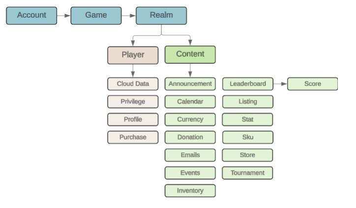
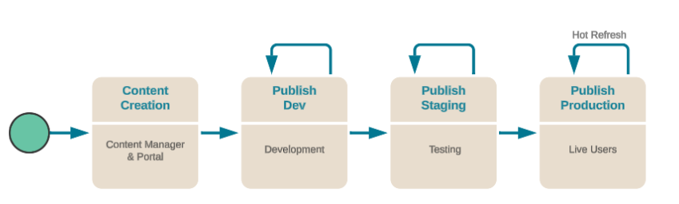

# Content - Overview

The **Content** feature allows game maker to store project-specific data objects. It's embedded into many Beamable features, such as Inventory, Store, Leaderboards, and Tournaments. For simplicity, some Beamable data structures may be omitted from this diagram.

{: style="height:auto;width:500px"}

## Content ID

The content ID is assigned at creation of a new content, and is composed of content `type` and content `id`. A content ID always starts with the content type. For example, a currency content for dollars would be:

`currency.dollars`.

One important concept of the Content ID is the "Nesting". Content IDs can be nested, and the resulting hierarchy will be baked in to the name. For example, to group "weekend" events under a common folder -- the content ID would be:

`events.weekend.<user-defined-id>`.

## Content Namespaces

Content is validated as a manifest which allows items to be validated against each other. This prevents validation errors when publishing; however, individual changes could cause validation errors after uploading; e.g., a store references a currency that no longer exists.

Namespaces are locations for content to be published so that the content does not impact content in other namespaces. Content namespaces can also be used for versioning in order to ensure older versions of the game using the same or similar content do not break.

!!! warning Global Namespace

    Beamable APIs that use content under the hood can only look to the global namespace.

## Content Data

Content types are must extend [`Beamable.Common.Content.ContentObject`](https://csharp.cdocs.beamable.com/latest/classBeamable_1_1Common_1_1Content_1_1ContentObject.html). All derive from Unity's [`ScriptableObject`](https://docs.unity3d.com/Manual/class-ScriptableObject.html). The Beamable SDK for Unity ships with all content types needed for common use cases. 

| Class Name | Related Feature | Coding Required? |
|------------|-----------------|------------------|
| [`AnnouncementContent`](https://csharp.cdocs.beamable.com/latest/classBeamable_1_1Common_1_1Announcements_1_1AnnouncementContent.html#details) | [Announcements](doc:announcements-feature-overview) | No |
| [`CalendarContent`](https://csharp.cdocs.beamable.com/latest/classBeamable_1_1Experimental_1_1Common_1_1Calendars_1_1CalendarContent.html#details) | -- | No |
| [`CurrencyContent`](https://csharp.cdocs.beamable.com/latest/classBeamable_1_1Common_1_1Inventory_1_1CurrencyContent.html#details) | [Currency](doc:virtual-currency-feature-overview) | No |
| [`EmailContent`](https://csharp.cdocs.beamable.com/latest/classBeamable_1_1Common_1_1Content_1_1EmailContent.html#details) | [Mail](doc:mail-feature-overview) | No |
| [`EventContent`](https://csharp.cdocs.beamable.com/latest/classBeamable_1_1Common_1_1Content_1_1EventContent.html#details) | [Events](doc:events-feature-overview) | No |
| [`GroupDonationsContent`](https://csharp.cdocs.beamable.com/latest/classBeamable_1_1Common_1_1Groups_1_1GroupDonationsContent.html#details) | [Groups](doc:groups-feature-overview) | No |
| [`ItemContent`](https://csharp.cdocs.beamable.com/latest/classBeamable_1_1Common_1_1Inventory_1_1ItemContent.html#details) | [Inventory](doc:inventory-feature-overview) | Optional; game makers may add `InventoryBehaviour` for custom item behavior. |
| [`LeaderboardContent`](https://csharp.cdocs.beamable.com/latest/classBeamable_1_1Common_1_1Leaderboards_1_1LeaderboardContent.html#details) | [Leaderboard](doc:leaderboards-feature-overview) | Optional; game makers may add custom code for client-authoritative scoring. |
| [`ListingContent`](https://csharp.cdocs.beamable.com/latest/classBeamable_1_1Common_1_1Shop_1_1ListingContent.html#details) | [Store](doc:stores-feature-overview) | Optional; game makers may add custom code for custom listing rendering. |
| [`SimGameType`](https://csharp.cdocs.beamable.com/latest/classBeamable_1_1Common_1_1Content_1_1SimGameType.html#details) | [Multiplayer](doc:multiplayer-feature-overview) | Optional; game makers may add custom game types. |
| [`SKUContent`](https://csharp.cdocs.beamable.com/latest/classBeamable_1_1Common_1_1Shop_1_1SKUContent.html#details) | [Store](doc:stores-feature-overview) | No |
| [`StoreContent`](https://csharp.cdocs.beamable.com/latest/classBeamable_1_1Common_1_1Shop_1_1StoreContent.html#details) | [Store](doc:stores-feature-overview) | No |
| [`TournamentContent`](https://csharp.cdocs.beamable.com/latest/classBeamable_1_1Common_1_1Tournaments_1_1TournamentContent.html#details) | [Tournaments](doc:tournaments-feature-overview) | No |
| [`VipContent`](https://csharp.cdocs.beamable.com/latest/classBeamable_1_1Common_1_1Inventory_1_1VipContent.html#details) | -- | No |

### Beamable Serialization of Custom Content Types

Unity's built-in types use [Unity's serialization](https://docs.unity3d.com/Manual/script-Serialization.html). However, Beamable's custom content types rely instead on Beamable's custom serialization. This serialization is strict and has limitations.

| Supported Types | Unsupported Types |
|-----------------|-------------------|
| • Unity's [`AssetReference`](https://docs.unity3d.com/Packages/com.unity.addressables@0.3/api/UnityEngine.AddressableAssets.AssetReference.html)<br/>• Unity's [`Color`](https://docs.unity3d.com/ScriptReference/Color.html)<br/>• `bool`<br/>• `double`<br/>• `enum`<br/>• `float`<br/>• `int`<br/>• `List`<br/>• `long`<br/>• `string`<br/>• `System.Object` (and child types)<br/>• [`ContentRef`](https://csharp.cdocs.beamable.com/latest/classBeamable_1_1Common_1_1Content_1_1ContentRef.html)<br/>• [`ContentLink`](https://csharp.cdocs.beamable.com/latest/classBeamable_1_1Common_1_1Content_1_1ContentLink.html) | • Unity's [`MonoBehaviour`](https://docs.unity3d.com/ScriptReference/MonoBehaviour.html)<br/>• Unity's [`ScriptableObject`](https://docs.unity3d.com/ScriptReference/ScriptableObject.html)<br/>• Etc... |

The `[IgnoreContentFieldAttribute]` can be applied to any field that you wish to exclude from the Content Serialization process.

MyCustomContent.cs
```csharp
[Agnostic]
[ContentType("MyCustomContent")]
public class MyCustomContent : ContentObject 
{
     public string Name;
     public AssetReferenceSprite Icon;

     [IgnoreContentFieldAttribute]
     public Dictionary<string, int> KeyValuePair;

}
```

### Inheritance Hierarchies

There might be cases where you want to have some hierarchy chain of `ContentObject` but have one of the types in the chain not be an actual `ContentType`; for example, to share code between different child `ContentTypes` but in a parent class that can never be created directly as a piece of Beamable content. You can do that by making the class abstract and **not** marking it as a `ContentType`.

The snippet below demonstrate what that would look like.

```csharp
// BaseCustomContent.cs
[ContentType("BaseCustomContent")]
[System.Serializable]
public class BaseCustomContent : ContentObject { /** (...) */ }

// AbstractCustomContent.cs
// This type is not a Beamable ContentType, but it'll share its members and functions with it's children.
[System.Serializable]
public abstract class AbstractCustomContent : BaseCustomContent { /** (...) */ }

// Leaf1CustomContent.cs
[ContentType("leaf1")]
[System.Serializable]
public class Leaf1CustomContent : AbstractCustomContent { /** (...) */ }

// Leaf2CustomContent.cs
[ContentType("leaf2")]
[System.Serializable]
public class Leaf2CustomContent : AbstractCustomContent { /** (...) */ }
```

## Content API

### Subscribing to Content Changes

The ContentService API allows you to subscribe to content changes on the server. This is useful for dynamically updating content in your game without requiring a full game update.

You can subscribe to all content changes, or filter by a specific type of content. The example below demonstrates both methods.

```csharp
private async void SetupBeamable()
{ 
    var beamContext = BeamContext.Default;
    await beamContext.OnReady;
      
    // Fetch All  
    beamContext.Api.ContentService.Subscribe(clientManifest =>
    {
        Debug.Log($"#1. ContentService, all object count = {clientManifest.entries.Count}");
    });

    // Fetch Filtered 
    beamContext.Api.ContentService.Subscribe("items", clientManifest =>
    {
        Debug.Log($"#2. ContentService, filtered 'items' object count = {clientManifest.entries.Count}");
    });
}
```

Beamable supports subscriptions to Content as well as direct references to certain pieces of content. Both of these will allow you to download content from the server, depending on the Game Maker's needs.

### ContentLink and ContentRef

Subscriptions use a PlatformSubscription to dynamically read the data on the server, and fire a callback when the data is changed. However, ContentLink and ContentRef are both resolved manually when the data is needed.

Beamable supports 2 methodologies for referencing a content object; [`ContentLink`](https://csharp.cdocs.beamable.com/latest/classBeamable_1_1Common_1_1Content_1_1ContentLink.html) and [`ContentRef`](https://csharp.cdocs.beamable.com/latest/classBeamable_1_1Common_1_1Content_1_1ContentRef.html). While they are both very similar syntactically and need to be resolved before using, they perform differently and have different use-cases.

- `ContentLink` - Beamable will perform a first frame load to resolve the reference. `ContentLink`s must be present and resolvable (that is, they cannot be `null`)
- `ContentRef` - Beamable will perform a lazy load to resolve the reference. As such, it is okay for a `ContentRef` to be `null` as long as it is never resolved

ContentServiceExistingExample.cs
```csharp
using System;
using Beamable.Common.Content;
using Beamable.Common.Inventory;
using UnityEngine;

namespace Beamable.Examples.Services.ContentService
{
    [Serializable]
    public class ItemLink : ContentLink<ItemContent> {}
    
    /// <summary>
    /// Demonstrates <see cref="ContentService"/>.
    /// </summary>
    public class ContentServiceExistingExample : MonoBehaviour
    {
        //  Fields  ---------------------------------------
        [SerializeField] private ItemLink _itemLink;
        [SerializeField] private ItemRef _itemRef;

        private ItemContent _itemContentFromLink = null;
        private ItemContent _itemContentFromRef = null;
        
        //  Unity Methods  --------------------------------
        protected void Start()
        {
            Debug.Log($"Start()");
            
            SetupBeamable();
        }

        //  Methods  --------------------------------------
        private async void SetupBeamable()
        {
            var beamContext = BeamContext.Default;
            await beamContext.OnReady;
      
            Debug.Log($"beamContext.PlayerId = {beamContext.PlayerId}");
            
            await _itemLink.Resolve()
                .Then(content =>
                {
                    _itemContentFromLink = content; 
                    Debug.Log($"_itemContentFromLink.Resolve() Success! " +
                              $"Id = {_itemContentFromLink.Id}");
                })
                .Error(ex =>
                {
                    Debug.LogError($"_itemContentFromLink.Resolve() Error!"); 
                });
            
            await _itemRef.Resolve()
                .Then(content =>
                {
                    _itemContentFromRef = content; 
                    Debug.Log($"_itemContentFromRef.Resolve() Success! " +
                              $"Id = {_itemContentFromRef.Id}");
                    
                }).Error(ex =>
                {
                    Debug.LogError($"_itemContentFromRef.Resolve() Error!"); 
                });
        }
    }
}
```

!!! info "Best Practice"

    - If the content that your game is using is known ahead of time (e.g. there will only be subtle differences in existing pieces of content), a content reference (such as ContentLink or ContentRef) should be used.
    - However, if the content in your game needs to be more dynamic (e.g. the Game Maker will be pushing entirely new pieces of content, unknown to the game client), a content subscription should be used.
    - DO: Use `ContentLink` in any member variable in your _custom_ content type which references another content type. ContentLink is useful for data that needs to be loaded quickly at runtime, since it is preloaded in very early stages of the application's lifecycle.
    - DON'T: Use `ContentRef` by default _everywhere_ in your project. This is supported but is considered overkill. ContentRef is useful for data that the application can afford to load on-demand (especially data that might not get loaded at all).

### GetManifest Method

In the SDK, the `GetManifest` function accepts a filter string, as shown in the example below. You can read more about filters in the Content Management section.

```csharp
public async Promise<IList<IContentObject>> LoadMyTaggedContent(string tag)
{
    var ctx = BeamContext.Default;

    // load a manifest that only has content including the request tag
    var manifest = await ctx.Content.GetManifest($"tag:{tag}");

    // resolve all the content in that manifest
    var content =  await manifest.ResolveAll();

    return content;
}	
```

### GetContent Method

Beamable's ContentService has another method that can pull content: GetContent. Since this method will attempt to pull several pieces of content at once, it is often inefficient, however it may be useful depending on the scope of your project.

```csharp
private string contentIdToLoad;

private async void GetContent()
{
    var rawContent = await _beamContext.Api.ContentService.GetContent(contentIdToLoad); //Returns as IContentObject
    var content = rawContent as ItemContent;
    //content can now be used as ItemContent
}
```

Filter strings do not grant type safety in the SDK, and are more prone to bugs and unintentional filtering. The above sample can be re-written with the `ContentQuery` class instead of the filter string. The `ContentQuery` allows the developer to specify constraints in a type safe way and will avoid filter serialization bugs.

```csharp
public async Promise<IList<IContentObject>> LoadMyTaggedContent(string tag)
{
   var ctx = BeamContext.Default;
   var manifest = await ctx.Content.GetManifest(new ContentQuery
   {
     TagConstraints = new HashSet<string>{ tag }
   });
   var content =  await manifest.ResolveAll();
   return content;
}
```

### Content with Microservices

This 'MyCustomContent.cs' snippet includes the  `[Agnostic]` attribute. To make content classes available to your microservices, add the attribute to your content classes.

See [Microservices](doc:microservices-feature-overview) for more info.

MyCustomContent.cs
```csharp
[Agnostic]
[ContentType("MyCustomContent")]
public class MyCustomContent : ContentObject { ... }
```

### Changing Content Namespaces
This sample shows how to switch the default content namespace to "tuna" before resolving a `CurrencyRef`.

```csharp
public class Tester : MonoBehaviour
{
    public CurrencyRef currency;

    async void Start()
    {
        var ctx = BeamContext.Default;

        ctx.Content.GetContent(content.Id, "tuna");

        var service = (ContentService)ctx.Content;
        service.SwitchDefaultManifestID("tuna");
        var content = await currency.Resolve();
    }
}
```

## Content Management

Content management is critical to keep the content in your game engaging and reactive, and Beamable provides a number of content management tools. This is a mixture of solutions within the "Beamable SDK for Unity" and Rest API calls. In addition Beamable provides some extended tools that integrate with Google Sheets as a plugin.

Beamable provides a streamlined Content Publishing pipeline. You can deploy your content across multiple environments that can be tailored to your own internal publishing workflow.

{: style="height:auto;width:500px"}

When you create your Beamable account, we automatically create a "Development to Production" pipeline of distinct environments for you. These environments are "Dev" → "Staging" → "Production". This is how we enable you to publish your content to our servers for the development environment while allowing you the peace of mind to know that the "Production" environment has not been modified.

Then, once you have tested that the new content in your environment looks correct, you can go into the Portal to promote the "Dev" content to "Staging" and eventually "Production".

### Storage Location of Content Types and Content Live Refresh

One of the main benefits of our content system is that, when you hit publish and the content updates, we will automatically refresh that content on each of the game clients via a server-to-client message. This allows for the system to be incredibly interactive at development time as well as allowing for over the air updates to players who are playing in "Production" after a content promotion.

While using the Content Manager Editor (Unity Editor) it will be saved locally to your project in the following location:

```csharp
/Assets/Beamable/Editor/content/
```

On Client's Builds (On-device) The development location is not included in the built game project. Instead, when the player loads the game, a fresh copy of all content is retrieved from the Beamable back-end and stored on-device. This allows Beamable to serve _dynamic_ content to the game project. By default, this is a lazy loading operation. Each of Beamable's feature prefabs show a loading progress indicator UI automatically.

Content is stored on-device in a within Unity's [`Application.persistentDataPath`](https://docs.unity3d.com/ScriptReference/Application-persistentDataPath.html).

```csharp
 Application.persistentDataPath + $"/content/{contentId}.json";
```
### Content Caching

Content is cached by the client and stored both in memory and persisted to disk. When content is updated on our backend, Beamable updates a client manifest and push it to all clients to invalidate and update the cache.

See source code of `Runtime/DisruptorEngine/Content/ContentCache.cs` for more info.

## Game Content Designer

Config data, or "Content" as it is called within Beamable, is realm-scoped and can be deployed from either...

- **Unity** -  Via Unity's [`ScriptableObject`](https://docs.unity3d.com/Manual/class-ScriptableObject.html)
- **Google Sheets** -  Via Beamable's [Game Content Designer](doc:game-content-designer)

Within the context of a CI/CD pipeline, game makers can create jobs that invoke the Content deployment function against data it pulled from source control, and pass in arguments for which realm this Content should go to. This is not theoretical, this is what game makers do today in production.


## Remote Configuration Workflows

A fundamental pattern for using Beamable Content is **Remote Configuration**. With modest planning, game makers can maximize the user experience while minimizing the number of game updates shipped. This workflow allows game makers to update game content remotely and do so in real-time. Games can tweak existing features, launch new features, test out functionality -- all without necessarily shipping app updates or code changes.This can be especially useful for live-ops, seasonal events, and limited-time offers.

This table summarizes the types of game changes that can be made remotely versus those that require a game update. So you can plan accordingly.

|                              | Remote Via Portal | Requires Game Update |
| :--------------------------- | :---------------- | :------------------- |
| Add/Remove/Edit Content Type | ❌                | ✔️                   |
| Add/Remove/Edit C# Code      | ❌                | ✔️                   |
| Edit Content Type _Values_   | ✔️                | ❌                   |


