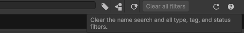
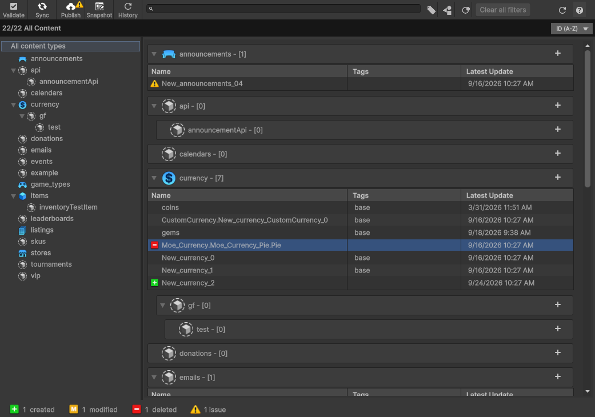
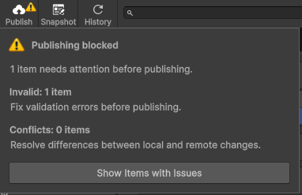
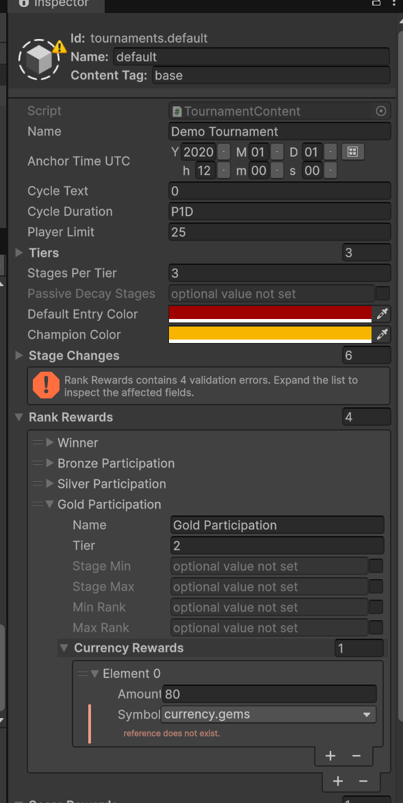

# Working with Content

Use the Content Manager to edit game content locally, resolve issues, and publish changes to a realm. Open it from the **Beamable Button → Content Manager**.

For most teams, we recommend a **shared development realm**: designers and engineers work against the same published content, while each person keeps local edits until they publish. Keep QA and production releases deliberate, separate from everyday authoring.

## Find content and understand its status

The updated window makes issues visible in the content list, footer, and **Publish** button. Hover over a status icon to see what changed and whether validation errors or conflicts block publishing. **Up to Date** means the item matches the last known realm version.

Use the wider search field and filters to narrow your list:

- Filter by name, content type, tag, or status; filter menus stay in sync with the search text
- Select **All content types** to remove only the type filter, keeping your name, tag, and status filters
- Select **Clear all filters** to reset the name search and every filter
   
- Click a footer status count to filter the list; the active status highlights in the footer
   
- Press `/` to focus search when the window is active and you are not editing another text field; press **Escape** or click outside to leave search without clearing it

{ style="width: 80%; height: auto;" }

## Fix issues before publishing

When content is invalid or conflicted, **Publish** displays an Issues badge. Click it to see separate validation and conflict counts, including any items counted in both categories. Choose **Show Items with Issues** to review them. The footer's Issues count opens the same view; both actions clear previous filters so they cannot hide affected items.

| Issue | What to do |
| --- | --- |
| Invalid | Select **Validate**, inspect the errors, and correct the affected fields |
| Conflicted | Select the item, then **Solve Conflict** in the Inspector; review the changes with the other author before choosing a version |

For conflicts, **Use Local** keeps your version for a later publish. **Use Realm** replaces your local version with the realm's version. Neither choice combines both authors' edits; reapply any changes you still need and validate again.

{ style="width: 200px; max-width: 100%; height: auto;" }

If Publish remains unavailable, hover over it to check for missing publish permission or no local changes.

---

## Working with content as a team

### Recommended: share a development realm

Use one stable authoring realm for the team instead of creating a realm for every author or content edit. This keeps collaboration manageable as the studio grows.

1. **Start together.** Select the agreed development realm and open the Content Manager; auto-sync receives published remote changes
2. **Edit locally.** Coordinate ownership when two people need to change the same item; teammates receive your changes after you publish
3. **Review issues.** Validate your content and resolve conflicts before publishing
4. **Publish intentionally.** Check the target realm and review the created, modified, and deleted items in the publish summary before confirming
5. **Test together.** Verify the published content in the shared environment before promoting it through your studio's QA and production process

Auto-sync receives remote changes and flags incompatible local edits. **Sync** offers actions that revert local changes to the realm version; review its confirmation before discarding work.

### Alternative: track content snapshots in Git

A Git-based workflow can suit an engineering-led team that needs content changes reviewed alongside code. Agree whether the realm or a committed snapshot is authoritative before mixing workflows.

Use shared **content snapshots** for Git tracking and keep `.beamable/local/` ignored. For automatic snapshots on publish, set **Project Settings → Beamable → Content → On Publish Auto Snapshot Type** to **Shared Only** or **Both**, then commit the intended snapshot from `.beamable/shared/contentSnapshots/<PID>/`.

**Pulling from Git does not apply a snapshot.** After pulling content changes, open **Snapshot**, select the agreed snapshot, review its additions, modifications, and deletions, then select **Restore Snapshot**. Preserve unfinished work first: restoring can replace local content. Validate and publish separately when that state should become the realm's version.

See [content version control](./content-unity.md#version-control-advisory) and the CLI [snapshot](../../../../../cli/commands/cli-command-reference/content/snapshot.md) and [restore](../../../../../cli/commands/cli-command-reference/content/restore.md) references for details.
