# Unity Editor Integration of Beamable Content Services

The Unity SDK many features to support the Beamable Content Service within the Unity Editor including a Content Manager window, Conflict Handlings, Validation tools and others

## Content Manager Editor

The new **Content Manager in Unity** now uses the **Beamable CLI Content Manager**, enabling content management even outside Unity.

While the previous Unity implementation relied on saved on disk **ScriptableObjects**, this updated version reads and parses the **JSON files** (the CLI's format) into memory-only **ScriptableObjects**. This ensures full compatibility with CLI workflows while preserving all Unity-specific features.

This change unifies content management across Beamable's ecosystem without disrupting existing Unity workflows.

To open the Content Manager, select it from the Beamable Button.

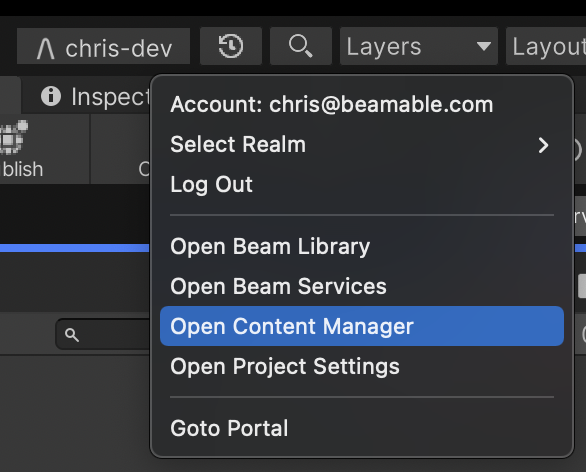{: style="height:auto;width:400px"}

Here is the user interface of the Beamable "Content Manager" tool window.

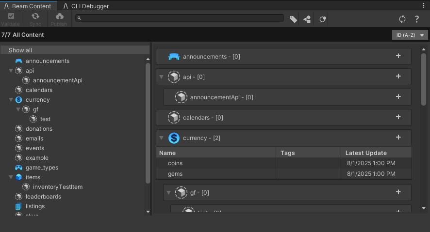{: style="height:auto;width:500px"}

### Content Status Bar
Provide quick information about the status of local content compared to remote content.

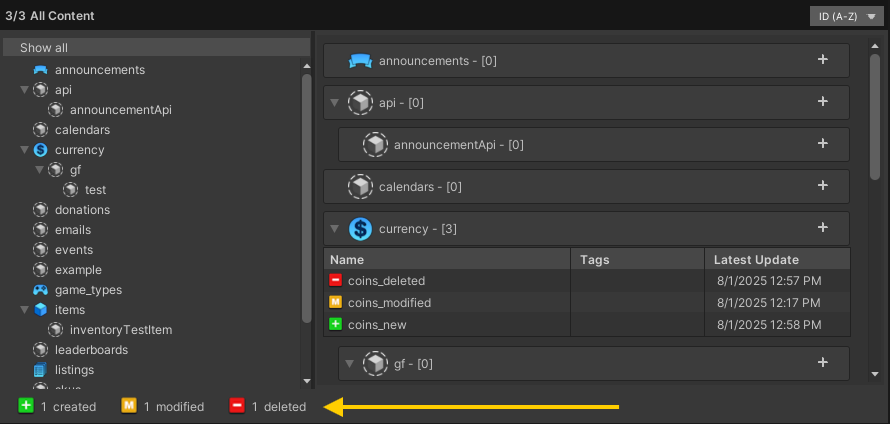{: style="height:auto;width:600px"}

The level of the status bar indicates the overall state of local content:

| Name       | Detail                                                        |
| :--------- | :------------------------------------------------------------ |
| Invalid    | • Content has validation issues and cannot be published       |
| Created    | • Content exists locally only                                 |
| Deleted    | • Content is removed on the local only                        |
| Modified   | • Content is modified on the client only                      |
| Up to Date | • Content local data matches remote data                      |
| Conflicted | • Content local and remote data is modified and doesn't match |

### Auto-Sync

The Content Manager now supports **Auto-Sync**, which automatically detects remote content changes and downloads them to your local environment. No manual syncing required.

**Automatic Updates:** Whenever content is modified or created remotely, the changes are seamlessly pulled to your local workspace.

**Conflict Handling:**  
A file is marked as **Conflicted** only when:

- Both local and remote versions have been modified, **and**
- The changes are incompatible (i.e., they don't match).

**No conflict is triggered if:**

- Both sides made identical changes (e.g., the same field updated to the same value).
- The file is deleted on both sides.
- Only one side has changes (remote-only or local-only modifications sync normally).

This feature streamlines collaboration by keeping content in sync while safeguarding local edits.

### Validate
The validation window automatically filters any invalid content and lists it in a list. It centralizes all invalid content and validation error messages into a single place, allowing you to fix them individually without needing to search for them in the Content Editor.

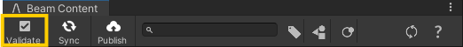{: style="height:auto;width:400px"}


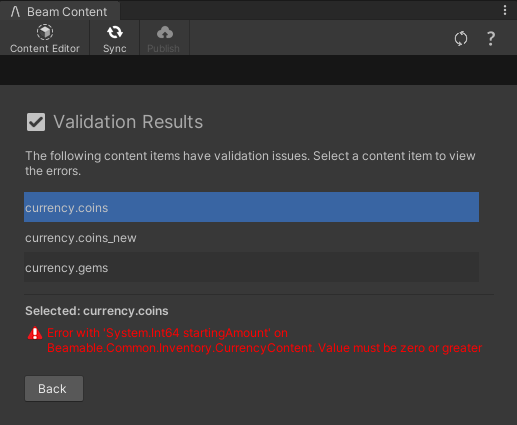{: style="height:auto;width:400px"}

### Sync
The Sync operation enables synchronization between local and remote content, reverting any local changes to match the remote data on Realm. 

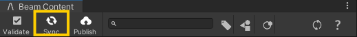{: style="height:auto;width:400px"}


You can choose to sync specific content types:

- **All Modified**: Updates local versions of remotely modified files
- **All Conflicted**: Resolves conflicts by syncing remote changes
- **All Deleted**: Removes locally deleted files from remote
- **All Newly Created on Local**: Uploads new local content to remote
- **Revert All**: Discards all local changes (Modified, Created, Deleted, and Conflicted

Then, the Revert Contents validation window gets all local changes and splits them into four categories:

- **Created**
- **Deleted** 
- **Modified** 
- **Conflicted** 

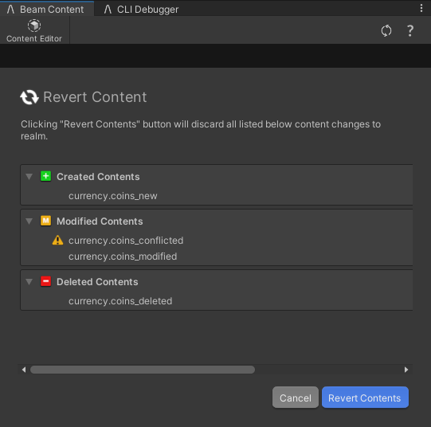{: style="height:auto;width:400px"}

After validating which contents will be reverted, the content manager will start the process of reverting your local data to match the target Realm.

### Publish

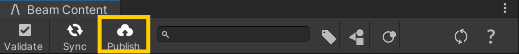{: style="height:auto;width:400px"}

The publish process compares the local content to the Beamable back-end and shows the publish confirmation window. 

The publish confirmation window organizes local changes into three categories:

- **Created** 
- **Deleted** 
- **Modified**

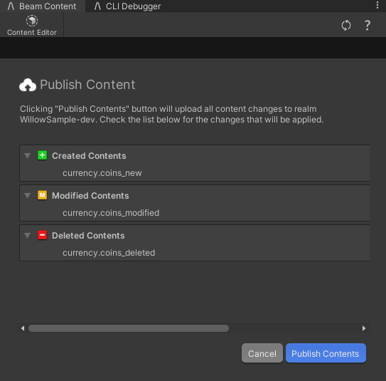{: style="height:auto;width:400px"}

When executed, the operation:

1. Uploads all changes to the target Realm
2. Updates the content manifest

Once published, development can safely continue within the game maker's Unity Editor and within the Unity Editor of other team-members. Any players connected to that Realm receive the updated content as well.

**Publish Restrictions**

The operation will be blocked if:

- No detectable changes exist (created/modified/deleted content)
- Any content is marked as **Invalid**
- Any files remain in a **Conflicted** state

This ensures only valid, resolved changes are deployed to your game environment.

### Refresh

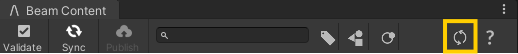

The refresh process has been updated to serve as a system recovery mechanism. Clicking the refresh button will:

1. Restart the CLI Content Manager directly from Unity
2. Clear all caches
3. Repaint the Unity Editor with the latest changes

**This functions as both:**

- An automatic fail-safe when errors occur during content operations
- A manual recovery option to restart the CLI content management session when needed

## Conflict Handling

When a content conflict is detected in a file, it is marked as **Conflicted** in the Content Manager. This indicates that both local and remote versions have been modified, and the changes are incompatible:

**Publishing Blocked**

- The system prevents publishing while any files remain in the **Conflicted** state.
- This ensures conflicting changes are resolved before they affect live content.

**Conflict Resolution**

- In the **Content Inspector Editor**, a new **"Solve Conflict"** button appears for conflicted files.

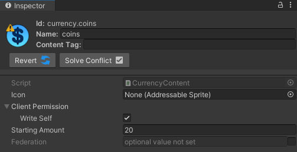

Users can choose to:

- Keep Local Version (overwrites remote changes, still need to publish)
- Accept Remote Version (overwrites local changes)

If you want to revert all conflicted files at once using the same strategy, you can do the following on your terminal.

**Local**

```shell
beam content resolve --use local
```

**Remote**

```shell
beam content resolve --use realm
```

This approach gives teams explicit control over version resolution while maintaining data integrity.

!!! info "Best Practice"

    When collaborating on a team of game makers, here are some suggestions for a safe process to try to lower potential content conflicts.

    - Carefully review which content items you publish,
    - Only commit contents that have properties or tags changes, don't need to keep track of all `referenceManifestId` updates.

## Content Filtering

Content can be filtered by tag, type, or id. The Content Manager Window can filter the viewable content. Content can be filtered from the SDK as well.

Content filter strings can be entered into the Content Manager's search box, or into the `GetManifest` function in the SDK. Filter strings follow the same conventions that Unity search strings do. The type of the filter is specified first, followed by a `:` character, and the query for the filter is specified last.

**Type Filtering:** To filter by content type, use the `t` filter constraint. The following table shows examples of type constraints.

| Filter String      | Description                                                         |
| ------------------ | ------------------------------------------------------------------- |
| `t:currency`       | returns all content elements that are of type "currency"            |
| `t:currency items` | returns all content elements that are of type "currency" or "items" |

**Tag Filtering:** To filter by content tag, use the `tag` filter constraint. The following table shows examples of tag constraints.

| Filter String | Description                                                        |
| ------------- | ------------------------------------------------------------------ |
| `tag:a`       | returns all content elements that have the "a" tag                 |
| `tag:a b`     | returns all content elements that have the "a" tag and the "b" tag |

**Id Filtering:** To filter by content id, use the `id` filter constraint, or use no constraint at all. The `id` filter constraint is the default constraint. The following table shows examples of id constraints.

| Filter String | Description                                                    |
| ------------- | -------------------------------------------------------------- |
| `gems`        | returns all content elements that contain "gems" in their name |
| `id:gems`     | returns all content elements that contain "gems" in their name |

**Compound Filtering:** Multiple filter constraints may be combined if separated by a `,` character. The following table shows examples of compound constraints.

| Filter String          | Description                                                                                |
| ---------------------- | ------------------------------------------------------------------------------------------ |
| `t:currency, gems`     | returns all content elements that are of type "currency", and contain "gems" in their name |
| `t:currency, tag:base` | returns all content elements that are of type "currency", and have the "base" tag          |
| `gems, tag:a`          | returns all content elements that contain "gems" in their name, and have the "a" tag       |

## Content Validation

The content system supports optional validation for each field of a `ContentObject` subclass. This allows game makers to easily build tooling to facilitate team members with their content administration tasks.

Beamable provides **built-in validation** and also allows for **custom validation**. Content Validation Results:

| ContentObject (Valid) | ContentObject (Invalid) |
| :-------------------- | :---------------------- |
| 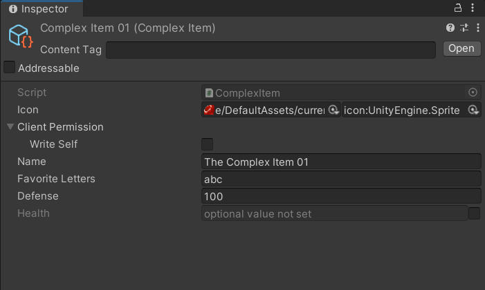 | 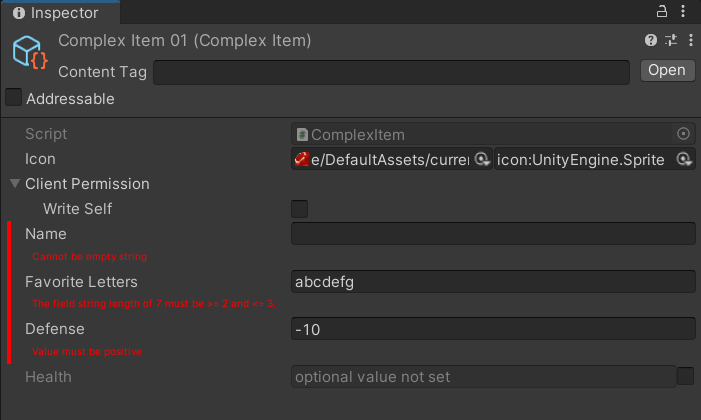 |

### Content Validation Types

Here are the built-in validation types. Beamable also supports creating custom validation types.

All validation types must descend from [`ValidationAttribute`](https://csharp.cdocs.beamable.com/latest/classBeamable_1_1Common_1_1Content_1_1Validation_1_1ValidationAttribute.html).

| Name | Detail |
|------|--------|
| [`CannotBeBlank`](https://csharp.cdocs.beamable.com/latest/classBeamable_1_1Common_1_1Content_1_1Validation_1_1CannotBeBlank.html) | Ensures field value is NOT blank |
| [`CannotBeEmpty`](https://csharp.cdocs.beamable.com/latest/classBeamable_1_1Common_1_1Content_1_1Validation_1_1CannotBeEmpty.html) | Ensures field value is NOT empty |
| [`MustBeComparatorString`](https://csharp.cdocs.beamable.com/latest/classBeamable_1_1Common_1_1Content_1_1Validation_1_1MustBeComparatorString.html) | Ensures field value is ">", "\<", "=", etc... |
| [`MustBeCurrency`](https://csharp.cdocs.beamable.com/latest/classBeamable_1_1Common_1_1Content_1_1Validation_1_1MustBeCurrency.html#details) | Ensures field value is a `CurrencyContent` |
| [`MustBeCurrencyOrItem`](https://csharp.cdocs.beamable.com/latest/classBeamable_1_1Common_1_1Content_1_1Validation_1_1MustBeCurrencyOrItem.html#details) | Ensures field value is a `CurrencyContent` or `ItemContent` |
| [`MustBeDateString`](https://csharp.cdocs.beamable.com/latest/classBeamable_1_1Common_1_1Content_1_1Validation_1_1MustBeDateString.html) | Ensures field value is a date string |
| [`MustBeItem`](https://csharp.cdocs.beamable.com/latest/classBeamable_1_1Common_1_1Content_1_1Validation_1_1MustBeItem.html#details) | Ensures field value is an `ItemContent` |
| [`MustBeLeaderboard`](https://csharp.cdocs.beamable.com/latest/classBeamable_1_1Common_1_1Content_1_1Validation_1_1MustBeLeaderboard.html#details) | Ensures field value is an `LeaderboardContent` |
| [`MustBeNonNegative`](https://csharp.cdocs.beamable.com/latest/classBeamable_1_1Common_1_1Content_1_1Validation_1_1MustBeNonNegative.html#details) | Ensures field value is NOT negative |
| [`MustBeOneOf`](https://csharp.cdocs.beamable.com/latest/classBeamable_1_1Common_1_1Content_1_1Validation_1_1MustBeOneOf.html) | Ensures field value is of a type contained in a given list of types |
| [`MustBePositive`](https://csharp.cdocs.beamable.com/latest/classBeamable_1_1Common_1_1Content_1_1Validation_1_1MustBePositive.html) | Ensures field value is NOT negative |
| [`MustContain`](https://csharp.cdocs.beamable.com/latest/classBeamable_1_1Common_1_1Content_1_1Validation_1_1MustContain.html) | Ensures field value contains certain string(s) |
| [`MustReferenceContent`](https://csharp.cdocs.beamable.com/latest/classBeamable_1_1Common_1_1Content_1_1Validation_1_1MustReferenceContent.html) | Ensures field value is of type `ContentObject`. |


### Content Validation Examples

This `ContentValidationExample.cs` snippet demonstrates the usage of built-in validation and custom validation within a custom subclass of `ContentObject`.

ComplexItem.cs
```csharp
using System;
using Beamable.Common.Content;
using Beamable.Common.Content.Validation;
using Beamable.Common.Inventory;

namespace Beamable.Examples.Services.ContentService
{
    [Serializable]
    public class ComplexItemLink : ContentLink<ComplexItem> {}

    /// <summary>
    /// This demonstrates validation rules
    /// for use with any fields within a <<see cref="ContentObject"/>
    /// subclass.
    ///
    /// Using validation is optional.
    ///
    /// See "Beamable.Common.Content.Validation" for full list.
    /// 
    /// </summary>
    [ContentType("complex_item")]
    public class ComplexItem : ItemContent
    {
        /// <summary>
        /// Built-in: Validation requires that the value be NOT blank.
        /// </summary>
        [CannotBeBlank]
        public string Name = "";
        
        /// <summary>
        /// Custom: Validation requires that the value be string and of
        /// string length of 2 or 3.
        /// See <see cref="MustBeStringLength"/>.
        /// </summary>
        [MustBeStringLength (2, 3)]
        public string FavoriteLetters = "";
        
        /// <summary>
        /// Built-in: Validation requires that the value be positive and
        /// non-zero.
        /// </summary>
        [MustBePositive(false)]
        public int Defense = 0;

        /// <summary>
        /// Built-In: Here is an optional value with no validation.
        /// </summary>
        public OptionalInt Health;
    }
}
```
This `MustBeStringLength.cs` snippet demonstrates the implementation of **custom** validation.

MustBeStringLength.cs
```csharp
using System;
using Beamable.Common.Content;
using Beamable.Common.Content.Validation;

namespace Beamable.Examples.Services.ContentService
{
    /// <summary>
    /// Demonstrates a custom validation rule for a
    /// field of a <see cref="ContentObject"/> subclass.
    /// </summary>
    public class MustBeStringLength : ValidationAttribute
    {
        //  Fields  ---------------------------------------
        private const string STRING_TYPE = "Value must be a string type.";
        private const string ARGUMENT_ERROR = "The StringLengthMin of {0} must be <= StringLengthMax of {1}.";
        private const string VALUE_ERROR = "The field string length of {0} must be >= {1} and <= {2}.";
        private int _stringLengthMin = 0;
        private int _stringLengthMax = 0;

        //  Constructor Methods  --------------------------------
        
        /// <summary>
        /// Optional. Pass validation arguments.
        /// </summary>
        /// <param name="stringLengthMin"></param>
        /// <param name="stringLengthMax"></param>
        public MustBeStringLength(int stringLengthMin, int stringLengthMax)
        {
            _stringLengthMin = stringLengthMin;
            _stringLengthMax = stringLengthMax;
        }

        //  Other Methods  --------------------------------
        
        /// <summary>
        /// Performs the validation using the current field type,
        /// field value, and any validation arguments.
        ///
        /// Any thrown <see cref="ContentValidationException"/> will
        /// show helpful text in the inspector to the game maker.
        /// 
        /// </summary>
        /// <param name="args"></param>
        /// <exception cref="ContentValidationException"></exception>
        public override void Validate(ContentValidationArgs args)
        {
            ValidationFieldWrapper validationField = args.ValidationField;
            IContentObject content = args.Content;
            Type type = validationField.FieldType;
            object obj = validationField.GetValue();
            
            if (typeof(Optional).IsAssignableFrom(type))
            {
                Optional optional = obj as Optional;
                if (!optional.HasValue) return;
                type = optional.GetOptionalType();
                obj = optional.GetValue();
            }

            // Validation: Is it a string?
            if (ValidationAttribute.IsNumericType(type))
            {
                throw new ContentValidationException(content, validationField, STRING_TYPE );  
            }

            // Validation: Are the arguments correct?
            if (_stringLengthMin > _stringLengthMax)
            {
                throw new ContentValidationException(content, validationField, 
                    string.Format(ARGUMENT_ERROR, _stringLengthMin, _stringLengthMax)); 
            }

            // Validation: Is the current value correct?
            string stringValue = obj as string;
            if (stringValue == null || 
                !(stringValue.Length >= _stringLengthMin && stringValue.Length <= _stringLengthMax))
            {
                throw new ContentValidationException(content, validationField, 
                    string.Format(VALUE_ERROR, stringValue.Length, _stringLengthMin, _stringLengthMax));
            }
        }
    }
}
```

### Optional Values

Beamable includes a suite of "optional" datatypes. Here the game maker must set the checkbox to true in the inspector before populating the field. The "optional" functionality and the "validation" functionality may be combined too.


## Version Control Advisory

Each content JSON file contains a `referenceManifestId` representing its last sync state. This identifier is crucial for:

- Detecting content changes
- Identifying potential conflicts
- Maintaining synchronization integrity

### Version Control Best Practices

1. **Minimize Unnecessary Commits**
   - Avoid committing files when only the referenceManifestId has changed
   - These changes can safely be reverted if needed
2. **Handling Revert Operations**  
   Reverting to an older version will trigger conflict detection (due to mismatched `referenceManifestId`). To resolve while preserving your content changes, run:
   ```shell
   beam content resolve --use local
   ```
   This command keeps your local content modifications and updates the `referenceManifestId` to match the remote version for each conflicted content.


## Storage Location of Content Types in Editor

While each content object inherits from Unity's [ScriptableObject](https://docs.unity3d.com/Manual/class-ScriptableObject.html), these objects exist solely in memory for Unity Editor inspection and are not saved to disk.

The actual content data is stored as JSON files in your project's: `.beamable/content/<YOUR_PID>/global/` directory
