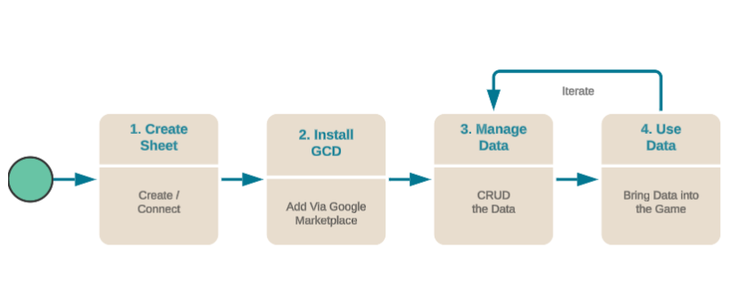
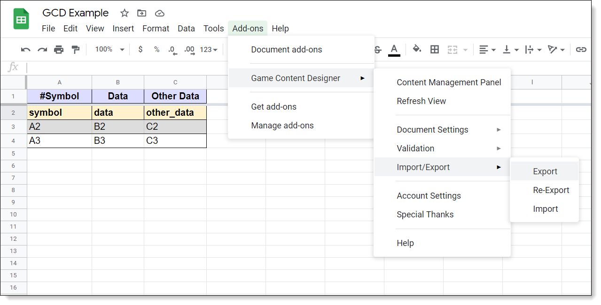

# Game Content Designer

The Beamable **Game Content Designer** feature allows game makers to create and manage data structures without having to write code.

Live games often have frequent changes to their structured and unstructured data: the definition of items and merchandise, virtual goods, currencies, inventory, items, world data and stories are just a few examples.

Managing these data structures is usually a pain, requiring special forms or processes or direct-editing of source code files that contain data definitions.

Game makers know that these problems only get worse when the game goes live -- because the desire is to change this data on the fly, without interfering with update, deployment, or live operations -- or requiring engineering intervention. **That's why we created the Game Content Designer (GCD). This Google Sheets Add-On allows game makers to manage all of the game's live data with the simplicity of a Google Sheet.**



!!! warning "Beamable Labs Feature"

    This is an experimental feature currently in development. Features may change or be removed in future releases.

## What is the GCD?

With **Game Content Designer**, game makers can create where they are most comfortable and then export the results. With no extra work, they can publish directly to their game with GCD handling all the translation from flat spreadsheets to Beamable Content, ultimately used by Unity in the form of [ScriptableObjects](https://docs.unity3d.com/Manual/class-ScriptableObject.html). With many common [Content-Type's](content-overview.md#content-data) already provided by Beamable, a game maker can create and publish content without touching code.

### Benefits

- Supports import/export via the industry standard [JSON](https://www.json.org/json-en.html) format
- Utilizes the powerful, versionable, and free-to-use [Google Sheets](https://www.google.com/sheets/about/) for data creation, management, and collaboration

!!! info "Beamable Not Required"

    This feature does not require a Beamable license nor the Beamable SDK. It is a free tool for use by the community. It is created and maintained by Beamable.

### Workflows

Even though GCD is made to work with Beamable, game makers do not have to use the Beamable back-end. GCD converts flat spreadsheet into Json objects with complex structures (arrays, references between objects, multidimensional objects), validation, constraints (min/max), crosstab IDs, etc... that can be load directly into a game via Unity.



### Exports

Schema headers are initially defined in the first row of a GCD sheet. For complex data structures that include nested data, the headers will span across multiple rows to represent the data hierarchy. The schema headers provide the mapping information for exporting data from a spreadsheet.

- **JSON** - A lightweight format for storing and transporting data. This is the primary export option. See [JSON Overview](https://www.json.org/json-en.html) for more info
- **YAML** - A human-readable data-serialization language. This is a secondary export option. See [YAML Overview](https://en.wikipedia.org/wiki/YAML) for more info

### Creating the Sheet

Google Sheets is a web-based spreadsheet app. Here data is arranged in the rows and columns in a grid and can be manipulated and used for modeling calculations.

It's free, powerful, and a preferred tool of many game designers.

| Step | Detail |
|------|--------|
| 1. Login to Google | • Visit [Google Accounts](https://www.google.com/account/about/) to login |
| 2. Create a new Google Sheet | • Visit [Google Sheets](https://www.google.com/sheets/about/) to create a new file |

### Installing GCD

GCD must be installed in the game maker's active Google account to be added to a **new** Google Sheet.

For **existing** Google Sheets with GCD already installed, the following step may be skipped.

| Step | Detail |
|------|--------|
| 1. Locate the GCD Add-On | • Open [Game Content Designer (GCD)](https://workspace.google.com/marketplace/app/game_content_designer/521598789987) on the Google Workspace Marketplace |
| 2. Install the GCD Add-On | _Note: GCD supports both `Domain` and `Individual` install types_ |
| 3. Open any Google Sheet | • E.g. The file created in "Step 1. Create the Sheet" above |
| 4. Enable "Game Content Designer" Add-On | • (Google Sheet → Add-Ons → Game Content Designer) |

### Managing the Data

| Step | Detail |
|------|--------|
| 1. Edit the Google Sheet | • Add cells<br/>• Edit cells<br/>• Delete cells<br/><br/>_Note: Google Sheets support styling of fonts and colors to aid readability, validation to correct newly inputted values, formulas for math operations (e.g. add cells, average cells, etc...), and more..._ |
| 2. Save the Google Sheet | _Note: Google Sheets save automatically. The format is versioned, backed-up, and easily shared for collaboration_ |

## Adding Data

Schema Headers make up the first row of a GCD sheet.

The metadata, stored in the **Notes** of the Schema Headers, provides additional information, such as specific export behavior for that column, as well as validation settings. The first column's schema header also stores sheet settings as part of the metadata.

Storing this information in the sheet itself means that copying a Spreadsheet, or even just the sheet cells, brings all the export, validation, and view information along with it.

- **Column** - Each column represents a different field in the data structure. (Breadth of Data)
- **Row** - Each row represents another entry in the array. (Depth of Data)

For all of the following examples, we assume that the export type is set as **List**. This represents the typical common setup.

**Basic Object**

**Input:**
```
symbol | data | other_data
A2     | B2   | C2
A3     | B3   | C3
```

**Output:**
```json
{
  "__README": "Readme here ... ",
  "BasicObject": [
    {
      "symbol": "A2",
      "data": "B2",
      "other_data": "C2"
    },
    {
      "symbol": "A3",
      "data": "B3",
      "other_data": "C3"
    }
  ]
}
```

**Basic Object With Comment**

To write a comment, or have an empty row for whatever reason, just add a '#' to the start of the row. This will tell the exporter to act like the row doesn't even exist.

**Input:**
```
symbol | data | other_data
A2     | B2   | C2
#      |      |
A4     | B4   | C4
```

**Output:**
```json
{
  "__README": "Readme text ... ",
  "BasicObjectWithComment": [
    {
      "symbol": "A2",
      "data": "B2",
      "other_data": "C2"
    },
    {
      "symbol": "A4",
      "data": "B4",
      "other_data": "C4"
    }
  ]
}
```

**Complex Object**

Adding a dot '.' to a path, creates a more complex object. Multiple columns can map to the same object with different fields.

These can be as deep as needed.

**Input:**
```
symbol | data | object.one | object.two | deep.foo | deep.child.bar | deep.child.delta
A2     | B2   | C2         | D2         | E2       | F2             | G2
A3     | B3   | C3         | D3         | E3       | F3             | G3
```

**Output:**
```json
{
  "__README": "Readme text ...",
  "ComplexObject": [
    {
      "symbol": "A2",
      "data": "B2",
      "object": {
        "one": "C2",
        "two": "D2"
      },
      "deep": {
        "foo": "E2",
        "child": {
          "bar": "F2",
          "delta": "G2"
        }
      }
    },
    {
      "symbol": "A3",
      "data": "B3",
      "object": {
        "one": "C3",
        "two": "D3"
      },
      "deep": {
        "foo": "E3",
        "child": {
          "bar": "F3",
          "delta": "G3"
        }
      }
    }
  ]
}
```

!!! warning "Important Notes"

    Here are some common issues and solutions:
    
    • Avoid naming any cell as **_locale**. That is a reserved keyword for GCD

### More Data Formatting Options

GCD supports even more!

- **4. Arrays** - Use square brackets ([ ]) token to support a column as being an array
- **5. Nested Arrays** - To support arrays within arrays
- **6. Vertical Object Representation** - To support key/value pairs like in configuration systems
- **7. Horizontal Array Representation** - To support a small list or to have each entry to be a single row for easier manipulation
- **8. Layers of Data** - Use an underscore (_) token to support storing multiple layers of data that are separately exported
- **9. Hierarchy of Multiple Sheets** - To support referencing the exported data of one sheet as the value for a cell in another sheet
- **10. Exclusion of Data** - To exclude data from the export, use an exclamation point (!) in the header name

These formatting options allow for building complex data in a more sane format.

**Example File**

All examples (1-9) are available in the following Google Sheets example file:

| Source | Detail |
|--------|--------|
|  | 1. **Open** the [Game Content Designer - Google Sheets Examples](https://docs.google.com/spreadsheets/d/1mYB6q-pFjbI3RMZLHh-hN6v1Wv4kVAq9NfbjPc42P44/edit?usp=sharing)<br/>2. Explore the tabs, descriptions, and cells<br/>3. Enjoy!<br/><br/>_Note: It is not recommended to use this file as-is directly in a production project. Simply learn from it and be inspired_ |

## Using the Data

In the end, GCD generates properly formatted JSON. It does not prescribe a delivery mechanism. The system is flexible to how game makers choose to use the data in the game project.

For example, here is a Google Sheet with GCD used to configure the following data set:

**Input:**
```
Weapons[].Name | Weapons[].Damage
Sword          | 20
Dagger         | 5
Spear          | 30
```

**Output:**
```json
{
  "Weapons": [
    {
      "Name": "Sword",
      "Damage": 20
    },
    {
      "Name": "Dagger",
      "Damage": 5
    },
    {
      "Name": "Spear",
      "Damage": 30
    }
  ]
}
```

Here are 3 popular usage techniques.

#### Loading JSON from local storage

The game maker exports the data to flat files, adds them to the Unity project, and loads them **locally** as needed.

**Pros**
- Simple implementation

**Cons**
- Large amounts of data may bloat the binary
- No over-the-wire updates, thus requiring users to redownload the entire game client
- Workflow has challenges — manual process is error prone (requires a human to export the data, download it, and copy it to the Unity project)

**Setup**

| Step | Detail |
|------|--------|
| 1. Prepare the JSON | • Open a Google Sheet with GCD<br/>• Export as JSON (Google Sheet → Add-Ons → Game Content Designer → Import / Export → Export)<br/>• Store the JSON **locally** within the Unity Project. E.g. `Assets/Resources/` |
| 2. Load the JSON | • See `GameContentDesignerDemo_Json.cs` below |
| 3. Convert the JSON to C# objects | • See `GameContentDesignerDemo_Json.cs` below |
| 4. Use the C# objects | • See `GameContentDesignerDemo_Json.cs` below |

#### Loading JSON from online storage

The game maker prepares the data, hosts it, and loads it **remotely** as needed.

As Google's [documentation](https://developers.google.com/sheets/api/limits) shows, directly calling Google Sheets is rate limited, thus game makers must create a custom hosting and delivery solution.

**Pros**
- Supports over-the-wire updates without requiring users to redownload the entire game client

**Cons**
- Requires paying for a dedicated host, and managing it
- Workflow has challenges — error prone if manual, complex to build if automated (requires build jobs with rollback functionality, etc ...)

**Setup**

| Step | Detail |
|------|--------|
| 1. Prepare the JSON | • Open a Google Sheet with GCD<br/>• Export as JSON (Google Sheet → Add-Ons → Game Content Designer → Import / Export → Export)<br/>• Store the JSON **remotely** at a custom, hosted server location |
| 2. Load the JSON | • See `GameContentDesignerDemo_Json.cs` below |
| 3. Convert the JSON to C# objects | • See `GameContentDesignerDemo_Json.cs` below |
| 4. Use the C# objects | • See `GameContentDesignerDemo_Json.cs` below |

**Sample Code**

GameContentDesignerDemo_Json.cs
```csharp
using UnityEngine;

namespace Beamable.Examples.Labs.GameContentDesigner.Json
{
   [System.Serializable]
   public class WeaponJson
   {
      public string Name;
      public string Damage;
   }

   [System.Serializable]
   public class WeaponsJson
   {
      public WeaponJson[] Weapons;
   }

   /// <summary>
   /// Demonstrates <see cref="GameContentDesignerDemo"/>.
   /// </summary>
   public class GameContentDesignerDemo_Json : MonoBehaviour
   {
      //  Fields  ---------------------------------------

      [SerializeField]
      private TextAsset _weaponsJson;

      //  Unity Methods  --------------------------------
      protected void Start()
      {
         Debug.Log($"Start()");
         
         WeaponsJson weapons = JsonUtility.FromJson<WeaponsJson>(_weaponsJson.text);

         foreach (WeaponJson weapon in weapons.Weapons)
         {
            Debug.Log($"weapon.Name = {weapon.Name}, weapon.Damage = {weapon.Damage}");
         }
      }
   }
}
```

#### Using Beamable SDK

Beamable is optional for GCD. However, to complete **this** specific usage option, the Beamable SDK and a Beamable license are required.

**Pros**
- Over the wire updates
- Simple to deploy and rollback content
- No need to pay for a dedicated host, scalable by default
- Workflow is smooth with automated process for releasing data updates

**Cons**
- Requires Beamable SDK and work to create C# classes in Unity so data can be downloaded at runtime

**Setup**

| Step | Detail |
|------|--------|
| 1a. Prepare the Content | • Open a Google Sheet with GCD<br/>• Login With Beamable (Google Sheet → Add-Ons → Game Content Designer → Account Settings)<br/>• Publish as Content (Google Sheet → Add-Ons → Game Content Designer → Content Manager Panel)<br/><br/>_Note: This data is visually inspectable via Beamable's Web-based [Portal](doc:portal)_ |
| 1b. Prepare the Unity Project | • Within Unity, add the Beamable SDK and Login (See [Installing Beamable](doc:installing-beamable)) |
| 2. Load the Content | • Open the [Content Manager](doc:content-manager) Window<br/>• Click "Download" to pull fresh data from the GCD |
| 3. Convert the Content to C# objects | • GCD does not include code generation capabilities. In order to convert content to C# objects, you should create classes that derive from `ContentObject` and include a `[ContentType()]` attribute. |
| 4. Use the C# objects | • See `GameContentDesignerDemo_Content.cs` below |

GameContentDesignerDemo_Content.cs
```csharp
using Beamable.Common.Content;
using UnityEngine;

namespace Beamable.Examples.Labs.GameContentDesignerDemo.Content
{
   [ContentType("gcd_weapon")]
   public class GCDWeapon : ContentObject
   {
      public string Name;
      public string Damage;
   }

   [ContentType("gcd_weapons")]
   public class GCDWeapons : ContentObject
   {
      public WeaponContentRef[] WeaponContentRefs;
   }

   [System.Serializable]
   public class WeaponContentRef : ContentRef<GCDWeapon> { }

   [System.Serializable]
   public class WeaponsContentRef : ContentRef<GCDWeapons> { }

   /// <summary>
   /// Demonstrates <see cref="GameContentDesignerDemo"/>.
   /// </summary>
   public class GameContentDesignerDemo_Content : MonoBehaviour
   {
      //  Fields  ---------------------------------------
      [SerializeField] private WeaponsContentRef _weaponsContentRef = null;

      //  Unity Methods   -------------------------------
      protected async void Start()
      {
         Debug.Log($"Start()");
         
         GCDWeapons weaponsContent = await _weaponsContentRef.Resolve();

         foreach (WeaponContentRef weaponContentRef in weaponsContent.WeaponContentRefs)
         {
            GCDWeapon weapon = await weaponContentRef.Resolve();

            Debug.Log($"weapon.Name = {weapon.Name}, weapon.Damage = {weapon.Damage}");
         }
      }
   }
}
```

## Settings

Mouse over a schema header to reveal the **cell notes**. Notes store the column metadata.

- **Sheet Settings** - Store the export settings for an entire sheet. (e.g. Export format and export key)
- **Column Settings** - Stores the export settings for a given column (e.g. Handling empty cells)
- **Validation Settings** - Store the validation settings (e.g. Number vs string) for a given sheet's column's

!!! info "Best Practice"

    While **cell notes** can be edited manually, it is recommended to use the provided settings UI
    
    • **Sheet Settings** - Google Sheet → Add-Ons → Game Content Designer → Documentation Settings
    • **Column Settings** - Google Sheet → Add-Ons → Game Content Designer → Documentation Settings
    • **Validation Settings** - Google Sheet → Add-Ons → Game Content Designer → Validation

## Delimiters

A **delimiter** is a sequence of one or more characters used to specify the boundary between separate, independent regions in plain text or other data streams. See Wikipedia's [Delimiter Overview](https://en.wikipedia.org/wiki/Delimiter) for more info.

- Delimiters are how GCD distinguished where an array entry begins. Bottom level arrays don't need one, but everything else does. These columns can be any text, importing will make them the array's index they are delimiting. These columns are not actually exported.
- The first column is always treated like a delimiter when exporting lists. You can make the first column unexported by giving it an underscore prefix. Note that to do this you will need to export as one sheet instead of splitting into individual files.
