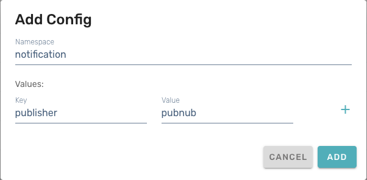

# Chat

The **Chat** feature allows players to communicate together in-game with text chat.

!!! danger "Deprecated API"

    As of December 2025, the Beamable Chat API described in this document is deprecated. Alternatives for real-time player communication include 3rd party solutions or implementing custom, game-specific chat using Beamable C# Microservices and the Beamable Notification service.

The deprecation of the Chat service is due to its reliance on PubNub, a
third party service for publish/subscribe workflows including real-time
communication. If your game already uses Beamable Chat, it is possible
to continue using the service by using your own PubNub account in place
of the deprecated Beamable PubNub integration.

PubNub Account Setup
--------------------

Before proceeding, you will need to have a paid PubNub account of your
own. Go to https://admin.pubnub.com/ and sign up for an account. You
will need to register an _App_ and a _Keyset_ with PubNub, and ensure
that your account is in paid production mode (Testing keys will not
work with Beamable Chat).

1. Sign up for a PubNub account at https://admin.pubnub.com/
2. Create an App for use with Beamable Chat. You may name this as you like, possibly something like "Beamable Chat Integration".
3. Add a Keyset to your PubNub App. Note that this keyset _MUST_ be for the Production environment.

When you have created your Keyset, you should have a publish key and a
subscribe key. Both of these will be needed by Beamable Chat, but you
will not need to use the PubNub secret key.

Publish keys have a format of `pub-c-<uuid>` and subscribe keys have a
format of `sub-c-<uuid>`.

Beamable Realm Configuration
----------------------------

There are three realm config settings that need to be added in order
to use your own PubNub keys with Beamable: `notification|publisher`,
`pubnub|publishKey`, and `pubnub|subscribeKey`.

To add realm config values, go to the Beamable admin portal at
https://portal.beamable.com/ and, after choosing the desired
realm, use Operate > Config to navigate to Realm Config. From there,
you can add or modify configuration values in the `notification` and
`pubnub` namespaces. If you do not already have values in those
namespaces, use the _+ Add Config_ button to add them.

1. Go to https://portal.beamable.com/
2. Choose the realm you want to configure
3. Navigate to Operate > Config
4. Use _+ Add Config_ to add three new realm configs

| namespace | key | value |
| --------- | --- | ----- |
| `notification` | `publisher` | `pubnub` |
| `pubnub` | `publishKey` | the pub-c key from your PubNub account setup |
| `pubnub` | `subscribeKey` | the sub-c key from your PubNub account setup |

Legacy Chat Documentation
-------------------------

If you need to view the past documentation for the Beamable "Chat V2"
service, you can find it in the v4.0 Beamable Unity SDK docs:
[Beamable v4.0 Documentation - Chat](https://help.beamable.com/Unity-4.0/unity/user-reference/beamable-services/social-networking/chat/)
