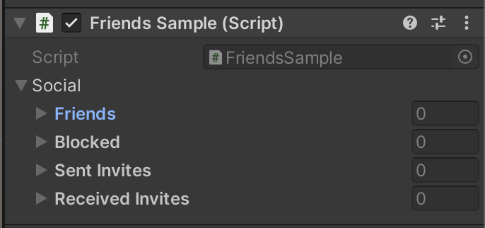

# Friends

The Beamable **Friends** feature allows players to connect with other players and manage friendships through various social interactions. Players can send friend invites, view pending invites, cancel invites, reject invites, accept invites, view friends, remove friends, block players, and unblock players.

The Friends feature is accessible via the `BeamContext` object, and is a code-first solution.

this is a list of the main concepts used in the Friends feature:

| Term            | Description                                                                                                                        |
| :-------------- | :--------------------------------------------------------------------------------------------------------------------------------- |
| Friend          | A player that has accepted a friend invite from the current user.                                                                  |
| Blocked Player  | A player that will be prevented from sending friend invites to the current user. Blocked players cannot be friends.                |
| Sent Invite     | A pending invite from the current user to another player. The other player must accept the invite before the friendship can begin. |
| Received Invite | A pending invite for the current user, from another player. The user must accept the invite before the friendship can begin.       |

## Friends API

Friends can be accessed directly through the `ISocialApi` interface, or conveniently through the `BeamContext.Social` accessor. The following samples illustrate how to achieve common use cases by using the `BeamContext`.

#### Viewing Social Data

The `BeamContext.Social` returns an instance of `PlayerSocial` which is a serializable object you can view in the Unity inspector. The `PlayerSocial` object is an observable type, which means that Beamable will update it silently in the background as friendships are initiated, made, or broken.

!!! info "Beamable Observables"

    You can use C# events to listen for changes to the `PlayerSocial` object. Use the `ctx.Social.OnUpdated` event to receive any update. The fields themselves also have events, such as `ctx.Social.Friends.OnDataUpdated`.

```csharp
using Beamable.Player;
using UnityEngine;

public class FriendsSample : MonoBehaviour
{
    public PlayerSocial social;
   
    async void Start()
    {
        var ctx = BeamContext.Default;
        await ctx.OnReady;
        social = ctx.Social;
    }
}
```

There are 4 main resources associated with a `PlayerSocial`,

1. The `PlayerSocial.Friends` list, which is an observable list of friends.
2. The `PlayerSocial.Blocked`list, which is an observable list of blocked players.
3. The `PlayerSocial.SentInvites` list, which is an observable list of friend invites sent from the current player.
4. The `PlayerSocial.ReceivedInvites` list, which is an observable list of friend invites sent to the current player.

{ width="300px"}

!!! info "Experiment with Multiple Beam Context objects"

    Validating friend invites can be hard when you're just one developer on one machine. Luckily, you can create multiple `BeamContext` instances at once in the same gameplay session. These samples all use `BeamContext.Default` for simplicity, but you can change them to use `BeamContext.ForPlayer("player1")`, and `BeamContext.ForPlayer("player2")` to simulate two unique players.

#### Sending an Invite

```csharp
using Beamable;
using UnityEngine;

public class FriendsSample : MonoBehaviour
{
    public long playerToBefriend;
    
    [ContextMenu("Invite")]
    async void Invite()
    {
        var ctx = BeamContext.Default;
        await ctx.OnReady;
        await ctx.Social.Invite(playerToBefriend);
    }
}
```

#### Accepting an Invite

```csharp
using Beamable;
using UnityEngine;

public class FriendsSample : MonoBehaviour
{
    [ContextMenu("Accept")]
    async void Accept()
    {
        var ctx = BeamContext.Default;
        await ctx.OnReady;
        await ctx.Social.ReceivedInvites[0].AcceptInvite();
    }
}
```

#### Removing a Friend

```csharp
using Beamable;
using UnityEngine;

public class FriendsSample : MonoBehaviour
{
    [ContextMenu("RemoveFriend")]
    async void RemoveFriend()
    {
        var ctx = BeamContext.Default;
        await ctx.OnReady;
        await ctx.Social.Friends[0].Unfriend();
    }
}
```

#### Canceling Sent Invite

```csharp
using Beamable;
using UnityEngine;

public class FriendsSample : MonoBehaviour
{
    [ContextMenu("Cancel")]
    async void Cancel()
    {
        var ctx = BeamContext.Default;
        await ctx.OnReady;
        await ctx.Social.SentInvites[0].Cancel();
    }
}
```

#### Blocking a Player

```csharp
using Beamable;
using UnityEngine;

public class FriendsSample : MonoBehaviour
{
    public long playerIdToBlock;
    [ContextMenu("Block")]
    async void Block()
    {
        var ctx = BeamContext.Default;
        await ctx.OnReady;

        await ctx.Social.BlockPlayer(playerIdToBlock);
    }
}
```

#### Unblocking a Player

```csharp
using Beamable;
using UnityEngine;

public class FriendsSample : MonoBehaviour
{
    [ContextMenu("Unblock")]
    async void Unblock()
    {
        var ctx = BeamContext.Default;
        await ctx.OnReady;

        await ctx.Social.Blocked[0].Unblock();
    }
}
```

#### Importing Friends from Facebook

A player who has associated a Facebook credential with their account may automatically import Facebook friends. Facebook friends who have also linked a Facebook credential will be listed as Beamable friends. When one player imports Facebook friends, all imported friends will have the initiating player as a friend as well.

```csharp
using Beamable;
using UnityEngine;

public class FriendsSample : MonoBehaviour
{
    public string facebookAuthToken;
    [ContextMenu("ImportFriends")]
    async void ImportFriends()
    {
        var ctx = BeamContext.Default;
        await ctx.OnReady;

        await ctx.Social.ImportThirdPartyFriends(facebookAuthToken);
    }
}
```

#### Presence

A friend may have a presence object that describes the friend's online status. Friend presence is accessible directly from the `PlayerFriend` structure, or by using the `ctx.Presence` SDK.

##### Listening for friend presence changes

```csharp
var ctx = await BeamContext.ForPlayer(code).Instance;
	   
ctx.Social.FriendPresenceChanged += friend =>
{
  Debug.Log($"{ctx.UserId} saw friend {friend.UserId} go online=[{friend.Presence.status}] - desc=[{friend.Presence.description}]");
};
```

##### Seting Your Current Presence

```csharp
var ctx = await BeamContext.ForPlayer(code).Instance;
await ctx.Presence.SetPlayerStatus(PresenceStatus.Away, "away from the computer");
```

### Direct Access

While the previous section is the preferred way to interact with Beamable friends, you can also access the API layer directly. This approach requires much more effort to manage.

```csharp
using Beamable;
using Beamable.Common.Api.Social;
using UnityEngine;

public class FriendsSample : MonoBehaviour
{
    void Direct()
    {
        var ctx = BeamContext.Default;
        var socialApi = ctx.ServiceProvider.GetService<ISocialApi>();
    }
}
```
