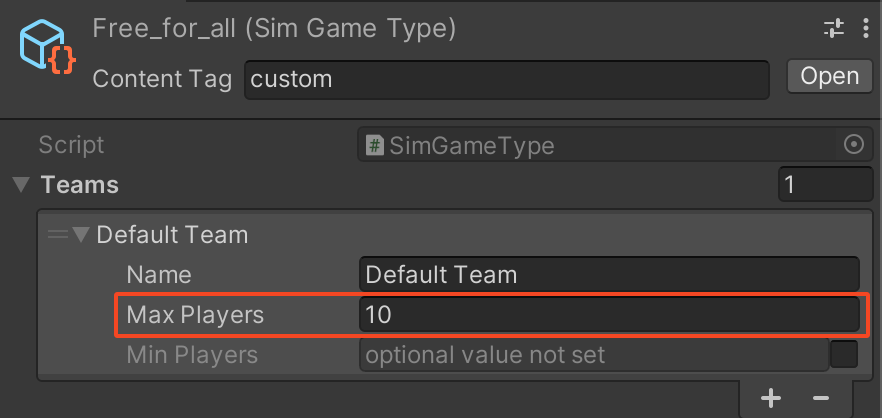

# Lobbies

The Beamable **Lobbies** feature allows players to create and join virtual spaces before entering a multiplayer match or game session. The host of the lobby can restrict the lobby to either open or closed. Open lobbies are public and can be joined by any player in the game while closed lobbies require players to join by passcode.

The Beamable **Lobbies** feature requires a name, a restriction type (either `Open` or `Closed`), and a `gameTypeId` or [`SimGameType`](https://csharp.cdocs.beamable.com/latest/classBeamable_1_1Common_1_1Content_1_1SimGameType.html#details) which is a Beamable ContentObject for Multiplayer when creating lobbies.

Optionally, you can set a description, list of player tags for custom player metadata, maximum number of players allowed in the lobby, a passcode length which is auto-generated by the backend and game statistics to include in the lobby.

To update a lobby, you would need the `lobbyId` to update the lobby restriction and/or set new host for the lobby. Optionally, you can update the lobby name, description, game type and maximum players allowed in the lobby.

Lobbies can also be found by game type and optionally setting a limit or skip value for paginated result.

To join a lobby requires a `lobbyId` in the case of an open lobby and `passcode` in the case of a closed lobby.

Other actions provided by the Beamable **Lobbies** feature include:

- Adding players to the lobby
- Removing players from the lobby
- Kicking a player out of the lobby
- Leaving the lobby

!!! tip "Design Considerations"

    Here are some additional things to consider when designing a lobby for matchmaking:
    
    - The lobby should be designed to be visually appealing and user-friendly.
    - The lobby should provide players with information about the status of their matchmaking queue, such as how many players are currently in the lobby and how long it is expected to take to find a match.
    - The lobby should allow players to communicate with each other before the game starts. This can help to improve the overall experience for players.
    - The lobby should be secure and prevent players from cheating or exploiting the system.

## Lobbies API

!!! danger "Experimental API"

    This API is experimental and may change in future releases.

These examples cover common use cases for Lobbies. The `_beamContext` variable used below is an instance of the `BeamContext` class and may be obtained by `BeamContext.Default`:

### Creating a Lobby

The [Create](https://csharp.cdocs.beamable.com/latest/classBeamable_1_1Experimental_1_1Api_1_1Lobbies_1_1LobbyService.html#a0e8f956a954c74e55f5a26db755e5499) method will create a lobby with specified parameters which can be accessed through `_beamContext.Lobby.Value`.

The `Create` method requires:

- `name` the name of the lobby.
- `LobbyRestriction` has 2 possible values:
  - `Open` means the lobby can be joined by any player who knows the `lobbyId`.
  - `Closed` allows players to join the lobby by passcode.
- `gameTypeId` the id of the `SimGameType` which is a Beamable ContentObject for multiplayer matchmaking.

The `Create` method has a number of optional parameters:

- `description` additional information about the lobby.
- `playerTags` list of arbitrary name/value pairs associated with a `LobbyPlayer` for custom player metadata or properties.
- `maxPlayers` determines maximum allowed number of players in the lobby. If not specified, it defaults to the maximum players set under teams in `SimGameType`.



- `passcodeLength` the length of the passcode that would be auto-generated by the backend.
- `statsToInclude` list of stat keys to include with lobby requests.

```csharp
public async Task CreateLobbyAsync(CreateLobbyRecord lobbyRecord) =>
        await _beamContext.Lobby.Create(lobbyRecord.Name, lobbyRecord.Restriction, lobbyRecord.GameTypeId,
            lobbyRecord.Description, lobbyRecord.PlayerTags, lobbyRecord.MaxPlayers, lobbyRecord.PasscodeLength);
```

### Updating a Lobby

The `Update` method will update details about an existing lobby which can be accessed through `_beamContext.Lobby.Value`.

The `Update` method requires:

- `lobbyId` a unique identifier for the existing lobby.
- `LobbyRestriction`
- `newHost` the `playerId` of a `LobbyPlayer`.

The `Update` method has a number of optional parameters:

- `description`
- `gameType`
- `maxPlayers`

```csharp
public async Task UpdateLobbyAsync(UpdateLobbyRecord lobbyRecord) =>
        await _beamContext.Lobby.Update(ActiveLobby.lobbyId, lobbyRecord.Restriction, ActiveLobby.host,
            lobbyRecord.Name, lobbyRecord.Description, lobbyRecord.GameTypeId, lobbyRecord.MaxPlayers);
```

### Finding Lobbies

The [FindLobbies](https://csharp.cdocs.beamable.com/latest/classBeamable_1_1Experimental_1_1Api_1_1Lobbies_1_1LobbyService.html#a0d248fffa2d8cbd3f7a6b50a131a3a17) method will find all open lobbies and will return a [LobbyQueryResponse](https://csharp.cdocs.beamable.com/latest/classBeamable_1_1Experimental_1_1Api_1_1Lobbies_1_1LobbyQueryResponse.html).

```csharp
public async Task FindLobbiesAsync() => Lobbies = (await _beamContext.Lobby.FindLobbies()).results;
```

### Finding Lobbies By Game Type

The `FindLobbiesOfType` method will find all lobbies of a particular game type and will return a [LobbyQueryResponse](https://csharp.cdocs.beamable.com/latest/classBeamable_1_1Experimental_1_1Api_1_1Lobbies_1_1LobbyQueryResponse.html).

The `FindLobbiesOfType` method has optional parameters for pagination:

- `limit` defaults to 100 if not specified.
- `skip` defaults to 0 if not specified.

```csharp
public async Task FindLobbiesOfTypeAsync(string gameType) =>
        Lobbies = (await _beamContext.Lobby.FindLobbiesOfType(gameType)).results;
```

### Joining a Lobby

The [Join](https://csharp.cdocs.beamable.com/latest/classBeamable_1_1Experimental_1_1Api_1_1Lobbies_1_1LobbyService.html#a50417b020ff456f8ee0df398cad0ffa8) method will allow players to join an existing open lobby by `lobbyId`. Optionally, you can send `playerTags` with the join lobby request.

```csharp
public async Task JoinLobbyAsync(JoinLobbyRecord lobbyRecord) =>
        await _beamContext.Lobby.Join(lobbyRecord.LobbyId, lobbyRecord.PlayerTags);
```

### Joining a Lobby By Passcode

The [JoinByPasscode](https://csharp.cdocs.beamable.com/latest/classBeamable_1_1Experimental_1_1Api_1_1Lobbies_1_1LobbyService.html#a99ffe1811128c3f86f4d0c03416bb668) method will allow players to join an existing closed lobby by `passcode`. Optionally, you can send `playerTags` with the join lobby by passcode request.

```csharp
public async Task JoinLobbyByPasscodeAsync(JoinLobbyByPasscodeRecord lobbyRecord) =>
        await _beamContext.Lobby.JoinByPasscode(lobbyRecord.Passcode, lobbyRecord.PlayerTags);
```

### Kicking Players Out Of Lobby

The [KickPlayer](https://csharp.cdocs.beamable.com/latest/classBeamable_1_1Experimental_1_1Api_1_1Lobbies_1_1LobbyService.html#a6938dd38ff51cf6f93716031d5f42e04) method will allow a host to remove a player with the given playerId from the lobby.

```csharp
public async Task KickPlayerOutOfLobbyAsync(string playerId) => await _beamContext.Lobby.KickPlayer(playerId);
```

### Leaving a Lobby

The [Leave](https://csharp.cdocs.beamable.com/latest/classBeamable_1_1Experimental_1_1Api_1_1Lobbies_1_1LobbyService.html#a1e8f5e43189edabe86e24854a7462387) method will allow a player to leave the lobby and would notify the lobby that the player intends to leave.

```csharp
public async Task LeaveLobbyAsync() => await _beamContext.Lobby.Leave();
```

### Data Update Event

The following event is available

```csharp
public Action<Lobby> OnDataUpdated;
```

### Sample Code

```csharp
using System.Collections.Generic;
using System.Threading.Tasks;
using Beamable;
using Beamable.Experimental.Api.Lobbies;
using UnityEngine;

public class BeamManager : MonoBehaviour
{
    private BeamContext _beamContext;

    public List<Lobby> Lobbies { get; private set; }

    public Lobby ActiveLobby { get; private set; }
    
    public string PlayerId { get; private set;  }
    
    private void Start() => SetupBeamable();

    private async void SetupBeamable()
    {
        _beamContext = BeamContext.Default;
        await _beamContext.OnReady;
        _beamContext.Lobby.OnDataUpdated += OnLobbyDataUpdated;
        PlayerId = _beamContext.PlayerId.ToString();
    }

    private void OnDestroy()
    {
        if (_beamContext == null) return;
        _beamContext.Lobby.OnDataUpdated -= OnLobbyDataUpdated;
    }

    public async Task FindLobbiesAsync() => Lobbies = (await _beamContext.Lobby.FindLobbies()).results;

    public async Task FindLobbiesOfTypeAsync(string gameType) =>
        Lobbies = (await _beamContext.Lobby.FindLobbiesOfType(gameType)).results;

    public async Task CreateLobbyAsync(CreateLobbyRecord lobbyRecord) =>
        await _beamContext.Lobby.Create(lobbyRecord.Name, lobbyRecord.Restriction, lobbyRecord.GameTypeId,
            lobbyRecord.Description, lobbyRecord.PlayerTags, lobbyRecord.MaxPlayers, lobbyRecord.PasscodeLength);

    public async Task UpdateLobbyAsync(UpdateLobbyRecord lobbyRecord) =>
        await _beamContext.Lobby.Update(ActiveLobby.lobbyId, lobbyRecord.Restriction, ActiveLobby.host,
            lobbyRecord.Name, lobbyRecord.Description, lobbyRecord.GameTypeId, lobbyRecord.MaxPlayers);

    public async Task JoinLobbyAsync(JoinLobbyRecord lobbyRecord) =>
        await _beamContext.Lobby.Join(lobbyRecord.LobbyId, lobbyRecord.PlayerTags);

    public async Task JoinLobbyByPasscodeAsync(JoinLobbyByPasscodeRecord lobbyRecord) =>
        await _beamContext.Lobby.JoinByPasscode(lobbyRecord.Passcode, lobbyRecord.PlayerTags);

    public async Task KickPlayerOutOfLobbyAsync(string playerId) => await _beamContext.Lobby.KickPlayer(playerId);

    public async Task LeaveLobbyAsync() => await _beamContext.Lobby.Leave();

    private void OnLobbyDataUpdated(Lobby lobby)
    {
        if (lobby == null) return;
        ActiveLobby = lobby;
    }
}

public record CreateLobbyRecord
{
    public string Name { get; set; }
    public LobbyRestriction Restriction { get; set; }
    public string GameTypeId { get; set; }
    public string Description { get; set; }
    public List<Tag> PlayerTags { get; set;  }
    public int? MaxPlayers { get; set; }
    public int? PasscodeLength { get; set; }
};

public record UpdateLobbyRecord
{
    public LobbyRestriction Restriction { get; set; }
    public string Name { get; set; }
    public string Description { get; set; }
    public string GameTypeId { get; set; }
    public int? MaxPlayers { get; set; }
}

public record JoinLobbyRecord
{
    public string LobbyId { get; set; }
    public List<Tag> PlayerTags { get; set;  }
}

public record JoinLobbyByPasscodeRecord
{
    public string Passcode { get; set; }
    public List<Tag> PlayerTags { get; set;  }
}
```
