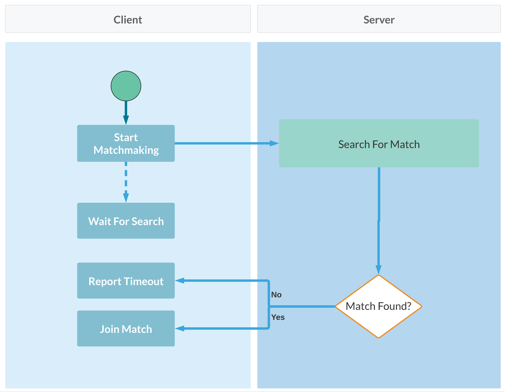
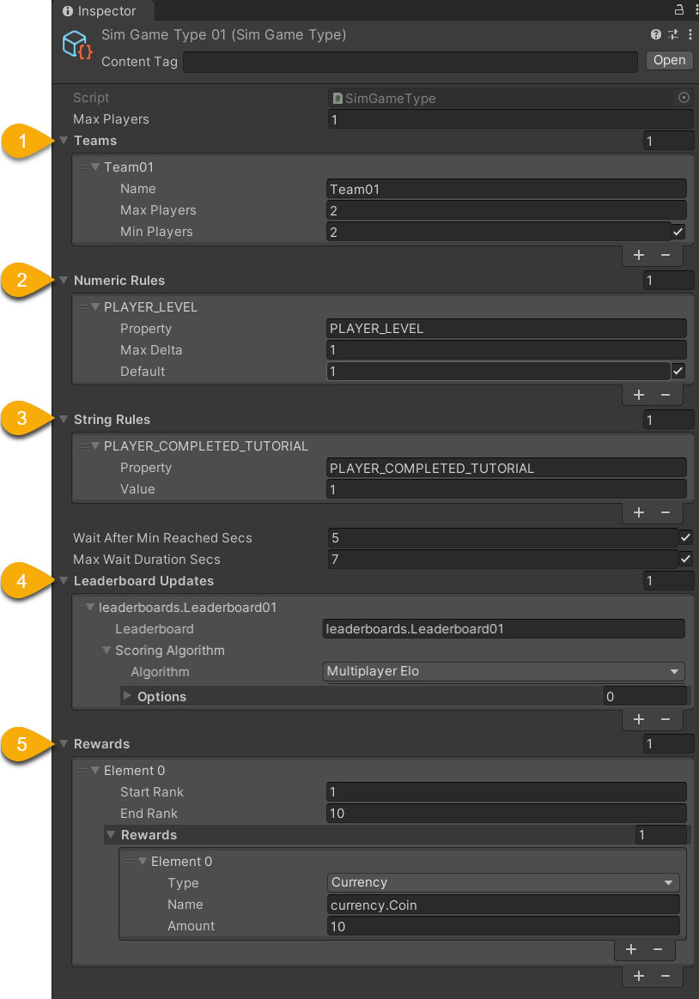

# Matchmaking

The Beamable **Multiplayer** feature allows game makers to create real-time and turn-based multi-user game experiences. For a project to offer multiplayer, it must first offer **matchmaking**. 

In multiplayer gaming, matchmaking is the process of creating/finding a **Match** (for example, a Multiplayer 'Room') based on criteria. For example, a client could say "give me a match to play in with 2 total players of any skill level". Beamable supports matchmaking through its [`MatchmakingService`](https://csharp.cdocs.beamable.com/latest/classBeamable_1_1Experimental_1_1Api_1_1Matchmaking_1_1MatchmakingService.html).

The Matchmaking service has many built-in events to attach listeners (match starting, search timeout, etc). This makes it very simple to connect your game's custom UI to Beamable's services.

The outcome of a successful matchmaking search gives the participating players a match ID. This can be used to integrate Beamable's in-house [Multiplayer](multiplayer.md) solution, or a third-party multiplayer suite such as [Photon](https://www.photonengine.com/).

The basic flow for matchmaking is described below:

{ width=400px }

| Action            | Description                                                                                                                                                                                                               |
| :---------------- | :------------------------------------------------------------------------------------------------------------------------------------------------------------------------------------------------------------------------ |
| Start Matchmaking | The player is entered into a matchmaking search, where they will be matched up with other similarly skilled players.                                                                                                      |
| Wait For Search   | The player waits for other players to also enter matchmaking. This is a good place to display matchmaking callbacks to the user (how many players have been found so far, how long the search has taken in seconds, etc). |
| Report Timeout    | If a duration of time has passed and a suitable match has not been found, the search is ended, at which point the player will need to restart searching.                                                                  |
| Join Match        | A suitable match has been found, the participating clients are now supplied with a match ID which they can use to join the "room".                                                                                        |

## Matchmaking API

!!! danger "Experimental API"

    This API is experimental and may change in future versions.

The main API is the [`MatchmakingService`](https://csharp.cdocs.beamable.com/latest/classBeamable_1_1Experimental_1_1Api_1_1Matchmaking_1_1MatchmakingService.html).

| Method Name | Detail |
|-------------|--------|
| StartMatchmaking | Starts the matchmaking process |
| CancelMatchmaking | Stops the matchmaking process |
| MatchmakingHandle | Handles events from the matchmaking process<br><br>• `OnUpdate` - Process is in progress, with success<br>• `OnMatchReady` - Process complete with success<br>• `OnMatchTimeout` - Process complete with failure |

Here is a custom, game-specific implementation which matches any 2 players without filtering. Depending on game design needs, the service can be extended to filter and match players with similar attributes; e.g. game skill level, network latency, spoken language, or geographic location.

The following shows partial sample code snippets:

### Starting Matchmaking

```csharp
private async void SetupBeamable()
{
   // Partial code

    var myMatchmaking = new MyMatchmaking (
        _beamContext.Api.Experimental.MatchmakingService,
        simGameType,
        _beamContext.PlayerId);

    myMatchmaking.OnProgress.AddListener(MyMatchmaking_OnProgress);
    myMatchmaking.OnComplete.AddListener(MyMatchmaking_OnComplete);
    myMatchmaking.OnError.AddListener(MyMatchmaking_OnError);

    await myMatchmaking.StartMatchmaking();
}
```

### Handling Matchmaking Success

```csharp
private void MyMatchmaking_OnComplete(MyMatchmakingResult myMatchmakingResult)
{
    Debug.Log($"MyMatchmaking_OnComplete()...\n\n" +
              $"MatchId = {myMatchmakingResult.MatchId}\n" +
              $"LocalPlayer = {myMatchmakingResult.LocalPlayer}\n" +
              $"Players = {string.Join(",", myMatchmakingResult.Players)}\n");
}
```

### Sample Code
The following two scripts demonstrate a simple matchmaking implementation:

MatchmakingServiceExample.cs
```csharp
using System.Collections.Generic;
using Beamable.Common.Content;
using UnityEngine;
using UnityEngine.Events;

namespace Beamable.Examples.Services.MatchmakingService
{
    public enum SessionState
    {
        None,
        Connecting,
        Connected,
        Disconnecting,
        Disconnected

    }

    
    /// <summary>
    /// Holds data for use in the <see cref="MatchmakingServiceExampleUI"/>.
    /// </summary>
    [System.Serializable]
    public class MatchmakingServiceExampleData
    {
        public SessionState SessionState = SessionState.None;
        public bool CanStart { get { return SessionState == SessionState.Disconnected;}} 
        public bool CanCancel { get { return SessionState == SessionState.Connected;}} 
        public List<string> MainLogs = new List<string>();
        public List<string> MatchmakingLogs = new List<string>();
        public List<string> InstructionsLogs = new List<string>();
    }
   
    [System.Serializable]
    public class RefreshedUnityEvent : UnityEvent<MatchmakingServiceExampleData> { }
    
    /// <summary>
    /// Demonstrates the creation of and joining to a
    /// Multiplayer game match with Beamable Multiplayer.
    /// </summary>
    public class MatchmakingServiceExample : MonoBehaviour
    {
        //  Events  ---------------------------------------
        [HideInInspector]
        public RefreshedUnityEvent OnRefreshed = new RefreshedUnityEvent();

        
        //  Fields  ---------------------------------------

        /// <summary>
        /// This defines the matchmaking criteria including "NumberOfPlayers"
        /// </summary>
        [SerializeField] private SimGameTypeRef _simGameTypeRef;
        private BeamContext _beamContext;
        private MyMatchmaking _myMatchmaking = null;
        private SimGameType _simGameType = null;
        private MatchmakingServiceExampleData _data = new MatchmakingServiceExampleData();

        //  Unity Methods  --------------------------------
        protected void Start()
        {
            string startLog = $"Start() Instructions..\n" +
                              $"\n * Play Scene" +
                              $"\n * View UI" +
                              $"\n * Press 'Start Matchmaking' Button \n\n";
         
            Debug.Log(startLog);
            
            _data.InstructionsLogs.Add("View UI");
            _data.InstructionsLogs.Add("Press 'Start Matchmaking' Button");
            
            SetupBeamable();
        }


        //  Methods  --------------------------------------
        private async void SetupBeamable()
        {
            _beamContext = BeamContext.Default;
            await _beamContext.OnReady;
            Debug.Log($"beamContext.PlayerId = {_beamContext.PlayerId}\n\n");

            _data.SessionState = SessionState.Disconnected;
            
            _simGameType = await _simGameTypeRef.Resolve();
            _data.MainLogs.Add($"beamContext.PlayerId = {_beamContext.PlayerId}");
            _data.MainLogs.Add($"SimGameType.Teams.Count = {_simGameType.teams.Count}");

            _myMatchmaking = new MyMatchmaking(
                _beamContext.Api.Experimental.MatchmakingService,
                _simGameType,
                _beamContext.PlayerId);

            _myMatchmaking.OnProgress.AddListener(MyMatchmaking_OnProgress);
            _myMatchmaking.OnComplete.AddListener(MyMatchmaking_OnComplete);
            _myMatchmaking.OnError.AddListener(MyMatchmaking_OnError);

            Refresh();
        }

        public async void StartMatchmaking()
        {
            string log = $"StartMatchmaking()";
            
            //Debug.Log(log);
            _data.SessionState = SessionState.Connecting;
            _data.MatchmakingLogs.Add(log);
            Refresh();
            
            await _myMatchmaking.StartMatchmaking();
        }
        
        public async void CancelMatchmaking()
        {
            string log = $"CancelMatchmaking()";
            //Debug.Log(log);
            
            _data.SessionState = SessionState.Disconnecting;
            _data.MatchmakingLogs.Add(log);
            Refresh();
            
            await _myMatchmaking.CancelMatchmaking();
            
            _data.SessionState = SessionState.Disconnected;
            Refresh();
        }
        

        public void Refresh()
        {
            string refreshLog = $"Refresh() ...\n" +
                                $"\n * MainLogs.Count = {_data.MainLogs.Count}" +
                                $"\n * MatchmakingLogs.Count = {_data.MatchmakingLogs.Count}\n\n";
         
            //Debug.Log(refreshLog);
         
            // Send relevant data to the UI for rendering
            OnRefreshed?.Invoke(_data);
        }
        
        //  Event Handlers  -------------------------------
        private void MyMatchmaking_OnProgress(MyMatchmakingResult myMatchmakingResult)
        {
            string log = $"OnProgress(), Players = {myMatchmakingResult.Players.Count} / {myMatchmakingResult.PlayerCountMax}";
            _data.MatchmakingLogs.Add(log);
            Refresh();
        }


        private void MyMatchmaking_OnComplete(MyMatchmakingResult myMatchmakingResult)
        {
            string log = $"OnComplete()...\n" + 
                         $"\tMatchId = {myMatchmakingResult.MatchId}\n " +
                         $"\tLocalPlayer = {myMatchmakingResult.LocalPlayer}\n" +
                         $"\tPlayers = {string.Join(",", myMatchmakingResult.Players)}\n";
            
            //Debug.Log(log);
            _data.SessionState = SessionState.Connected;
            _data.MatchmakingLogs.Add(log);
            Refresh();
        }


        private void MyMatchmaking_OnError(MyMatchmakingResult myMatchmakingResult)
        {
            _data.SessionState = SessionState.Disconnected;
            string log = $"OnError(), ErrorMessage = {myMatchmakingResult.ErrorMessage}\n";
            
            //Debug.Log(log);
            _data.MatchmakingLogs.Add(log);
            Refresh();
        }
    }
```

MyMatchmaking.cs
```csharp
using System;
using System.Collections.Generic;
using System.Linq;
using System.Threading.Tasks;
using Beamable.Common.Content;
using Beamable.Experimental.Api.Matchmaking;
using UnityEngine;
using UnityEngine.Events;

namespace Beamable.Examples.Services.MatchmakingService
{
   public class MyMatchmakingEvent : UnityEvent<MyMatchmakingResult>{}

   /// <summary>
   /// Contains the in-progress matchmaking data.
   /// When the process is complete, this contains
   /// the players list and the MatchId
   /// </summary>
   [Serializable]
   public class MyMatchmakingResult
   {
      //  Properties  -------------------------------------
      public List<long> Players
      {
         get
         {
            if (_matchmakingHandle == null || _matchmakingHandle.Status == null ||
                _matchmakingHandle.Status.Players == null)
            {
               return new List<long>();
            }
            return _matchmakingHandle.Status.Players.Select(i => long.Parse(i)).ToList();
         }
      }
      
      public int PlayerCountMin
      {
         get
         {
            int playerCountMin = 0;
            foreach (TeamContent teamContent in _simGameType.teams)
            {
               if (teamContent.minPlayers.HasValue)
               {
                  playerCountMin += teamContent.minPlayers.Value;
               }
            }
            return playerCountMin;
         }
      }
      
      public int PlayerCountMax
      {
         get
         {
            int playerCountMax = 0;
            foreach (TeamContent teamContent in _simGameType.teams)
            {
               playerCountMax += teamContent.maxPlayers;
            }
            return playerCountMax;
         }
      }
      
      public string MatchId
      {
         get
         {
            return _matchmakingHandle?.Match?.matchId;
         }
      }
      
      public long LocalPlayer { get { return _localPlayer; } }
      public SimGameType SimGameType { get { return _simGameType; } }
      public MatchmakingHandle MatchmakingHandle { get { return _matchmakingHandle; } set { _matchmakingHandle = value;} }
      public bool IsInProgress { get { return _isInProgress; } set { _isInProgress = value;} }

      //  Fields  -----------------------------------------
      public string ErrorMessage = "";
      private long _localPlayer;
      private bool _isInProgress = false;
      private MatchmakingHandle _matchmakingHandle = null;
      private SimGameType _simGameType;

      //  Constructor  ------------------------------------
      public MyMatchmakingResult(SimGameType simGameType, long localPlayer)
      {
         _simGameType = simGameType;
         _localPlayer = localPlayer;
      }

      //  Other Methods  ----------------------------------
      public override string ToString()
      {
         return $"[MyMatchmakingResult (" +
            $"MatchId = {MatchId}, " +
            $"Teams = {_matchmakingHandle?.Match?.teams}, " +
            $"players.Count = {Players?.Count})]";
      }
   }

   /// <summary>
   /// This example is for reference only. Use as
   /// inspiration for usage in production.
   /// </summary>
   public class MyMatchmaking
   {
      //  Events  -----------------------------------------
      public MyMatchmakingEvent OnProgress = new MyMatchmakingEvent();
      public MyMatchmakingEvent OnComplete = new MyMatchmakingEvent();
      public MyMatchmakingEvent OnError = new MyMatchmakingEvent();
      
      
      //  Properties  -------------------------------------
      public MyMatchmakingResult MyMatchmakingResult { get { return _myMatchmakingResult; } }

      
      //  Fields  -----------------------------------------
      private MyMatchmakingResult _myMatchmakingResult = null;
      private Experimental.Api.Matchmaking.MatchmakingService _matchmakingService = null;
      public const string TimeoutErrorMessage = "Timeout";
      

      //  Constructor  ------------------------------------
      public MyMatchmaking(Experimental.Api.Matchmaking.MatchmakingService matchmakingService,
         SimGameType simGameType, long localPlayerDbid)
      {
         _matchmakingService = matchmakingService;
         _myMatchmakingResult = new MyMatchmakingResult(simGameType, localPlayerDbid);
      }

      
      //  Other Methods  ----------------------------------
      public async Task StartMatchmaking()
      {
         if (_myMatchmakingResult.IsInProgress)
         {
            Debug.LogError($"MyMatchmaking.StartMatchmaking() failed. " +
                           $"IsInProgress must not be {_myMatchmakingResult.IsInProgress}.\n\n");
            return;
         }
         
         _myMatchmakingResult.IsInProgress = true;
         
         _myMatchmakingResult.MatchmakingHandle =  await _matchmakingService.StartMatchmaking(
            _myMatchmakingResult.SimGameType.Id,
            maxWait: TimeSpan.FromSeconds(10),
            updateHandler: handle =>
            {
               OnUpdateHandler(handle);
            },
            readyHandler: handle =>
            {
               // Call both
               OnUpdateHandler(handle);
               OnReadyHandler(handle);
            },
            timeoutHandler: handle =>
            {
               // Call both
               OnUpdateHandler(handle);
               OnTimeoutHandler(handle);
            });
      }


      public async Task CancelMatchmaking()
      {
         await _matchmakingService.CancelMatchmaking(_myMatchmakingResult.MatchmakingHandle.Tickets[0].ticketId);
      }
      
      
      //  Event Handlers  ----------------------------------
      private void OnUpdateHandler(MatchmakingHandle handle)
      {
         OnProgress.Invoke(_myMatchmakingResult);
      }
      
      private void OnReadyHandler(MatchmakingHandle handle)
      {
         Debug.Assert(handle.State == MatchmakingState.Ready);
         _myMatchmakingResult.IsInProgress = false;
         OnComplete.Invoke(_myMatchmakingResult);
      }
      
      private void OnTimeoutHandler(MatchmakingHandle handle)
      {
         _myMatchmakingResult.IsInProgress = false;
         _myMatchmakingResult.ErrorMessage = TimeoutErrorMessage;
         OnError?.Invoke(_myMatchmakingResult);
      }
   }
}
```

## Getting Started

To create a **Matchmaking** experience with Beamable, using the `SimGameType` content type is required. It allows deep configuration and customization.

The following steps outline the matchmaking setup process:

| Step | Detail                                                                                                                                                                   |
|------|--------------------------------------------------------------------------------------------------------------------------------------------------------------------------|
| 1. Setup Beamable | • See [Getting Started](../../../getting-started/installing-beamable.md)                                                                                                               |
| 2. Setup Content | • The content type related to Matchmaking is the `SimGameType`. It defines the parameters for the match to be created.                                                   |
| 3. Create C# multiplayer-specific logic | • Access Local Player Information<br>• Create Multiplayer Session<br>• Handle Events<br>• Send Events<br><br>_Note: See [Multiplayer](multiplayer.md) for more info_     |
| 4. Create C# game-specific logic | • Convert input to events<br>• Gracefully handle network latency<br>• Convert events into graphics and audio rendering<br>• Handle game logic (e.g. win/loss conditions) |

The content type related to Matchmaking is the `SimGameType`. It defines the parameters for the match to be created.

{ width=400px }

| Name | Detail |
|------|--------|
| 1. Teams | • _Name_ - Arbitrary name<br>• _MaxPlayers_ - Maximum players allowed<br>• _MinPlayers_ - Minimum players allowed |
| 2. Numeric Rules | Match to players who have an approximate `game.private.player` stat value<br><br>• _Property_ - The stat name<br>• _Max Delta_ - Largest stat value difference which will allow a match<br>• _Default_ - Value used if no stat value exists |
| 3. String Rules | Match to players who have an exact `game.private.player` stat value<br><br>• _Property_ - The stat name<br>• _Value_ - Required value to allow a match |
| 4. Leaderboard Updates | • _Leaderboard_ - The reference to update<br>• _Scoring Algorithm_ - (Advanced use cases) |
| 5. Rewards | • _Start Rank_ - The best rank to be rewarded<br>• _End Rank_ - The worst rank to be rewarded<br>• _Reward_ - The type and amount of the reward |
| Misc | • _MaxPlayers_ - This is deprecated<br>• _WaitAfterMinReachedSecs_ - Duration to wait if match found (with just the minimum players)<br>• _MaxWaitDurationSecs_ - Duration to wait if no match found |
