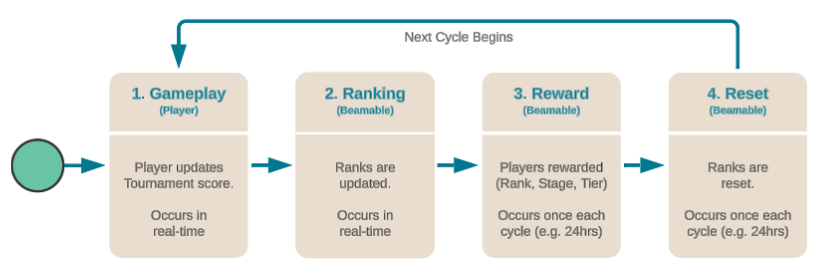

# Tournaments

The purpose of this feature is to allow the game maker to set up a recurring Tournament for players.

The **Tournament** feature provides a comprehensive system for competitive gameplay.

Tournaments offer deep engagement and social competition features for your game.

Beamable offers two types of recurring live events to increase player engagement and retention:

- **1. Events** - Scheduled competitions with specific start and end times. See [Events](../live-ops/events-overview.md) for more info.
- **2. Tournaments** - Recurring competitions with automatic tier-based progression. Continue reading below for more info.

{width="600px" height="auto"}

Here is the glossary of Tournament terms.

| Name | Detail |
|------|--------|
| Cycle | The duration of time between each tournament reward phase (e.g. 24 Hrs)<br><br>_Note: Cycles are written in [ISO 8601 Format](https://en.wikipedia.org/wiki/ISO_8601)._ |
| Rank | The position of a player's score, relative to the game's community |
| Reward | The extrinsic payoff to the player, calculated by rank, stage, & tier<br><br>_Note: Only Currency Content may be rewarded. Support for other reward types is not yet available_ |
| Score | The in-game performance of a player, often represented as a number (e.g. "100" points) |
| Stage | An ordered grouping of **ranks**, relative to the game's community |
| Tournament | A recurring competition between all players within a game's community, based on score ranking, stage, and tier |
| Tournament Player | The unique identity of the person playing the game |
| Tournament Player Limit | The maximum number of tournament players **per** stage (e.g. 50) |
| Tier | An ordered grouping of **stages**, relative to the game's community |

### Tournament vs Leaderboards

Beamable supports many social features including Tournaments and Leaderboards. A game can incorporate either, none, or both. Both features help to build game community, encourage player competition, and increase player retention.

- Leaderboards - Simpler integration. Simpler user experience. No player rewards are given
- Tournaments - Deeper user experience. Player rewards are given

See Leaderboard for more info.

## Tournaments API

### Initializing BeamContext

This code sample is very similar to most other code guides. Note that we are saving the User ID to a variable for use in later functions.

```csharp
private BeamContext _beamContext;
private long _userId;

private async void Start()
{
    _beamContext = BeamContext.Default;
    await _beamContext.OnReady;
    _userId = _beamContext.PlayerId;

    Debug.Log($"User Id: {_userId}");
}
```

### Getting Tournaments

This function will return all tournaments in your game's content database.

```csharp
private async Task<List<TournamentInfo>> GetTournaments()
{
    var response = await _beamContext.Api.TournamentsService.GetAllTournaments();
    return response?.tournaments;
}
```

### Joining Tournament

Before a score can be posted in a tournament, the player must join the tournament using this function.

```csharp
private async Task JoinTournament(string tournamentId)
{
    await _beamContext.Api.TournamentsService.JoinTournament(tournamentId);
}
```

### Setting Score

The following function sets the user's score in the tournament. The `_userId` variable comes from BeamContext in the "Initialize BeamContext" example above.

```csharp
private async Task SetScore(string tournamentId, double score)
{
    await _beamContext.Api.TournamentsService.SetScore(tournamentId, _userId, score);
}
```

### Sample Code

This sample code demonstrates how to use the TournamentService to join a tournament and set a score for the current player.
TournamentServiceExample.cs
```csharp
using Beamable.Common.Tournaments;
using UnityEngine;

namespace Beamable.Examples.Services.TournamentService
{
    /// <summary>
    /// Demonstrates <see cref="TournamentService"/>.
    /// </summary>
    public class TournamentServiceExample : MonoBehaviour
    {
        [SerializeField] private TournamentRef _tournamentRef = null;
        [SerializeField] private double _score = 100;

        protected void Start()
        {
            Debug.Log("Start()");

            TournamentsSetScore(_tournamentRef.GetId(), _score);
        }

        private async void TournamentsSetScore(string id, double score)
        {
            var beamContext = BeamContext.Default;
            await beamContext.OnReady;
            var userId = beamContext.PlayerId;

            Debug.Log($"beamContext.PlayerId = {userId}");

            // Need to fetch the status for the current tournament cycle in order to set the score.
            var current = await beamContext.Api.TournamentsService.GetTournamentInfo(id);

            // This allows the currently logged in user to join the tournament by its content id.
            await beamContext.Api.TournamentsService.JoinTournament(current.tournamentId, 0);

            // Let's set the score for this player!
            await beamContext.Api.TournamentsService.SetScore(current.tournamentId, userId, score);

            Debug.Log($"Tournaments.SetScore({id},{userId},{score})");
        }
    }
}
```

## Getting Started
The **Beamable Tournaments** feature provides a system for recurring social competitions where players get promoted and demoted between competitive tiers (for example: Bronze, Silver, and Gold). Players begin in the lowest tier by submitting scores, leveraging the existing Beamable Leaderboard system. Tournaments have recurring cycles on a fixed period of your choice (such as daily or weekly).

Tournaments become active after publishing the content to a realm. Once published, the tournament runs on its defined cycle schedule. Players participate by submitting scores, and all players initially start in the bottom stage of the bottom tier.

The **Beamable Tournaments** system automatically creates leaderboards for tournaments based on the tournament content. The only setup required for a working tournament is the Beamable SDK, a realm, and published tournament content. Player score submission to the Tournaments system is server-authoritative: it requires C# microservices or a similarly privileged context.

### Steps to Setup

1. Have a Beamable account, and the Beamable Unity SDK installed.
2. Create a new Tournament by setting up Tournament Content.
3. Publish the Tournament Content via Content Manager.
4. Players submit scores. All players begin at the lowest ranking.
5. Player tiers are maintained for the duration of a cycle. Scores are submitted via the Tournament system and stored in the Leaderboard system. Scores dictate stage progression and are fully reset between Tournament cycles.

### Key Elements

Game Makers set up tournaments by defining their content. This content includes the tournament name, the number of tiers, colors for each tier, and specific promotion and demotion rules. Rewards, if specified, are granted as Beamable Inventory items and currencies and are evaluated at the end of each competition cycle. All tournament definitions are created as structured data using the Unity Content Manager with the Beamable SDK.

#### Tournament Properties

| Property | Description |
|----------|-------------|
| **Tournament ID** | New content in Unity should be created and named using the Tournament ID. This is a content ID in the tournaments content type: a typical tournament ID looks like `tournaments.weekly_ascension` where the part after the dot is meaningful to you, the Game Maker. |
| **Name** | This is the user-facing name data for the Tournament. The Game Maker determines how to display this information within the application. Note that the tournament name is distinct from the tournament ID: the ID is a machine-friendly ID like `tournaments.test_tournament_001`, whereas the name is a human-friendly name like "Daily Climb Tournament" |
| **Anchor Time** | This parameter defines the start time and date for the Tournament series. You can specify a past date. If the current time falls within a Tournament cycle that began in the past, the Tournament appears active from the current point onward. |
| **Cycle Duration** | Tournaments recur on a fixed period. You define this cycle's cadence using a period string (e.g., P1D for 1 day, P14D for 14 days). While you can end a specific Tournament cycle early, the subsequent cycle resumes according to the preset cadence. When changing a Tournament's cadence, it is best to delete the existing Tournament and set up a new one, with a different ID, with the desired cadence cycle. |
| **Tiers and Stages per Tier** | Tournaments incorporate tiers, which represent players ranked with each other like bronze, silver, or gold levels. Players only compete against others within their assigned tier and stage. Beamable supports tiers with standardized stages; you can set stage rules for promoting or demoting players sequentially. All tiers must contain the same number of stages. |
| **Stage Changes** | These parameters define the Promotion/Demotion rules for the Tournament. For a given rank range, you can specify a delta indicating how many stages a player gains or loses. These changes are evaluated at the end of each tournament cycle. |
| **Rank Rewards** | These rewards reference the Beamable Inventory for fulfillment. The system evaluates and grants these rewards at the end of each Tournament cycle. Rewards must be explicitly claimed via Tournament API call in order to be fulfilled. |
| **Score Rewards** | These rewards also reference the Beamable Inventory for fulfillment. The system evaluates and grants these rewards at the end of each Tournament cycle. Rewards must be explicitly claimed via Tournament API call in order to be fulfilled. |
| **Group Rewards** | These rewards pertain to players who are enrolled in a group, within the Beamable Groups System. They are fulfilled the same way as other rewards, through Beamable Inventory. Group reward eligibility is specified similar to individual Rank Rewards: the reward specifies which tier the reward belongs to, as well as a range of stages and rankings within which players are eligible for the reward. Rankings for group rewards are tracked separately from individual player rankings: the score for a group is the sum of the scores of that group's members, and the rankings are calculated accordingly. |

### Testing Notes

- **Manage Test Tournaments**. Tournaments set to cycle frequently (e.g., hourly) for testing purposes can cause issues if left active. It is best practice to delete these test tournaments after completing your testing.
- **Early Cycle Termination**. Game makers can end a tournament cycle early. However, this action only affects the current cycle. Subsequent tournaments remain scheduled and operate under their original time cycle parameters.
- **Avoid Cadence Changes on Existing Tournaments**. Changing the cadence (e.g., from daily to weekly) for a tournament that already exists with a specific Tournament ID can lead to errors during testing. To avoid issues, create a new tournament (with new Tournament ID) when a different cadence is desired.

### Protips

- While both leaderboards and tournament content are viewable within the Beamable portal, direct management of Tournaments currently requires API calls.
- Player scores persist for the duration of the tournament cycle; when players enter the next cycle their scores begin at 0, but within the new tier and stage dictated by promotion or demotion.
- From cycle to cycle, player scores are reset to 0 but tiers persist. If you, the Game Maker, wish to carry over previous Tournament scores, a separate microservice will be required to pre-seed this information when each new cycle starts.
- Tournaments differ from Events by featuring a recurring time cycle. Events each have a beginning and end, and potentially multiple phases. Events can have one-off occurrences or be scheduled to recur, but Tournaments always require a cadence.