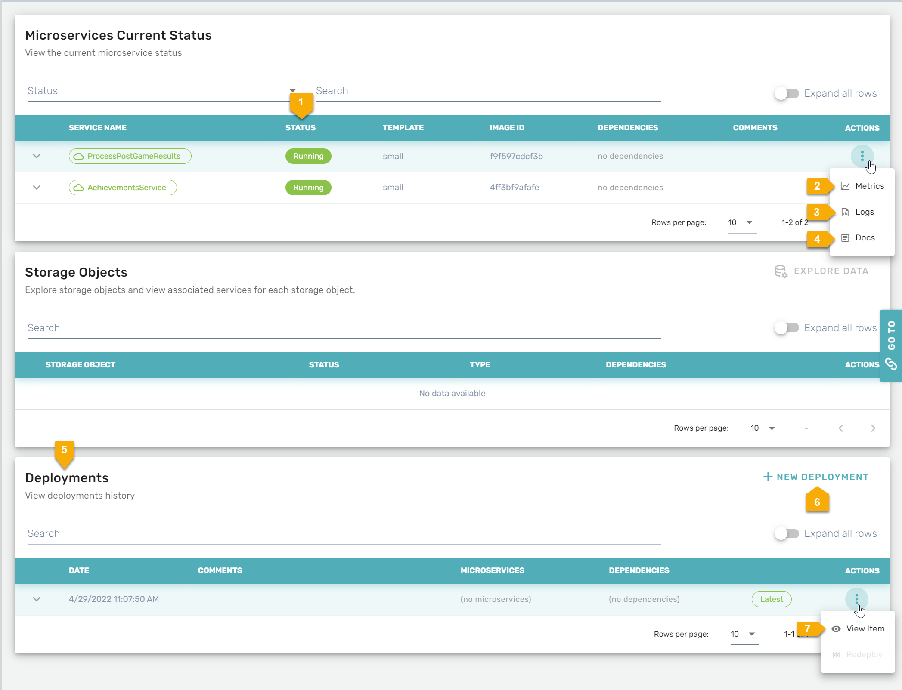
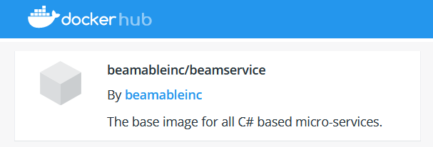
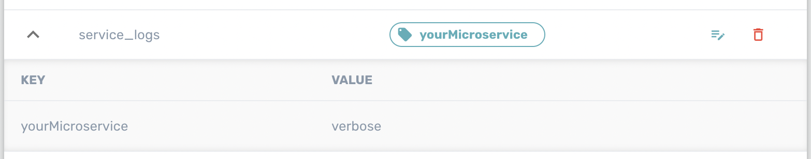

# Microservices Overview

Beamable Microservices are small C# projects that can handle web traffic for your game in Unity, Unreal, or custom engine. The C# project is written with the modern dotnet library which means you have full access to the vast majority of dotnet features, including Nuget, Msbuild, and the myriad of performance improvements available in recent dotnet updates. 

!!! warning "Dotnet and Docker Dependency!"

    To use Microservices, you will need to install [dotnet 8](https://dotnet.microsoft.com/en-us/download) onto your machine. In order to publish services, you will need to install [Docker](https://www.docker.com/products/docker-desktop/). (You _do not_ need to create a Docker account). These are only development dependencies.

The basic gist of a Beamable Microservice is a simple class like the one below, 

```csharp
[Microservice("ExampleService")]
public partial class ExampleService : Microservice
{
	[ClientCallable]
	public int Add(int a, int b)
	{
		return a + b;
	}
}
```

The `Add` method will be available as a callable HTTP route on the service. The serialization of the parameters and response types happen automatically as JSON based conversions. Client code is generated for Unity and Unreal as part of our engine integrations. Beamable handles the deployment, routing, and scaling of these services. 

## Microservices Framework

The Microservices use a framework for managing user requests and facilitating access to the rest of Beamable's feature suite. 

### Request Details

When a `[ClientCallable]` method executes, there is an available class field, `Context`, that contains information about the HTTP request responsible for initiating the `[ClientCallable]`.

#### Access Caller Information

It is common to require a player id for several operations that take place in a Microservice. The Player Id can be acquired through the `Context` property as the `UserId`. The given Player Id will be the Player id for the player that initiated the request. If no `Authorization` header was given to the HTTP call, such as calling a `[Callable]` method, then the `UserId` may be 0, implying there is no player associated with the call.

```csharp
[ClientCallable]
public void RequestDetails()
{
  var playerId = Context.UserId;
}
```

!!! info "Account Id"

    Sometimes, Beamable features require an Account Id instead of a Player Id. If a player signs up on a single realm, they get a _Player Id_ for that realm, and a global _Account Id_. When they sign up on a _second_ realm (perhaps a developer account, or on a second game), they get a new _Player Id_ for the new realm, but they use the same global _Account Id_ as before. 
    
    ```csharp
    var accountId = Context.AccountId;
    ```

#### Access Unity Version via Headers

The HTTP headers can be found via the `Context.Headers` property. The `Headers` is a `Dictionary<string, string>`, where the keys represent HTTP header names, and the values represent HTTP header values. 

The Unity Beamable SDK sends a few special headers that describe the game's environment, including the game's version, Unity's version, Beamable's version, and Unity's runtime target. 

| Header | Code | Description | Examples |
|--------|------|-------------|----------|
| X-KS-BEAM-SDK-VERSION | `var headerPresent = Context.Headers.TryGetBeamableSdkVersion(out var version);` | The Beamable SDK version that the request originated from. | 1.3.0, 1.2.10 |
| X-KS-USER-AGENT-VERSION | `var headerPresent = Context.Headers.TryGetClientEngineVersion(out var version);` | The version of the engine that sent the request. | 2019.3.1, 2021.3.1 |
| X-KS-USER-AGENT | `var headerPresent = Context.Headers.TryGetClientType(out var version);` | The name of the engine that sent the request. | Unity, UnityEditor |
| X-KS-GAME-VERSION | `var headerPresent = Context.Headers.TryGetClientGameVersion(out var version);` | The version of the game that sent the request. | 1.0, 0.1 |

These headers are sent automatically from the Unity SDK. If a request is sent from elsewhere, such as a custom script, the headers may not be present.

#### Handling Request Timeouts

It is possible that a request may timeout while it is executing. Long running loops are one example. In the code below, the `while` loop never completes, so the method never returns a value, so the request will timeout.

```csharp
[ClientCallable]
public int Example();
{
  while (true) { }
  return 1;
}
```

However, despite the request timing out and the client receiving an HTTP 504 error, the Microservice will _still be processing the loop_. This is a major performance problem, because the CPU will never yield control to other request executions. Essentially, anytime a request is caught in a non terminating loop, the entire Microservice performance profile suffers dramatically. It is a best practice to ensure loops will always terminate. In Beamable 1.9, the `Context` variable has a property, `Context.IsCancelled`, that returns `true` if the request has timed out. There is also a `Context.ThrowIfCancelled()` method that will throw a task cancellation exception. It is a best practice to _always_ include the `ThrowIfCancelled()` method in long running loops, as exemplified below.

```csharp
[ClientCallable]
public int Example();
{
  while (true) 
  { 
     // if the request has not been cancelled, this is a no-op.
     Context.ThrowIfCancelled();
  }
  return 1;
}
```

### Organizing Microservices Code

As your project grows, you will have a larger amount of C#MS code and, as such, you might want to split this code into multiple C#MSs in order to organize it.

However, doing so has implications you should take into consideration when deciding things for your project. In many cases, it is possible to simplify C#MS and reduce the quantity without sacrificing functionality.

- Having multiple deployed C#MSs incurs costs as each of them is a separate instance.

- While you can call C#MSs from other C#MSs to reuse code, this also turns your system into a distributed system. This adds complexity.

- Having multiple C#MSs also increases C#MS build/deploy times which can be a concern when developers want to iterate quickly.

So, what can you do to share and organize code without incurring costs or adding complexity to your C#MS?

You can leverage C# partial classes, which we support when detecting `ClientCallables`. The following snippets will define a single C#MS called `MyPartialMs` with two `ClientCallables`: `DoSomethingRelatedToA()` and `DoSomethingRelatedToB()`.

```csharp
// MyPartialMs.A.cs
[Microservice("MyPartialMs")]
public partial class MyPartialMs : Microservice {
 
    [ClientCallable]
    public void DoSomethingRelatedToA(){
    }
}

// MyPartialMs.B.cs
public partial class MyPartialMs {
 
    [ClientCallable]
    public void DoSomethingRelatedToB(){
    }
}
```

The end result here is that you have two `ClientCallables` in the same `MyPartialMs` but in separate files. The same thing works for utility functions and other similar things.

#### What should I use different C#MSs for?

Basically, the decision for this has to do with expected traffic hitting that feature/service and how it's resources are expected to scale. When reasoning about this, here are a couple of things to keep in mind:

- Requests Per Second that a feature can be expected to have. You can calculate this in a "back-of-the-napkin" way by estimating the number of non-locally cached requests the features make per-player every second and then multiply that by the expected number of concurrent players utilizing the feature.

- You should also think about how spikes in feature activity happen. A feature that spikes really fast to really high numbers might be a good canditate for being a stand-alone C#MS as its spikes may cause longer response times for features shared in it as the servers scale up. If a feature is expected to have a slow increase in requests-per-second, it should be able to scale without affecting other features even if they are in the same C#MS.

To keep things a bit simpler, here are general rules of thumb:

- Group as many features with low request-per-second profiles as you can in a single service. This simplifies your development process and make auto-scaling of the service more efficient. Especially if they don't spike quickly.
- Split out features that are expected to have heavy request-per-second profiles and want a lot of server resources (CPU/Memory) into their own C#MSs. Especially, if their usage spikes in a short amount of time.
- Keep payloads as small as you can. While we support larger payloads, it'll end up causing the C#MS to have to scale sooner. Try to keep these well below 10kb.
- Code organization should not factor into this decision if you want the maximum bang for your buck while using Beamable C# Microservices.

If the above is true and you still wish to share code between two different microservices, architect your code and functions so that the parts that are worth sharing can be pulled into a separate AssemblyDefinition which both services reference. Keep in mind that you should only do this if the complexity is worth the code reuse --- over-using AssemblyDefinitions can increase overall project complexity for not that much gain.

All-in-all, this is a very game-specific decision. As such, our goal is to provide guidelines and tools to help you make that decision. Currently, you can see CPU/Memory utilization metrics via the Beamable Dev Portal's C#MS section and, in the future, we may track more specific metrics to allow you to make better decisions.

### Designing Microservice Methods

When designing each microservice method, a key question is 'Who is allowed access?'. Game makers control this access with Microservice method attributes.

**Microservice Method Attributes**

| Name | Detail | Accessible Via? |
|------|--------|-----------------|
| [`[AdminOnlyCallable]`](https://csharp.cdocs.beamable.com/latest/classBeamable_1_1Server_1_1AdminOnlyCallableAttribute.html#details) | Method callable by any **admin** user account | Microservices OpenAPI |
| [`[ClientCallable]`](https://csharp.cdocs.beamable.com/latest/classBeamable_1_1Server_1_1ClientCallableAttribute.html#details) | Method callable by any user account | Microservices OpenAPI and Unity C# Client |

**Managing Deployed Microservices Via Portal**

With the Portal, game makers can view and manage the deployed Microservices.



| Name              | Details                                                                                                                   |
| :---------------- | :------------------------------------------------------------------------------------------------------------------------ |
| 1. Status         | Shows the **current** and deploying Microservices                                                                         |
| 2. Metrics        | Shows the metrics                                                                                                         |
| 3. Logs           | Shows the logs                                                                                                            |
| 4. Docs           | Shows the OpenAPI docs. See Debugging (Via OpenAPI) for more info |
| 5. Deployments    | Shows the **historic** deployments of Microservices                                                                       |
| 6. New Deployment | Allows game makers to make a new deployment                                                                               |
| 7. View           | Allows game makers to view new deployment                                                                                 |

### Making Beamable Calls From A Microservice

Each custom Microservice created extends the Beamable [`Microservice`](https://csharp.cdocs.beamable.com/latest/classBeamable_1_1Server_1_1Microservice.html) class.

This gives the custom Microservice access to key member variables:

- [`Context`](https://csharp.cdocs.beamable.com/latest/classBeamable_1_1Server_1_1RequestContext.html) - Refers to the current request context. It contains info including what PlayerId is calling and which path is run 
- [`Requester`](https://csharp.cdocs.beamable.com/latest/interfaceBeamable_1_1Common_1_1Api_1_1IBeamableRequester.html) - It can be used to make direct (and admin privileged) requests to the rest of the Beamable Platform
- [`Services`](https://csharp.cdocs.beamable.com/latest/interfaceBeamable_1_1Server_1_1IBeamableServices.html) - The powerful Microservice entry-point to Beamable's [`StatsService`](https://csharp.cdocs.beamable.com/latest/classBeamable_1_1Api_1_1Stats_1_1StatsService.html), [`InventoryService`](https://csharp.cdocs.beamable.com/latest/classBeamable_1_1Api_1_1Inventory_1_1InventoryService.html), and more

**Example**

Below are two versions of the same method call with varied implementations. Notice that #2 handles more functionality on the Microservice-side and is thus more secure.

**#1. Method Without Beamable Services**

Here the eligibility of reward is evaluated and the amount is calculated. This assumes the client side will handle the rewarding of the currency. 

```csharp
[ClientCallable]
public int GetLootboxReward()
{
  // if (IsAllowed), then reward 100 gold
  return 100;
}
```

**#2. Method With Beamable Services**

Here the eligibility of reward is evaluated, the amount is calculated, and the currency is rewarded.

```csharp
[ClientCallable]
public async Task<bool> GetLootboxReward()
{
  // if (IsAllowed), then reward 100 gold
  await Services.Inventory.AddCurrencies(
    new Dictionary<string, long> {{"currencies.gold", 100}});

  // Optional: Return success, if needed
  return true;
}
```

### Making External HTTP Calls

This example code will make an external HTTP call from the Beamable Microservice.

```csharp
[ClientCallable]
public async Task<string> GetCommitDescription()
{
  var service = Provider.GetService<IHttpRequester>();

  var commit = await service.ManualRequest(Method.GET,"https://whatthecommit.com/index.txt", parser: s => s);
  BeamableLogger.Log(commit);

  return commit;
}
```

!!! info "Custom HttpClient Implementation"

    You can also implement your own services that will handle calling other sites. 
    
    Learn more: <https://makolyte.com/csharp-how-to-make-concurrent-requests-with-httpclient/>

### Microservice Serialization

Unity's built-in features use [Unity's serialization](https://docs.unity3d.com/Manual/script-Serialization.html). 

However, within a Beamable's Microservice, game makers must rely instead on Beamable's custom Serialization. This serialization is strict and has limitations.

#### Types

| Supported Types | Unsupported Types |
|-----------------|-------------------|
| [Microservice Serialization Supported Types](https://docs.google.com/spreadsheets/d/1EWGhLQmoDIEAjwHk6Fn0BTJ3u8yAj5B2TxbefuBvZ88/edit?usp=sharing) | All other types |

#### UseLegacySerialization

A breaking change is introduced in Beamable SDK v0.11.0. If you began your project with an **earlier** version of the SDK, see [Beamable Releases Unity SDK Version 0.11.0](https://www.beamable.com/blog/beamable-releases-unity-sd-version-0-11-0) for more info. Otherwise, simply disregard this issue.

### Handling Errors

When a call to a Beamable service fails, it will throw a `RequesterException`. The exception can be caught using standard C# try/catch practices. In the example below, the call to `SetCurrency` will fail, and the `catch` block will capture a `RequesterException` that exposes details about the failure.

```csharp
using Beamable.Common.Api;
using Beamable.Server;
using System.Threading.Tasks;

namespace Beamable.Microservices {
  [Microservice("ErrorDemo")]
  public class ErrorDemo: Microservice {
    [ClientCallable]
    public async Task < string > ServerCall() {
      try {
        // do something that will trigger a failure, like trying to reference a piece of content that doesn't exist.
        await Services.Inventory.SetCurrency("does-not-exist-so-it-will-trigger-a-400", 0);
      } catch (RequesterException ex) {
        return $ "{ex.Method.ToReadableString()} / {ex.Payload} / {ex.Prefix} / {ex.Status} / {ex.Uri} / {ex.RequestError.error} / {ex.RequestError.message} / {ex.RequestError.service}";
      }

      return "okay";
    }
  }
}
```

!!! info "Share Exception code with Unity"

    The `RequesterException` is the same type of exception that is thrown on the Unity client SDK in the event of a Beamable networking error. You can catch the same type and use the same error handling logic.

### Beamable & Docker

Beamable Microservices uses the industry standard Docker technology. Docker simplifies and accelerates your workflow, while giving developers the freedom to innovate with their choice of tools, application stacks, and deployment environments for each project. See Docker's [documentation](https://docs.docker.com/) for more info.

Beamable handles all coordination and configuration of Docker including the `beamableinc/beamservice` base image hosted on Docker's [DockerHub](https://hub.docker.com/u/beamableinc).



## Publishing Microservices

Microservices are developed locally on your machine, but when it comes to release your game or do more integrated testing, the Microservices should be published to the Beamable Cloud. When a Microservice is published, Beamable takes charge of running the Microservice at production scale, with auto-scaling rules.

To Publish your Microservices, navigate to the _Beam Services_  window and click the _Release_ button at the top of the window. A popup will appear that operates in three main phases. First, all your local services are built in Release mode. If there are any compile errors in your services, the publish process will fail here. Second, the publish popup will show an option to review the publication. You will be given an opportunity to see which services will be uploaded, what services will be enabled, etc. The final phase is the actual uploading of the Microservice code and the publication event.

Microservice and storages are published as a single atomic unit, instead of individually. If you have multiple Microservices, a publication will take all Microservices into consideration. However, if the Beamable SDK can determine that the Microservice has not changed, then it will not be re-uploaded.

## Using Published Services

Once the services have been published, they are viewable on the Beamable Portal. Services logs, metrics, and openAPI specification can be accessed for these remote services.

### Remote Logging

By default, Microservices use an INFO log level when published.

!!! tip
    However, Microservices use a DEBUG log level when running locally.

If you need to change the log level, consider first using request based log level controls. Navigate to the microservice section of the Portal, and create a Log Config Rule for your desired service. You can change the log level dynamically per request based on what player is requesting the service, or which route is being invoked. 

For example, you could enable DEBUG logging for a player that called into your customer support line, or enable DEBUG logs for a particularly sensitive route. 

You can also use the Log Config section to change the default request level. 

It is also possible to change the default log level for a service by using Realm Config.

!!! tip
    The _request_ level will set the log level for all requests made to your service, but internal background Beamable framework logs will still be set to a default level of INFO (which means very few system logs). 

If you need to change the default log level, then go to the Realm Config page of portal, create a new namespace called "service_logs". Then, create an entry in the "service_logs" namespace for each service you want to change the log level for. The entry should be the name of the Microservice. The value should be one of the following, "verbose", "debug", "info", "warn", "error", or "fatal".



If you configure the service with "fatal", then only log messages at the "fatal" level will be shown. However, if you configure the service with "debug", then all log messages with a log level of "debug" or greater will be shown, including "debug", "info", "warn", "error", and "fatal".

## Deleting a Service

If you have a published service, delete the service locally, and then start a new publication step, then you will be "archiving" the service. The publication step will stop the service in the Beamable Cloud and hide it in the Portal view.
