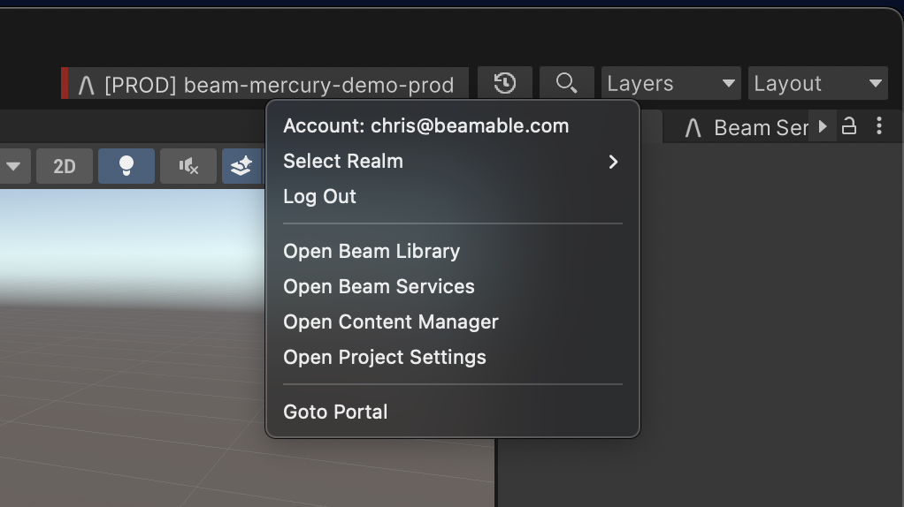
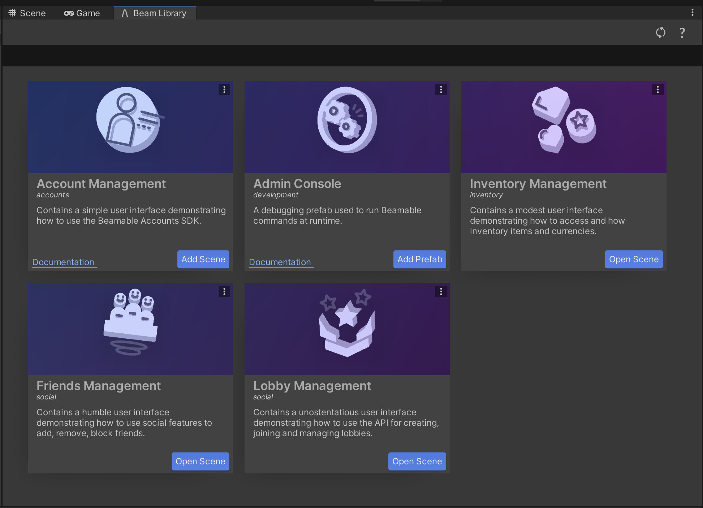
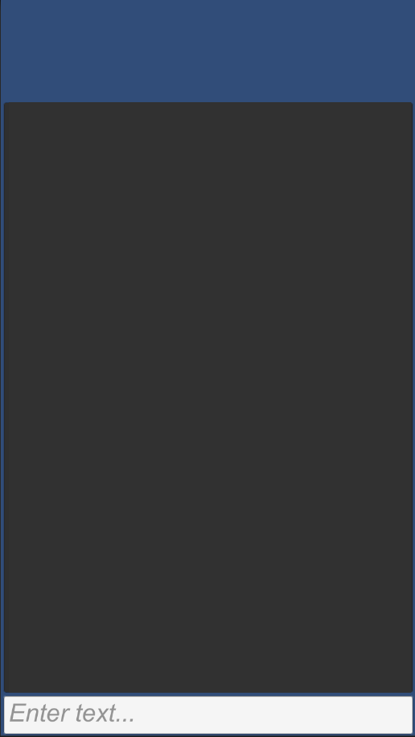

# Beam Library Overview

The Beam Library is a collection of package samples and prefabs to help get you started learning the Unity SDK. To open the Beam Library, click on the Beamable Button (at the top-right of the Unity window), and select _Beam Library_. 

{width="400px"}

Now the _Beam Library_ should be open. 

{width="400px"}

Each card represents a Package Sample. When you click the "Open Scene" button, a Beamable sample will be added to your assets folder under `Assets/Samples/Beamable`.

## Admin Console

Beamable provides you with an easy way to get debug information about your Beamable game. We provide you with a command line tool, as a prefab, that can be placed in a unity scene and allow you to access information via command.

!!! info "This is currently a Unity only feature"

    This feature currently requires Unity 3D development environment and is not available for other platforms. It is designed to be used within the Unity Editor.

| Command       | Details                                                             |
| :------------ | :------------------------------------------------------------------ |
| LOGIN_ACCOUNT | Login to the PlayerId designated by the given username & password   |
| IDFA          | Get the Advertising ID of the current device                        |
| HEARTBEAT     | Get the heart beat of a user account                                |
| TOKEN         | Show current access token                                           |
| EXPIRE_TOKEN  | Expires the current access token                                    |
| CORRUPT_TOKEN | Corrupts the current access token to trigger the refresh token flow |
| RESET         | Clear the access token and start with a fresh account               |

These are but a few of the commands you can perform from within the Admin tool. To get a full list of the available commands you can type **help** at the prompt and see all available commands.

### AdminFlow API

#### Creating Custom Admin Commands

Game makers can create custom admin commands for additional functionality.

AdminFlowCustomCommandExample.cs
```csharp
using Beamable.ConsoleCommands;
using UnityEngine;

namespace Beamable.Examples.Features.AdminFlow
{
    [BeamableConsoleCommandProvider]
    public class CustomConsoleCommandProvider 
    {
        [BeamableConsoleCommand ("Add", "A sample addition command", "Add <int> <int>")]
        public string Add(string[] args)
        {
            var a = int.Parse(args[0]);
            var b = int.Parse(args[1]);
            return "Result: " + (a + b);
        }
    }
    
    /// <summary>
    /// Demonstrates <see cref="AdminFlow"/>.
    /// </summary>
    public class AdminFlowCustomCommandExample : MonoBehaviour
    {
        //  Unity Methods  --------------------------------
        protected void Start()
        {
            Debug.Log($"Start() Instructions...\n" + 
                      " * Run The Scene\n" + 
                      " * Type '~' in Unity Game Window to open Admin Console\n" + 
                      " * Type 'Add 5 10'\n" + 
                      " * See 'Result: 15' in Unity Console Window\n");
        }
    }
}
```

### Admin Console Prefab

#### Overview

The **Admin Flow** Feature Prefab provides developers with debugging capabilities.

The purpose of this feature is to offer the game maker an in-game UI for executing game commands and cheats.

#### Usage

The Admin Flow can be opened at runtime in multiple ways...

- Within the Unity Editor, press the "~" key
- Within a Mobile Build, use a "three-finger swipe-up gesture"

#### The User Interface

{width="200px"}

#### Adding to your project

The Admin Prefab is accessible via the _Beam Library_ window. You can open the _Beam Library_ and add the admin prefab to your scene.

#### Admin Commands

Once the Admin Flow is open, type an admin command into the input field and press return.

There are built-in Beamable admin commands and game makers can create custom admin commands for additional functionality.

##### Using Beamable Admin Commands

| Command                                         | Detail                                                                                                               |
| :---------------------------------------------- | :------------------------------------------------------------------------------------------------------------------- |
| `help`                                          | Shows the list of all admin commands                                                                                 |
| `TRACK_PAYMENT`                                 | Track a test payment audit                                                                                           |
| `ECHO <message>`                                | Repeat message to console.                                                                                           |
| `WHERE <command>`                               | Find where a specific console command was registered from, if it was registered with a DBeamConsoleCommand attribute |
| `account_toggle`                                | emit an account management toggle event                                                                              |
| `account_list`                                  | list user data                                                                                                       |
| `IDFA`                                          | print advertising identifier                                                                                         |
| `RESET`                                         | Clear the access token and start with a fresh account                                                                |
| `LOCALNOTE [<delay> [<title> [<body>]]]`        | Send a local notification. Default delay is 10 seconds.                                                              |
| `TIMESCALE <value> \| variable`                 | Sets the current timescale                                                                                           |
| `SUBSCRIBER_DETAILS`                            | Query subscriber details                                                                                             |
| `DBID`                                          | Show current player PlayerId                                                                                         |
| `ENTITLEMENTS <symbol> <state>`                 | Show current player entitlements                                                                                     |
| `HEARTBEAT <dbid>`                              | Get heartbeat of a user                                                                                              |
| `LOGIN_ACCOUNT <email> <password> `             | Log in to the PlayerId designated by the given username and password                                                 |
| `MAIL_GET <category>`                           | Get mailbox messages                                                                                                 |
| `MAIL_UODATE <id> <state> <acceptAttachments> ` | Update a mail                                                                                                        |
| `REGISTER_ACCOUNT <email> <password>`           | Registers this PlayerId with the given username and password                                                         |
| `EXPIRE_TOKEN`                                  | Expires the current access token to trigger the refresh flow                                                         |
| `CORRUPT_TOKEN`                                 | Corrupts the current access token to trigger the refresh flow                                                        |
| `TEST-ANALYTICS`                                | Run 1000 events to test batching/load                                                                                |
| `IAP_BUY <listing> <sku>`                       | Invokes the real money transaction flow to purchase the given item_symbol.                                           |
| `IAP_PENDING`                                   | Displays pending transactions                                                                                        |

#### Force-Enabled

Within the Unity Editor, press the "~" key to open the in-game console. This always works, regardless of player privileges or "Admin Flow" settings.

On device, use a three-finger swipe gesture to open the in-game console. This only works if the player has sufficient privileges, or if the "Admin Flow" settings specify the console should always be available.

!!! info "Best Practice"

    - For security reasons, it is not recommended to allow a players to access the in-game console. Beamable has precautions in place to prevent this.

The in-game console, on-device, will **only** appear if the force-enabled checkbox is true, or if the current player's account has tester, developer, or admin privileges.

The Portal allows game makers to grant player privileges. This privilege-requirement only applies to device, not the Unity Editor.

