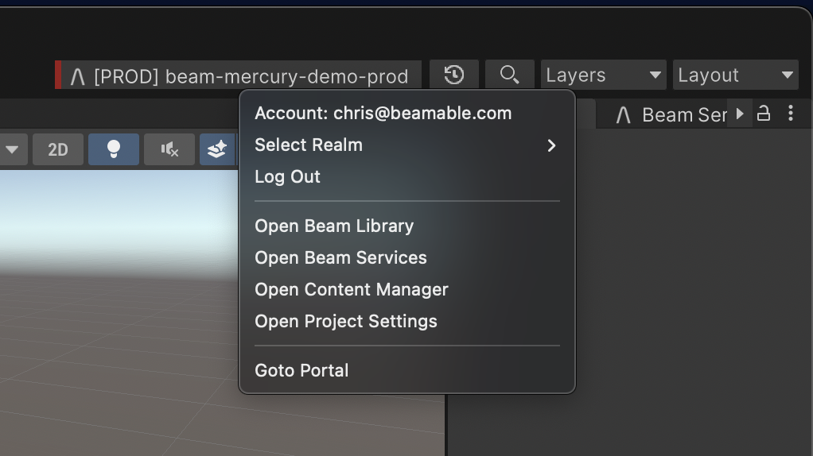
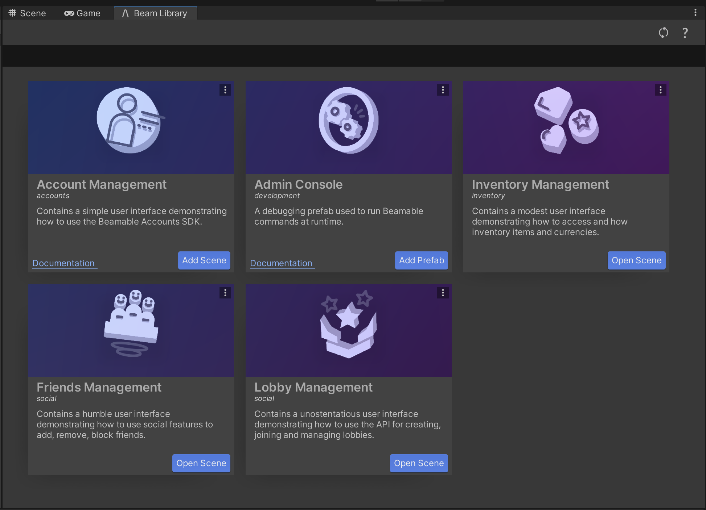

# Beam Samples overview

The **Beam Samples** window is a collection of Lightbeam samples that help you get started learning the Unity SDK. To open it, click the Beamable button (at the top-right of the Unity window) and select _Beam Samples_.

{width="400px"}

Now the _Beam Samples_ window should be open.

{width="400px"}

Each card represents a Lightbeam sample. Selecting a sample copies it into your project under `Assets/Samples/Beamable`.

## Admin Console

!!! warning "Deprecated: prefab-based Admin Console"
    Earlier SDK versions shipped the Admin Console as a prefab (the "Admin Flow" feature) that you added to your scene from this window. That prefab is deprecated and scheduled for removal in a future release. The Admin Console is now a built-in runtime integration that requires no prefab — see [Admin console](../runtime-systems/admin-console.md) for setup, the built-in command reference, and the custom-command API.

