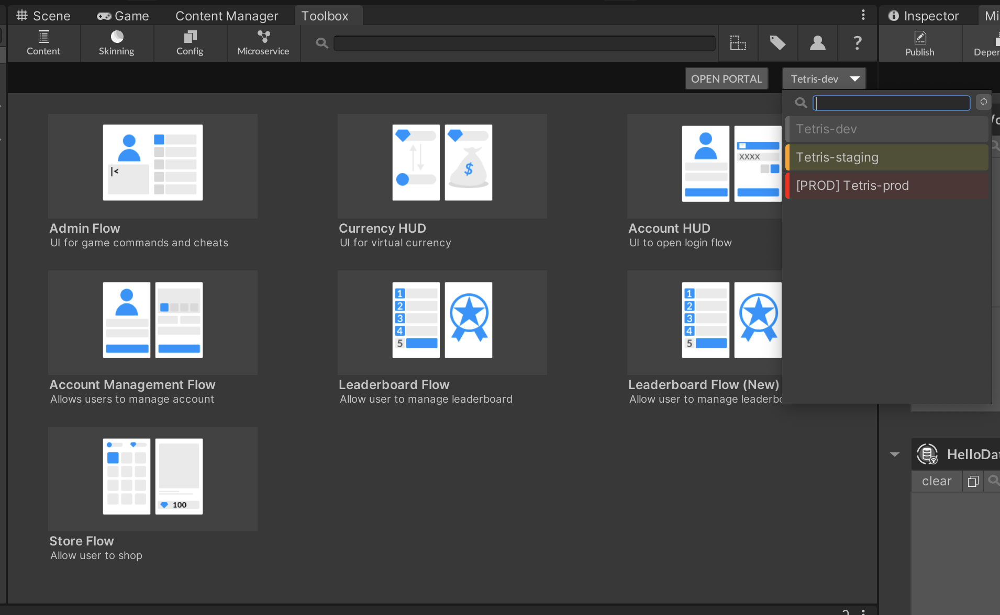
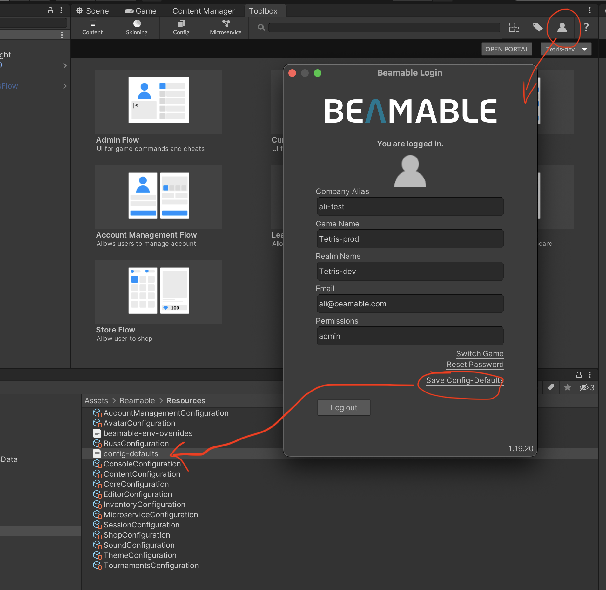
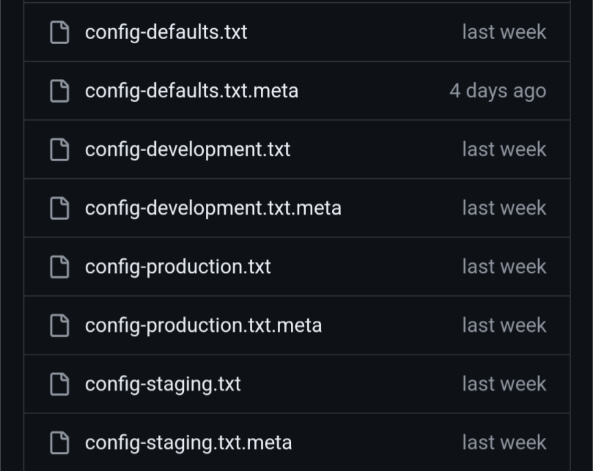

# Builds & Environments

If you run the project in the Unity editor in play mode, the realm that will activate against the play mode will be the realm that is specified in the selector.



When you do a build in Unity, the realm that is selected for the build is whatever is stored in the config-default.txt file.

To update what is in the config-defaults.txt, you can open the account section, and click the "Save Configs-Defaults" file which will save whatever realm you are using in the editor to the file.



For automated builds (e.g. Unity Cloud, Github Actions, etc.), we also have a Unity pre-build script which will swap out the realm based on an environment variable. You can basically have multiple config-<env>.txt files.



Here is the script that you can use to automate the builds.

```csharp
using System;
using System.IO;
using UnityEditor;
using UnityEditor.Build;
using UnityEditor.Build.Reporting;
using UnityEngine;

public class BuildProcessorOverrideConfigDefaults : IPreprocessBuildWithReport
{
    public int callbackOrder => 0;

    public void OnPreprocessBuild(BuildReport report)
    {
        string configKey = Environment.GetEnvironmentVariable("BEAMABLE_CONFIG");
        CopyOverrideConfig(configKey);
    }

    private static void CopyOverrideConfig(string configKey)
    {
        Debug.Log("Checking for Beamable Config Override...");
        var configDefaultsAssetPath = Path.Combine("Assets", "Beamable", "Resources", "config-defaults.txt");
        if (!File.Exists(configDefaultsAssetPath))
        {
            throw new IOException($"Beamable Config Defaults missing! Config file was not found at path: '{configDefaultsAssetPath}'.");
        }
        
        if (!string.IsNullOrEmpty(configKey))
        {
            Debug.Log($"Beamable Config override provided. Attempting to copy 'config-{configKey}.txt' to 'config-defaults.txt'.");
            var configAssetPath = Path.Combine("Assets", "Beamable", "Resources", $"config-{configKey}.txt");
            if(File.Exists(configAssetPath))
            {
                FileUtil.ReplaceFile(configAssetPath, configDefaultsAssetPath);
                AssetDatabase.ImportAsset(configDefaultsAssetPath, ImportAssetOptions.ForceUpdate);
                AssetDatabase.Refresh();

                var configDefaultsText = File.ReadAllText(configDefaultsAssetPath);
                var configAssetText = File.ReadAllText(configAssetPath);
                
                if (configAssetText != configDefaultsText)
                {
                    throw new IOException("Beamable Config override failed to copy to config-defaults. Config content does not match." +
                                          $"\n[config-defaults.txt]:\n{configDefaultsText}\n" + 
                                          $"\n[config-{configKey}.txt]:\n{configAssetText}");
                }
                
                Debug.Log($"Beamable Config override successfully copied to config-defaults: '{configAssetPath}'.");
            }
            else
            {
                throw new IOException($"Failed to apply Beamable Config override. Config file was not found at path: '{configAssetPath}'.");
            }
        }
        else
        {
            Debug.Log("No Beamable Config Override provided, using default config.");
        }
    }
}
```
