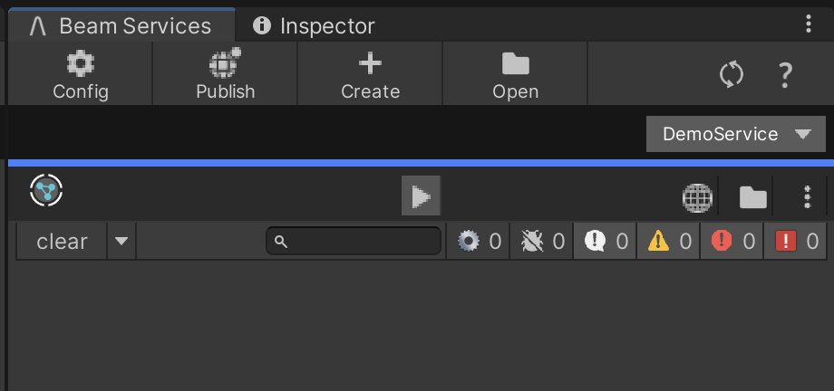

# Beam Services

The _Beam Services_ window allows you to manage your Microservice and Microstorage objects in the project. You can open the _Beam Services_ window by clicking the _Beamable Button_ and selecting _Open Beam Services_. 

{width="400px"}

## The User Interface

Here is the user interface of the _Beam Services_ window. 

{width="400px"}

Along the top bar are 4 major buttons, 

| Button  | Description                                                                                                                                             |
| :------ | :------------------------------------------------------------------------------------------------------------------------------------------------------ |
| Config  | Sets the _Beam Services_ window to config mode for the selected service.                                                                                |
| Publish | Opens the publish window, which will begin the process to building your services to publication to Beamable. Learn more at [Publishing](doc:publishing) |
| Create  | Create a new service, storage, or federation id.                                                                                                        |
| Open    | Open a code editor to view all the services in a shared solution.                                                                                       |

The mid bar has a single dropdown which is the service selector. The _Beam Services_ window only shows a single service at a time. If you had multiple services, you would switch between them using the dropdown. The dropdown also has function buttons to quickly toggle a service's state, go to the Open API documentation, and more. 

The lower bar has a row of function buttons for the selected Service. These buttons do not have text, so the following table will describe them in order from left to right. 

| Button / Icon        | Anchor | Description                                                                                                                                                               |
| :------------------- | :----- | :------------------------------------------------------------------------------------------------------------------------------------------------------------------------ |
| Service Icon         | Left   | A simple icon denoting this is a MIcroservice. If a Microstorage were selected, this icon would show a Storage symbol.                                                    |
| Run Button           | Center | This button will highlight blue when the service is running. The first time you click it, it will start the service. If you click it again, it will turn off the service. |
| Documentation Button | Right  | Opens the auto-generated OpenAPI documentation page in Portal.                                                                                                            |
| Open Code Button     | Right  | Opens the shared dotnet solution file for all services and storages.                                                                                                      |
| More Options Button  | Right  | Opens a dropdown showing more options for each service card.                                                                                                              |

Finally, the main content of the _Beam Window_ is the log view for the Microservice. The logs from locally running Microservices will be sent to this section. There are log level filters similar to the Unity Console logs. However, this window has additional log levels, including Verbose, Debug, and Fatal. By default, Verbose and Debug are disabled, because they can be overly noisy when looking at your service logs. However, they can be helpful to debug a broken Microservice.
