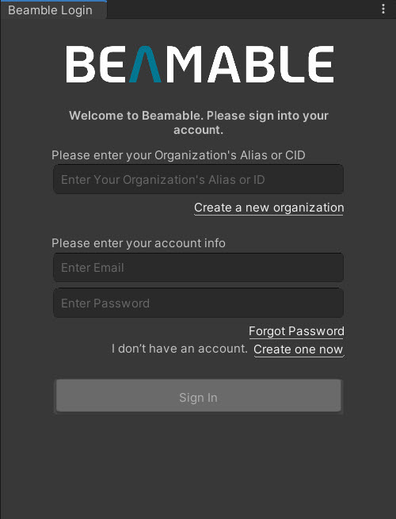
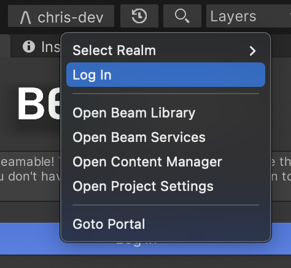
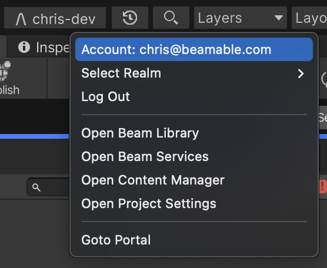
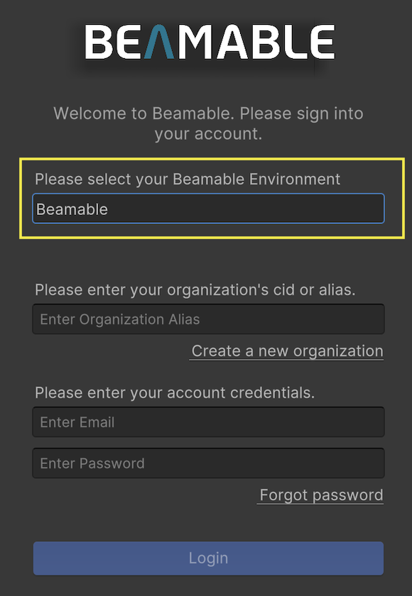

# Unity Editor Login

## Overview

The Beamable Login tool window provides a user interface for managing authentication and account access within the Unity editor environment.

The purpose of this Tool Window is to allow front-end administration of the game maker account.

## The User Interface

Here is the user interface of the Beamable "Login" tool window.

| New User | Existing User                                                                                          |
|----------|--------------------------------------------------------------------------------------------------------|
| {width="300px"} | {width="300px"} |

To open the panel, select "Log in" from the Beamable Button if you are not logged in, or select your email address if you are logged in.

{width="300px"}

{width="300px"}

## Login Information

When you log into Beamable in the Unity editor, the log-in information is kept in the `.beamable` workspace folder in your Unity project's root folder. You can run terminal commands from that folder with the same authentication. If you log out from either the CLI or the Unity editor, the log-in information will be removed.

## Changing Beamable Environment

By default, Beamable packages are configured to use Beamable's production server environment, at `https://api.beamable.com`. If you want to target a different Beamable server environment, or a Private Cloud environment, you need to configure that when you log into Beamable within the Unity Editor.

{width="300px"}
