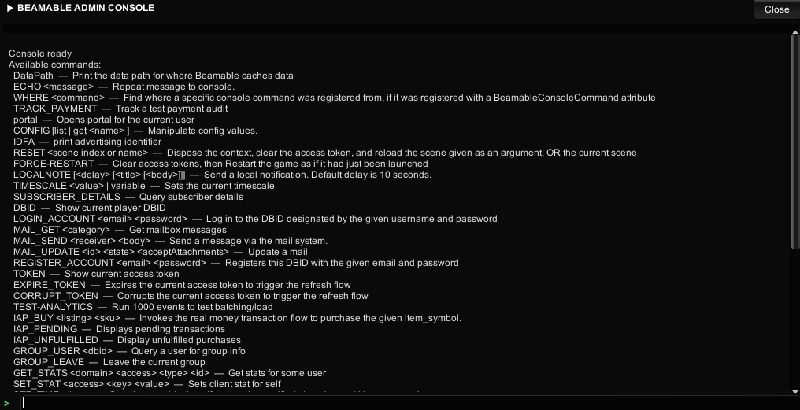

# Admin console

The Admin Console is a runtime overlay that lets developers and QA engineers run commands against a live Beamable game session without stopping play mode or redeploying. It renders an window over the scene and accepts typed commands, with autocomplete and history navigation built in.



As of this version, the Admin Console is a built-in integration managed directly by the Beamable runtime — no manual prefab setup is required. The previous prefab-based Admin Console is deprecated and will be removed in a future release. Migrate to the built-in integration described on this page.

!!! warning "Deprecated: prefab-based Admin Console"
    The old `ConsoleFlow` prefab approach is deprecated. Remove any existing Admin Console prefabs from your scenes and rely on the built-in initialization described in [Initialization](#initialization).

## Activating the console

The console can be opened and closed several ways depending on the target platform and input configuration.

| Method | Details |
|--------|---------|
| Backtick / grave key (`` ` ``) | Default keyboard shortcut on all platforms |
| 3-finger swipe | Touch platforms — drag three fingers while they are all on screen |

## ConsoleConfiguration

`ConsoleConfiguration` is a Beamable module configuration ScriptableObject found alongside the other Beamable config assets in your project (under **Beamable** → **Resources** → **ConsoleConfiguration** in the Project window).

| Field | Type | Default | Description |
|-------|------|---------|-------------|
| `EnableAdminConsole` | `bool` | `true` | Enables the console overlay in non-editor builds for all players, bypassing the `cli:console` scope requirement |

!!! note "Deprecated fields"
    `ForceEnabled` and `ToggleAction` are still present in the asset but only apply to the old prefab-based Admin Console. They have no effect on the built-in integration and can be ignored.

!!! tip
    Set `EnableAdminConsole` to `false` before shipping a player-facing build to ensure the console cannot be opened without the `cli:console` scope.

## Access control

| Environment | Behavior |
|-------------|---------|
| Unity Editor | Always enabled |
| Runtime build | Requires `ConsoleConfiguration.EnableAdminConsole = true` **or** the logged-in player must have the `cli:console` scope |

Players without the `cli:console` scope will not be able to open the console even if they trigger the correct gesture or key.

## Keyboard shortcuts

Once the console overlay is open, the following shortcuts are active:

| Key | Action |
|-----|--------|
| `Enter` / `Return` | Submit the current input |
| `Tab` | Accept the current autocomplete suggestion; press again to cycle through matches |
| `↑` / `↓` | Navigate command history |
| `Escape` | Close the console |

## Running commands

Type a command and press `Enter`. The console echoes the command, runs it, and appends the result to the output log.

Example:
```
> account_list
```

## Listing all Commands

Use the `help` command to list every registered command and its usage:

```
> help
```


## Logging to the console

Any script can write lines to the console output by calling `Log` on the singleton instance:

```csharp
BeamableAdminConsole.Instance.Log("Inventory refreshed.");
```

## API reference

### Instance

```csharp
public static BeamableAdminConsole Instance { get; private set; }
```

Singleton reference set during `InitializeConsole`. Use this to call `Log`, check state, or subscribe to events from anywhere in your code without holding a direct reference to the component.

### IsActive

```csharp
public bool IsActive { get; }
```

`true` while the console overlay is visible on screen. Use this to pause game input or suppress UI interactions that should not fire while the console is open.

### IsInitialized

```csharp
public bool IsInitialized { get; }
```

`true` after `InitializeConsole` has completed successfully. Calls to `Log` or `Instance` before initialization are safe but will have no visible effect until the console is ready.

### OnLogLine

```csharp
public event Action<string> OnLogLine;
```

Fired each time a line is appended to the console output, whether from a command result, a `Log` call, or internal console messages. Subscribe to forward output to an external logger or display it in a custom UI:

```csharp
BeamableAdminConsole.Instance.OnLogLine += line => MyLogger.Write(line);
```