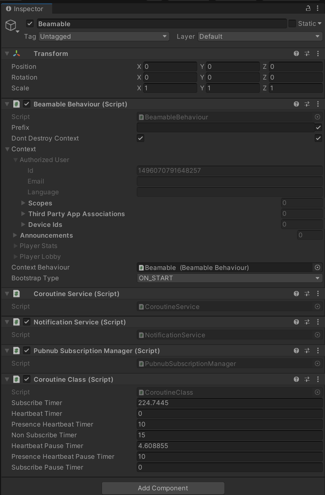

# Player Centric API

The "Beamable SDK for Unity" provides a main entry point to Beamable functions in your Unity Code and the Beamable Player-Centric API is the recommended way to access Beamable APIs.

This class is designed to support multiple local players, flexible API reference syntax, testability, and lazy initialization. The Beamable Player-Centric API also continues to offer a flexible API reference syntax of Async / Await, Callbacks, Coroutines, as well as **Synchronous**.

## BeamContext Overview

After that setup, game makers use the `BeamContext` object as the main entry-point to Beamable functionality. Here's a simple example of initializing the `BeamContext` 

```csharp
private async void InitializeBeamContext()
{
    var _context = BeamContext.Default;
    //The OnReady callback can be used to explicitly wait for initialization to complete.
    //However, it can be omitted in a synchronous function.
    await _context.OnReady;
    Debug.Log($"_context.PlayerId = {_context.PlayerId}");
}
```

Additionally The Beamable Player-Centric API has multiple ways to return the reference to the API. Each one is suited for different use-cases:

| Syntax                                                    |                                                                                  |
| :-------------------------------------------------------- | :------------------------------------------------------------------------------- |
| `var beamContext = BeamContext.Default;`                  | **Default**. This is suggested for most use-cases                                |
| `var beamContext = BeamContext.ForContext("MyPlayer01");` | Ideal for games with 2+ local players                                            |
| `var beamContext = BeamContext.ForContext(this);`         | Traverses the hierarchy for relevant configuration data. **Advanced Users Only** |

You can see more samples of it usage below:

**One Local Player Sync**  
Here the game maker references the context _synchronously_. Note that the `PlayerId` may be null during the initialization of the Beamable system.

```csharp
private void MyMethodViaSynchronous()
{
    var beamContext = BeamContext.Default;
    Debug.Log($"beamContext.PlayerId = {beamContext.PlayerId}");
}
```

**One Local Player Async**  
Here the game maker references the context _asynchronously_ to guarantee the value `PlayerId` will be set.

```csharp
private async void MyMethodViaAsynchronous()
{
    var beamContext = BeamContext.Default;
    await beamContext.OnReady;
    Debug.Log($"beamContext.PlayerId = {beamContext.PlayerId}");
}
```

**Two or More Local Players**  
Here the game maker references 2 (or more) contexts. This is ideal for advanced use-cases such as couch-coop games.

```csharp
private void MyMethodViaSynchronous()
{
    var beamContext01 = BeamContext.ForPlayer("MyPlayer01");
    Debug.Log($"beamContext01.PlayerId = {beamContext01.PlayerId}");

    var beamContext02 = BeamContext.ForPlayer("MyPlayer02");
    Debug.Log($"beamContext02.PlayerId = {beamContext02.PlayerId}")
}
```


## BeamContext Lifecycle

The Lifecycle of the `BeamContext` instance is very straightforward. You can see the complete list of functions below:

| API                                               | Definition                                                                                                                                                                                                                                                                                     |
| :------------------------------------------------ | :--------------------------------------------------------------------------------------------------------------------------------------------------------------------------------------------------------------------------------------------------------------------------------------------- |
| BeamContext.OnReady()                             | Confirms `BeamContext` is running and the player has finished logging in.                                                                                                                                                                                                                      |
| BeamContext.Start()                               | Starts tracking changes to the user state. Does nothing if the context has already been started.                                                                                                                                                                                               |
| BeamContext.Stop()                                | Coroutines stop, subscriptions stop, deletes `GameObject` linked to context. Since it is a promise, it should be awaited, but it will still function in a synchronous context if there is no need to detect when it finishes. `OnDispose` will be called for all services when Stop is called. |
| BeamContext.ClearPlayerAndStop()                  | Logs the player out and does the same thing as `Stop()`. Erases the PlayerId and access token. Calling `Start()` after this will grab a brand new player and fill it into the Context variable you were already using.                                                                         |
| BeamContext.ChangeAuthorizedPlayer(TokenResponse) | Switches the PlayerId of the context to the given player.                                                                                                                                                                                                                                      |

_Note: `BeamContext` API calls will fail if it is stopped in the middle of an async method and will throw an exception. It must be started for these calls to work._

## Attaching Service Callbacks

Here the game maker references the context and subscribes to service changes via callback. The common Beamable services support various callbacks.

**Currency OnUpdated Callback**

```csharp
private async void MyMethodForCurrencyCallback()
{
    var beamContext = BeamContext.Default;
    beamContext.Inventory.Currencies.OnUpdated += () => 
   {
        Debug.Log("The currency has been modified.");
   };
}
```

**Common Service Callbacks**

| Name | Detail |
|------|--------|
| OnLoadingStarted | Invoked when the service starts loading.<br><br>_Note: between the loading start and loading finish, a data update may occur, however that does not mean the service is fully finished loading._ |
| OnLoadingFinished | Invoked when the service finishes loading.<br><br>_Example:_<br>`beamContext.Inventory.Currencies.OnLoadingFinished` |
| OnUpdated | Invoked when some change is detected in the data contained in the service. This event has no arguments, so it is only a notification with no data.<br><br>_Example:_<br>`beamContext.Inventory.Currencies.OnUpdated` |
| OnDataUpdated | Invoked directly after OnUpdated, but contains a list of the internal data. The event argument is of type `List<T>`.<br><br>_Example:_<br>`beamContext.Inventory.Currencies.OnDataUpdated`, which passes type `List<PlayerCurrency>` |


## In the Unity Editor

When a BeamContext instance is initialized, a GameObject will be instantiated under Unity's "DontDestroyOnLoad" folder in the scene hierarchy. This GameObject will be named "Beamable" and contains information and behaviours for the currently running context, including:

• The current Authorized User  
• Player Stats  
• Subscription/Coroutine managers

Since this object is linked to the associated Context, calling `Stop()` on the context will delete this object, and vice versa.




## Legacy Beamable API

The Legacy Beamable API is still available for use in the Beamable SDK for Unity, but it is no longer the recommended way to access Beamable APIs.

```csharp
private async void InitializeLegacyAPI()
{
    var beamableAPI = await Beamable.API.Instance;
    Debug.Log($"beamableAPI.User.id = {beamableAPI.User.id}");
}
```

After that setup, game makers use the `beamableAPI` object as the main entry-point to Beamable functionality. Limitations of this API include that it relates to exactly _one_ local player and most Beamable functionality within must be called **asynchronously**.

You can the difference between the two APIs in the table below:

| Benefits | Legacy API | Player-Centric API |
|----------|------------|-------------------|
| Flexible **creation** syntax<br>(Async / Await, Callbacks, & Coroutines) | ✔️ | ✔️ |
| Flexible **service method calls** syntax<br>(Async / Await, Callbacks, Coroutines & Synchronous) | ❌ | ✔️ |
| Supports 2+ Local Players | ❌ | ✔️ |
| Designed for Testability | ❌ | ✔️ |
| Optimized for Lazy Initialization | ❌ | ✔️ |


Game makers with existing Beamable projects which are using the legacy Beamable API are encouraged to migrate to the Beamable Player-Centric API

For the simplest migration instructions;

- Replace `var beamableAPI = await Beamable.API.Instance;` with `var beamContext = BeamContext.Default;`.
- APIs and services are accessed very similarly as well, since a BeamContext instance has an `Api` variable, with access to all the same services as Beamable.API. This is documented further in the [Player Centric API - Dependency Injection](doc:player-centric-api-dependency-injection) documentation.
