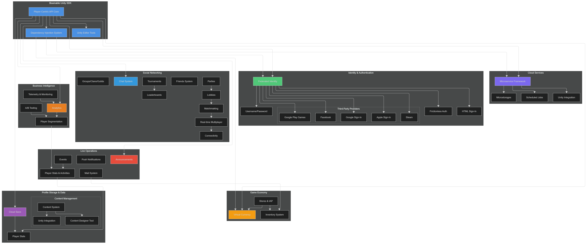

# Unity SDK Technical Overview

## Introduction

Modern game development faces numerous challenges: setting up scalable backend infrastructure, implementing secure authentication systems, managing virtual economies, handling real-time multiplayer networking, and analyzing player behavior. Beamable solves these problems by providing a unified platform that enables developers to build modern multiplayer games with advanced features like live operations, social networking, game economy, analytics, and cloud services without the complexity of managing backend infrastructure.

## Beamable Way

The Beamable Unity SDK allows your Unity Project to connect with the Beamable Services. This addresses the fundamental challenges of modern game development by providing a comprehensive, integrated platform that eliminates the need to build backend infrastructure from scratch. Instead of spending months implementing authentication systems, virtual economies, and multiplayer networking, developers can focus on creating compelling gameplay experiences. 

The platform's player-centric design ensures that all systems work together seamlessly, while the deep Unity Editor integration maintains developer productivity. With first citzen support to C# Microservices, developers can extend the platform with custom server-side logic without managing servers or scaling infrastructure. This combination of features and ease of use empowers developers to build, launch, and operate modern multiplayer games efficiently.

Bellow you can find a comprehensive technical overview of the Beamable Unity SDK, highlighting its key components, architecture, and features.

### Player-Centric API and Dependency Injection

Beamable follows a player-centric architecture that fundamentally changes how developers think about game backend services. Traditional game development often requires managing multiple disparate systems, each with their own APIs, authentication methods, and data models. This fragmentation leads to increased development time, security vulnerabilities, and maintenance overhead.

The [Player-Centric API](runtime-systems/player-centric-api.md) solves this by organizing all services around the player experience, providing a unified interface that treats the player as the central entity. The [Dependency Injection System](runtime-systems/di.md) ensures clean architecture patterns for managing service dependencies, making code more testable and maintainable. On top of it, a suite of Unity Editor Tools deeply integrated provides a seamless development workflow, allowing developers to configure, test, and deploy backend services directly from the Unity Editor.

### Microservice-First Architecture

Many games require custom server-side logic that goes beyond standard backend services. Traditional approaches often require managing servers, scaling infrastructure, and handling deployment complexity. This creates significant operational overhead and limits development agility.

Beamable's microservice system solves these challenges by allowing developers to extend the platform with custom server-side logic while leveraging Beamable's managed infrastructure. The [Microservice Framework](cloud-services/microservices/microservice-framework.md) enables developers to build custom backend services using familiar C# development patterns. [Unity Integration](cloud-services/microservices/microservice-unity-integration.md) provides seamless client-server communication with automatically generated client code and type-safe networking.

[Microstorages](cloud-services/microstorages.md) offer custom data storage solutions that integrate with the microservice framework, while [Scheduled Jobs](cloud-services/scheduled-jobs.md) enable automated background tasks and cron jobs for maintenance and periodic operations.

## Core Services

### Identity and Authentication

One of the most complex challenges in modern game development is implementing secure, scalable authentication that works across multiple platforms and devices. Players expect to be able to sign in quickly, maintain their progress across devices, and link multiple authentication methods to a single account. Traditional authentication implementations require managing OAuth flows, storing sensitive credentials, handling edge cases like token expiration, and ensuring compliance with platform-specific requirements.

Beamable's identity system solves these problems by providing a robust authentication framework that supports multiple authentication methods out of the box. [Frictionless Authentication](beamable-services/identity/frictionless.md) enables device-based authentication for immediate player onboarding, eliminating the friction of account creation for casual players while still maintaining secure player identification. [Username and Password authentication](beamable-services/identity/username-password.md) provides traditional email/password authentication for players who prefer explicit account creation, enabling cross-platform play and account recovery.

For games targeting web platforms, [HTML Sign-In](beamable-services/identity/html-sign-in.md) enables web-based authentication flows that can be customized and branded to match the game's visual identity. The system also integrates seamlessly with major third-party authentication providers, including [Facebook Authentication](beamable-services/identity/providers/facebook-sign-in.md) for social gaming features, [Google Sign-In](beamable-services/identity/providers/google-sign-in.md) for broad platform compatibility, [Google Play Game Services](beamable-services/identity/providers/google-play-game-services-sign-in.md) for Android-specific gaming features, [Apple Sign-In](beamable-services/identity/providers/apple-sign-in.md) for iOS compliance and user privacy, and [Steam Integration](beamable-services/identity/providers/steam-sign-in.md) for PC gaming distribution.

The [Federated Identity](beamable-services/identity/federated-identity.md) system allows players to link multiple authentication methods to a single account, solving the common problem of players losing access to their accounts when switching between devices or authentication providers.

### Game Economy

Monetization and virtual economies are critical for the success of modern games, but implementing them securely and flexibly presents significant challenges. Developers must create systems for multiple currency types, complex item relationships, secure transaction processing, and fraud prevention. Traditional implementations often result in rigid systems that are difficult to modify post-launch and vulnerable to exploitation.

Beamable's game economy system provides a comprehensive solution for monetization and virtual economy management. The [Virtual Currency](beamable-services/game-economy/virtual-currency-overview.md) system supports multiple currency types with configurable conversion rates, enabling complex economic designs while maintaining balance and preventing inflation. The [Inventory System](beamable-services/game-economy/inventory-overview.md) handles item management, collections, and player inventories with support for item stacking, expiration, and complex item relationships. The [Stores](beamable-services/game-economy/stores-overview.md) system provides in-game stores that support both real money and virtual currency purchases, with built-in support for platform-specific payment processing and receipt validation.

### Live Operations

Maintaining player engagement after launch requires sophisticated live operations capabilities. Game developers need to deliver new content, run limited-time events, communicate with players, and respond to changing player behavior in real-time. Traditional approaches often require client updates for new content, limiting the speed and flexibility of live operations.

Beamable's live operations suite addresses these challenges with dynamic content and engagement tools. The [Announcements](beamable-services/live-ops/announcements-overview.md) system enables targeted messaging to specific player segments without requiring app updates, allowing for immediate communication about events, promotions, or game updates. [Events](beamable-services/live-ops/events-overview.md) provide a framework for time-limited events and seasonal content that can be configured and launched from the Beamable portal without client updates.

The [Mail System](beamable-services/live-ops/mail-overview.md) offers in-game messaging with attachment support, enabling developers to send rewards, compensation, or personalized messages directly to players. [Notifications](beamable-services/live-ops/notifications-overview.md) provide push notification capabilities for player re-engagement, with support for scheduling, personalization, and platform-specific delivery. The [Player Stats and Activities](beamable-services/live-ops/player-stats-and-activities.md) system tracks player progression and activities, providing the data foundation for targeted live operations.

### Social Networking

Modern games increasingly rely on social features to drive engagement and retention. However, implementing robust social networking features requires sophisticated real-time communication systems, matchmaking algorithms, and community management tools. Building these systems from scratch is time-consuming and technically challenging.

Beamable's social networking suite provides complete multiplayer and social features that solve these challenges. The [Chat System](beamable-services/social-networking/chat.md) enables real-time messaging and communication with support for channels, moderation, and message history. The [Friends System](beamable-services/social-networking/friends.md) manages friend lists and social connections, providing the foundation for social gameplay features.

[Groups](beamable-services/social-networking/groups.md) enable the creation of clans, guilds, and other social organizations with customizable permissions and management tools. [Leaderboards](beamable-services/social-networking/leaderboards.md) provide competitive rankings and scoring systems that can be configured for different game modes and time periods. The [Lobbies](beamable-services/social-networking/lobbies.md) system manages game session creation and player matchmaking, while [Matchmaking](beamable-services/social-networking/matchmaking.md) provides skill-based and custom matchmaking algorithms.

For real-time gameplay, [Multiplayer](beamable-services/social-networking/multiplayer.md) systems handle real-time multiplayer game sessions with low-latency networking. [Parties](beamable-services/social-networking/parties.md) enable group formation for multiplayer games, and [Tournaments](beamable-services/social-networking/tournaments.md) provide competitive tournament systems with brackets, scheduling, and prize distribution. The [Connectivity](beamable-services/social-networking/connectivity.md) system manages network connections and handles connection issues gracefully.

### Profile Storage and Data Management

Player data persistence and synchronization across devices is a fundamental requirement for modern games. Players expect their progress to be saved securely and available across all their devices. Implementing robust cloud save systems requires handling data conflicts, ensuring data integrity, and managing storage costs at scale.

Beamable's profile storage and data management systems solve these challenges comprehensively. [Cloud Save](beamable-services/profile-storage/cloud-save.md) provides cross-platform save game synchronization with automatic conflict resolution and data versioning. [Player Stats](beamable-services/profile-storage/stats.md) offers a dedicated system for player statistics and progression tracking with support for atomic updates and historical data.

The content management system addresses the challenge of managing game configuration data that needs to be updated without client releases. The [Content Overview](beamable-services/profile-storage/content/content-overview.md) explains the content system architecture, while [Content Unity Integration](beamable-services/profile-storage/content/content-unity.md) shows how content integrates seamlessly with Unity workflows. [Getting Started with Content](beamable-services/profile-storage/content/content-getting-started.md) provides implementation guidance, and the [Game Content Designer](beamable-services/profile-storage/content/game-content-designer.md) offers visual tools for content creation and management.

### Business Intelligence and Analytics

Understanding player behavior and optimizing game performance requires sophisticated analytics and experimentation capabilities. Game developers need to track player actions, analyze retention patterns, segment players for targeted experiences, and run controlled experiments to optimize game mechanics. Building these systems internally requires significant data engineering expertise and infrastructure.

Beamable's business intelligence suite provides data-driven insights and optimization tools that solve these challenges. [Analytics](beamable-services/bi/analytics-overview.md) offers comprehensive player behavior tracking and game analytics with real-time dashboards and custom event tracking. [A/B Testing](beamable-services/bi/ab-testing-overview.md) provides experiment management and optimization tools that enable data-driven decision making about game features and monetization.

[Segmentation](beamable-services/bi/segmentation-overview.md) enables sophisticated player segmentation for targeted experiences, allowing developers to customize gameplay for different player types. [Telemetry](beamable-services/bi/telemetry-overview.md) provides performance monitoring and data collection capabilities that help identify technical issues and optimization opportunities.
