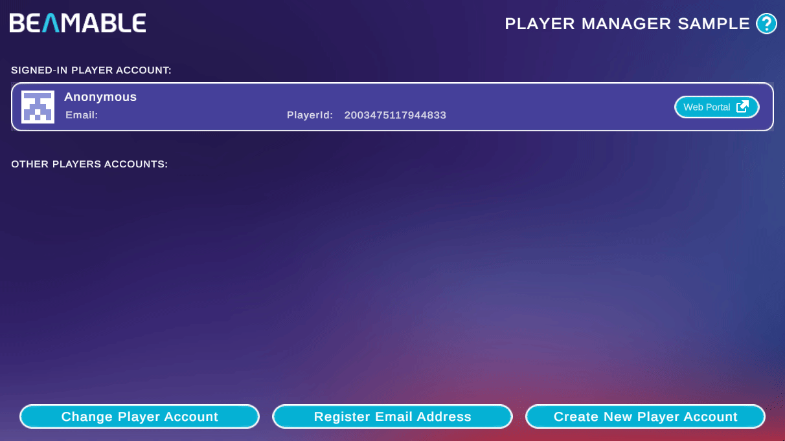
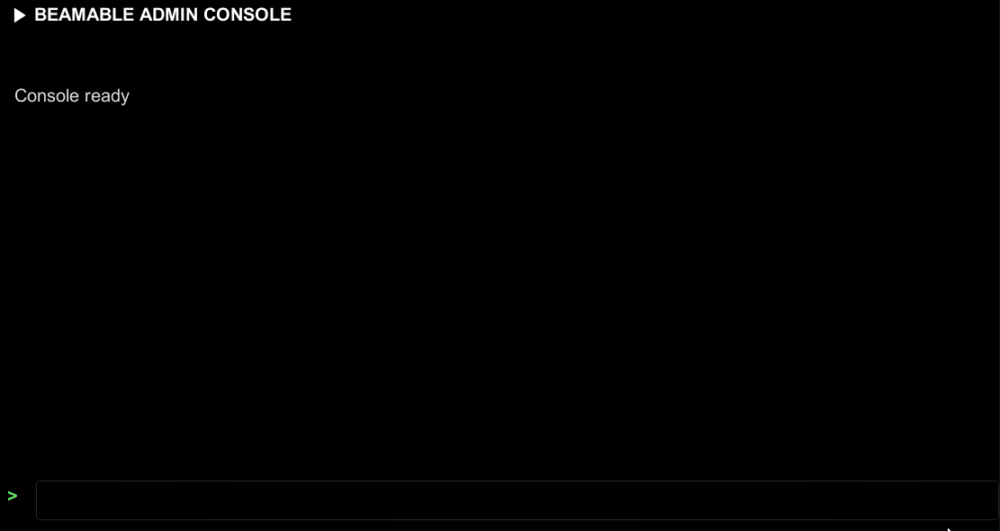

# Version 5.1

These are the release notes for the Beamable Unity SDK version 5.1. This release introduces a built-in Admin Console, reworked Lightbeam samples, Content Manager workflow improvements, and a range of bug fixes. Below are the highlights of this release.

## Highlights

### Reworked Lightbeam samples

The Lightbeam samples were reworked to improve their interfaces and visuals, alongside many bug fixes and new docs. You can access them from the **Beam Samples** window in the Unity Editor.

{width=800px}

Here is the updated list of samples and the new docs:

- [Player Account Manager](../samples/lightbeam-account.md)
- [Inventory management](../samples/lightbeam-inventory.md)
- [Friends management](../samples/lightbeam-friends.md)
- [Lobby management](../samples/lightbeam-lobby.md)
- [Loot boxes](../samples/lightbeam-loot.md)
- [Cloud Save](../samples/lightbeam-cloud.md)

See the [Lightbeam samples overview](../samples/lightbeam.md) for the shared framework, common sample structure, and customization options.

### New Admin Console

The [Admin Console](../user-reference/runtime-systems/admin-console.md) is now a built-in runtime overlay managed directly by the Beamable runtime — no manual prefab setup is required.

{width=800px}

To start using it, open the console with the backtick (`` ` ``) key on a keyboard or a 3-finger swipe on touch platforms.

The old AdminFlow console is now [deprecated](#deprecations).

### Content Manager improvements

The Content Manager received several workflow improvements:

- Sync and revert operations now report progress directly in the window
- Renamed content entries appear as a single *Modified Renamed* entry instead of a separate new-and-deleted pair
- Default assets and content are now imported manually on your first visit to the Content Manager
- A new setting controls download concurrency for editor content sync

See [Content in Unity](../user-reference/beamable-services/profile-storage/content/content-unity.md) for the Content Manager workflow.

## Other changes

- The **Beam Library** window is now the **Beam Samples** window, updated with the latest samples and docs
- `ContentConfiguration` adds an `OmitContentManifestTags` option that excludes content tags from the public manifest fetched at runtime. When enabled, runtime tag-based `ContentQuery` filters (for example, `tag:weapon`) return no results. In-Editor Content Manager filtering is unaffected
- `MicroserviceConfiguration` adds a Max Parallel Service Build count setting to control how many services build concurrently
- The default gem icon was updated:

    {width=96px}

## Fixes

This release includes numerous bug fixes, including:

- Improved content sync resilience for transient SSL and socket-reset download failures
- Fixed an intermittent account login `TaskCanceledException` caused by overlapping Unity Editor CLI refreshes
- Fixed first-run Account window build-config setup when `config-defaults.txt` is missing or has no PID
- Fixed a periodic freeze caused by telemetry collector polling

## Deprecations

### AdminFlow prefab

The previous AdminFlow prefab approach is still available for backward compatibility, but it is now deprecated and scheduled for removal in a future release, currently planned for late 2026 or early 2027. The prefab is no longer offered in the Beam Samples window.

When using the legacy AdminFlow system, the new Admin Console is automatically disabled by default to prevent conflicts between both implementations.

To use the new Admin Console instead, remove the legacy AdminFlow prefab from your scene.
