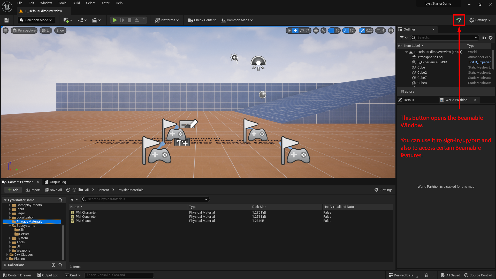
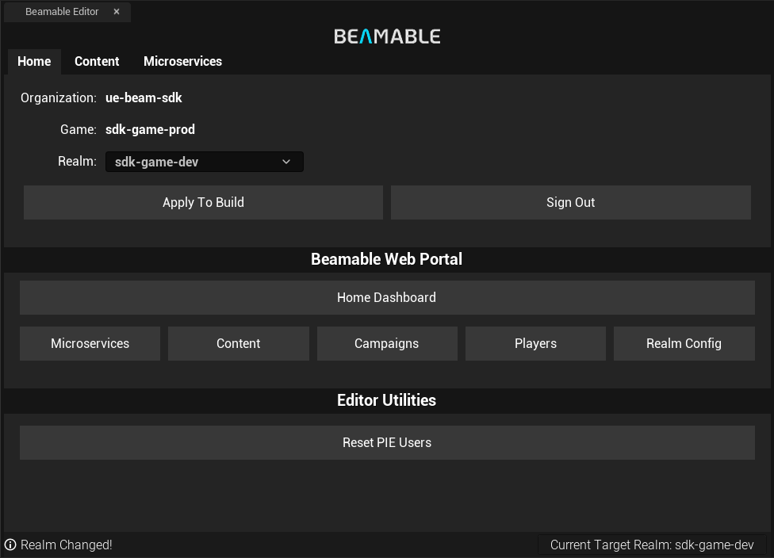

# Making your First Request
This guide assumes you've [set up](setup.md) your project with the SDK correctly.

Start by opening your editor. You'll see the Beamable Logo in your upper-right bar, next to the Settings dropdown. This button opens the Beamable window.

In this window, you can log in to the account you just created in the Beamable portal. When you do, you should see the window below:

Here's some a quick tour of Beamable terminology:

- `Realm` is an isolated data environment (think of it as a branch, but for your backend).
    - By default, you have one of these these for your `dev`, `staging` and `prod` environments. You can make more of them through the portal.
    - The `ApplyToBuild` button sets the realm information in the `Config/DefaultEngine.ini` file of your project. Whatever realm is configured in this file, is the realm your build will be pointed towards.
    - [Dedicated Server Builds](../user-reference/servers-and-builds/dedicated-servers.md) don't need to care about their baked in `TargetRealm`. They fetch their target realm from Environment Variables.
- `Content` opens up the **Content Window**.
    - [Content](../user-reference/beamable-services/content.md) is Beamable's solution for defining game-specific read-only data.
- `Microservices` opens the **Microservice Window**.
    - [Microservices](../user-reference/microservices/microservices.md) are Beamable's approach to Cloud-Code.
- `Reset PIE Users` (Play-In-Editor) removes your PIE users locally cached data.
    - By default, when you sign-into a Beamable account in PIE (in your game code), Beamable will use the same user until you delete the files `Saved/Beamable/UserSlots/PIE_XXXXX.json`.
    - This button does that for you. After you click it, the next time you enter PIE, a brand new Beamable player account will be created in your current realm.
- `Home` opens Beamable's **Portal** in your default web-browser.
    - You'll be logged in with your editor user and pointed at your current realm.
    - The other buttons are short-cuts to pages you usually need during day-to-day workflows.

Now that you are familiar with the **Beamable Window**, you are ready to make your first Beamable request (we'll do it via Blueprint, but you can do the exact same flow in C++ by making these calls in your Project's `GameMode` class's `BeginPlay` function).

To get started, open your Level Blueprint and add the following pattern:

The `BeamRuntime` is an `GameInstanceSubsystem` that is responsible for controlling the SDK's lifecycle and player authentication.

!!! warning "SDK Technical Overview"
    The [Technical Overview](../user-reference/overview.md) explains how the Beamable Runtime works. Please read it after you are done with this guide as the default Beamable configuration might not be the best fit for your type of game and it'll give you examples of common setups.

Calling this function will initialize the SDK.

Once the SDK is initialized, let's set it up to login a guest account automatically. To do that, add the `Login - Frictionless` Operation node. These "purple" Beamable nodes come in various flavors. You can [read more about them here](../user-reference/runtime-systems/blueprints.md).

There are 3 exposed callbacks here:

- `On Success`: This flow pin executes if the login completed successfully.
- `On Error`: This flow pin executes if any error happens during our login flow. Details about this flow [can be found here](../user-reference/beamable-services/identity.md).
- `On Cancelled`: This is used in _very special cases_ and can mostly be ignored for now.

That's it.

If this operation succeeds, you'll have a **Guest Account** signed-into the `Player0` user slot.

With the SDKs default configuration and the above setup, you can enter PIE (Play-In-Editor). You should see several requests's responses being written to your Output Log window. After you see the final `GetMe` request, you can exit PIE knowing you've made your very first request to Beamable.

## Additional Tips
Before we complete this guide, there are a few things you should know for your day-to-day development:

- We highly recommend to use verbose logging `log Category Verbose` when encountering an issue stemming from our SDK (Log Categories can be found in `BeambleCore/BeamLogging.h` file).
  - This verbose logging will print out ***a lot more*** information about requests being made and what the SDK is doing. Its meant to aid us in diagnosing issues that you may encounter when using the SDK AND not for production use. To turn it off in the same editor session, just run `log Category Display` in the editor console.
  - When reporting an issue to us, try to reproduce the issue with the logs of the relevant systems set to Verbose and attach them to your report. It usually helps us A LOT.

- If you plan on doing a lot of work with blueprints, don't forget to read [read more about them here](../user-reference/runtime-systems/blueprints.md) to see the extent of what we support.
  - For engineers planning on building complex systems on top of ours but still want to leverage our custom blueprint nodes to expose functionality to designers, [you can read this](../user-reference/runtime-systems/operations-and-waits.md).

## Next Steps
Now that you've made your first Beamable Request, take a look at the [Technical Overview](../user-reference/overview.md) page so you can understand more about how the SDK is structured and identify the best path to using it in your game.

If you'd like to see a more samples running on Beamable, take a look at our [Samples](../samples/intro.md).

If you want to contact us for support, doubts or suggestions, you can do so through one of our [Discord Channel](https://discord.com/invite/beamable). 