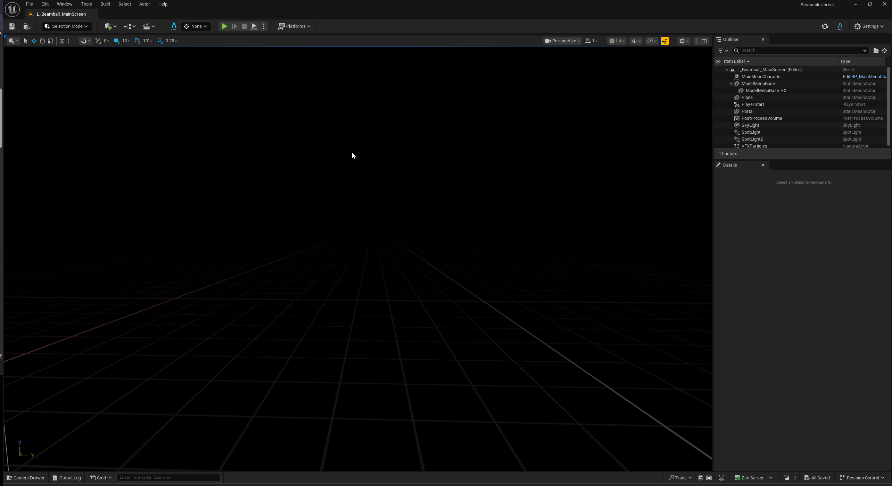

# Making your First Request

Here we will guide you through the process of loading the Beamable Window, creating a simple request to retrieve user information. This tutorial assumes you have already set up your Beamable account and integrated the Beamable SDK into your Unreal project, you can check how to do it in the [Setup Unreal SDK](setup.md) session. 

## Accessing the Beamable Window

When opening the Unreal Editor of your project, you'll see the Beamable Logo in your upper-right bar, next to the Settings dropdown. This button opens the Beamable Editor Window. Here, you can log in to the account you just created in the Beamable portal.

When the login process is finished, you should see the Beamable Window Editor like this:

Here's a quick tour of Beamable Window's functions:

- **[Home:](../user-reference/editor-systems/editor-systems-overview.md)** Here you will find information about the current workspace, shortcuts to the most common pages in the Beamable Portal and some Global Utilities.
- **[Content:](../user-reference/beamable-services/content.md)** Opens the Content Window, where you can manage your game's read-only data.
- **[Microservices](../user-reference/microservices/microservices.md)** Opens the Microservice Window, where you can manage your local Microservices.
- **[PIE](../user-reference/editor-systems/pie-settings.md)** Opens the Play-In-Editor (PIE) Utilities, where you can setup PIE Settings and Create/Capture PIE Users.

## Your First Blueprint Request

Now that you are familiar with the **Beamable Window**, you are ready to make your first Beamable request (we'll do it via Blueprint, but you can do the exact same flow in C++ by making these calls in your Project's `GameMode` class's `BeginPlay` function).

To get started, open your Level Blueprint and add the following nodes:

The `BeamRuntime` is an `GameInstanceSubsystem` that is responsible for controlling the SDK's lifecycle and player authentication. Calling this function will initialize the SDK. You can find a deep explanation about the Beamable Runtime in our [Technical Overview](../user-reference/overview.md) page.

Once the SDK is initialized, we can Login a guest account automatically. To do that, we're using the `Login - Frictionless` Operation node that will login a guest account into the `Player0` user slot.

Operation nodes are "purple" Beamable nodes that encapsulate many complex functionalities in a easy-to-use fashion. You can read more about the Operation Nodes [Here](../user-reference/runtime-systems/blueprints.md).

In the Frictionless Login node, we have three flow pins to handle the result of our login operation:

- **On Success:** This flow pin executes if the login completed successfully.
- **On Error:** This flow pin executes if any error happens during our login flow.
- **On Cancelled:** This is used in _very special cases_ and can mostly be ignored for now.

And that's it! If this operation succeeds, you'll have a **Guest Account** signed-into the `Player0` user slot.

With the SDKs default configuration and the above setup, you can enter PIE (Play-In-Editor). You should see several requests' responses being written to your Output Log window. After you see the final `GetMe` request, you can exit PIE knowing you've made your very first request to Beamable. Congratulations!

## Next Steps
Now that you've made your first Beamable Request, you can take a look at the [Technical Overview](../user-reference/overview.md) page so you can understand more about how the SDK is structured and identify the best path to using it in your game.
Also, take a look at our [Samples](../samples/intro.md), they are a valuable source of practical information and good reference for implementing your game.

## Find any issue? How to report?
- We highly recommend to use verbose logging `log Category Verbose` when encountering an issue stemming from our SDK (Log Categories can be found in `BeamableCore/BeamLogging.h` file).
- This verbose logging will print out ***a lot more*** information about requests being made and what the SDK is doing. It's meant to aid us in diagnosing issues that you may encounter when using the SDK AND not for production use. To turn it off in the same editor session, just run `log Category Display` in the editor console.
- When reporting an issue to us, try to reproduce the issue with the logs of the relevant systems set to Verbose and attach them to your report. It usually helps us A LOT.
- If you want to contact us for support, doubts or suggestions, you can do so through one of our [Discord Channel](https://discord.com/invite/beamable).