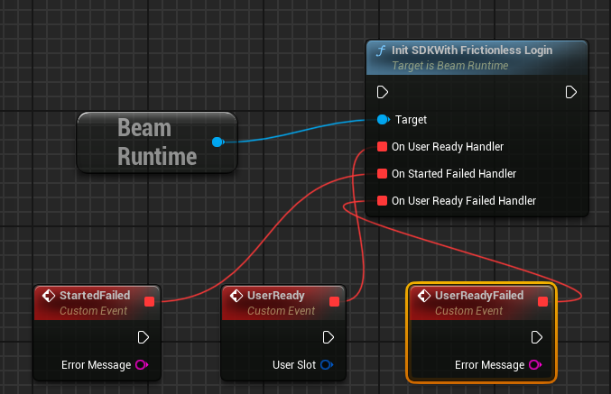
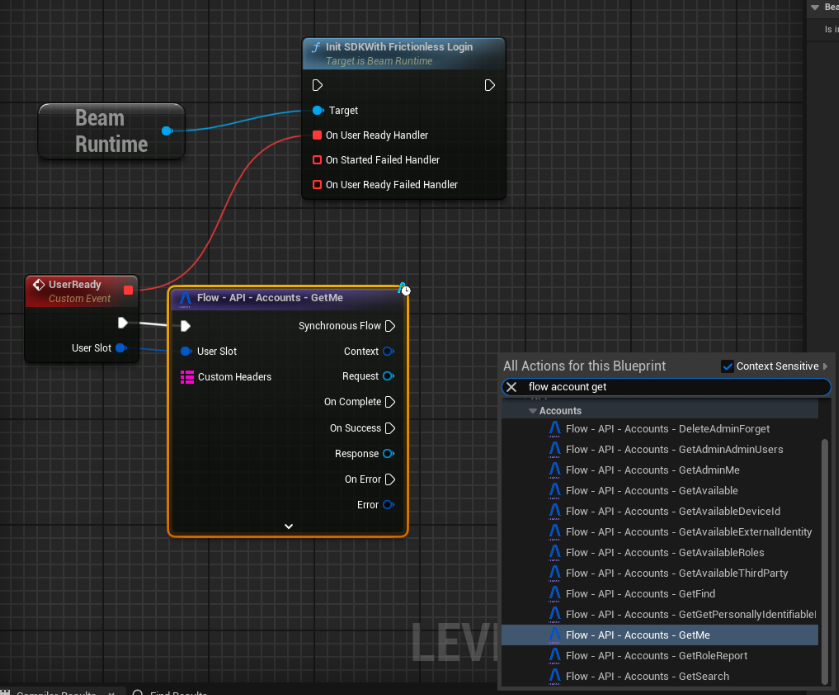

# Making your First Request
Once your Editor opens, you'll see the Beamable Logo in your upper-right bar, next to the Settings dropdown. This button opens the Beamable window.

In this window, you can login to the account you just created in the Beamable portal. When you do, you should see the window below:

Here's some a quick tour of Beamable terminology:

- `Realm` is an isolated data environment (think of it as a branch, but for your backend).
    - By default, you have one of these these for your `dev`, `staging` and `prod` environments.
    - The `ApplyToBuild` button sets the realm information in the `Config/DefaultEngine.ini` file of your project. Whatever realm is configured in this file, is the realm your build will be pointed towards. [Dedicated Server Builds](../user-reference/servers-and-builds/dedicated-servers.md) don't need to care about their baked in `TargetRealm`. They fetch their target realm from Environment Variables.
- `Content` opens up the **Content Window**.
    - [Content](../user-reference/beamable-services/content.md) is Beamable's solution for defining game-specific read-only data.
- `Microservices` opens the **Microservice Window**.
    - [Microservices](../user-reference/microservices/microservices.md) are Beamable's approach to Cloud-Code.
- `Reset PIE Users` (Play-In-Editor) removes your PIE users locally cached data.
    - By default, when you sign into a Beamable account in PIE (in your game code), Beamable will use the same user until you delete the files `Saved/Beamable/UserSlots/PIE_XXXXX.json`.
    - This button does that for you. After you click it, the next time you enter PIE, a brand new Beamable player account will be created in your current realm.
- `Home` opens Beamable's **Portal** in your default web-browser.
    - You'll be logged in with your editor user and pointed at your current realm.
    - The other buttons are short-cuts to pages you usually need during day-to-day workflows.

Now that you are familiar with the **Beamable Window**, you are ready to make your first Beamable request (we'll do it via Blueprint, but you can do the exact same flow in C++ by making these calls in your Project's `GameMode` class's `BeginPlay` function).

To get started, open your Level Blueprint and add the following pattern:

The `BeamRuntime` is an `GameInstanceSubsystem` that is responsible for controlling the SDK's lifecycle and, in clients, player authentication.

!!! warning "SDK Technical Overview"
    The [Technical Overview](../user-reference/overview.md) explains how the Beamable Runtime works. Please read it after you are done with this guide as the default Beamable configuration might not be the best fit for your type of game and it'll give you examples of common setups.

Calling this function will initialize the SDK and, after that is successful, will automatically log into Beamable as a **Guest Account**. There are 3 exposed callbacks here:

- `On Started Error`: This callback will be invoked if any problems occurred during the SDK's initialization process. If this is called, neither of the other two are called.
- `On User Ready`: This callback will be invoked after the user is logged in and 100% ready for use; after this callback is invoked, you can make authenticated requests to Beamable.
- `On User Ready Failed`: This callback will be invoked if the SDK initialized but the Login fails. You can retry by invoking any of the `Login` functions in `Beam Runtime`.

Now that you have this event hooked up, you can add your first **Beam Flow Node** and make your first request. **Beam Flow Nodes** are custom nodes that wrap around the following flow:

- Creating a new Request `UObject`.
- Getting a `UBeam___Api` engine subsystem.
    - This is a stateless system that exposes an auto-generated API to talk to various services.
    - This is not the recommended way you'll use Beamable. Its just the simplest way for you to get started.
- A set of Custom Event nodes (for success, error and completion) of the request being made to Beamable.
    - Because of this, Unreal does not allow the use of these nodes (or any node that expands to Event nodes) outside of **EventGraphs** or **Macros used in EventGraphs**.

With the SDKs default configuration and the above setup, you can enter PIE (Play-In-Editor). You should see several requests's responses being written to your Output Log window. After you see the final `GetMe` request, you can exit PIE knowing you've made your very first request to Beamable.

## Additional Tips
Before we complete this guide, there's one final thing that is important to know. We higly recommend to use verbose logging `log "Category" Verbose` when  encountering an issue stemming from our SDK (Log Categories can be found in `BeambleCore/BeamLogging.h` file).

This verbose logging will print out ***everything*** about the request being made. Its meant to aid us in diagnosing issues that you may encounter when using the SDK AND not for production use. To turn it off in the same editor session, just run `log LogBeamBackend Display` in the editor console.

When reporting an issue, try to reproduce the issue with the logs of the relevant systems set to Verbose and attach them to the issue.

## Next Steps
Now that you've made your first Beamable Request, take a look at the [Technical Overview](../user-reference/overview.md) page so you can understand more about how the SDK is structured and identify the best path to using it in your game.

If you'd like to see a more samples running on Beamable, take a look at our [Samples](../samples/intro.md).

If you want to contact us for support, doubts or suggestions, you can do so through one of our [Discord Channel](https://discord.com/invite/beamable). 