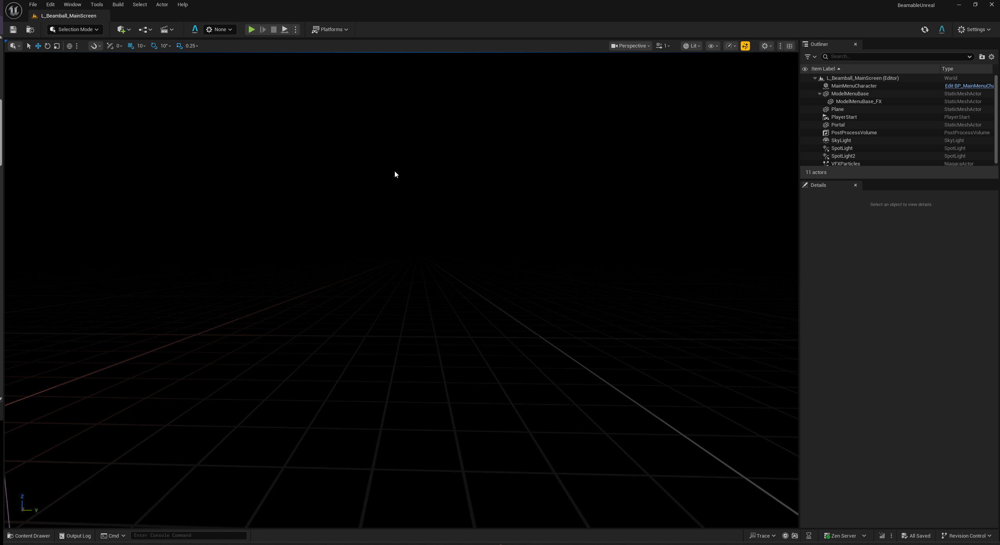
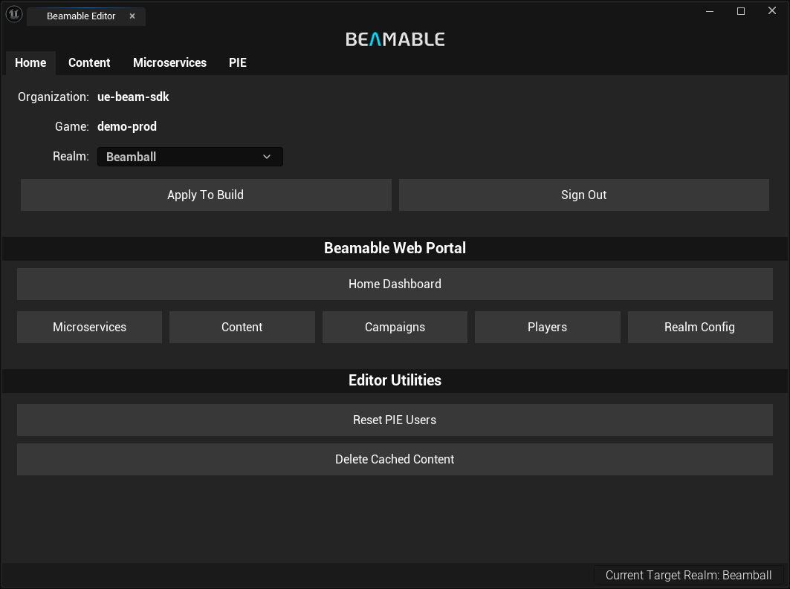

# Making your First Request

**This page walks through the process of loading the Beamable Window in your project and creating a simple request to retrieve user information.**

!!! note "Notice"
    This tutorial assumes you have already set up your Beamable account and integrated the Beamable SDK into your Unreal project. For instructions on doing so, see the [Setup Guide](setup.md).

## Accessing the Beamable Window

When opening the Unreal Editor of your project, you'll see the Beamable Logo in the upper-right, next to the Settings dropdown. This button opens the Beamable Editor Window. Here, you can log in to the account you just created in the Beamable Portal.

When the login process is finished, you should see the Beamable Window Editor like this:

Here's a quick tour of Beamable Window's functions:

- **[Home](../user-reference/editor-systems/editor-systems-overview.md)**
  Workspace overview, shortcuts to common Beamable Portal pages, and global utilities.

- **[Content](../user-reference/beamable-services/content.md)**
  Manage your game's read-only content and configuration data.

- **[Microservices](../user-reference/microservices/microservices.md)**
  Run, debug, and manage local Microservices.

- **[Play-In-Editor (PIE)](../user-reference/editor-systems/pie-settings.md)**
  Configure PIE settings and create or capture PIE users.

## Your First Blueprint Request

Now that you are familiar with the Beamable Window, you are ready to make your first Beamable request. We'll do it via Blueprint, but you can do the exact same flow in C++ by making these calls in your Project's `GameMode` class's `BeginPlay` function.

To get started, open your Level Blueprint and add the following nodes:

### What's going on Above:

The `BeamRuntime` is a `GameInstanceSubsystem` that is responsible for controlling the SDK's lifecycle and player authentication. Calling this function will initialize the SDK. You can find a deep explanation about the Beamable Runtime in the [Technical Overview](../user-reference/overview.md) page.

Once the SDK is initialized, the `Login - Frictionless` Operation node logs in a guest account automatically into the `Player0` user slot.

Operation nodes are "purple" Beamable nodes that encapsulate many complex functionalities in a easy-to-use fashion. See [Operation Nodes](../user-reference/runtime-systems/blueprints.md) for more information.

The Frictionless Login node has three flow pins to handle the result of the login operation:

- **On Success**: executes if the login completed successfully
- **On Error**: executes if any error happens during the login flow
- **On Cancelled**: used in _very special cases_ and can mostly be ignored for now

And That's it! If this operation succeeds, you'll have a **Guest Account** signed-into the `Player0` user slot.

With the SDKs default configuration and the above setup, you can enter PIE (Play-In-Editor) and should see several requests' responses being written to your Output Log window. After you see the final `GetMe` request, you can exit PIE knowing you've made your very first request to Beamable. Congratulations!

## Next Steps
Now that you've made your first Beamable Request, you can take a look at the [Technical Overview](../user-reference/overview.md) page to understand more about how the SDK is structured and identify the best path to using it in your game.

Also, take a look at the [Samples](../samples/intro.md), which are a valuable source of practical information and good general reference.

## Issues and Reporting
- Use verbose logging `log Category Verbose` when encountering an issue stemming from the SDK (Log Categories can be found in `BeambleCore/BeamLogging.h` file)
- This verbose logging will print ***a lot more*** information about requests being made and what the SDK is doing. It is meant to aid in diagnosing issues, NOT for production use. To turn it off in the same editor session, run `log Category Display` in the editor console
- When reporting an issue, try to reproduce it with the logs of the relevant systems set to Verbose and attach them to the report
- To contact support or submit suggestions, head to the [Support Portal](https://beamable.com/support)
