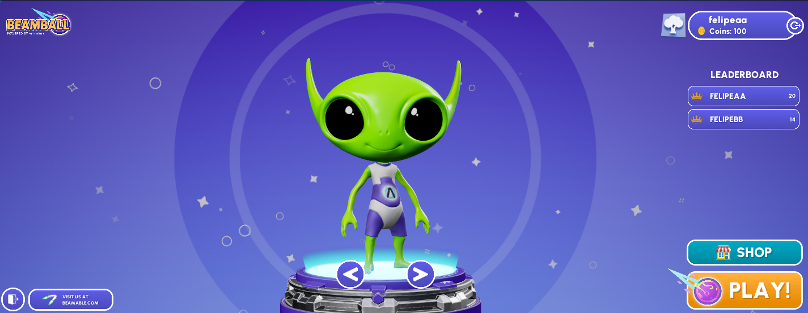

# Beamball Sample

This demo showcases how you can use the **Beamable Unreal SDK**'s in full game project. Particularly it focus on the Store, Leaderboard, Stats and Matchmaking.

## Introduction

Aside from our `BeamableCore` Plugin, here's what the sample contains:

- **`BEAMPROJ_Beamball` Unreal Plugin.**: Contains the UE implementation for the sample's client. The core code is inside `LiveOpsDemoMainMenu.h` and part of the implementation is done through BPs inside the folder `UI_BPs` folder of the `BEAMPROJ_Beamball` project.
- **`Microservice/BeamballMs` Microservice**: Microservice containing code that's used by the sample for various matchmaking and stats stuff.

To set up this sample you'll need a a Beamable Account and a Realm. To configure the repo for the sample run `dotnet beam unreal select-sample BEAMPROJ_Beamball`.

## Setting up the Project
To set up an organization and realm to run this sample, follow the steps below.

1. Go to the Beamable Portal and create a new Beamable realm called `Beamball`    
2. Compile and open the `BeamableUnreal` editor project.
3. Sign into your Beamable account and go to the `Beamball` realm.
      1. Optionally you can hit `Apply to Build` after the realm change is done.
5. Let's Setup the Content
      1. First you will need to run the command dotnet beam content `replace-local --from DE_1885450253346843 --to YOUR_REALM_ID` to bring all the content from the sample to your current realm.
      2. Open the `Content` window.
      3. Ensure there's an `game_types` content with the name `default`
      3. Ensure there's an `currency` content with the name `coins`
      3. Ensure there are 4 `itemskin` content with the names `skin1`, `skin2`, `skin3`, `skin4`
      3. Ensure there's an `leaderboard` content with the name `global`
      3. Ensure there are 3 `listings` content with the names `skin1`, `skin2`, `skin3`
      5. Click `Publish` to publish those new contents to the realm.
      6. You can read more about the content system [Here](../user-reference/beamable-services/content.md)

## Running the Sample in Editor
Now you're set up to run the sample.

1. Open the Unreal editor.
2. Go to the `Beamable -> Microservice` window.
      1. You should see the `BeamballMS` service there. Select it.
      2. Click `Run` and wait until you see the `Service ready for traffic` log line (and the running icon in the Microservice's card to change).
      3. After you're done with the sample, don't forget to come here and stop the service.
3. Open the `Beamball_MainScreen` Level if it's not opened yet.
      1. You can find it inside the `BEAMPROJ_Beamball Content`  folder.
      2. If you can't see plugin content in your content browser, you can change the settings of the UE `Content Browser` to display it.
5. Play the `Beamball_MainScreen` in the Editor.

## Can I use it as a Template?

This sample is not meant to be used as a template directly, however, its components are free for you to copy and use in your own project. Here's what these are:

- The `BeamballMS` Microservice : located inside Microservice/BeamballMS
- Beamable code and blueprints inside BEAMPROJ_Beamball plugin