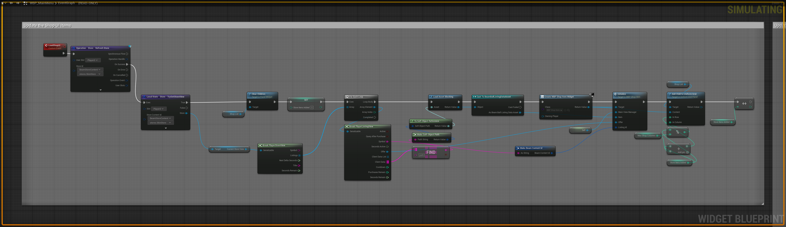
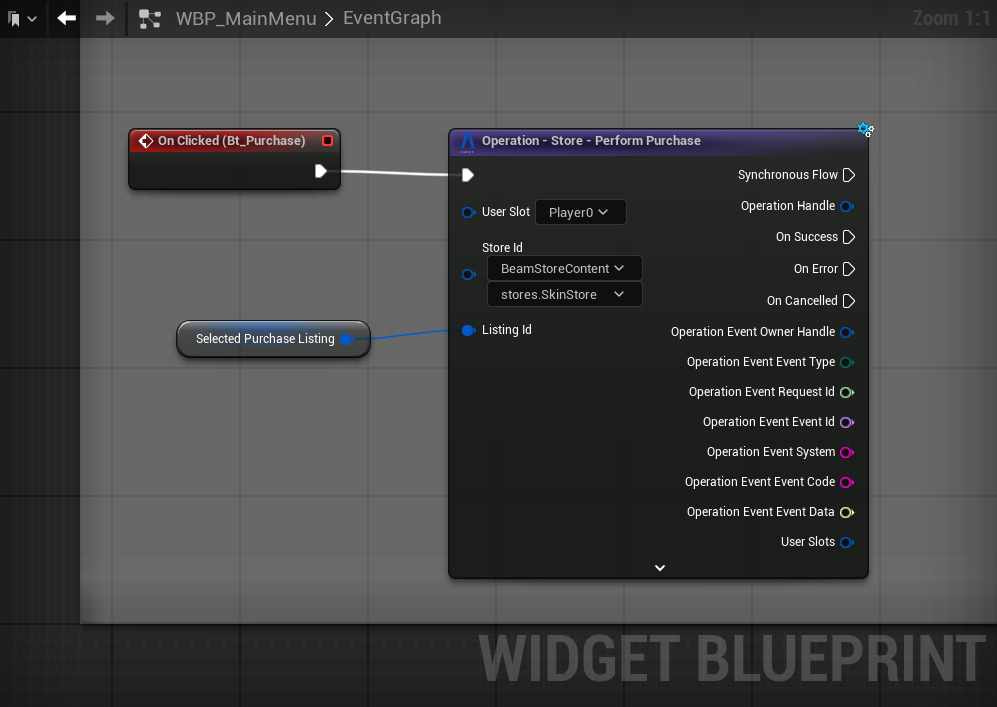
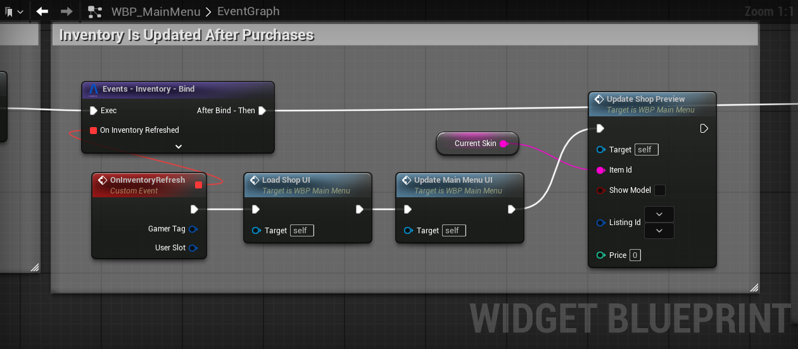

# Beamball – Store and Content System

In the **Beamball** sample we have a basic implementation of the Store and Inventory Systems. Those are build using the Beamable’s **Store** and **Content** services. The flow combines backend data (listings and offers) with **local DataAssets** that define the visual presentation of each item.

## Loading and Displaying Store Items

The Content system in Beamball acts as a bridge between:

- **The online side** – store listings and offers managed by Beamable services,
- **The local side** – Local State that is a mirror of the Online state. DataAssets and widgets that define how items are displayed in the game.

This design enables a flexible, dynamic, and content-driven inventory experience. New offers and items can be added without code changes, simply by publishing new Content and updating Store configurations.

When the store screen is opened, the client first updates the player’s store state using the operator **`Operation - Store - Refresh Store`**. After the operation completes successfully, the store data is guaranteed to be up-to-date and available in the local State. Then we can retrieve it with **`Local State - Store - TryGetStoreView`**, ensuring that the UI always reflects the latest backend data.  

The returned `Content Store View` contain the listings and their offers available to the player. Each listing represents a category of items, and contains references to one or more offers that can be purchased. In the Beamball sample, we have four listings, each representing a different skin for the player. Each listing contains a single offer that allows the player to purchase that skin.

The Listing data is combined with a local **DataAssets** that define how each item should be presented in the UI. In this case, we have a DataAsset for each skin, containing information such as the skin’s name, description, and thumbnail image. The DataAssets are linked to the listings using it path as a Soft Object Reference in the `path` field of the listing.

Each listing is transformed into an **item widget**.  During initialization, the widget receives:

- The **Offer** from the Listing data (used to display price),
- The **Beam Content Id** to link the UI with Beamable services,
- The **DataAsset** that defines the item’s local presentation.  

Widgets are then placed dynamically into a **grid layout**, with positioning calculated from the number of items already added.

!!! note "Main Operators to be aware of:"
    - **`Operation - Store - Refresh Store`**:  Refreshes the player’s store state from the backend.
    - **`Local State - Store - TryGetStoreView`**: Retrieves the updated StoreView from the local Beamable state.

## Purchasing Items

When the player selects an item to purchase, the corresponding widget calls the **`Operation - Store - Performa Purchase`** operator. This operator takes care of the entire purchase flow, including:

- Validating the offer,
- Checking the player’s balance,
- Deducting the cost,
- Adding the item to the player’s inventory.

Upon successful completion of the purchase operation, the player’s inventory changes with the addition of the item. It triggers a redraw from scratch fro the UI so it can include the newly acquired item.

!!! note "Main Operators to be aware of:"
    - **`Operation - Store - Perform Purchase`**:  Purchase a listing in the player's account.
    - **`Events - Inventory - Bind`**: Trigger an event when the inventory is refreshed (Updated) in the server.