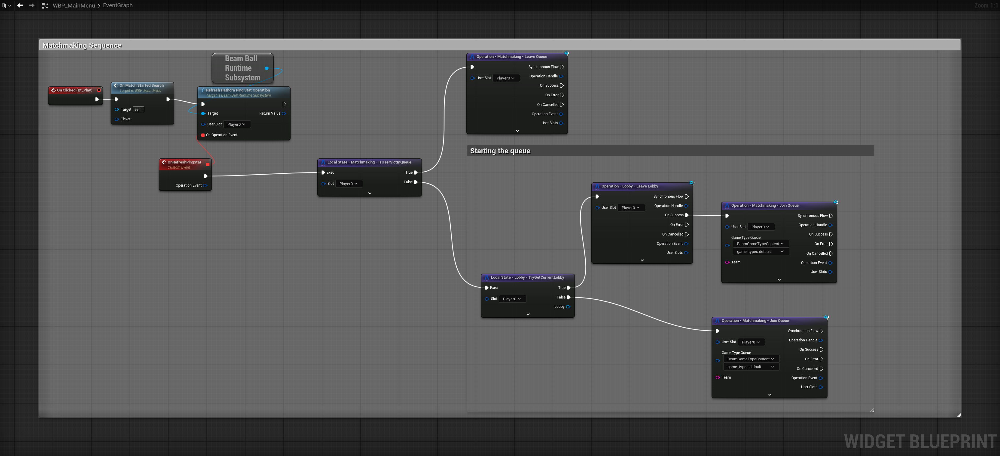
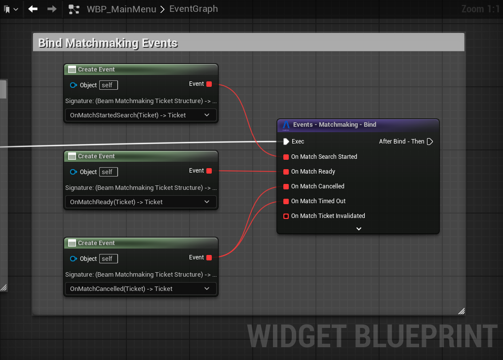

# Beamball – Matchmaking and Lobby System

In the **Beamball** sample we demonstrate a basic implementation of the Beamable's **Matchmaking** and **Lobby** services and Hathora Orquestrators.

# Starting a Matchmaking Queue

The Player clicks **Play** in the main menu then The **`Refresh Hatchora Ping Stat Operation`** updates ping in the player's stats allowing the server to choose the best lobby to this player. TheLocal state is checked with **`Local State - Matchmaking - IsUserInQueue`**, leaving the queue if already in. The  **`Local State - Lobby - TryGetCurrentLobby`** checks if the player is in a lobby, leaving if so. Finally, if there's impediment the player joins the matchmaking queue with **`Operation - Matchmaking - Join Queue`**. Beamable services handle the rest of the matchmaking process, forming balanced lobbies and starting the match.

!!! note "Main SDK Functions to be aware of:"
    - **`Operation - Matchmaking - Leave Queue`**: Removes the player from the current matchmaking queue.  
    - **`Operation - Lobby - Leave Lobby`**: Exits the current lobby if one exists.  
    - **`Operation - Matchmaking - Join Queue`**: Places the player into the matchmaking queue for the specified game type.  
    - **`Local State - Matchmaking - IsUserInQueue`**: Checks if the player is currently in a matchmaking queue.  
    - **`Local State - Lobby - TryGetCurrentLobby`**: Retrieves the current lobby if the player is in one.

# Matchmaking Events

The matchmaking process is asynchronous, and the player is kept informed through event bindings on the **`Events - Matchmaking - Bind`**. The player is notified when they successfully started search for a match, when the Match is ready, canceled or timed out.

# Starting a Match

Once the matchmaking system has formed a lobby, the player is notified and can start. The **`Operation - Lobby - Load Level`** operator is called, which signals Beamable's backend to initiate the match using the configured Lobby Data. In this sample the Hathora Orquestrator handles the server alocation and return a call to Beamable to start the match, allowing players to seamlessly transition into the game.

# Summary

The matchmaking system in Beamball demonstrates how to integrate Beamable’s **Matchmaking** and **Lobby** operators in a clean sequence:

- Ensure the player leaves any existing queues or lobbies,
- Place the player into the appropriate matchmaking queue.
- Handle asynchronous events to keep the player informed of their matchmaking status.
- Start the match once the lobby is ready.

This guarantees a seamless matchmaking experience while letting Beamable’s backend dynamically manage match creation and team balance.