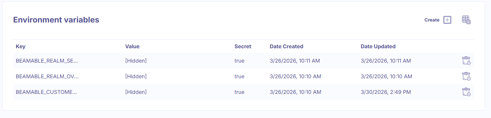
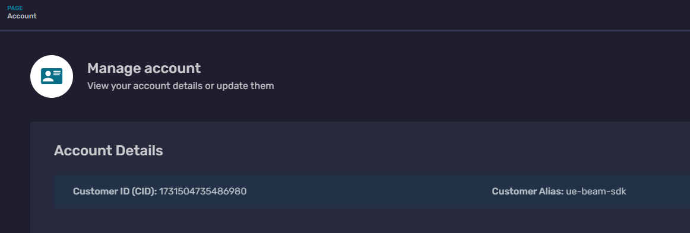
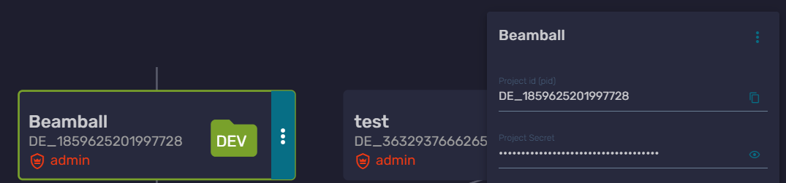
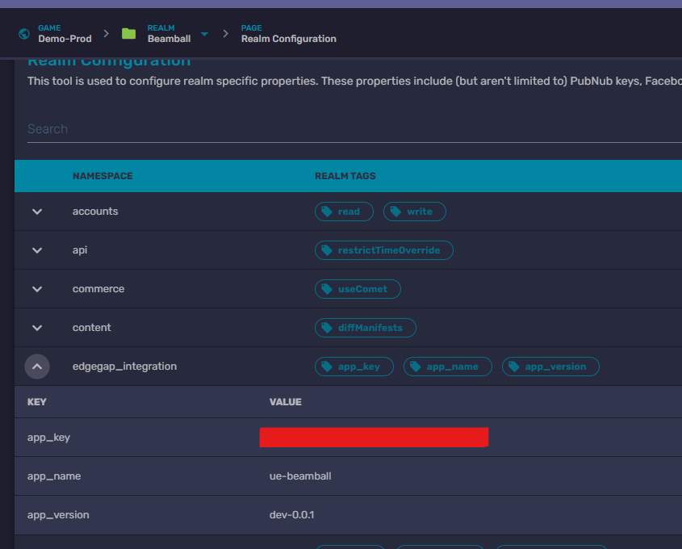

# EdgeGap Integration Guide

> **Reference Documentation**: For comprehensive information about EdgeGap integration with Unreal Engine, see the [official EdgeGap documentation](https://docs.edgegap.com/unreal-engine).

## Building Beamball with the Edgegap Plugin

To generate a Beamball server build with the Edgegap plugin, Docker is required. The plugin uses Docker to package the dedicated server into a container image that can then be published to Edgegap directly from the plugin.

Overview:

- The Edgegap plugin relies on Docker to create the container image for the Beamball dedicated server build.
- Verify that your Beamball server build target is configured correctly before running the Edgegap build workflow.
- After the Docker image is generated, use the plugin's Publish button to send the build to your Edgegap application version.

## Configuration

### Edgegap Environment Variables Required

Once you set up your version, you will need to add the following environment variables to the version.

 

- BEAMABLE_CUSTOMER_OVERRIDE: The CID found in your Beamable portal.

- BEAMABLE_REALM_OVERRIDE: The Realm found in your Beamable portal.

- BEAMABLE_REALM_SECRET: The Realm Secret.

### Storing EdgeGap Credentials in Realm Config

EdgeGap integration requires three configuration parameters that should be stored in your Realm Config:

- **API Key**: Your EdgeGap API key for authentication
- **Application Name**: Your registered EdgeGap application name
- **Version**: The version of your game server to deploy

These credentials are stored in the Beamable Realm Config and can be accessed by your microservices at runtime.

## Accessing EdgeGap Configuration in Microservices

Your microservices can access the EdgeGap configuration from the Realm Config at runtime. When provisioning a game server for a lobby, you:

1. Retrieve the EdgeGap configuration from Realm Config
2. Make requests to the EdgeGap API with these credentials
3. Store the resulting server connection details in the lobby's global data

You can check the example of this in our [GitHub page](https://github.com/beamable/UnrealSDK/blob/main/Microservices/services/BeamballMs/BeamballMs.cs) for that sample.

## Additional Resources

- [EdgeGap Official Documentation](https://docs.edgegap.com/unreal-engine)
- [EdgeGap API Reference](https://docs.edgegap.com/api)
- [Beamable Microservices Documentation](../../user-reference/microservices/microservices.md)
- [Beamable Realm Configuration Guide](../../../cli/guides/configuration.md)
