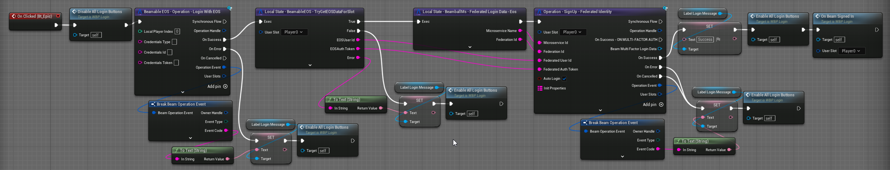

# Beamball - Epic Online Services integration

This page explains how to integrate a Beamable game with Epic Online Services (EOS) using the **Beamable Unreal SDK** and **Beamable Microservices**.

## Introduction

Aside from the `BeamableCore` Plugin, here's what the sample contains:

- **`BEAMPROJ_Beamball` Unreal Plugin.**: Contains the UE implementation for the client
- **`Microservices/services/BeamballMs` Microservice**: Microservice containing code that implements `IFederatedLogin`

To set up this sample, you'll need a few things:

- A Beamable Account and a Realm
- An Epic Games Developer Account

To configure the sample, run `dotnet beam unreal select-sample BEAMPROJ_Beamball`.

!!! note "Assumptions"
    Instructions below assume that you already have the Epic application created in Epic's Developer portal. If that is not the case, be sure to create one first.

## Configuring the sample as an Epic application

Since this sample requires several resources, it is not pre-hosted. To access it, set up an Epic Games account and configure the sample:

1. Log into your [Epic Games Developer Portal](https://dev.epicgames.com/portal)
2. Create or select your application
3. Navigate to **Product Settings** and note the following values:
   - **Application ID** (also called Product ID)
   - **Deployment ID**
4. Navigate to **Epic Account Services** > **Applications**
5. Create a new Application or select an existing one, and set aside:
   - **Client ID**
   - **Client Secret**
6. Configure the **Client Policy** to allow the authentication methods you need:
   - Enable **Persistent Auth** for automatic re-login
   - Enable **Exchange Code** if launching from Epic Games Launcher
   - Enable **Account Portal** for browser-based authentication
7. For PIE testing, download and run the [EOS Developer Authentication Tool](https://dev.epicgames.com/docs/epic-account-services/developer-authentication-tool)
   - Configure it with your Application ID and use credentials like `Context_1`, `Context_2`, etc.

### Setting up Beamable systems

Next, configure a Beamable realm to work with your Epic Application:

1. Go to the Beamable Portal and create a new Beamable realm called `beamball-demo`
2. Go to the Portal (`Account`) and set aside your Customer Id (CID)
3. Go to the Portal and set aside your realm's PID and Realm Secret (`Games -> YourGame -> beamball-demo`)
4. On the Portal open the Realm Config page of the `beamball-demo` realm (`Operate -> Config`)
5. Hit the `Add Config` button
6. Set the following key-value pairs for the namespace `eos_integration`:
    1. `applicationId -> Your Epic Application ID`
    2. `deploymentId -> Your Epic Deployment ID`
    3. `clientId -> Your Epic Client ID`
    4. `clientSecret -> Your Epic Client Secret`
7. Compile and open the `BeamableUnreal` editor (it'll be configured as the `BEAMPROJ_Beamball`) project
8. Sign into your Beamable account and go to the `beamball-demo` realm
    1. Hit `Apply to Build`
9. Open a bash terminal at the `BeamableUnreal` root directory
10. Run `dotnet beam project enable --with-group BEAMPROJ_Beamball`
11. Run `dotnet beam project disable --without-group BEAMPROJ_Beamball`
12. Guarantee `Docker` is open and running
13. Run `dotnet beam deploy plan`
    1. This tells you details about the services you would deploy given your project's local state
14. Run `dotnet beam deploy release --latest-plan`
    1. This deploys the services outlined by the generated plan in the previous command
15. Go to the Portal (`Operate -> Microservices`) to verify that the microservices have initialized
16. Configure your Unreal project's Online Services for EOS by following the [Unreal Online Services documentation](https://dev.epicgames.com/docs/epic-online-services/eos-get-started/services-quick-start#unreal-engine)
17. Package the project using the appropriate build target

Now, you are ready to log in with Epic Online Services.

## Playing the sample

Testing the EOS integration in PIE requires the EOS Developer Authentication Tool to be running with configured credentials.

For PIE testing, you have two options:
- **Recommended**: Download and run the [EOS Developer Authentication Tool](https://dev.epicgames.com/docs/epic-account-services/developer-authentication-tool)
  - Configure credentials for your PIE instances (e.g., `Context_1`, `Context_2`)
  - Launch in PIE mode
- **Alternative**: Use **Account Portal** (browser-based login) which also works in the editor
  - The authentication flow will automatically fall back to Account Portal if Developer Auth Tool is not running

For packaged builds:
- The authentication flow will use **PersistentAuth** (cached credentials), **Exchange Code** (from Epic Launcher), or **Account Portal** (browser-based login)

Testing the EOS integration in PIE should be performed in PIE's `Standalone Game` mode as per Epic's documentation.

To test the sample:

- Launch the game with your Epic account
- On the login screen, you should see an Epic button. Press it

## Sample highlights

This sample demonstrates a complete Epic Online Services (EOS) authentication integration using Beamable's federated login system with OpenID Connect JWT validation.

### Client-side implementation

The client uses Unreal's Online Services (not the deprecated Online Subsystem) to authenticate with EOS and obtain an external auth token (JWT ID token). The implementation in `BeamableEOS.cpp` provides a flexible authentication flow with automatic fallback:

1. **LoginWithEOS Operation**: The client calls `LoginWithEOSOperation` which handles the complete EOS authentication flow
2. **Multi-Method Authentication**: The system attempts authentication in priority order:
   - **PersistentAuth**: Automatic re-login using cached refresh tokens from previous sessions
   - **Exchange Code**: Authentication via Epic Games Launcher when launched from Epic's platform
   - **Developer Auth**: For PIE testing using the EOS Developer Authentication Tool (localhost:6300)
   - **Account Portal**: Browser-based login as the final fallback
3. **Token Caching**: After successful authentication, the EOS Account ID (Product User ID) and external auth token are cached in-memory per local player index for use with Beamable

In Blueprint, you can invoke the EOS login flow using operation nodes:

### Server-side implementation (Microservice)

The `BeamballMs.EpicOnlineServices.cs` microservice implements `IFederatedLogin<EpicOnlineServicesId>` using industry-standard OpenID Connect JWT validation:

1. **Token Reception**: The microservice receives the JWT ID token from the client after successful EOS authentication
2. **OIDC Discovery**: Fetches Epic's OpenID configuration from their `.well-known/openid-configuration` endpoint to retrieve the JSON Web Key Set (JWKS) containing Epic's public signing keys
3. **JWT Validation**: Validates the token cryptographically using Microsoft's IdentityModel libraries:
   - **Signature**: Verifies the token was signed by Epic using their public keys
   - **Issuer**: Confirms token was issued by `https://api.epicgames.dev`
   - **Audience**: Validates the token is intended for your Client ID
   - **Lifetime**: Ensures the token hasn't expired (with 2-minute clock skew tolerance)
   - **Application ID**: Verifies the `appid` claim matches your configured Application ID
4. **User Identification**: Extracts the Epic Account ID from the `sub` (subject) claim, which becomes the federated identity linked to the Beamable account
5. **Player Initialization**: For first-time users, the microservice obtains a client credentials access token and calls Epic's account information API to retrieve the user's display name and preferred language, populating the Beamable account with this data as player stats

This implementation follows Epic's official authentication documentation and security best practices for validating third-party tokens using asymmetric cryptography.

## Can I use it as a template?

This sample is NOT a template you can start your own repository from. However, Beamable code components are free for you to copy and use in your own project. Here's what these are:

- The `BeamballMs.EpicOnlineServices.cs` file in the `BeamballMs` Microservice. You can copy/paste it into any of your microservices
- Beamable code inside `BEAMPROJ_Beamball/**/PlatformIntegrations` except code inside a `ThirdParty` directory
- Content inside the `BEAMPROJ_Beamball` except things inside a `ThirdParty` directory

## Why no client build

Clients must be pointed at your realm/Epic application, so you need to generate the build yourself by packaging it for any supported platform.
