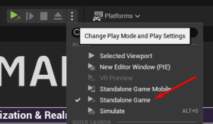

# Beamball - Steam integration

This page explains how to integrate a Beamable game with Steam using the **Beamable Unreal SDK** and **Beamable Microservices**.

## Introduction

Aside from the `BeamableCore` Plugin, here's what the sample contains:

- **`BEAMPROJ_Beamball` Unreal Plugin.**: Contains the UE implementation for the client.
- **`Microservices/services/BeamballMs` Microservice**: Microservice containing code that implements `IFederatedLogin`

To set up this sample, you'll need a few things:

- A Beamable Account and a Realm
- A Steam Developer Account

To configure the sample, run `dotnet beam unreal select-sample BEAMPROJ_Beamball`.

!!! note "Assumptions"
    Instructions below assume that you already have the Steam application created in Steam's Developer portal. If that is not the case, be sure to create one first.

## Configuring the sample as a Steam application

Since this sample requires several resources, it is not pre-hosted. To access it, set up a Steam account and configure the sample:

1. Log into your [Steam](https://partner.steamgames.com/apps) developer account.
2. Go to your App and set aside its `AppId`.
3. Create a Publisher Web API key
   using [this tutorial](https://partner.steamgames.com/doc/webapi_overview/auth#publisher-keys). Set it aside in a
   notepad for future use.
4. Make sure that the game is added to the user that you want to use to log in. To do that:
    1. Generate a Steam Key.
    2. Add it to your Steam account so you can access the game.

### Setting up Beamable systems

Now, you'll need to configure a Beamable realm to work with your Steam App so you can use it:

1. Go to the Beamable Portal and create a new Beamable realm called `beamball-demo`.
2. Go to the Portal (`Account`) and set aside your Customer Id (CID).
3. Go to the Portal and set aside your realm's PID and Realm Secret (`Games -> YourGame -> beamball-demo`).
4. On the Portal open the Realm Config page of the `beamball-demo` realm (`Operate -> Config`).
5. Hit the `Add Config` button.
6. Set the following key-value pairs for the namespace `steam_integration`:
    1. `appid -> Your Steam application ID`
    2. `key -> Your Steam Application Publisher Key`
7. Compile and open the `BeamableUnreal` editor (it'll be configured as the `BEAMPROJ_Beamball`) project.
8. Sign into your Beamable account and go to the `beamball-demo` realm.
    1. Hit `Apply to Build`.
9. Open a bash terminal at the `BeamableUnreal` root directory.
10. Run `dotnet beam project enable --with-group BEAMPROJ_Beamball`
11. Run `dotnet beam project disable --without-group BEAMPROJ_Beamball`
12. Guarantee `Docker` is open and running.
13. Run `dotnet beam deploy plan`.
    1. This tells you details about the services you would deploy given your project's local state.
14. Run `dotnet beam deploy release --latest-plan`.
    1. This deploys the services outlined by the generated plan in the previous command.
15. Go to the Portal (`Operate -> Microservices`) to verify that the microservices have initialized.
16. In `DefaultEngine.ini` set the value of `SteamDevAppId` to your Steam Application ID. For more info, see the [Unreal Engine Steam tutorial](https://docs.unrealengine.com/4.27/en-US/ProgrammingAndScripting/Online/Steam/).
17. Package the project using the `BeamableUnrealSteam` target.

Now, you are ready to log in with Steam.

## Playing the sample

Testing the Steam integration in PIE should be performed in PIE's `Standalone Game` mode as per Steam's documentation.



To test the sample:

- Open Beamball with Steam running on the account to which you added the game
- You should see your "Steam" status change to playing
- On the login screen, you should see a Steam button. Press it

## Sample highlights

This sample demonstrates a complete Steam authentication integration using Beamable's federated login system.

### Client-side implementation

The client uses the Steam SDK directly to obtain authentication credentials. The implementation in `BeamableSteam.h` provides a `TryGetSteamData` function that:

1. **Retrieves Steam User Interface**: Accesses the Steam SDK's `ISteamUser` interface to interact with the authenticated Steam user.
2. **Generates Auth Session Ticket**: Calls `GetAuthSessionTicket()` to generate a cryptographic proof that the user owns the game and has an active Steam session. This ticket is a binary blob that Steam can validate server-side.
3. **Converts Ticket to Hex String**: The binary ticket is converted to a hexadecimal string format for transmission to Beamable.
4. **Obtains Steam ID**: Retrieves the user's unique Steam ID (SteamID64) for identification purposes.

In Blueprint, you can invoke the Steam login flow using operation nodes:


### Server-side implementation (Microservice)

The `BeamballMs.Steam.cs` microservice implements `IFederatedLogin<SteamId>` to handle authentication:

1. **Authentication Flow**: When a user attempts to log in, the microservice receives the Auth Session Ticket from the client.
2. **Ticket Validation**: The microservice calls Steam's `AuthenticateUserTicket` Web API endpoint to validate the ticket against Steam's servers using your Publisher Web API Key.
3. **User Identification**: Steam returns the user's unique Steam ID (SteamID64), which becomes the federated identity linked to the Beamable account.
4. **Player Initialization**: For first-time users, the microservice calls Steam's `GetPlayerSummaries` API to retrieve the user's profile data (display name, avatar URLs) and populates the Beamable account with this information as player stats.

This two-phase approach ensures that users are properly authenticated via Steam and their account is enriched with Steam profile data for display in-game.

## Can I use it as a template?

This sample is NOT a template you can start your own repository from. However, Beamable code components are free for
you to copy and use in your own project. Here's what these are:

- The `BeamballMs.Steam.cs` file in the `BeamballMs` Microservice. You can copy/paste it into any of your microservices.
- Beamable code inside `BEAMPROJ_Beamball/**/PlatformIntegrations` except code inside a `ThirdParty` directory.
- Content inside the `BEAMPROJ_Beamball` except things inside a `ThirdParty` directory.

## Why no client build
Clients must be pointed at your `steam-demo` realm, so you need to generate the build yourself by packaging it for any supported platform.

---

## Required files for Steam on Mac

### SSL certificate (`cacert.pem`)

Beamable uses secure socket connections, and on some platforms the OS requires a trusted CA certificate bundle to validate them. Without this file, Beamable network calls may fail silently at runtime.

1. Locate the certificate file bundled with the engine:

    ```
    \Epic Games\UE_5.6\Engine\Content\Certificates\ThirdParty\cacert.pem
    ```

2. Copy it into a folder named `Certificates` inside your project's **Source** folder:

    ```
    <ProjectRoot>/Source/Certificates/cacert.pem
    ```

3. In your project settings, add this folder to the **Additional Non-Asset Directories to Copy** list (under **Packaging**) so Unreal includes it in the packaged build:

    ```
    Certificates
    ```

Unreal will then bundle the certificate with the build, allowing Beamable to establish trusted connections at runtime.

---

## macOS development: disabling app sandbox

When developing on macOS, the App Sandbox may block Steam network calls and Beamable connections. If you are working in a **development build**, you should disable the sandbox by editing the entitlements file.

Open the following file in your project:

```
Build/Mac/Resources/Sandbox.Server.entitlements
```

Set the `com.apple.security.app-sandbox` key to `false`:

```xml
<?xml version="1.0" encoding="UTF-8"?>
<!DOCTYPE plist PUBLIC "-//Apple//DTD PLIST 1.0//EN" "http://www.apple.com/DTDs/PropertyList-1.0.dtd">
<plist version="1.0">
<dict>
    <key>com.apple.security.app-sandbox</key>
    <false/>
</dict>
</plist>
```

> **Warning**: Only set `APP_SANDBOX` to `No` in development builds. Re-enable it before submitting to production or the Mac App Store.
