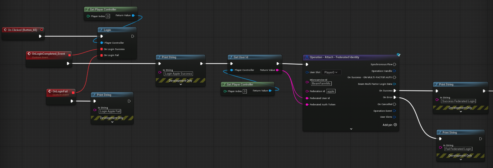

# Apple Login Integration (Unreal + Beamable)

This document describes how to integrate **Apple / Game Center login** in an Unreal Engine project and how **Login** and **Attach** federation flows work when linking Apple accounts to Beamable players.

---

## Overview

Apple authentication is handled on the **client** using Unreal’s **OnlineSubsystemIOS**, while account linking and authentication are handled on the **server** using **Beamable Federation**.

High-level flow:

1. Authenticate the player using **Game Center**
2. Retrieve the **Apple UserId**
3. Send the UserId to a Beamable **Federation Microservice**
4. Beamable either logs the player in or attaches the Apple identity

---

## Prerequisites

### Unreal iOS Setup

Follow Unreal’s official documentation to configure iOS builds:

[https://dev.epicgames.com/documentation/en-us/unreal-engine/setting-up-an-unreal-engine-project-for-ios](https://dev.epicgames.com/documentation/en-us/unreal-engine/setting-up-an-unreal-engine-project-for-ios)

### Apple Developer Configuration

Enable the following capabilities in your Apple Developer project:

- Game Center
- Sign in with Apple

Apple documentation:
[https://developer.apple.com/documentation/gamekit/initializing-and-configuring-game-center](https://developer.apple.com/documentation/gamekit/initializing-and-configuring-game-center)

> If these capabilities are not enabled, Apple authentication may silently fail on device.

---

## Enabling OnlineSubsystemIOS

Apple login relies on Unreal’s **OnlineSubsystemIOS** plugin.

Enable it via **Edit → Plugins** or by copying it from the Engine plugins folder.

API reference:
[https://dev.epicgames.com/documentation/en-us/unreal-engine/API/PluginIndex/OnlineSubsystemIOS](https://github.com/beamable/UnrealSDK/tree/main/Plugins/BEAMPROJ_BeamFarm/Source/BEAMPROJ_BeamFarm)

### Build.cs Configuration

```csharp
if (Target.Platform == UnrealTargetPlatform.IOS)
{
    DynamicallyLoadedModuleNames.Add("OnlineSubsystemIOS");
}
```

---

## Apple Login Client Implementation

The client authenticates with Game Center and retrieves a unique Apple UserId.

### Responsibilities

- Trigger Game Center login
- Retrieve the Apple UserId
- Expose the result to Blueprint

### Required Functions

- Login
- GetUserId

Reference implementation:
[https://github.com/beamable/UnrealSDK/tree/main/Plugins/BEAMPROJ_BeamFarm/Source/BEAMPROJ_BeamFarm](https://github.com/beamable/UnrealSDK/tree/main/Plugins/BEAMPROJ_BeamFarm/Source/BEAMPROJ_BeamFarm)

---

## Federation Concept (Beamable)

Beamable Federation allows external identity providers to authenticate or link accounts.

For Apple integration:

- The Apple UserId is used as the federation token
- The token uniquely identifies the Apple user
- Beamable uses it to authenticate or attach the identity

Federation reference:
[user-reference/federation/federated-login](../../../user-reference/federation/federated-login/)

---

## Apple Federation Microservice

### Federation Identifier

```csharp
[FederationId("apple")]
public class AppleFederation : IFederationId
{
}
```

### Federated Login Implementation

```csharp
async Promise<FederatedAuthenticationResponse>
    IFederatedLogin<AppleFederation>.Authenticate(
        string token,
        string _,
        string __)
{
    return new FederatedAuthenticationResponse()
    {
        user_id = token
    };
}
```

---

## Login vs Attach Flows

### Login Flow (Returning Player)

**Purpose:** Authenticate a player who has already linked Apple.

**Client:**

1. Apple Login
2. Retrieve Apple UserId
3. Call Federated Login

**Server:**

- Finds account linked to Apple UserId
- Logs player in

**Result:**

- Player authenticated

---

### Attach Flow (First-Time Link)

**Purpose:** Link Apple to an existing account.

**Client:**

1. Apple Login
2. Retrieve Apple UserId
3. Call Attach – Federated Identity

**Server:**

- Links Apple UserId to current account

**Result:**

- Apple identity attached
- Progress preserved

---

## Client Blueprint

1. Trigger Apple Login
2. Retrieve UserId
3. Call Attach or Login
4. Handle success or failure


