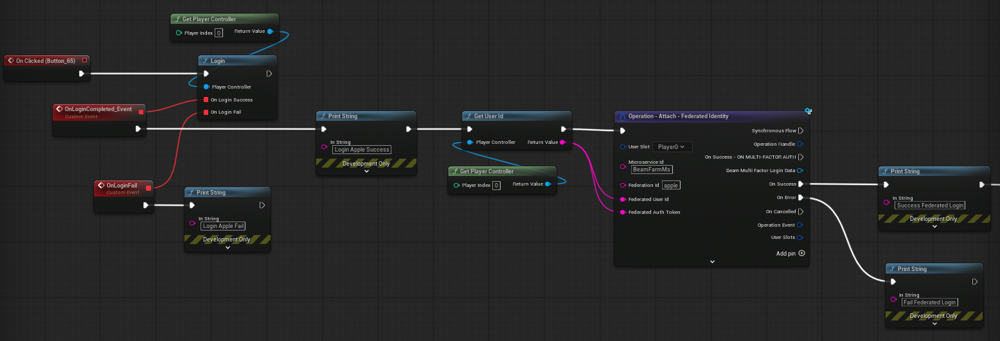

# Apple Login Integration (Unreal + Beamable)

This document describes how to integrate **Apple / Game Center login** in an Unreal Engine project and how **Login** and **Attach** federation flows work when linking Apple accounts to Beamable players.

---

## Overview

Apple authentication is handled on the **client** using Unreal’s **OnlineSubsystemIOS**, while account linking and authentication are handled on the **server** using **Beamable Federation**.

High-level flow:

1. Authenticate the player using **Game Center**
2. Retrieve the **Apple UserId**
3. Send the UserId to a Beamable **Federation Microservice**
4. Beamable either logs the player in or attaches the Apple identity

---

## Prerequisites

### Unreal iOS Setup

Follow Unreal’s official documentation to configure iOS builds:

[https://dev.epicgames.com/documentation/en-us/unreal-engine/setting-up-an-unreal-engine-project-for-ios](https://dev.epicgames.com/documentation/en-us/unreal-engine/setting-up-an-unreal-engine-project-for-ios)

### Apple Developer Configuration

Enable the following capabilities in your Apple Developer project:

- Game Center
- Sign in with Apple

Apple documentation:
[https://developer.apple.com/documentation/gamekit/initializing-and-configuring-game-center](https://developer.apple.com/documentation/gamekit/initializing-and-configuring-game-center)

> If these capabilities are not enabled, Apple authentication may silently fail on device.

---

## Enabling OnlineSubsystemIOS

Apple login relies on Unreal’s **OnlineSubsystemIOS** plugin.

Enable it via **Edit → Plugins** or by copying it from the Engine plugins folder.

API reference:
[https://dev.epicgames.com/documentation/en-us/unreal-engine/API/PluginIndex/OnlineSubsystemIOS](https://github.com/beamable/UnrealSDK/tree/main/Plugins/BEAMPROJ_BeamFarm/Source/BEAMPROJ_BeamFarm)

### Build.cs Configuration

```csharp
if (Target.Platform == UnrealTargetPlatform.IOS)
{
    DynamicallyLoadedModuleNames.Add("OnlineSubsystemIOS");
}
```

---

## Apple Login Client Implementation

The client authenticates with Game Center and retrieves a unique Apple UserId.

### Responsibilities

- Trigger Game Center login
- Retrieve the Apple UserId
- Expose the result to Blueprint

### Required Functions

- Login
- GetUserId

Reference implementation:
[https://github.com/beamable/UnrealSDK/tree/main/Plugins/BEAMPROJ_BeamFarm/Source/BEAMPROJ_BeamFarm](https://github.com/beamable/UnrealSDK/tree/main/Plugins/BEAMPROJ_BeamFarm/Source/BEAMPROJ_BeamFarm)

---

## Federation Concept (Beamable)

Beamable Federation allows external identity providers to authenticate or link accounts.

For Apple integration:

- The Apple UserId is used as the federation token
- The token uniquely identifies the Apple user
- Beamable uses it to authenticate or attach the identity

Federation reference:
[user-reference/federation/federated-login](../../../user-reference/federation/federated-login/)

---

## Apple Federation Microservice

### Federation Identifier

```csharp
[FederationId("gamecenter")]
public class GameCenterFederation : IFederationId
{
}
```

### Federated Login Implementation

```csharp
async Promise<FederatedAuthenticationResponse>
    IFederatedLogin<GameCenterFederation>.Authenticate(
        string token,
        string _,
        string __)
{
    return new FederatedAuthenticationResponse()
    {
        user_id = token
    };
}
```

---

## Login vs Attach Flows

### Login Flow (Returning Player)

**Purpose:** Authenticate a player who has already linked Apple.

**Client:**

1. Game Center Login
2. Retrieve Game Center UserId
3. Call Federated Login

**Server:**

- Finds account linked to Apple UserId
- Logs player in

**Result:**

- Player authenticated

---

### Attach Flow (First-Time Link)

**Purpose:** Link Apple to an existing account.

**Client:**

1. Apple Login
2. Retrieve Apple UserId
3. Call Attach – Federated Identity

**Server:**

- Links Apple UserId to current account

**Result:**

- Apple identity attached
- Progress preserved

---

## Client Blueprint

1. Trigger Apple Login
2. Retrieve UserId
3. Call Attach or Login
4. Handle success or failure



---

## Required Files for Game Center on iOS

Two additional files must be present in the project for Game Center to work correctly on iOS.

### SSL Certificate (`cacert.pem`)

Beamable uses secure socket connections on iOS, and the OS requires a trusted CA certificate bundle to validate them. Without this file, Beamable network calls will fail silently on device.

1. Locate the certificate file bundled with the engine:

    ```
    \Epic Games\UE_5.6\Engine\Content\Certificates\ThirdParty\cacert.pem
    ```

2. Copy it into a folder named `Certificates` inside your project's **Source** folder:

    ```
    <ProjectRoot>/Source/Certificates/cacert.pem
    ```

Unreal will include this file in the iOS bundle, allowing Beamable to establish trusted connections at runtime.

### Game Center Entitlements (`GameCenter.entitlements`)

Unreal must be told about the entitlements file so it can embed the correct Apple capabilities (Game Center and Sign in with Apple) during the build and signing process.

In your project's **iOS build settings**, verify that the **Additional Plist Data** or equivalent entitlements path is pointing to a file named `GameCenter.entitlements` located at the **root of the project**:

```
<ProjectRoot>/GameCenter.entitlements
```

This file must be referenced in the project settings so that Unreal includes it during code signing. Without it, Apple capabilities such as Game Center will not be active in the signed build, and authentication will fail.
