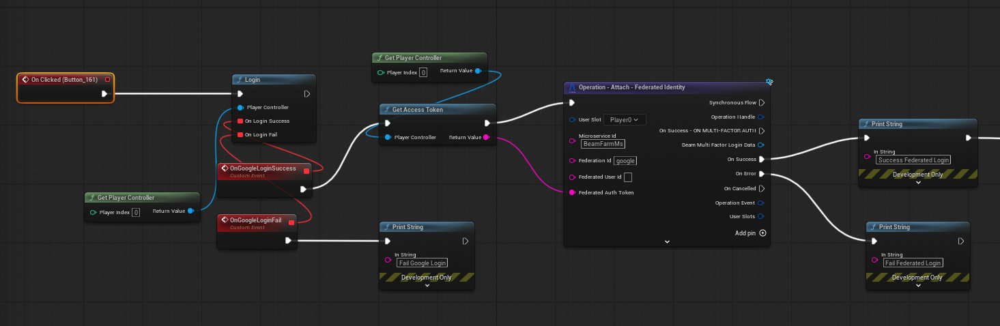

# Google Sign-In Integration (Unreal + Beamable)

This document describes how to integrate **Google Sign-In** in an Unreal Engine project and how **Login** and **Attach** federation flows work when linking Google accounts to Beamable players.

---

## Overview

Google authentication is handled on the **client** using Google Sign-In, while account linking and authentication are handled on the **server** using **Beamable Federation**.

High-level flow:

1. Authenticate the player using **Google Sign-In**
2. Retrieve a **Google ID Token**
3. Send the ID Token to a Beamable **Federation Microservice**
4. Beamable validates the token with Google and:
   - Logs the player in
   - Or attaches the Google identity to an existing account

---

## Prerequisites

### Google Developer Console Setup

Before implementing Google Sign-In, configure a Google Cloud project:

- Enable **Google Identity Services**
- Create an **OAuth 2.0 Client ID**
- Configure authorized bundle IDs / package names

Google documentation:  
[https://developers.google.com/identity/sign-in](https://developers.google.com/identity/sign-in)

---

## Google Sign-In Client Implementation

The client authenticates the player with Google and retrieves an **ID Token**.

### Responsibilities

- Trigger Google Sign-In flow
- Retrieve the **ID Token**
- Forward the token to Beamable
- Handle user cancellation or failure

---

## Federation Concept (Beamable)

Beamable Federation allows external identity providers (such as Google) to authenticate or link accounts.

For Google integration:

- The **Google ID Token** is sent to the federation
- The federation validates the token with Google
- The Google **UID (`sub`)** becomes the authoritative user identifier

---

## Google Federation Microservice

### Federated Login Implementation

```csharp
async Promise<FederatedAuthenticationResponse>
    IFederatedLogin<GoogleFederation>.Authenticate(
        string token,
        string challenge,
        string solution)
{
    return new FederatedAuthenticationResponse()
    {
        user_id = await GetGoogleUidFromIdTokenAsync(token)
    };
}
```

### Token Validation

```csharp
public async Task<string> GetGoogleUidFromIdTokenAsync(string idToken)
{
    HttpClient httpClient = new HttpClient();

    var payload = new FormUrlEncodedContent(new[]
    {
        new KeyValuePair<string, string>("id_token", idToken)
    });

    var response = await httpClient.PostAsync(
        "https://oauth2.googleapis.com/tokeninfo",
        payload);

    response.EnsureSuccessStatusCode();

    var content = await response.Content.ReadAsStringAsync();
    var json = JObject.Parse(content);

    return json["sub"]?.ToString();
}
```

---

## Login vs Attach Flows

### Login Flow (Returning Player)

- Player selects **Sign in with Google**
- Client retrieves ID Token
- Calls **Federated Login**
- Backend validates token and logs player in

---

### Attach Flow (First-Time Link)

- Player is already authenticated
- Client retrieves ID Token
- Calls **Attach – Federated Identity**
- Backend links Google UID to account


## Client Blueprint

1. Trigger Google Login
2. Retrieves the ID Token
3. Call Attach or Login
4. Handle success or failure


