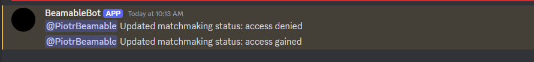

# Discord integration sample

This demo showcases how you can use the **Beamable Unreal SDK** and **Beamable Microservices** to integrate with Discord for community management tools.

## Introduction

Aside from the `BeamableCore` Plugin, here is what the sample contains:

- **`BEAMPROJ_DiscordDemo` Unreal Plugin.**: Contains the UE implementation for the client
- **`Microservices/services/DiscordDemo` Microservice**: Microservice containing code that implements `IFederatedLogin` and a `DiscordBot` integration

To set up this sample you will need a few things:

- A Beamable Account and a Realm
- A Discord Developer Account

To configure the sample, run `dotnet beam unreal select-sample BEAMPROJ_DiscordDemo`.

!!! note "Assumptions"
      Instructions below assume that you already have the Discord server that you want to use for integration. If that is not the case, be sure to create one first. Make sure that you have the admin access to the Discord server of choice.

## Setting Discord application
This sample integrates with a third-party platform, so it relies on your own credentials and Beamable does not host a ready-to-run version. Set up a Discord account and configure the sample Discord bot:

1. Log into your [Discord.dev](https://discord.com/developers/applications) account
2. Create an App. Set aside its `AppId` in a notepad for future use
      1. Fill out General Information about your app
      2. No need for providing any of the URLs at the bottom of the General Information page
3. Go to App `Settings->OAuth2` and set the Redirects Url: `http://127.0.0.1`. Make sure that changes are saved
4. Go to App `Settings->Bot`
      1. Set a Bot username
      2. Set as true all **Privileged Gateway Intents**, especially the **Server Members Intent**
      3. Press the `Reset Token` button and set it aside (it will be required later on)
5. Go to App `Settings->Installation`
      1. In `Install Link` select `Discord Provided Link`, copy and paste it into a browser
      2. In `Default Install Settings` add `bot` to the `Scopes` field and `Administrator` to the `Permissions` field
      3. Install the App into your Discord server of choice
6. Now open the Discord application
      1. Open `Settings->Advanced` and enable `Developer Mode` to copy various IDs by right-clicking items in the UI
      2. Right click on the server icon and select the option `Copy server ID` and set it aside
      3. Right click on the server icon and select `Settings->Roles`
      4. Create a `enabled-matchmaking` role
      5. Right click on the role and select the option `Copy Role ID` and set it aside
      6. Pick any text channel. Right click on the channel select the option `Copy Channel ID` and set it aside

## Setting up Beamable

Next, configure a Beamable realm to use it.

1. Go to the Beamable Portal and create a new Beamable realm called `discord-demo`
2. On the Portal open the Realm Config page of the `discord-demo` realm (`Operate -> Config`)
3. Hit the `Add Config` button
4. Set the following key-value pairs for the namespace `"discord_integration"`:
      1. `"matchmaking_roles_whitelist"` -> Your copied Role Id, can be multiple separated by comma
      2. `"bot_token"` -> Your Bot Token
      3. `"guild_id"` -> Your Discord Server ID
      4. `"notify_channel"` -> Optional- Discord channel ID that bot will notify about status changes
5. Open the `Plugins/BEAMPROJ_DiscordDemo/Overrides/Config/DefaultGame.ini`
      1. Replace the `DiscordAppId` in it with `Your App Id`
      2. Regenerate project files
6. Compile and open the `BeamableUnreal` editor (it will be configured as the `BEAMPROJ_DiscordDemo`) project

Now, you are ready to sign into a game using Discord.

## Playing the sample in editor

To test the sample:

1. Open the `BeamableUnreal` in the Unreal Editor
2. Sign into your Beamable account in the `Beamable Window` and go to the `discord-demo` realm
3. Go to the `Microservices` and run the `DiscordSampleMS` microservice
4. Start game
5. Press the `Sign In with Discord` button following instructions (discord will ask for permission)
6. After logging in, you should see information about being able to participate in matchmaking
7. Add or remove the role for the signed-in user on your Discord server
8. Observe the text on the UI changing to reflect your ability to participate in matchmaking
9. If `"notify_channel"` was specified correctly in the configuration, the bot also notifies the channel of the status change:

To actually gate matchmaking, set up a rule in your `GameType` content that excludes people from the queue who do not have the role. This is not shown in this demo.

## Can I use it as a template?

This sample is not meant to be used as a template directly, however, its components are free for you to copy and use in your own project. Here is what these are:

- The `DiscordDemo` Microservice
- Beamable code inside `BEAMPROJ_DiscordDemo` except code inside a `ThirdParty` directory
- Content inside the `BEAMPROJ_DiscordDemo` except things inside a `ThirdParty` directory

## Why no client build
Clients must be pointed at your `discord-demo` realm, so you need to generate the build yourself by packaging it for any supported platform.
