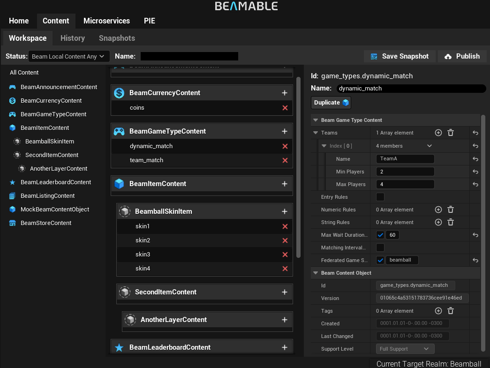
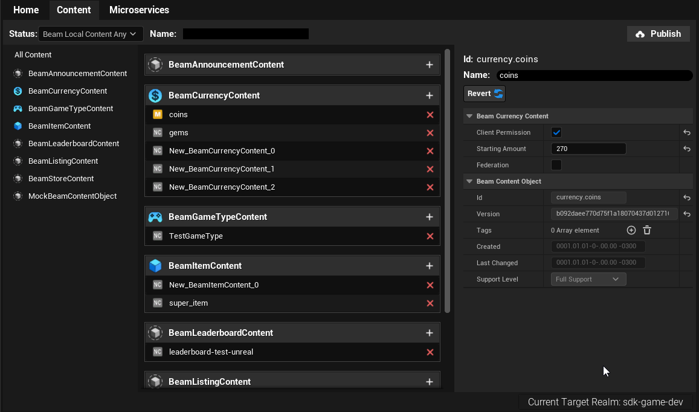
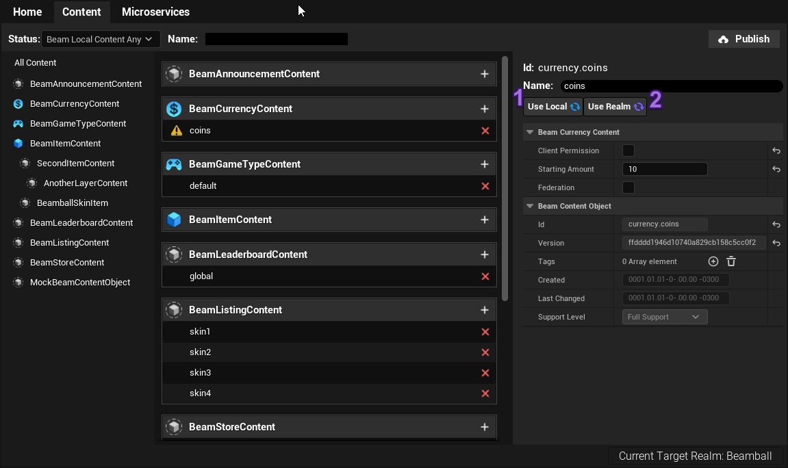
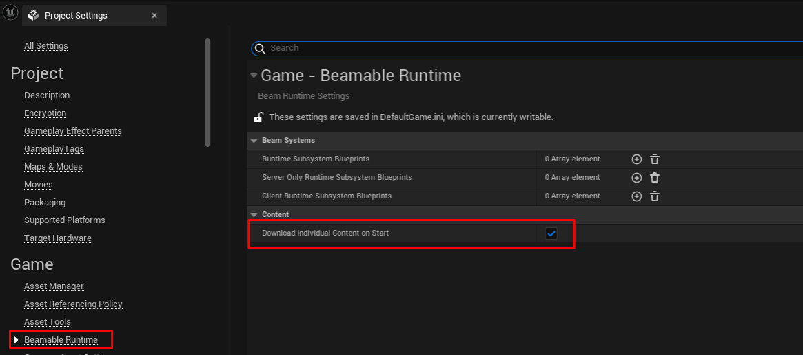
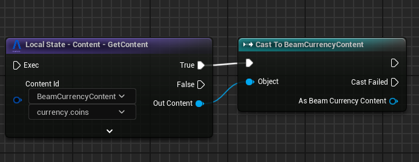

# Content System

Beamable Content System is a read-only (at runtime) arbitrary data store that allows you to define arbitrary JSON-serialized _content objects_ for use at runtime. Several of Beamable's own managed features also use content in some way or another.

The system is manifest-based. This means:

- A **manifest** is a list of published content objects in a realm indexed by their content ids.
- Publishing a **manifest** means first uploading all the individual content objects to Beamable and, after that, uploading a manifest that knows all where each content lives.
- Downloading a **manifest** does not necessarily imply downloading the individual content object jsons (more information below).
- **_You are solely responsible for maintaining backward compatibility for your custom content objects._**

Each individual content object in each manifest is identified by an ID with the format below:

> ContentTypeId.ContentName

`ContentTypeId` expands to the hierarchy of `UBeamContentObject` types, starting from the root type. For example:

> `UMyGameItemContent` inherits from `UBeamItemContent`
> `items.mygameitem.MyGameItemName`

The last part of the id is the only one you edit through the **Content Window**. The `ContentTypeId` is inferred by the type hierarchy.

## Content Window
The content window is the main tool to create, edit and publish new content to your project.


The list of content objects displayed in the content window is very similar to a "Status" window in Git or some other version control systems. Beside show your local content it also presents the differences between your local state and the state in your currently targeted `Realm`.

These differences are represented by the `[+]`,`[-]` and `[M]` signs.

- `[+]`: Means the content exists locally but NOT in the realm.
- `[M]`: Means the content exists BOTH locally and in the realm AND that it is modified relative to the one in the realm.
    - `[!]`: Means the content had changes locally when a someone else published to the realm. This means that your changes would overwrite the published changes. We call this a **Conflict** and you MUST resolve conflicts before publishing your changes.
- `[-]`: Means the content DOES NOT exists locally but DOES exist in the realm.

If the content is not marked with any of these signs, it means it is in sync with the realm.

!!! warning "Changing Realm"
	Content is stored locally per-Realm inside the `.beamable` folder. This means that, when you change realms in the editor, you will sync your local content state against the new realm's content without losing your local state against the previous realm.

!!! note "Where can I find the content files?"
	While you edit the content objects as `UObject` and a details panel, these are not stored as `UDataAsset` or anything inside Unreal itself. These are stored as individual JSON objects inside `ProjectRoot/.beamable/content` folder. This makes it more friendly for version control systems.

## Creating, Modifying and Deleting Content



To create a new piece of content locally:

1. Click **+** next to any of the content type headers to create a content of that type.
2. Rename the created content with whatever name you want; it cannot contain whitespaces or `.`.

Deleting content can be done simply by pressing `Del` on your keyboard with a item selected or clicking the `[X]` button in the Item Details.

Items created locally will have a `[+]` sign next to them informing that they are not in the realm yet and will be added in the next publish. Items deleted locally that have counterparts on the realm will have a `[-]` sign next to them informing that they will be removed from the realm in the next publish.

Modifying content can be done by via the Details editor in the **Content Window**. Modified content, relative to the latest published manifest, is shown with an `[M]` icon next to them. They can be reverted to their state at the realm by using the `Revert` button.



## Publishing and Auto-Synch'ing
The source of truth for content in a realm is always whatever manifest was last published to that realm. **Publishing** is telling the Beamable SDK that you want to send your entire local content state to the realm and make that the source of truth.

!!! note "For Designers"
	You can think of the realm's published content as a "Dropbox/Google Drive folder" that contains all content object's serialized JSON files and the manifest is an index that tells the SDK which content exists and where to download their JSON file.

	**Publishing** means deleting all the contents of the Dropbox folder and replacing them with your local files.  

To publish content to a realm simply press the **Publish** button.

### Understanding Content Auto-Sync Rules
It is often desireable to have designers in a realm that is stable and allow them to work in `Blueprints`, `Beamable Content` and Unreal `Data Asset` in the same realm plus branch combination. 

In order to enable this workflow, the Beamable SDK:

- Listens for whenever any developer publishes content to a realm and notifies other developers working on that same realm.
	- If `Designer-A` publishes changes, `Designer-B` will see a UE-notification informing them that `Designer-A` has just published.  
- Automatically keeps any un-modified local files up-to-date with the latest version of that file published to the realm.
    - If `Designer-A` publishes changes to `Content-1` and `Designer-B` had no changes made to that file in their machine, the SDK in `Designer-B`'s machine will automatically update their `Content-1` file to match the newest version of it published by `Designer-A`.
    - The notification tells you what content was automatically synchronized.
- Informs you that you had made changes to a file that was modified in the published manifest. This is called a **Conflict**.
	- If `Designer-A` publishes changes to `Content-1` and `Designer-B` had made changes to that file in their machine, the SDK in `Designer-B`'s machine will NOT automatically update their `Content-1` file. Instead, it'll accuse a **Conflict**.
    - The notification informs you if a conflict happened.

To prevent `Designer-B` from overwriting changes made by `Designer-A` the SDK will not allow `Designer-B` to **Publish** until all detected conflicts are resolved. Resolving a conflict can be done in one of two ways:

- **Use Realm**: this will discard all local changes to that content and use whatever was published.
- **Use Mine**: this will simply ignore the conflict (which means that it will allow you to publish and your publish WILL overwrite the version in the realm).



As such, we recommend a few things:

- Organize the designers in your to minimize the chance of **conflicts**.
    - As long as they are working in different content objects, working in the same realm should be seamless.
    - Common distributions of work that work well with this is to assign owners to subset of your content when mapping out who's doing what work.
- Instruct designers to ALWAYS talk to the person whose publish action caused the conflict _before_ resolving things.
  	- This is why we inform you _who_ made the last publish that caused the conflict.

This workflow can also be used for engineers that are developing non-Beamable related features.

In addition to the workflow above, there are cases where you might want to create realms in order to have a more controlled enviroment for developing. Common examples are:

- Large features that make use of new custom content definitions developed alongisde Microservices.
- Content schema modifications or equivalents that will require migrating existing content to a new schema. 

To achieve this --- just create a new realm for the development of that feature.

!!! note "Feature Branches vs Feature Flags"
    If you like working with feature branches, we recommend pairing this realm for the feature branch. For reducing complexity, we recommend only doing this for large features that will take a lot of time in development.

	If you are a team that prefer to use feature flags over feature branches, you can still make the realm. Just write the code behind the feature flag to expect to be running in a realm whose Microservices, configuration and content match the feature realm's one.

Once your work is done, you can configure the stable realm with whatever new configuration is required and then use the CLI or the Portal to move the content over to the new realm. 

## Custom Content Types

In Unreal, you define content schemas as sub-classes of `UBeamContentObject` or any of its subtypes available in the SDK ( `UBeamItemContent` , `UBeamGameTypeContent` , etc...). Every content type must define a unique string id for that particular type and a function that returns it.

The following example of `UBeamCurrencyContent` shows how that can be done:

```c++
UCLASS(BlueprintType)
class BEAMABLECORE_API UBeamCurrencyContent : public UBeamContentObject
{
	GENERATED_BODY()
public:
	// Define the ContentTypeId for this type.
	UFUNCTION()
	void GetContentType_UBeamCurrencyContent(FString& Result){ Result = TEXT("currency"); }
	
	// Define the properties you wish
	UPROPERTY(EditAnywhere, BlueprintReadWrite)
	FBeamClientPermission clientPermission;
	
	UPROPERTY(EditAnywhere, BlueprintReadWrite)
	int64 startingAmount;
	
	UPROPERTY(EditAnywhere, BlueprintReadWrite, DisplayName="Federation")
	FOptionalBeamFederation external;
};
```

Please remember to annotate your `UPROPERTY` with `EditAnywhere` and either:

- `BlueprintReadOnly` if you are not writing utilities to create the objects for you.
- `BlueprintReadWrite` if you are writing utilities to create the objects for you.

!!! note "Microservices"
	In a lot of cases, you will want to access these content objects in Microservices.	For all of Beamable's own content-types ( `UBeamCurrencyContent` , etc...) you will find equivalents in the Microservice SDK. For your own custom types, you'll need to declare them in C#. To do so, use the serialization table below as reference to know how to map types from C++ to C#.

## Supported Content Serialization

| Serializable Type               | In C# Microservices                        | Notes                                                                                                                                                                                                                              |
| ------------------------------- | ------------------------------------------ | ---------------------------------------------------------------------------------------------------------------------------------------------------------------------------------------------------------------------------------- |
| **Primitive Types**             |                                            |                                                                                                                                                                                                                                    |
| `uint8` , `int32` , and `int64` | `byte`, `int` and `long`.                  |                                                                                                                                                                                                                                    |
|                                 | `float` and `double`.                      |                                                                                                                                                                                                                                    |
|                                 | `bool`                                     |                                                                                                                                                                                                                                    |
| **Unreal Types**                |                                            |                                                                                                                                                                                                                                    |
| `FString`, `FText`, `FName`     | `string`                                   | These get serialized as JSON strings.                                                                                                                                                                                              |
| `FGameplayTag`                  | `string`                                   | `FGameplayTag::RequestGameplayTag` for deserialization.                                                                                                                                                                            |
| `FGameplayTagContainer`         | `string`                                   | `FGameplayTagContainer::FromExportString` for deserialization.                                                                                                                                                                     |
| `UClass*`                       | `string`                                   | Gets converted to `FSoftObjectPath` when serializing. Deserializing will first create the `FSoftObjectPath` and then resolve it.                                                                                                   |
| `TSoftObjectPtr`                | `string`                                   | Gets converted to `FSoftObjectPath` when serializing. When `None` serializes as an empty `string`.                                                                                                                                 |
| `TArray<>`                      | `List<>` or `T[]`                          | Any `TArray<SomeType>` will serialize normally as long as `SomeType` is also supported.                                                                                                                                            |
| `TMap<FString, >`               | `Dictionary<string,>`                      | We only support maps with `FString` as keys. The values can be any supported type.                                                                                                                                                 |
| **Beamable Types**              |                                            |                                                                                                                                                                                                                                    |
| `FBeamOptional`                 | `Optional____`                             | Any property of a type implementing `FBeamOptional` doesn't get serialized if `IsSet==false` but does get serialized otherwise.<br><br>For example, `FOptionalInt32` serializes to nothing OR an `int32`.                          |
| `FBeamSemanticType`             | `string` OR semantic type equivalent in C# | This always gets serialized as a JSON blob when inside `UBeamContentObject`.                                                                                                                                                       |
| `FBeamArray` and `FBeamMap`     | `ArrayOf` and `MapOf`                      | Any implementation of these wrappers are serialized correctly as JSON arrays and JSON<br>objects respectively. These are only used when<br>you want to nest `TArray<TArray<>>` / `TMap<,TMap<>>` and still have Blueprint Support. |
| `FBeamJsonSerializableUStruct`  | Any C# class that maps to your struct      | Any type inheriting from this type gets serialized as a JSON object.                                                                                                                                                               |
| `IBeamJsonSerializableUObject`  | Any C# class that maps to your class       | `UObject` in content should have their classes<br>annotated with `DefaultToInstanced`,<br>`EditInlineNew` since you shouldn't reference<br>assets directly inside content objects.<br><br>For that, use `TSoftObjectPtr<>`.        |

Take a look at `UMockBeamContentObject` to see the supported types.


## Runtime Content Subsystem
The SDK fetches the content manifest before the `OnBeamableStarted` callback is triggered. By default, it downloads the content manifest and each individual piece of content. You can enable and disable this behavior it can be configured to do so inside `Project Settings -> Beamable Runtime`.



The SDK also supports live content updates (if you publish content while the game client is running):

- While the [`OwnerUserSlot`](../runtime-systems/user-slots.md) is signed in to Beamable, `UBeamContentSubsystem` listens for notifications that the realm's content manifest has been updated.
- When that happens, we will re-download the manifest. 
- If `bDownloadIndividualContentAtStart` is `true`:
    - We download and cache all the updated content objects relative to the last manifest we've downloaded in this client.
    - These updates are cached locally inside the `Saved` directory in binary form such that a user does not need to re-download content in subsequent runs of your game unless the published manifest changes.
    - This cache is invalidated if your game-version changes, the SDK version changes or the UE version changes. 
- If `bDownloadIndividualContentAtStart` is `false`:
    - You are then responsible for downloading each individual content via the APIs: `FetchIndividualContentBatchOperation` and `FetchIndividualContentOperation`.
    - Caching will still occur automatically when manually downloading content.

Accessing content at runtime is fairly simple:



## Baking Content
In a couple of cases, you might want to bake content to distribute it with your build:

- If you plan to release a new build every time you want to update your game.
- If you want to trade off some binary size for spending less time waiting for the individual content download at initialization time.

To enable those cases, we provide an editor utility that will bake your local content into a `UBeamContentCache`. 
This is a special asset type that has the `UBeamContentObject` instances serialized using UE's binary serialization as opposed to JSON.
**Keep in mind that this utility uses your local content; so make sure your content matches the realm's content before running it**.

The utility is called `EBP_BakeContent` and can be found in Beamable Core's plugin folder under `/Editor/Utility/EBP_BakeContent.EBP_BakeContent`. 
Running this utility goes through your local content and bakes them into a `BCC_` assets ( `UBeamContentCache` ) stored in `/Game/Beamable/Content/Manifests/Cooked/` directory.
This directory is configured, by default, to be included in packaged games.

At runtime, any `UBeamContentCache` is loaded automatically by the `UBeamContentSubsystem` if it exists and is configured correctly; so you don't have to do anything to have it work.

!!! warning "I can't find the Beamable Core Content in the Content Browser"
	UE's Content Browser does not show Plugin content folders by default. If you want to see these, you need to turn it on at `Content Browser -> Settings -> Show Plugin Content`.

## Notes on Binary Serialization
Unreal's Binary serialization of `UObject` types works _mostly_ out of the box without any need for you to write any code. There are a few caveats:

- When referencing assets inside content objects use `TSoftObjectPtr`.
- When referencing types inside content objects use `UClass*`.
- When referencing non-asset `IBeamJsonSerializableUObject` inside content objects use `UMyObject*` directly and add `DefaultToInstanced, EditInlineNew` to the `UCLASS` macro of that type.

Doing that will make the binary serialization of content for local cache-ing work in each of these cases.   

For serializing arbitrary data structures, prefer `FBeamJsonSerializableUStruct` subtypes `UBeamContentObject` as these are simpler to set up. It is only in cases where you need a recursive type that we recommend the use of inlined `IBeamJsonSerializableUObject`. For examples of handling this edge case, you can look at the `UBeamGameTypeContent` and `UBeamStatComparisonRule` types shipped with the SDK.