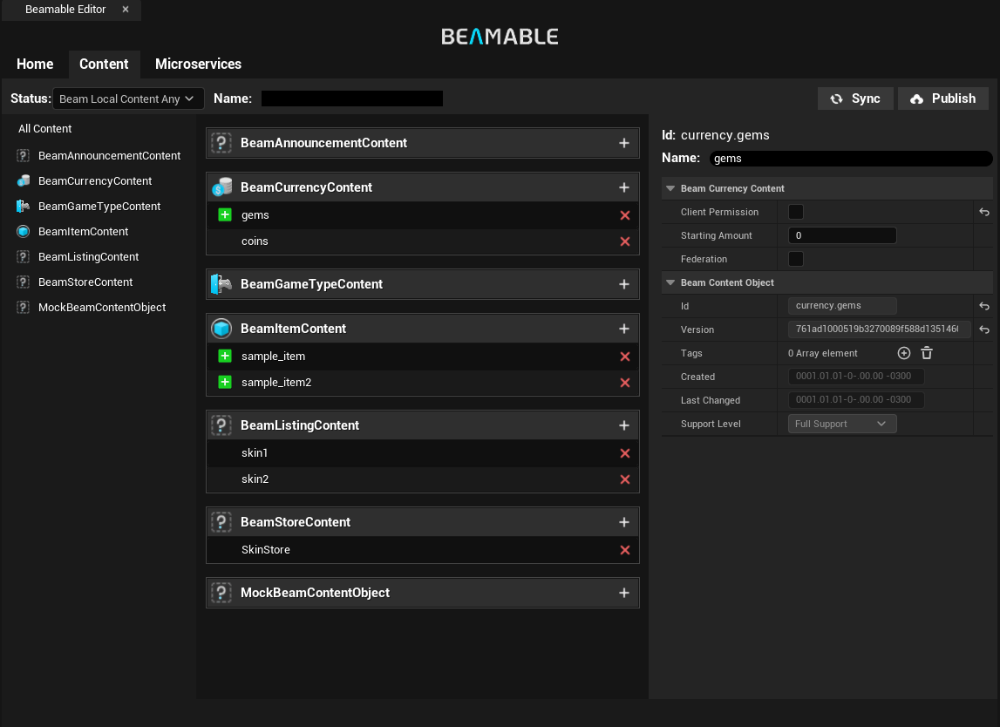
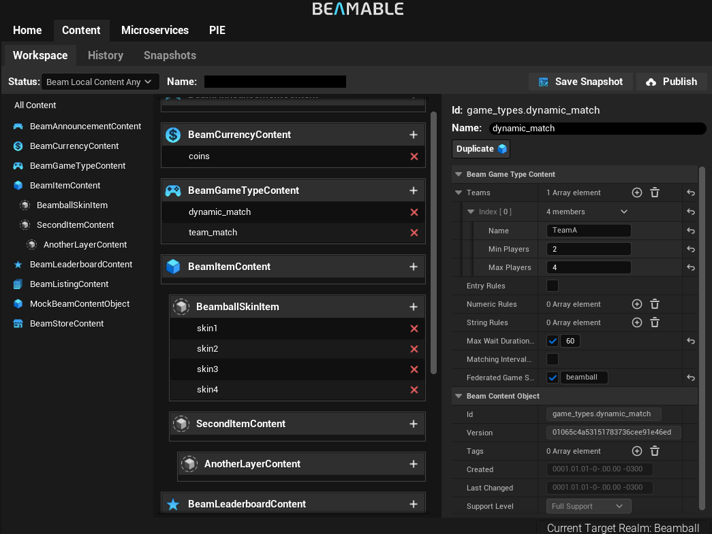
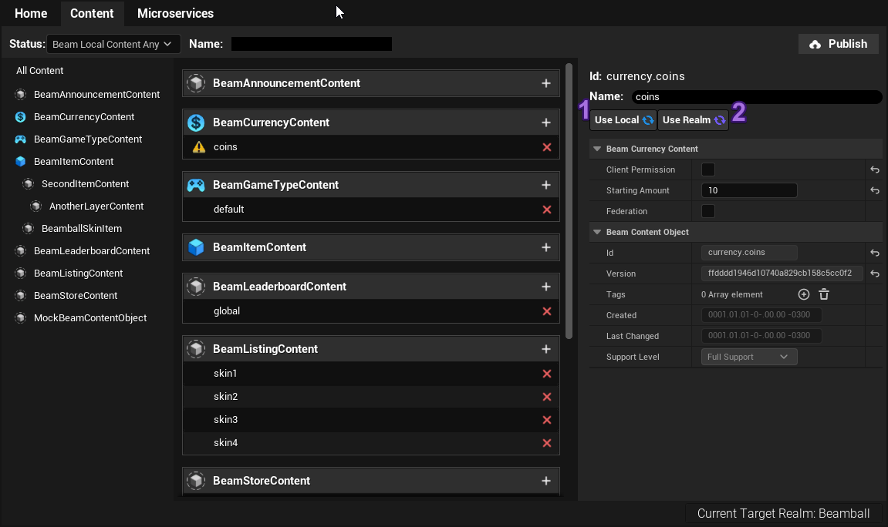
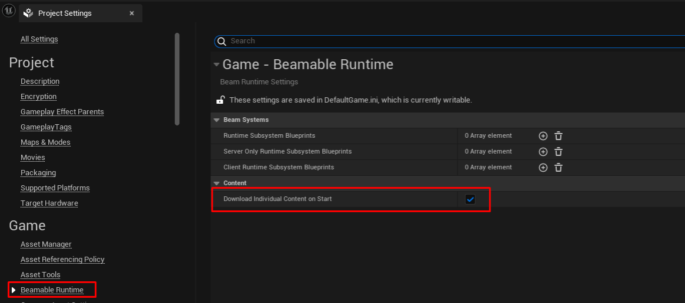
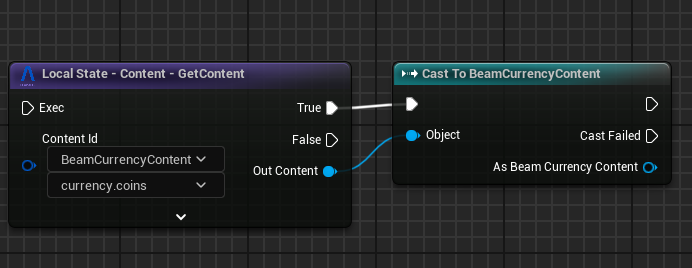
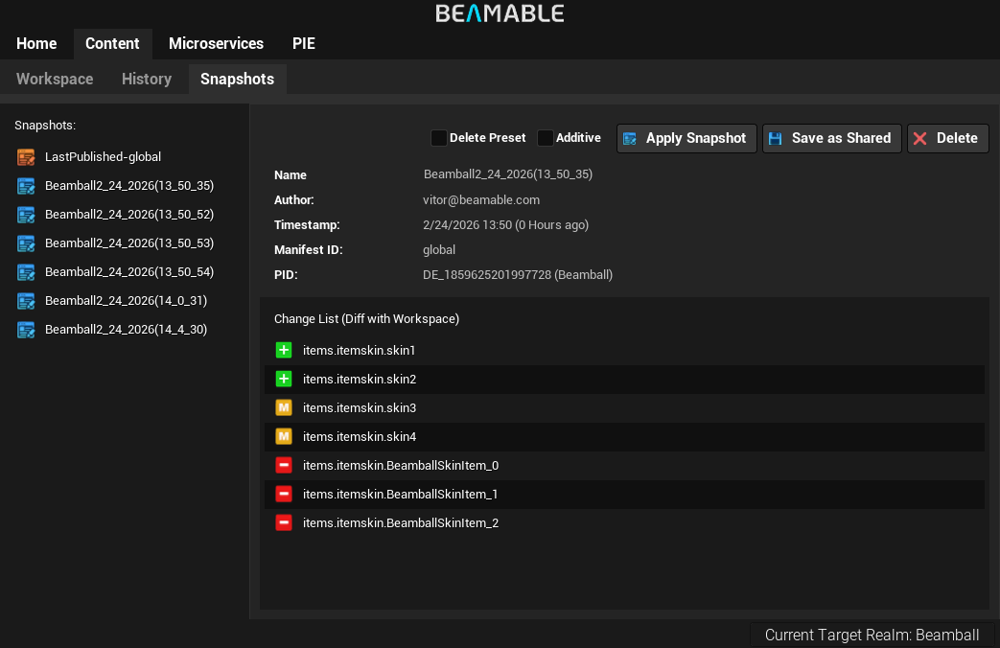
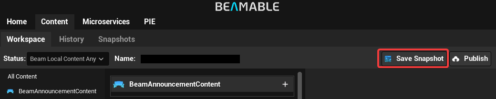
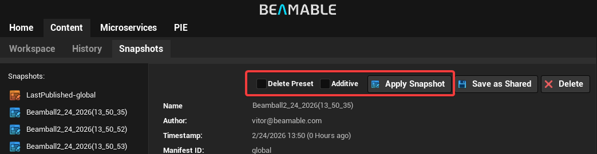
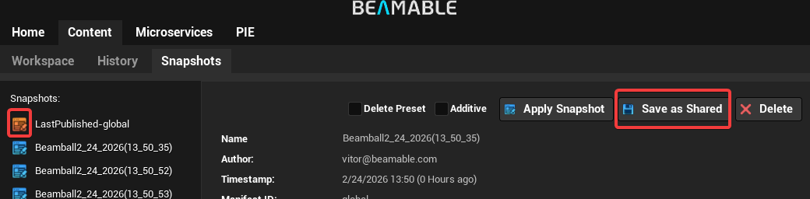
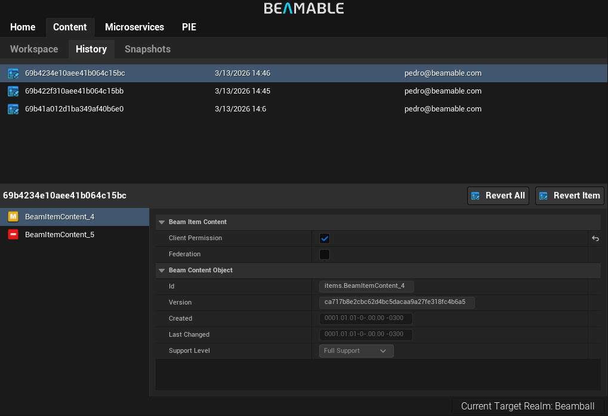

# Content system

Beamable Content System is a read-only (at runtime) arbitrary data store that allows you to define arbitrary JSON-serialized _content objects_ for use at runtime. Several of Beamable's own managed features also use content in some way or another.

The system is manifest-based.

- A **manifest** is a list of published content objects in a realm indexed by their content ids
- **Publishing** a manifest means first uploading all the individual content objects to Beamable and, after that, uploading a manifest that knows where the content objects live
- **Downloading** a manifest does not necessarily imply downloading the individual content object jsons (more information below)

**_You are solely responsible for maintaining backward compatibility for your custom content objects._**

Each individual content object in each manifest is identified by an ID with the format below:

> ContentTypeId.ContentName

`ContentTypeId` expands to the hierarchy of `UBeamContentObject` types, starting from the root type. For example:

> `UMyGameItemContent` inherits from `UBeamItemContent`
> `items.mygameitem.MyGameItemName`

The last part of the ID is the only one you edit through the **Content Window**. The `ContentTypeId` is inferred by the type hierarchy.

## Content window
The Content Window is the main tool to create, edit, and publish new content to your project.



The list of content objects displayed in the content window is very similar to a "Status" window in Git or some other version control systems. Besides showing your local content, it also presents the differences between your local state and the state in your currently targeted `Realm`.

These differences are represented by the `[+]`,`[-]` and `[M]` signs.

- `[+]`: Means the content exists locally but NOT in the realm
- `[M]`: Means the content exists BOTH locally and in the realm AND that it is modified relative to the one in the realm
    - `[!]`: Means the content had changes locally when someone else published to the realm. This means that your changes would overwrite the published changes. This is called a **Conflict**. You MUST resolve conflicts before changes can be published
- `[-]`: Means the content DOES NOT exist locally but DOES exist in the realm

If the content is not marked with any of these signs, it means it is in sync with the realm.

!!! warning "Changing Realm"
	Content is stored locally per-Realm inside the `.beamable` folder. This means that, when you change realms in the editor, you will sync your local content state against the new realm's content without losing your local state against the previous realm.

!!! note "Where can I find the content files?"
	While you edit the content objects as `UObject` and a details panel, these are not stored as `UDataAsset` or anything inside Unreal itself. These are stored as individual JSON objects inside `ProjectRoot/.beamable/content` folder. This makes it more friendly for version control systems.

## Creating, modifying, and deleting content



**To create a new piece of content locally:**

1. Select **+** next to any of the content type headers to create a content of that type
2. Rename the created content; it cannot contain whitespaces or `.`

To delete content, press `Del` on your keyboard with an item selected, or select the `[X]` button in the Item Details.

Items created locally will have a `[+]` sign next to them informing that they are not in the realm yet and will be added in the next publish. Items deleted locally that have counterparts on the realm will have a `[-]` sign next to them informing that they will be removed from the realm in the next publish.

Modifying content can be done via the Details Editor in the **Content Window**. Modified content, relative to the latest published manifest, is shown with an `[M]` icon next to them. They can be reverted to their state at the realm by using the `Revert` button.

![The Content window with the modified dynamic_match object marked by an [M] icon and selected, its detail panel showing a Revert button next to Duplicate.](../../../media/imgs/content-revert.png)

## Publishing and auto-syncing
**Publishing** tells the Beamable SDK that you want to send your entire local content state to the realm and make that the source of truth. The source of truth for content in a realm is always whatever manifest was last published to that realm.

To publish content to a realm, use the Publish button.

!!! note "For Designers"
	You can think of the realm's published content as a "Dropbox/Google Drive folder" that contains all content objects' serialized JSON files. The manifest is an index that tells the SDK which content exists and where to download their JSON files.

	**Publishing** means deleting all the contents of the Dropbox folder and replacing them with your local files.

### Understanding content auto-sync rules
It is often desirable to have designers in a realm that is stable and allow them to work in `Blueprints`, `Beamable Content` and Unreal `Data Asset` in the same realm plus branch combination.

To enable this workflow, the Beamable SDK:

- Listens for whenever any developer publishes content to a realm and notifies other developers working on that same realm
	- If `Designer-A` publishes changes, `Designer-B` will see a UE-notification informing them that `Designer-A` has just published. <br><br>
- Automatically keeps any un-modified local files up-to-date with the latest version of that file published to the realm
    - If `Designer-A` publishes changes to `Content-1` and `Designer-B` had no changes made to that file in their machine, the SDK in `Designer-B`'s machine will automatically update their `Content-1` file to match the newest version of it published by `Designer-A`
    - The notification tells you what content was automatically synchronized. <br><br>
- Informs you that you had made changes to a file that was modified in the published manifest. This is called a **Conflict**
	- If `Designer-A` publishes changes to `Content-1` and `Designer-B` had made changes to that file in their machine, the SDK in `Designer-B`'s machine will NOT automatically update their `Content-1` file. Instead, it will accuse a **Conflict**
    - The notification informs you if a conflict happened

To prevent `Designer-B` from overwriting changes made by `Designer-A` the SDK will not allow `Designer-B` to **Publish** until all detected conflicts are resolved. Resolving a conflict can be done in one of two ways:

- **Use Realm**: this will discard all local changes to that content and use whatever was published
- **Use Local**: this ignores the conflict (which means that it will allow you to publish and your publish WILL overwrite the version in the realm)



Therefore, consider these practices:

- Organize the designers in your realm to minimize the chance of **conflicts**
    - As long as they are working in different content objects, working in the same realm should cause no conflicts.<br><br>
- Instruct designers to ALWAYS talk to the person whose publish action caused the conflict _before_ resolving things
  	- This is why the SDK shows _who_ made the last publish that caused the conflict

This workflow can also be used for engineers that are developing non-Beamable related features.

In addition to the workflow above, there are cases where you might want to create realms to have a more controlled environment for developing. Common examples are:

- Large features that make use of new custom content definitions developed alongside Microservices
- Content schema modifications or equivalents that will require migrating existing content to a new schema

To achieve this, create a new realm for the development of that feature.

!!! note "Feature Branches vs Feature Flags"
    If you like working with feature branches, pair this realm with the feature branch. Limit this to large features that will take a lot of time in development.

	If you are a team that prefer to use feature flags over feature branches, you can still make the realm. Just write the code behind the feature flag to expect to be running in a realm whose Microservices, configuration and content match the feature realm's one.

Once your work is done, you can configure the stable realm with whatever new configuration is required and then use the CLI or the Portal to move the content over to the new realm.

## Custom content types

In Unreal, you define content schemas as sub-classes of `UBeamContentObject` or any of its subtypes available in the SDK ( `UBeamItemContent` , `UBeamGameTypeContent` , etc.). Every content type must define a unique string ID for that particular type and a function that returns it.

The following example of `UBeamCurrencyContent` shows how that can be done:

```c++
UCLASS(BlueprintType)
class BEAMABLECORE_API UBeamCurrencyContent : public UBeamContentObject
{
	GENERATED_BODY()
public:
	// Define the ContentTypeId for this type.
	UFUNCTION()
	void GetContentType_UBeamCurrencyContent(FString& Result){ Result = TEXT("currency"); }

	// Define the properties you wish
	UPROPERTY(EditAnywhere, BlueprintReadWrite)
	FBeamClientPermission clientPermission;

	UPROPERTY(EditAnywhere, BlueprintReadWrite)
	int64 startingAmount;

	UPROPERTY(EditAnywhere, BlueprintReadWrite, DisplayName="Federation")
	FOptionalBeamFederation external;
};
```

Annotate your `UPROPERTY` with `EditAnywhere` and either:

- `BlueprintReadOnly` if you are not writing utilities to create the objects for you
- `BlueprintReadWrite` if you are writing utilities to create the objects for you

!!! note "Microservices"
	In many cases, you may need to access these content objects in Microservices. For all of Beamable's own content-types (`UBeamCurrencyContent`, etc.), the Microservice SDK provides equivalents. For your own custom types, declare them in C# — use the serialization table below as reference for mapping types from C++ to C#.

## Supported content serialization

| Serializable Type               | In C# Microservices                        | Notes                                                                                                                                                                                                                              |
| ------------------------------- | ------------------------------------------ | ---------------------------------------------------------------------------------------------------------------------------------------------------------------------------------------------------------------------------------- |
| **Primitive Types**             |                                            |                                                                                                                                                                                                                                    |
| `uint8` , `int32` , and `int64` | `byte`, `int` and `long`.                  |                                                                                                                                                                                                                                    |
|                                 | `float` and `double`.                      |                                                                                                                                                                                                                                    |
|                                 | `bool`                                     |                                                                                                                                                                                                                                    |
| **Unreal Types**                |                                            |                                                                                                                                                                                                                                    |
| `FString`, `FText`, `FName`     | `string`                                   | These get serialized as JSON strings.                                                                                                                                                                                              |
| `FGameplayTag`                  | `string`                                   | `FGameplayTag::RequestGameplayTag` for deserialization.                                                                                                                                                                            |
| `FGameplayTagContainer`         | `string`                                   | `FGameplayTagContainer::FromExportString` for deserialization.                                                                                                                                                                     |
| `UClass*`                       | `string`                                   | Gets converted to `FSoftObjectPath` when serializing. Deserializing will first create the `FSoftObjectPath` and then resolve it.                                                                                                   |
| `TSoftObjectPtr`                | `string`                                   | Gets converted to `FSoftObjectPath` when serializing. When `None` serializes as an empty `string`.                                                                                                                                 |
| `TArray<>`                      | `List<>` or `T[]`                          | Any `TArray<SomeType>` will serialize normally as long as `SomeType` is also supported.                                                                                                                                            |
| `TMap<FString, >`               | `Dictionary<string,>`                      | Only `FString` keys are supported. The values can be any supported type.                                                                                                                                                 |
| **Beamable Types**              |                                            |                                                                                                                                                                                                                                    |
| `FBeamOptional`                 | `Optional____`                             | Any property of a type implementing `FBeamOptional` does not get serialized if `IsSet==false` but does get serialized otherwise.<br><br>For example, `FOptionalInt32` serializes to nothing OR an `int32`.                          |
| `FBeamSemanticType`             | `string` OR semantic type equivalent in C# | This always gets serialized as a JSON blob when inside `UBeamContentObject`.                                                                                                                                                       |
| `FBeamArray` and `FBeamMap`     | `ArrayOf` and `MapOf`                      | Any implementation of these wrappers are serialized correctly as JSON arrays and JSON<br>objects respectively. These are only used when<br>you want to nest `TArray<TArray<>>` / `TMap<,TMap<>>` and still have Blueprint Support. |
| `FBeamJsonSerializableUStruct`  | Any C# class that maps to your struct      | Any type inheriting from this type gets serialized as a JSON object.                                                                                                                                                               |
| `IBeamJsonSerializableUObject`  | Any C# class that maps to your class       | `UObject` in content should have their classes<br>annotated with `DefaultToInstanced`,<br>`EditInlineNew` since you should not reference<br>assets directly inside content objects.<br><br>For that, use `TSoftObjectPtr<>`.        |

Take a look at `UMockBeamContentObject` to see the supported types.


## Runtime content subsystem
The SDK fetches the content manifest before the `OnBeamableStarted` callback fires. It can also download each individual piece of content at startup. Toggle this with **Download Individual Content on Start** in `Project Settings -> Beamable Runtime`.



The SDK also supports live content updates (if you publish content while the game client is running):

- While the [`OwnerUserSlot`](../runtime-systems/user-slots.md) is signed in to Beamable, `UBeamContentSubsystem` listens for notifications that the realm's content manifest has been updated
- When that happens, the SDK re-downloads the manifest
- If `bDownloadIndividualContentOnStart` is `true`:
    - The SDK downloads and caches all updated content objects relative to the last manifest downloaded in this client
    - These updates are cached locally inside the `Saved` directory in binary form such that a user does not need to re-download content in subsequent runs of your game unless the published manifest changes
    - This cache is invalidated if your game-version changes, the SDK version changes or the UE version changes
- If `bDownloadIndividualContentOnStart` is `false`:
    - You are then responsible for downloading each individual content via the APIs: `FetchIndividualContentBatchOperation` and `FetchIndividualContentOperation`
    - Caching will still occur automatically when manually downloading content

Accessing content at runtime is fairly simple:



## Content snapshots
The content snapshot system allows you to save the state of your local content at any given time and restore it later.



This is useful for a couple of workflows:

- You can use it to save the state of your local content before trying out risky changes and then restore it if you do not like the changes
- You can save the current state of your local content and share it with your teammates so they can load it in their machines and have the same local content state as you
- You can save the content state of your current realm and apply it to another realm

Content snapshots can be local or shared between users. The local ones are kept in the `.beamable/contentSnapshots` folder and the shared ones in the .beamable/shared/contentSnapshot folder of the project, so you can version it with git.

### Creating content snapshots
To create a content snapshot, click on the button in the top right corner of the Workspace window. This will create a snapshot of your current local content state. It then will be added to the list of snapshots in the Snapshots Window.



### Applying content snapshots
To apply the content of a snapshot to your current workspace, select the snapshot in the list and click `Apply Snapshot`



Additionally you can also select the following options:

- Delete Preset: deletes the snapshot after applying it
- Additive: if checked, the snapshot will be applied on top of your current local content state only adding the new and modified content. If unchecked, the snapshot will replace your current local content state

### Sharing content snapshots
Shared snapshots are stored in the `.beamable/shared/contentSnapshot` folder, so you can share them with your teammates by sharing that file through Git or any other way you like. To save a Local Snapshot as Shared, click `Save as Template`.

The Shared Snapshots are identified in the list with a different (orange) icon.



Notice that every time you publish content to the realm it will automatically update the shared snapshot called `LatestPublished` to match the content that was just published. This means that you can always share with your teammates the latest published content by sharing that snapshot.

## Content history
The content history system allows you to see the history of your content publishing and revert to any previous version of your content.



You can revert the whole content state to a previous version by clicking on the `Revert All` button. This will replace your local content state with the content state of that version or revert individual content objects to a previous version by clicking on the `Revert Item` button in the content details. This will replace your local version of that content object with the version of that content object in that version.


## Baking content
Baking content embeds it in your build as binary-serialized `UBeamContentCache` assets, trading binary size for faster load times at startup. Baking pays off for content that changes little between builds, since anything that falls out of sync with the realm still has to be downloaded at runtime.

To bake content, run the `EBP_BakeContent` editor utility at `/Editor/Utility/EBP_BakeContent.EBP_BakeContent` in the Beamable Core plugin folder. The utility bakes your **local** content state, so make sure it matches the realm before running it.

!!! warning "I cannot find the Beamable Core Content in the Content Browser"
	UE's Content Browser does not show plugin content folders by default. Turn it on at `Content Browser -> Settings -> Show Plugin Content`.

The baked assets (`BCC_`-prefixed `UBeamContentCache` objects) are stored in `/Game/Beamable/Content/Manifests/Cooked/`, which is included in packaged games by default. At runtime, `UBeamContentSubsystem` loads any `UBeamContentCache` automatically if it exists and is configured correctly.

## Notes on binary serialization
Unreal's binary serialization of `UObject` types works mostly out of the box. There are a few caveats:

- When referencing assets inside content objects, use `TSoftObjectPtr`
- When referencing types inside content objects, use `UClass*`
- When referencing non-asset `IBeamJsonSerializableUObject` inside content objects, use `UMyObject*` directly and add `DefaultToInstanced, EditInlineNew` to the `UCLASS` macro of that type

This ensures binary serialization of content for local caching works in each case.

For serializing arbitrary data structures, prefer `FBeamJsonSerializableUStruct` subtypes of `UBeamContentObject` as these are simpler to set up. Use inlined `IBeamJsonSerializableUObject` only when you need a recursive type.

For examples, see the `UBeamGameTypeContent` and `UBeamStatComparisonRule` types shipped with the SDK.
