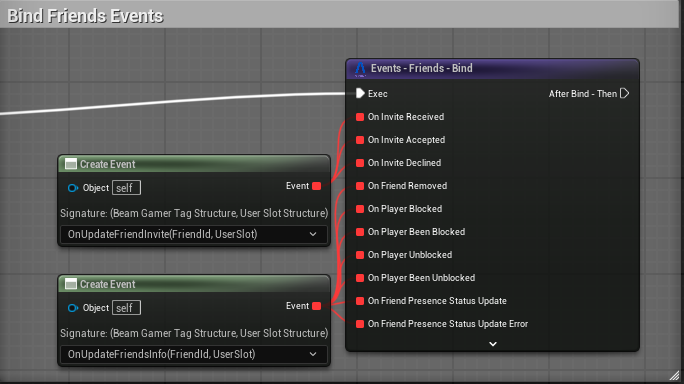

# Friends

The Beamable **Friends** Feature allows game makers to connect players with each other and manage the status of the new friends.

Beamable's Friend system allows the following game flows: 

 - Send friend invites to other players.
 - Accept/Decline invites received from other players.
 - Block/Unblock other players.
 - Check the status of the player (Online, offline).
 - Remove the player from the friend list.

 There is support for local and multiplayer usage for the friend system, in this document we will focus on multiplayer, as it is the most common usage case.

A sample that demonstrates the friend subsystem is available in our [GitHub](https://github.com/beamable/UnrealSDK). For more details, check out the [Beamball Demo](../../samples/beamball/beamball-demo.md).

## Getting Started
To use the friend system, you will need to first setup your Unreal to PIE with multiple players. That will allow you to test everything due multiple instances. 

???+ Warning "Observation"
    The friend subsystem allows you to use the friend system for local players with multiple accounts, you can do as we show here by setting up the UserSlot for the correct player.

Once you have your environment set up to start, the following steps will show how to implement the basic functionalities in BP.

### Binding the Friends Events
 In the SDK all the events can be bound using our custom node for bind from the subsystem. The image below shows an example of how to do this.

 

### Inviting a Friend

1. Open your Level Blueprint (or some other BP)
2. Call the `Operation - Friend - SendFriendInvite`. This will allow you to create an asynchronous chain to handle after inviting someone to be a friend.

It's possible to listen for changes to the invites received, being responsive to this by showing the player that a new friend invite has been received. You will need to bind to the event `OnInviteReceived` shown in the [How to Bind the Friends Events](#how-to-bind-the-friends-events).

### Accepting a Friend Invite

1. Open your Level Blueprint (or some other BP)
2. Call the `Operation - Friend - AcceptFriendInvite`. This will allow you to create an asynchronous chain to handle after accepting a friend invite.

When the player that received the invite accepts it, both receive the invite-accepted event, which could be used for updates in the invite list or to start showing the new friend in the friend list.

To bind to this event you can use the `OnInviteAccepted` as shown in the section above [How to Bind the Friends Events](#how-to-bind-the-friends-events).

???+ Warning "Local Player Feedback"
    Once the player accepts the invite, if you prefer not to wait for the backend notification to update the friend list, you can directly use the operation for the player who accepted and update the local state either synchronously or asynchronously.

### Declining a Friend Invite

1. Open your Level Blueprint (or some other BP)
2. Call the `Operation - Friend - DeclineFriendInvite`. This will allow you to create an asynchronous chain to handle after declining a friend invite.

When the player that received the invite declines it, both receive the `OnInviteDeclined` notification, which can help to update the visuals and the player list. The local state is already updated when the player receives this notification. As shown in the section above [How to Bind the Friends Events](#how-to-bind-the-friends-events).

### Blocking/Unblocking a Player

1. Open your Level Blueprint (or some other BP)
2. Call the `Operation - Friend - BlockPlayer`/`Operation - Friend - Unblock`. This will allow you to block/unblock a player using the gamer tag of this player.

???+ Warning "Observations"
    - It's not necessary for the player to be your friend to block him.
    - **Blocked players can not be friends**.
    - If you are already friends with a player and then block him, it will automatically remove the friend.
    - If you block a friend and then unblock him, this action won't make you friends again. It will require a new friend invite.

There are two events related to blocking players: one for the player who initiates the block and one for the player who is blocked. The first event, `OnPlayerBlocked`, is triggered only for the player who blocks another player. The blocked player does not receive this event, as it is typically not necessary to handle the blocked player in this case. Instead, the blocked player will receive the second event, `OnPlayerBeenBlocked`. As shown in the section above [How to Bind the Friends Events](#how-to-bind-the-friends-events).

???+ Warning "Removed Friend Event"
    The removed friend event will be triggered in both players if they were friends before.

The unblock flow is very similar to the block, so there's an `OnPlayerUnblocked` event and an `OnPlayerBeenUnblocked`.

To use the status presence as the common behavior of showing if your friend is online or offline, we recommend registering in the `OnPresenceStatusUpdate` and handling the updates in the player status from this. As shown in the section above [How to Bind the Friends Events](#how-to-bind-the-friends-events).

### Removing a Friend

1. Open your Level Blueprint (or some other BP)
2. Call the `Operation - Friend - RemoveFriend`. This will allow you to create an asynchronous chain to handle after removing a friend.

When a player is removed from the friend list it will trigger this notification. You will be able to register on this to handle the behavior in your game.

The event that will be triggered is the `OnFriendRemoved`. As shown in the section above [How to Bind the Friends Events](#how-to-bind-the-friends-events).
When it triggers, the local state of the friend list will already be updated. 

### How To Use The System State To Update The View (Invite Sample)

In the example below, we demonstrate how to retrieve the user's friend state and use it to update a view or another screen. In this case, the example simply sets a list of all invites in the friend state. There are other ways to handle this, such as adding or removing items based on events, rather than setting the entire list. For simplicity, we're showing this approach.

# Conclusion

This is a brief document that describes the basic usage of the Friend Subsystem, once you implement those features consider to test with multiple users or adding more complex interactions.