# Friends

# Overview
The Beamable **Friends** Feature allows game makers to connect players with each other and manage the status of the new friends.

Beamable's Friend system allow the following game flows: 

 - Send friend invites to other players.
 - Accept/Decline invites received from other players.
 - Block/Unblock other players.
 - Check the status of the player (Online, offline).
 - Remove the player from the friend list.

 There's support for local and multiplayer usage for the friend system, in this document we will focus on multiplayer, as it is the most common usage case.

A sample that demonstrates the friend subsystem is available in our [GitHub](https://github.com/beamable/UnrealSDK). For more details, check out the [Hathora Demo](../../samples/hathora-demo.md).

# Getting Started
To use the friend system, you will need to first setup your Unreal to PIE with multiple players. That will allow you to test everything due multiple instances. 

???+ Warning "Observation"
    The friend subsystem allow you to use the friend system for local players with multiple accounts, you can do as we showing here setting up the UserSlot for the correct player.

Once you have your enviroment setup to start, the follow steps will show how to implement the basic functinalities in BP.

## How to Invite a Friend

1. Open your Level Blueprint (or some other BP)
2. Call the `Operation - Friend - SendFriendInvite`. This will allow you to create a asynchronos chain to the after invite someone to be a friend.

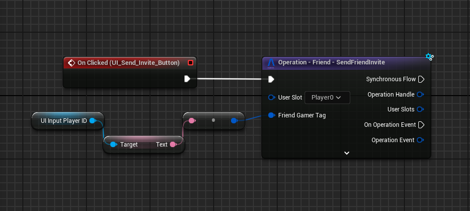

### Invite Received Event

It's possible to listen to the changes for the invites received, being responsive to this showing to the player that a new friend invite has been received. In order to to this you will bind to the event in the `FriendSubsystem` as shown in the BP sample below.

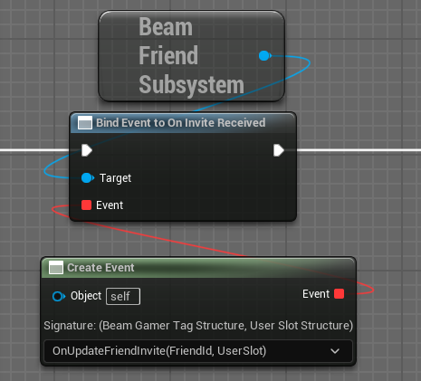

## How to Accept a Friend Invite

1. Open your Level Blueprint (or some other BP)
2. Call the `Operation - Friend - AcceptFriendInvite`. This will allow you to create a asynchronos chain to the after accept a friend invite.

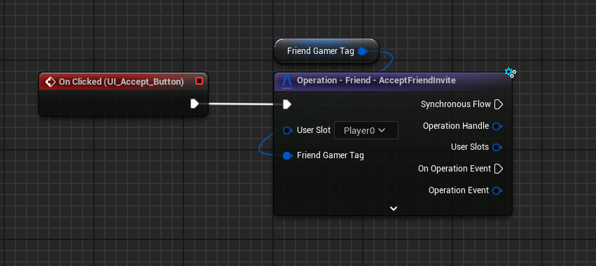

### Invite Accepted Event 

When the player that received the invite accept it, both receive the invite accepted event, it could be used for updates in the invite list or to start to show the new friend in the friend list.

To bind to this event you can use the `FriendSubsystem` and do as shown in the BP below.

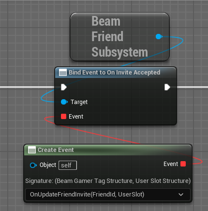

???+ Warning "Local Player Feedback"
    Once the player accepts the invite, if you prefer not to wait for the backend notification to update the friend list, you can directly use the operation for the player who accepted and update the local state either synchronously or asynchronously.

## How to Decline a Friend Invite

1. Open your Level Blueprint (or some other BP)
2. Call the `Operation - Friend - DeclineFriendInvite`. This will allow you to create a asynchronos chain to the after decline a friend invite.

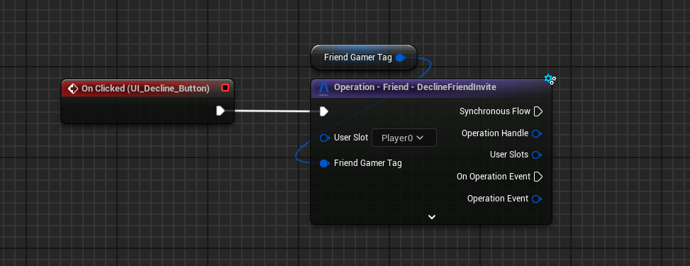

### Invite Decline Event

When the player that received the invite decline it, both receive the `OnInviteDeclined` notification, that can help to update the visuals and the player list. The local state is already updated when the player receive this notification.

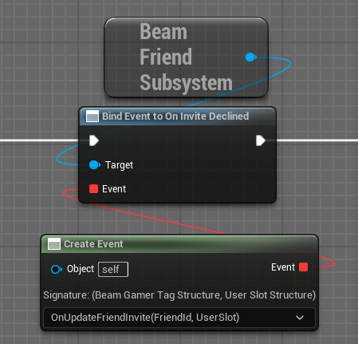

## How to Block/Unblock a Player

1. Open your Level Blueprint (or some other BP)
2. Call the `Operation - Friend - BlockPlayer`/`Operation - Friend - Unblock`. This will allow you to block/unblock a player using the gamer tag of this player.

???+ Warning "Observations"
    - It's not necessary for the player to be your friend to block him.
    - **Blocked players can not be friends**.
    - If you already friend of a player and then block him, it will automatically remove the friend.
    - If you block a friend and then unblock it, this action won't make you both friends again. It will require a new friend invite.

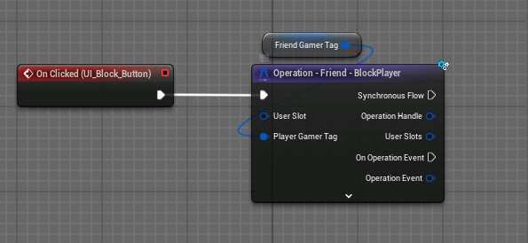

### Block/unblock player event

There are two events related to blocking players: one for the player who initiates the block and one for the player who is blocked. The first event, `OnPlayerBlocked`, is triggered only for the player who blocks another player. The blocked player does not receive this event, as it is typically not necessary to handle the blocked player in this case. Instead, the blocked player will receive the second event, `OnPlayerBeenBlocked`.

|Bind to player blocked |Bind to player been blocked|
|:-:|:-:|
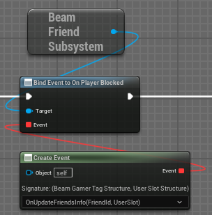 | 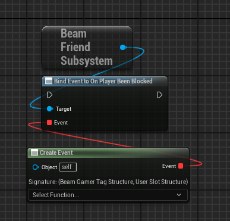

???+ Warning "Removed Friend Event"
    The removed friend event will be triggered in both players if they were friends before.

For the unblock flow is very similar to the block, so there's a `OnPlayerUnblocked` event and a `OnPlayerBeenUnblocked`.

### Presence status update event

 For you to use the status presence as the common behavior of showing if your friend is online or offline we recommend to register in the `OnPresenceStatusUpdate` and handle the updates in the player status from this.

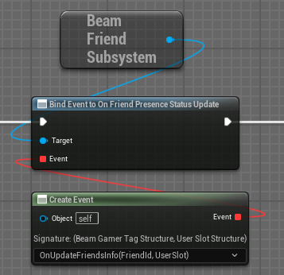

## How to remove a friend

1. Open your Level Blueprint (or some other BP)
2. Call the `Operation - Friend - RemoveFriend`. This will allow you to create a asynchronos chain to the after remove a friend.

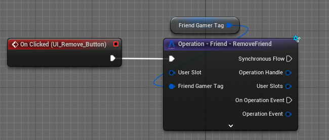

### Remove friend event

When a player is removed from the friend list it will triggers this notification. You will be able to register on this to treat the behavior in your game.

The event that will be trigger is the `OnFriendRemoved`. When it triggers, the local state of the friend list will already been updated.

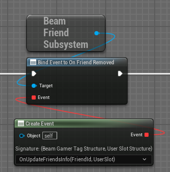

## How To Use The System State To Update The View (Invite Example)

In the example below, we demonstrate how to retrieve the user's friend state and use it to update a view or another screen. In this case, the example simply sets a list of all invites in the friend state. There are other ways to handle this, such as adding or removing items based on events, rather than setting the entire list. For simplicity, we're showing this approach.

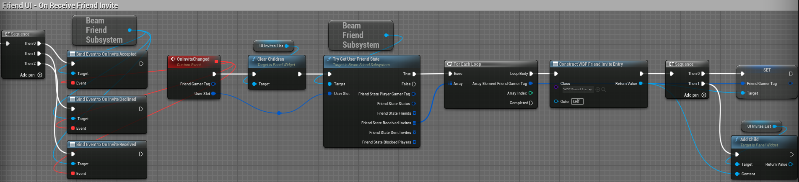

# Conclusion

This is a brief document that describes the basic usage of the Friend Subsystem, once you implement those features consider to test with multiple users or adding more complex interactions.