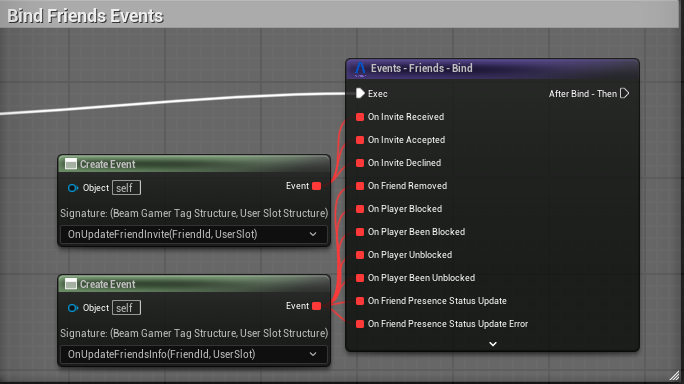
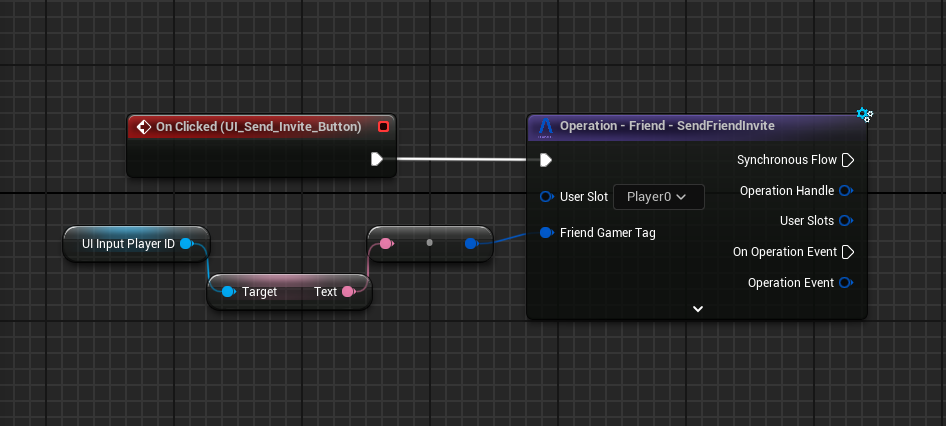
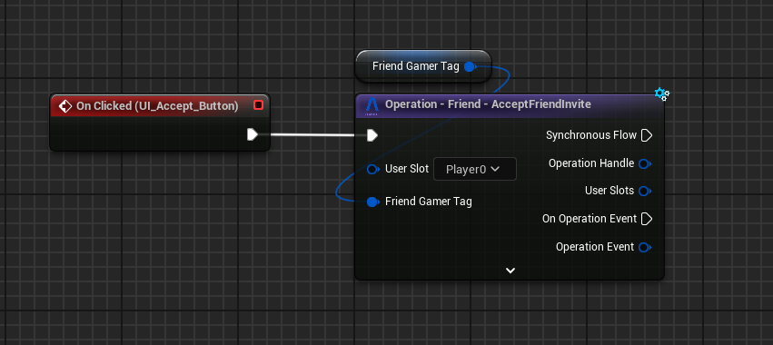
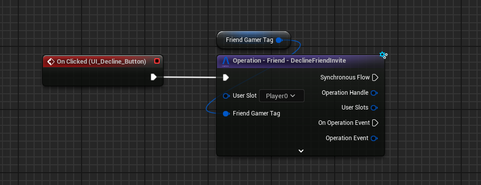
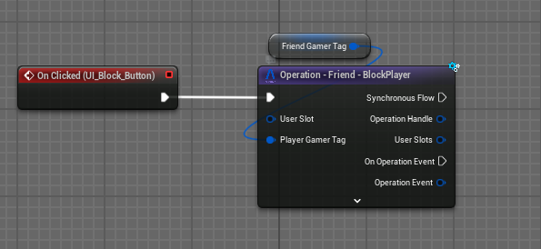
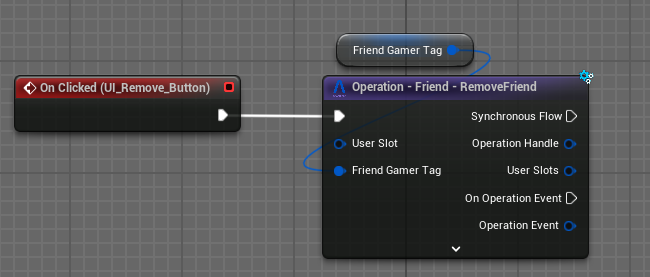
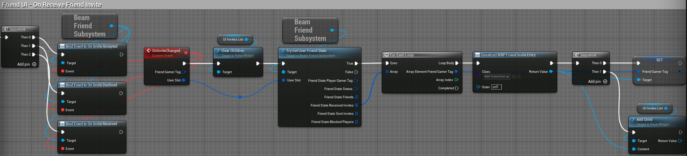

# Friends

The Beamable **Friends** service allows game makers to connect players with each other and manage the status of new friends.

Beamable's Friend system allows the following game flows:

 - Send friend invites to other players
 - Accept/Decline invites received from other players
 - Block/Unblock other players
 - Check the status of the player (Online, offline)
 - Remove the player from the friend list

There is support for both local and multiplayer usage. This document focuses on multiplayer, as it is the most common use case.

A sample that demonstrates the friend subsystem is available in the [GitHub repository](https://github.com/beamable/UnrealSDK). For more details, check out the [Beamball Demo](../../samples/beamball/beamball-demo.md).

## Getting started
To use the friend system, first configure an Unreal PIE session with multiple players.

???+ Warning "Observation"
    The friend subsystem lets you use the friend system for local players with multiple accounts. Set up the `UserSlot` for each player as shown here.

Once your environment is set up, the following steps show how to implement the basic functionalities in BP.

### Binding the friends events
In the SDK, all events can be bound using the custom bind node on the subsystem. The image below shows an example.

 

### Inviting a friend

1. Open your Level Blueprint (or some other BP)
2. Call `Operation - Friend - SendFriendInvite` to send a friend invite asynchronously

You can listen for received invite changes — for example, alerting the player that a new invite arrived. You will need to bind to the event `OnInviteReceived` shown in the [How to Bind the Friends Events](#how-to-bind-the-friends-events).

### Accepting a friend invite

1. Open your Level Blueprint (or some other BP)
2. Call `Operation - Friend - AcceptFriendInvite` to accept a friend invite asynchronously

When the player that received the invite accepts it, both receive the invite accepted event, it could be used for updates in the invite list or to start to show the new friend in the friend list.

To bind to this event you can use the `OnInviteAccepted` as shown in the section above [How to Bind the Friends Events](#how-to-bind-the-friends-events).

???+ Warning "Local Player Feedback"
    Once the player accepts the invite, if you prefer not to wait for the backend notification to update the friend list, you can directly use the operation for the player who accepted and update the local state either synchronously or asynchronously.

### Declining a friend invite

1. Open your Level Blueprint (or some other BP)
2. Call `Operation - Friend - DeclineFriendInvite` to decline a friend invite asynchronously

When the player that received the invite decline it, both receive the `OnInviteDeclined` notification, that can help to update the visuals and the player list. The local state is already updated when the player receive this notification. As shown in the section above [How to Bind the Friends Events](#how-to-bind-the-friends-events).

### Blocking and unblocking a player

1. Open your Level Blueprint (or some other BP)
2. Call the `Operation - Friend - BlockPlayer`/`Operation - Friend - Unblock`. This will allow you to block/unblock a player using the gamer tag of this player

???+ Warning "Observations"
    - You can block any player — friend or not
    - **Blocked players can not be friends**
    - If you are already friends with a player and block them, the friendship is removed automatically
    - If you block a friend and then unblock them, this does not restore the friendship — a new friend invite is required

There are two events related to blocking players: one for the player who initiates the block and one for the player who is blocked. The first event, `OnPlayerBlocked`, is triggered only for the player who blocks another player. The blocked player does not receive this event, as it is typically not necessary to handle the blocked player in this case. Instead, the blocked player will receive the second event, `OnPlayerBeenBlocked`. As shown in the section above [How to Bind the Friends Events](#how-to-bind-the-friends-events).

???+ Warning "Removed Friend Event"
    The removed friend event will be triggered in both players if they were friends before.

The unblock flow is very similar: `UBeamFriendsSubsystem` provides `OnPlayerUnblocked` (fires for the player who initiates the unblock) and `OnPlayerBeenUnblocked` (fires for the player who was unblocked).

To show a friend's presence status, register on `OnFriendPresenceStatusUpdate`; the status is an `EBeamPresenceStatus` value — `Visible`, `Invisible`, `Dnd`, or `Away`. As shown in the section above [How to Bind the Friends Events](#how-to-bind-the-friends-events).

### Removing a friend

1. Open your Level Blueprint (or some other BP)
2. Call `Operation - Friend - RemoveFriend` to remove a friend asynchronously

When a player is removed from the friend list it will trigger this notification. You will be able to register on this to treat the behavior in your game.

The event triggered is `OnFriendRemoved`. As shown in the section above [How to Bind the Friends Events](#how-to-bind-the-friends-events).
When it triggers, the local state of the friend list will already have been updated.

### How to update the view using system state (invite sample)

The example below shows how to retrieve the user's friend state and use it to update a view or another screen. For simplicity, the example sets a list of all invites in the friend state; alternatives include adding or removing items based on events rather than setting the entire list.

## Conclusion

This document describes the basic usage of the Friend Subsystem, once you implement those features, consider testing with multiple users or adding more complex interactions.
