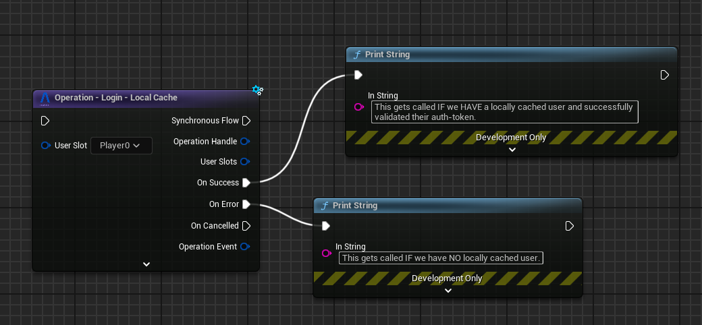
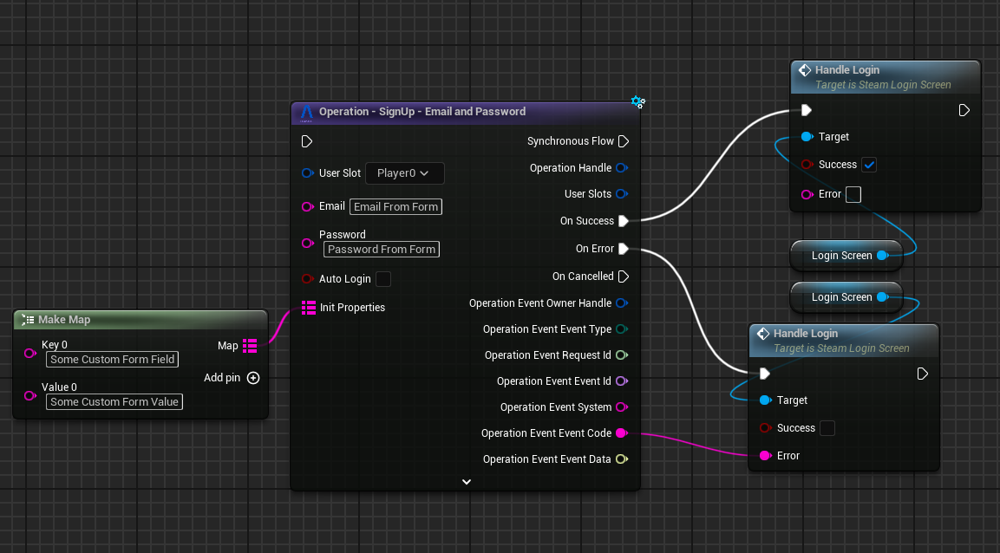
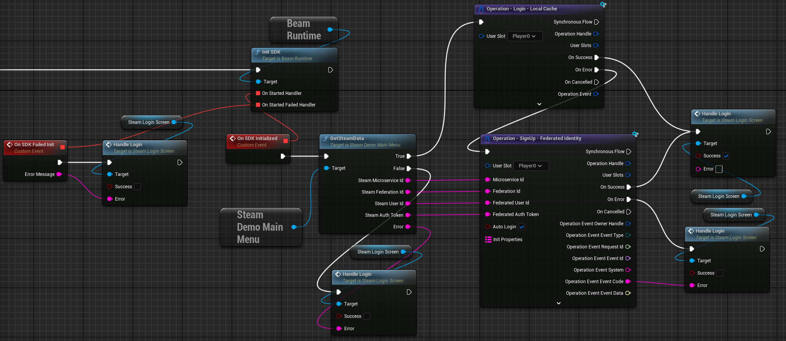

# Identity

Identity in Beamable provides authentication and account management functionality for your game. Through the Identity
system, players can create accounts, sign in, and manage their credentials across different platforms and devices.

The Beamable SDK includes a comprehensive set of pre-implemented operations that handle common authentication scenarios:

- Guest account creation and management
- Email/password authentication
- Third-party platform integration (Steam, Epic, Discord, Web3 Wallets etc...)
  - With Support for implementing Multi-Factor Auth
- Account merging and credential attachment

These operations are designed to be easily integrated into your game's login and signup flows while maintaining security
best practices.

## Login Semantics

Logging in with the Unreal SDK means:

> Authenticate the user, fetch all relevant data from the backend into the `UBeamRuntimeSubsystem`'s in-memory state and complete the operation.

This is handled automatically by the `Login` operations and `UBeamRuntimeSubsystem` implementations. You can see an overview about how this all works [here](../overview.md). But the short version is: "After calling `Login` operations, your local state is ready for use."

Here's a simple example using `Login - Frictionless` Operation from one of our samples:

As you can see, in the success handling of the operation, we simply tell our UI to go update itself. While not shown in this image, that UI can then use our [`Local State - Stats`](stats.md) and [`Local State - Inventory`](inventory.md) nodes to read the player's stats and inventory to render itself.

!!! note "Customizing the Login Flow"
	If you want to add calls to Microservices to be made as part of the login flow (such that every time your game opens you make those calls), you can see how you can implement your own [`UBeamRuntimeSubsystem`](../runtime-systems/lower-level.md) and call your custom Microservice from there.

This approach, coupled with [Federated Player Initialization](../federation/federated-player-init.md) greatly simplifies how you can design your game's boot up flow and UI implementations.

The following sections explain how to leverage our SDK to implement common authentication flows for different games and platforms.

## "Mobile Games" Style Authentication
Mobile games often want to create a **Guest Account** for the player so they can start playing quickly and later decide if they want to `Attach` one or more permanent identities to that guest account.

The SDK supports this flow via the `Login - Frictionless` operation.
If an account is already locally cached at that `FUserSlot`, we'll login to that one automatically without making a request to Beamable.

**Guest Accounts are lost if signed out (or have its locally cached data lost for any reason)**. To avoid that, players can "attach" some persistent identity information to that guest account via `Operation - Attach` nodes.

Attaching an identity can succeed or fail:

- After a successful `Attach` call, a player will be able to log in via the corresponding `Login` operation. 
    - For example, if you `Attach - EmailAndPassword` you'll be able to `Login - EmailAndPassword` to sign back into the account.
- If it fails with an `_IN_USE` error code, it means that the identity is already in use. Handling of this is game specific, but most games will either:
    - Call the `Login` operation and log in with the in-use identity, discarding the guest account. This is the most common way to handle this.
    - Detect progress on the guest account and, if above a particular threshold, leverage microservices to try and do some progress merging should the user want it. This is non-trivial and not a lot of games do it since cost-benefit isn't there in most cases (but it is _possible_).

You can check out our [Discord sample](../../samples/discord-demo.md) for an example of this flow.

## "PC/Console" Style Authentication
In PC/Console titles, often the user can sign-in and up from inside the game. That can happen either through an active form-filling process, an active request to third-party authentication (Discord, Google, etc...) or an automatic platform-based login (Epic Online Services, PSN, Steam, etc...).

In all of these cases, you usually want to keep the user signed into the machine after the login once (without having to go through the process of re-authenticating them every time).

For that, we provide a `Login - Local Cache`.

### Local Cache + Email/Password Form
Some games might have builds distributed outside of common platforms and instead might want to ask users to sign-up via Email/Password.

In these cases and builds, you'll want to:

- Call `Login - Local Cache` so we first try to login as the locally cached user in that slot.
- Call `Sign Up - Email And Password` with `bAutoLogin` as true.
    - You can optionally make use of a properly configured Microservice with [Federated Player Initialization](../federation/federated-player-init.md) and the `InitProperties` in the `SignUp` node to pass in additional data to influence initial player state.

Here's what you would do once the user confirms the form:

If your login/signup flows are the same (which is sometimes useful in early development), you can leverage the `Auto Login` option in this node. It'll create the account with email/password if it doesn't exist and, if it already does, it'll try to log into that account with the provided password.

### Local Cache + Platform-specific
Beamable has a different approach for supporting 3rd-Party Platforms such as Steam. Instead of us trying to maintain a small subset of ALL existing 3rd-Party Platforms, we leverage our [Microservice Federation](../federation/federation.md) capabilities to allow you to implement whichever Platform-specific features you need for your game.

Platform login flows are usually very simple. You can see that in our working [Steam Demo](../../samples/steam-demo.md).

In builds for specific stores and platforms, what you'll want to do is:

- Call `Login - Local Cache` so we first try to login as the locally cached user in that slot.
- Call `Sign Up - Federated Identity` with `bAutoLogin` as true and a properly configured Microservice with [Federated Login](../federation/federated-login.md).
- Both the success of the `Login - Local Cache` as well as the `Sign Up - Federated Identity` calls mean you have logged in successfully.

Here's how that looks like in the client side:

Each different platform (Steam, EOS, PSN, etc...) requires a different Microservice implementation. At the moment, we only have a sample for Steam --- but we plan to add samples for all major platforms (Steam, EOS, Console and Mobile platforms) as time passes and the SDK evolves to support each target.

!!! note "Why do platform integrations this way?"
	The problem with Beamable supporting each platform directly in the SDK is that it ties Beamable SDK versions to each individual platform's SDK versions. This denies game-makers the ability to independently select the feature-set they want to support from each individual platform.
    
    It also causes breaking changes from these platforms to sometimes force the Beamable SDK to propagate them out. This creates scenarios where a game-maker wanting a new Beamable feature might need to update their Platform's SDK version even if they won't take advantage of the new Platform's SDK.

    The advantages of the Federation approach is that the game-maker retains control of how they want to interact with the feature-set of each platform and gives them better control of upgrade timings.

## Identity in Dedicated Servers
Dedicated Servers use a different authentication model ([realtime multiplayer](../realtime-multiplayer/realtime-multiplayer-overview.md)) that is not `UserSlot`-based.

As such, none of these flows run in Dedicated Servers.