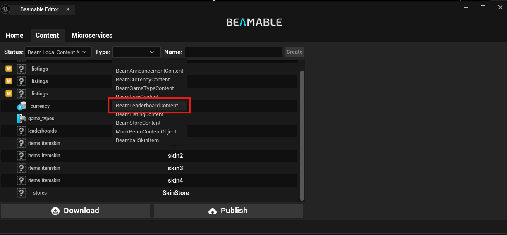
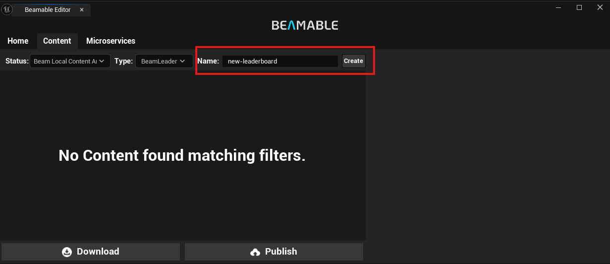
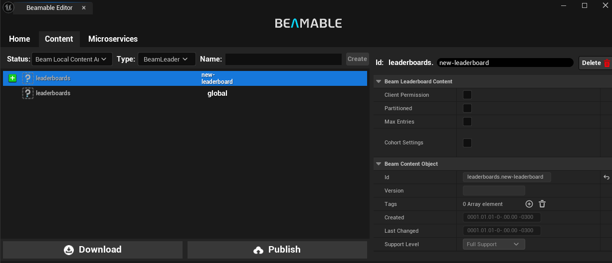
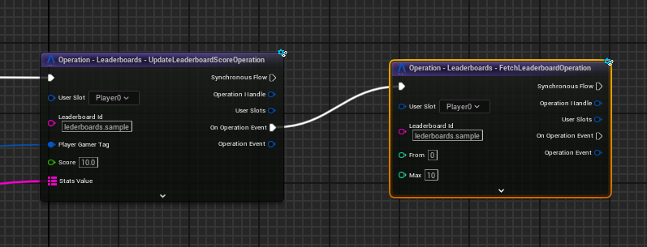
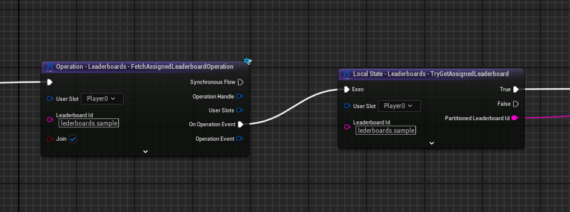
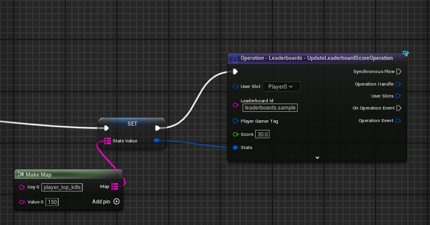
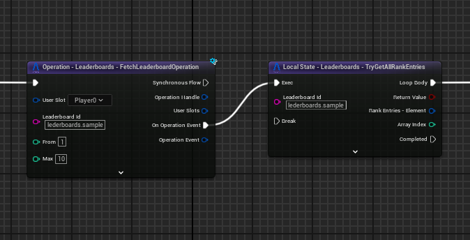
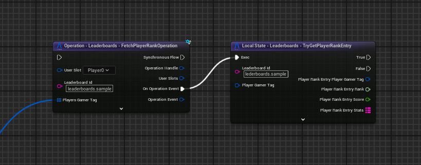
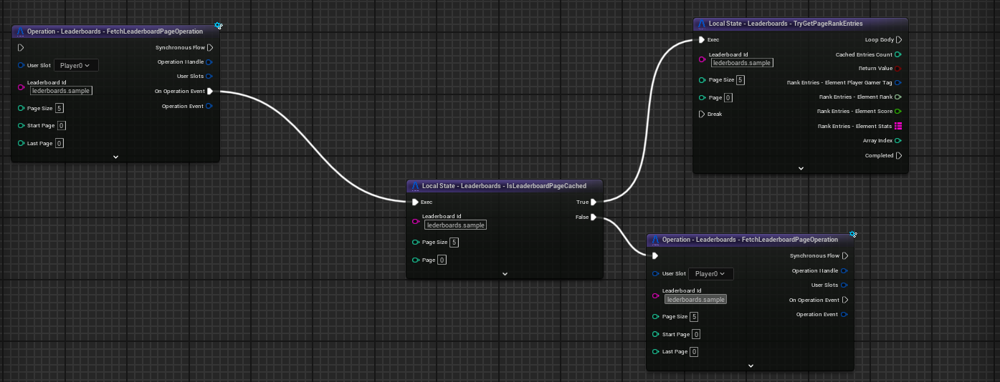

# Leaderboards

The Beamable **Leaderboards** allow the game makers to track player scores in social rankings which are "global" (with hundreds of millions players) or "segmented" (in smaller groups). It supports:

 - Assign a player to a specific leaderboard.
 - Retrieve entries from specific ranges in the leaderboard.
 - Leaderboard pagination.
 - Retrieve a specific player rank.
 - Retrieve the friends ranks. 

# Getting Started

In order to have a good overview for leaderboards we will present some common use cases and how to fully implement it. 

## Creating the Leaderboards

There's two ways to create a new leaderboard, using the portal or as a content.

!!! note "Type of leaderboard"
	If you created the leaderboard in the content, it will appears in the portal as expected. But if you create the leaderboard directly in the portal, it WON'T appear in the content.

### Creating via Content

In order to create a content of leaderboard type, first you will need to open the **Beamable Window** in the top right and select the **Content** tab.

Then select the leaderboard content type as shown in the image below.

After select the leaderboard content type, you will type the name of the leaderboard using the input field.

You will be able to see the leaderboard as a new content in the content list. That means that was created with success, but it still need to be published.

Before publish it there's some configurations that can change the way your leaderboard works.

 - **Client Permission**: Allow the clients to update they score in the leaderboard. **OBS: This will be possible vunerability in your game**  
 - **Partioned**: Determines whether this leaderboard automatically partitions into smaller leaderboards.
 - **Max Entries**: Determines the maximum number of entries in a given leaderboard partition.
 - **Cohort Settings**: Specifies criteria for grouping players together.

## Assign Player to Leaderbord

There are two ways to assign a player to a leaderboard:

 - Set a Score Directly: Simply submit a score for the player on the desired leaderboard. This automatically associates the player with that leaderboard.

 - Use FetchAssignedLeaderboardOperation with Join = true: This operation is particularly useful for partitioned leaderboards. By passing the base leaderboard ID, this operation returns the specific partitioned leaderboard ID (e.g., "leaderboards.my_partitioned_board" becomes "leaderboards.my_partitioned_board#0").

!!! warning "If you assign a player without a score"
	If you assign a player without a score, it will be the first of the empty scores. So for example if you have 3 players, the first one with 10 of score the second one with 0 and the third one with 0, when you assign a new player to this leaderboard the new player will take the second place. 
	Basically the priority is same score, last assigned.

!!! note "Non Partitioned Leaderboard"
	If you use this operation on a non-partitioned leaderboard, it will simply return the original leaderboard ID without any partition suffix.

# Entries modify

It is possible to modify meta-data and score for leaderboard entries. But it is more flexible in the microservice side, if you are using an client authoritative leaderboard won't be change other entry besides the authenticated player.

## Add Score to a Player

Here is a example about how to add score in the client for authoritative client. 

### Score Stats

The Stats in the leaderboard are mostly usage for keep cached a per entry information that prevent multiple requests to the API. It's only possible to set the stats when you are updating the score, here is a example about how to set the stats in the leaderboard.

# Uses Cases

## Fetch Top 10 Players

With our SDK it is possible to create leaderboards like in [Brawl Stars](https://supercell.com/en/games/brawlstars/) 

## Show the Player Rank

Using the blue print shown above it's possible to get the playe rank and show it as separetally entry. 

## Leaderboard Pagination

The blueprint shown above is a part of how to have pagination in your leaderboards.

