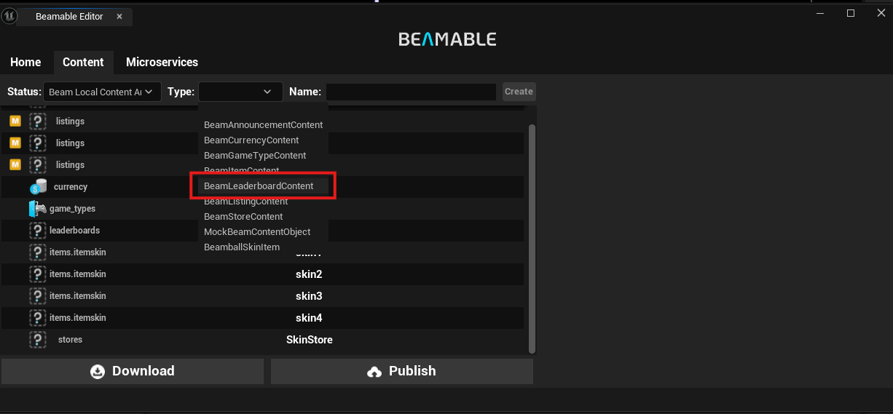
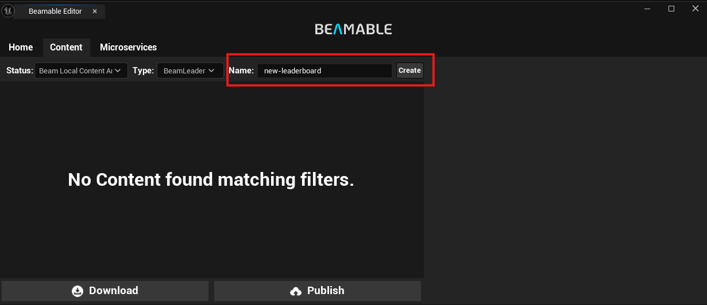
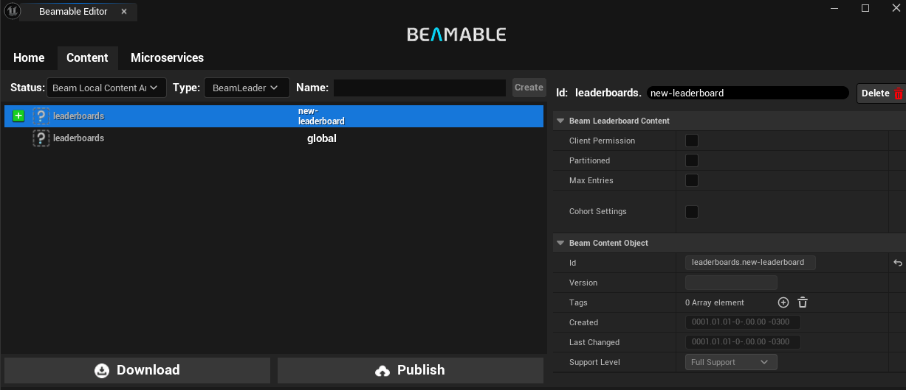
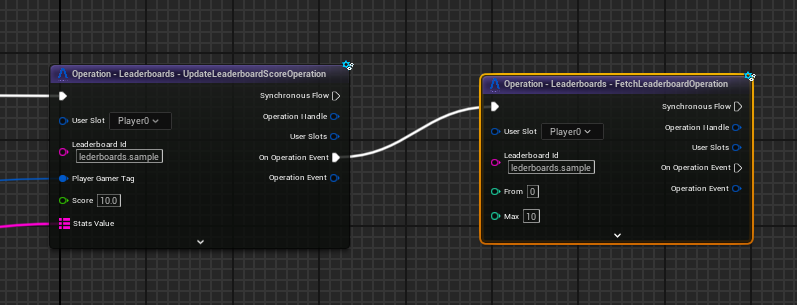
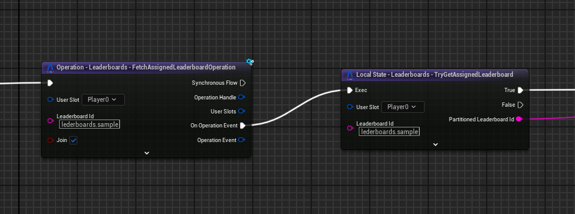
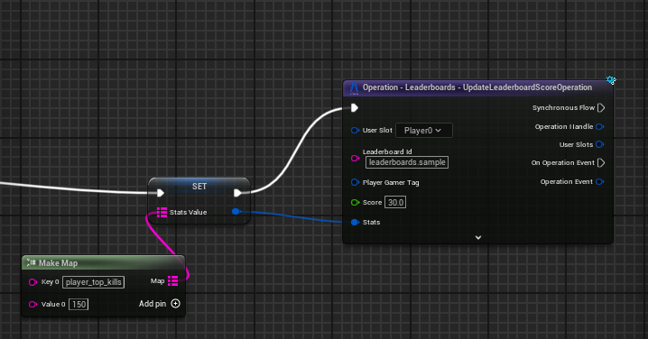
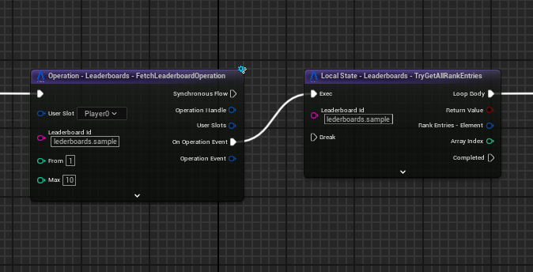
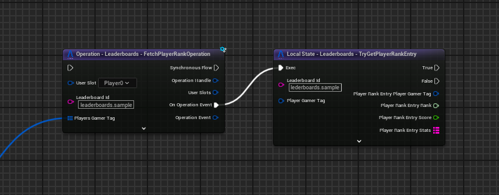

# Leaderboards

The Beamable **Leaderboards** allow the game makers to track player scores in social rankings which are "global" (with hundreds of millions of players) or "segmented" (in smaller groups). It supports:

 - Assign a player to a specific leaderboard
 - Retrieve entries from specific ranges in the leaderboard
 - Leaderboard pagination
 - Retrieve a specific player rank
 - Retrieve the friends ranks

## Getting started

This section covers common leaderboard use cases and how to implement them.

### Creating the leaderboards

There are two ways to create a new leaderboard, using the Portal or as a content.

!!! note "Type of leaderboard"
	If you created the leaderboard in the content, it will appear in the Portal as expected. But if you create the leaderboard directly in the Portal, it Will not appear in the content.

#### Creating via content

To create leaderboard content, open the **Beamable Window** in the top right and select the **Content** tab.

Then select the leaderboard content type as shown in the image below.

After selecting the leaderboard content type, type the name of the leaderboard in the input field.

You will be able to see the leaderboard as a new content in the content list. That means it was created successfully, but it still needs to be published.

Before publishing, there are some configurations that can affect how your leaderboard works.

 - **Client Permission**: Allow the clients to update their score in the leaderboard. **Warning:** This is a potential vulnerability in your game
 - **Partitioned**: Determines whether this leaderboard automatically partitions into smaller leaderboards
 - **Max Entries**: Determines the maximum number of entries in a given leaderboard partition
 - **Cohort Settings**: Specifies criteria for grouping players together

### Assigning a player to a leaderboard

There are two ways to assign a player to a leaderboard:

 - Set a Score Directly: Submit a score for the player on the desired leaderboard. This automatically associates the player with that leaderboard

 - Use `FetchAssignedLeaderboardOperation` with `Join` = `true`: This operation is particularly useful for partitioned leaderboards. By passing the base leaderboard ID, this operation returns the specific partitioned leaderboard ID (e.g., "leaderboards.my_partitioned_board" becomes "leaderboards.my_partitioned_board#0")

!!! warning "If you assign a player without a score"
	If you assign a player without a score, it will be the first of the empty scores. So for example if you have 3 players, the first one with 10 of score the second one with 0 and the third one with 0, when you assign a new player to this leaderboard the new player will take the second place.
	The priority is same score, last assigned.

!!! note "Non Partitioned Leaderboard"
	If you use this operation on a non-partitioned leaderboard, it returns the original leaderboard ID without any partition suffix.

## Modifying entries

You can modify metadata and scores for leaderboard entries. On the microservice side, this is more flexible — a client-authoritative leaderboard cannot change entries other than the authenticated player's.

### Adding score to a player

Here is an example of how to add a score for a client-authoritative client.

Stats in the leaderboard are primarily used to cache per-entry information, reducing API requests. You can only set stats when updating the score; here is an example.

## Leaderboard samples

### Fetch top 10 players

With the SDK, you can create leaderboards similar to those in [Brawl Stars](https://supercell.com/en/games/brawlstars/)

### Show the player rank

Using the Blueprint shown above, you can get the player rank and display it separately

### Leaderboard pagination

The blueprint shown above is a part of how to have pagination in your leaderboards.

