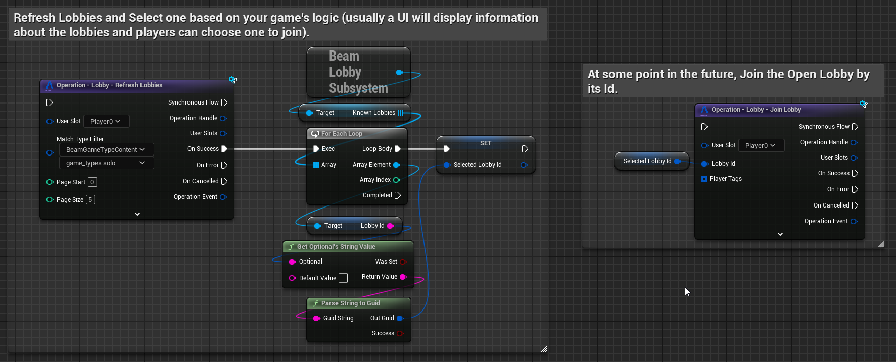
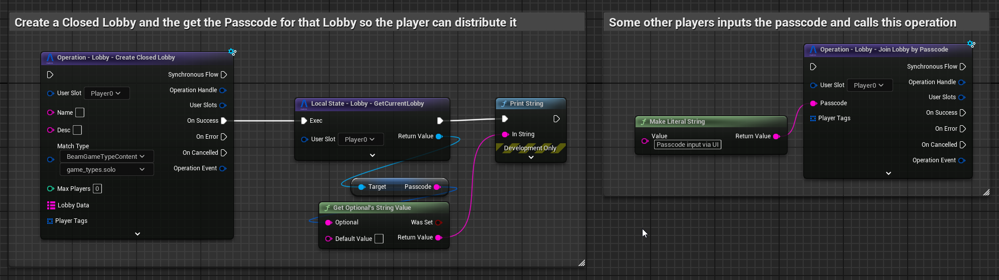
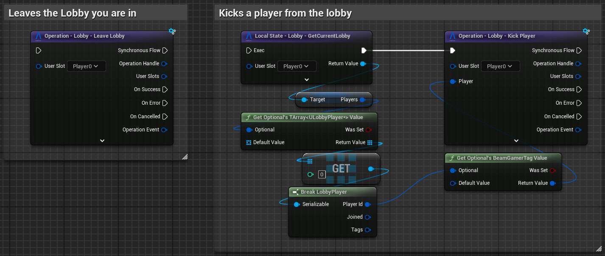
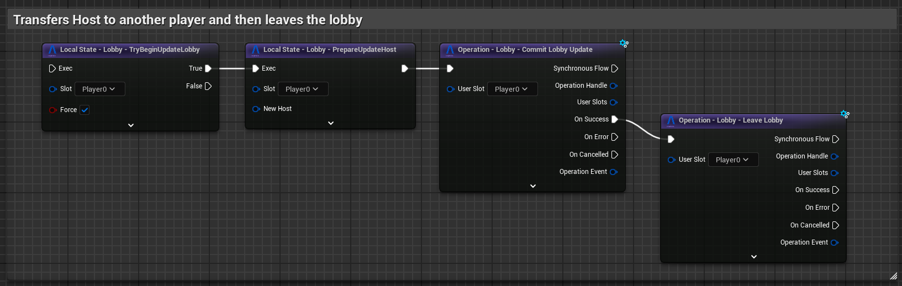
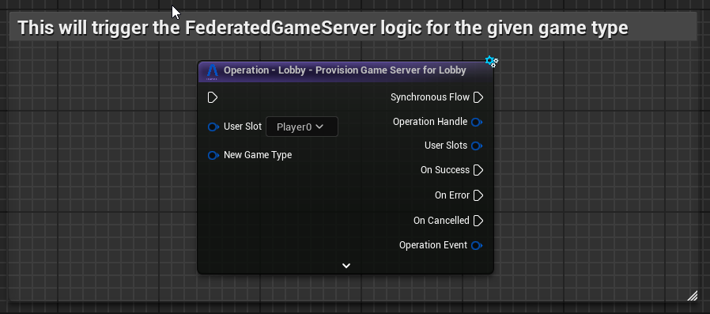
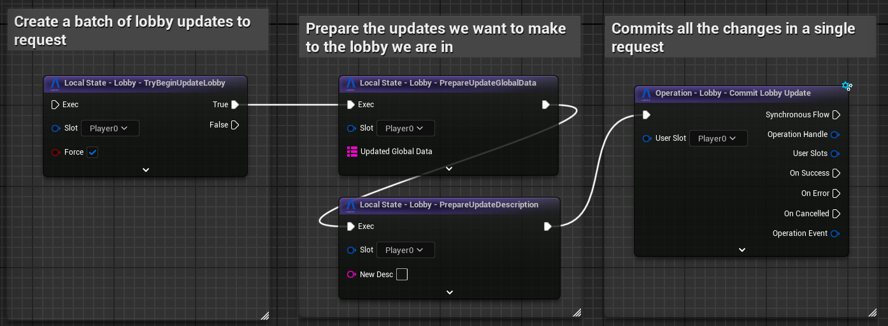
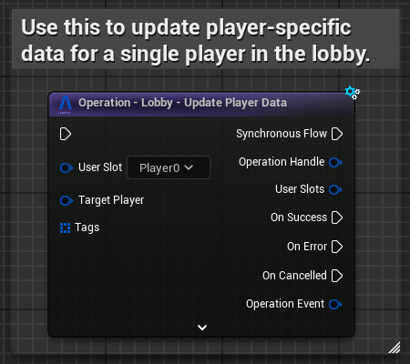
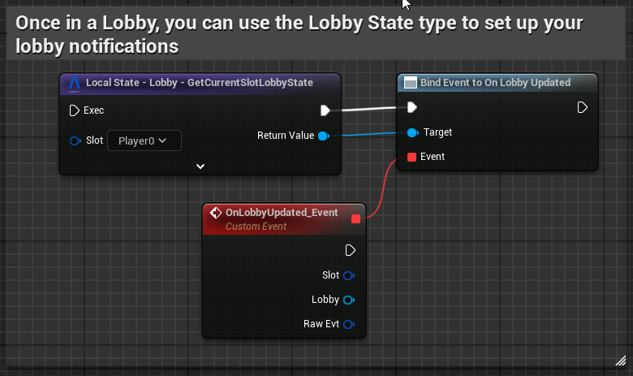

# Lobbies

Beamable's Lobby system can be used primarily for 2 cases:

- **Open/Closed Custom Lobbies/Rooms**: Player-created custom rooms for room-based games.
- **Resulting Matchmaking Matches**: Matchmaking queues output lobbies with players in them at each matchmaking queue. See more in [Matchmaking](matchmaking.md).

Lobbies are rooms containing only [online players](../runtime-systems/connectivity.md) and a set of arbitrary room properties and per-player properties. There are a few rules you should be aware of:

- Each Non-Matchmaking Lobby has a **Host** and other Players.
	- Matchmaking Result Lobbies have no host; instead they disband once every player in it becomes offline.
- The Host Player...
    - ...becoming offline will disband a lobby (after a small delay).
    - ...can edit global properties and any other player's properties.
    - ...can kick other players.
- Other Players...
  	- ...can **read** the entire lobby data but only **write** to their own state.
    - ...can leave the lobby.  
- Becoming offline will remove you from the lobby (after a small delay).

## Getting Started - Open/Closed Lobbies
This section describes how to set up and join manually created lobbies. Lobbies created via [Matchmaking](matchmaking.md) don't need this setup.

### Creating Lobbies

Use the `Lobby - Create Open Lobby` operation to create an **_Open Lobby_**. This Lobby will be visible to all players in the realm. You can use the `Lobby - Refresh Lobbies` operation to fetch filtered paged lists of Open lobbies in a realm.

Use the `Lobby - Create Closed Lobby` operation to create a **_Closed Lobby_**. This Lobby is NOT visible to all players in the realm and can only be joined via its **Passcode**.

When in a [Party](parties.md), only the party leader is allowed to join a Lobby. Doing so will also bring all other party members into the Lobby with them. If the Lobby **MaxPlayer** count would be surpassed by the entire party joining, nobody can join.

### Leaving and Kicking Users
Once in a Lobby, any player can leave it by using the `Lobby - Leave Lobby` operation. By default, whenever a host leaves the lobby, Beamable will disband the lobby and notify all players in it. The Lobby's Host also has the ability to kick players via the `Lobby - Kick Player` operation.

In some games, you might want to make your host transfer ownership of the lobby before leaving. To do that, you can update the Lobby's host before leaving.

### Dedicated Servers
For dedicated server games, you can use the `Lobby - Provision Game Server for Lobby` operation to trigger a [Game Server Federation](../federation/federated-game-server.md) to boot up a server instance for the game. If you need to differentiate between matchmaking lobbies and Open/Closed lobbies, you can verify whether or not the lobby has a host within the federation's logic to properly handle when and which game server to provision. 

## Getting Started - Reading and Writing to Lobbies
For both Matchmaking lobbies and Open/Closed lobbies, we need APIs to read/write to lobby data that is synchronized between all players in the lobby.

Updating the Lobby's `Global Data` and any of its configurations can only be done by the Lobby's host (or a server in case of Matchmaking lobbies).

Updating individual player data in the lobby can be done by the Host (for any player). Non-Host players can only update their own properties but read ALL player's properties.  

### Synchronizing Across Clients
Beamable's Lobby system will automatically notify every player inside a lobby of relevant events. Once you're in a lobby, the SDK keeps track of your local state inside `UBeamLobbyState` (one per-`UserSlot`).

You can use `GetCurrentSlotLobbyState` to get the `UBeamLobbyState` and setup various **Delegates** in this object to respond the these events, normally updating your UI or custom system built on top of this subsystem.

Here's the list of events we expose:

- **OnKickedFromLobby**: Received whenever a host removes a player from the lobby via `KickPlayerOperation`.
	- Every player in the lobby receives this notification, including the host.
- **OnLeftLobby**: Received whenever a player leaves the lobby via `LeaveLobbyOperation`.
	- Every remaining player in the lobby receives this notification.
- **OnLobbyDisbanded**: Received whenever the host player leaves.
	- Every remaining player in the lobby receives this notification. The host does not receive it.
- **OnLobbyUpdate**: Whenever any property of the lobby changes via `CommitLobbyUpdateOperation`, `UpdatePlayerDataOperation` and `UpdateSlotPlayerDataOperation`, this will be invoked.

## On Lobby Types and Lobby Schema
There are two types of lobbies: **Open** and **Closed** lobbies. **Open** lobbies can be queried via `RefreshLobbies` and joined without the use of any passcode. **Closed** lobbies are not visible to `RefreshLobbies` and expect to be joined via the generated passcode.

Both lobby types have the same schema and are represented by the `ULobby` class. This class has several properties:

- **LobbyId**: The unique identifier for the Lobby.
- **MatchType**: Contains information about the `UBeamGameTypeContent` that is associated with the lobby.
- **Name** and **Description**: Are arbitrarily defined when the lobby is created.
	- For matchmaking, these are empty.
- **Host**: The host player's `FBeamGamerTag`. 
	- For matchmaking result lobbies, there is no host. // Federation thing: Make a section here explaining LoL-style matchmaking where player properties change after the match is made but BEFORE the server is provisioned.
- **Restriction**: Defines whether the lobby is **Open** or **Closed**.
	- Can be changed --- whenever it is changed to **Closed**, a new **Passcode** is generated.
- **Passcode**: An auto-generated realm-scoped unique value that can be use to `JoinLobbyByPasscode`.
	- This is filled on-creation and the passcode length has a minimum of 6.
- **MaxPlayers**: Defines the maximum amount of players that can be in this lobby at the same time.
	- When changing this via `CommitLobbyUpdateOperation`, if you have more players than the new **MaxPlayer** value, you'll get an error.
- **Players**: A list of `ULobbyPlayer` containing data associated to each player in the lobby.
	- **PlayerId**: The player's `FBeamGamerTag`.
	- **Joined**: A ISO-8601 Date Time string for when the player.
	- **Tags**: An array of Key-Value pairs (allows duplicates).
- **Data**: An arbitrary data store that can be filled and updated by the host of the lobby.
	- Can be filled via [Federations](../federation/federated-game-server.md) as well.
- **Created**: A ISO-8601 Date Time string for when the Lobby was created.
