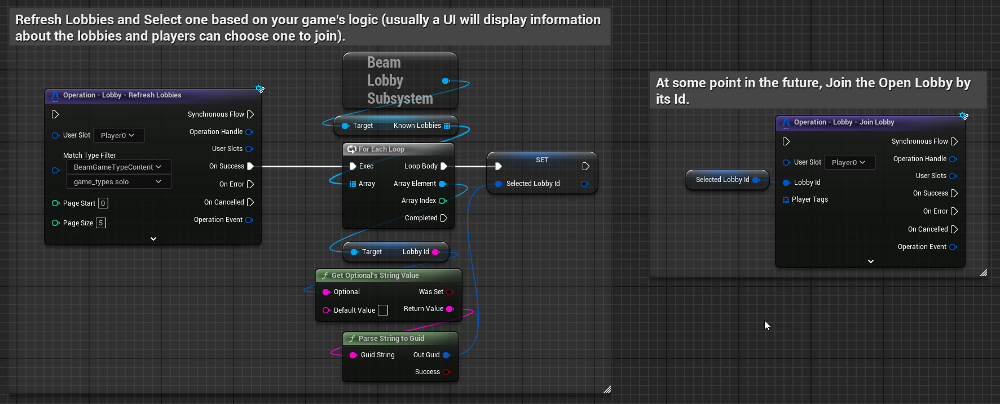
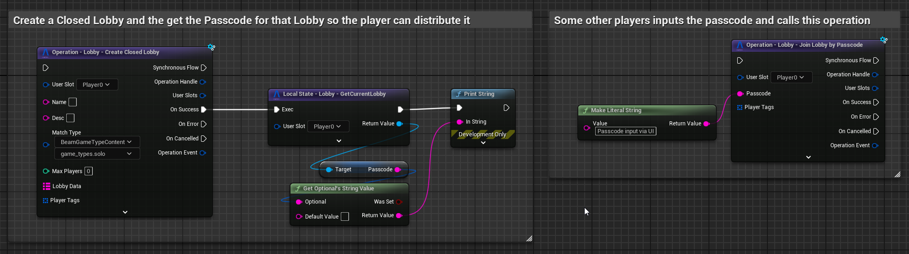
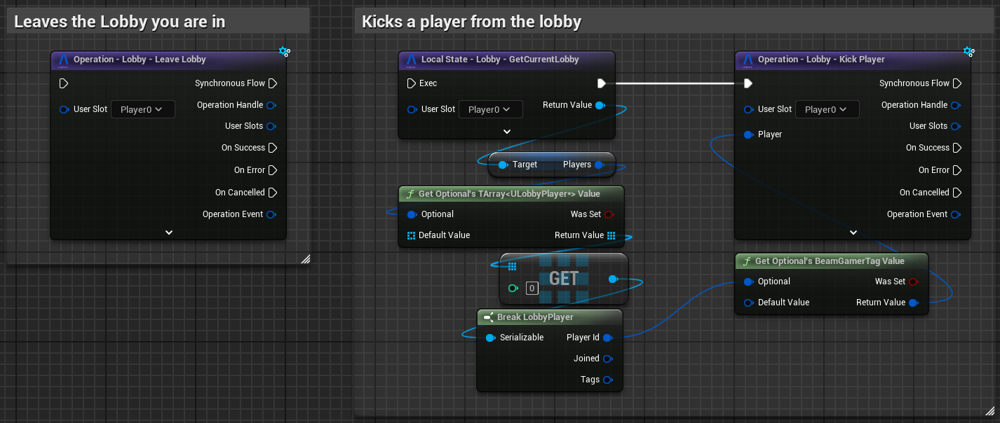
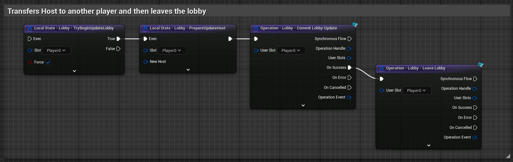
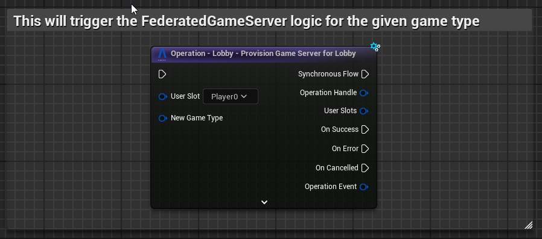
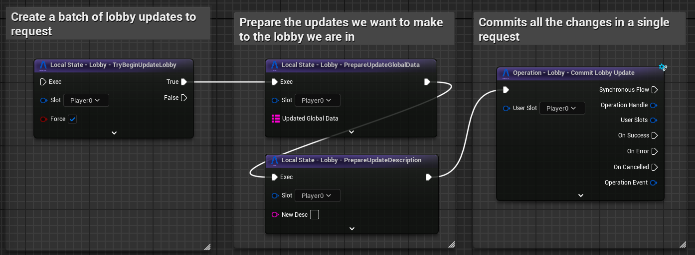
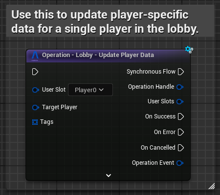
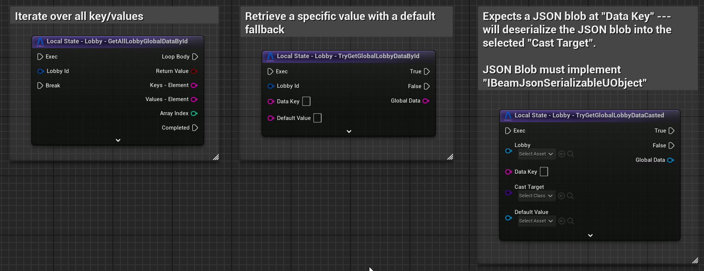
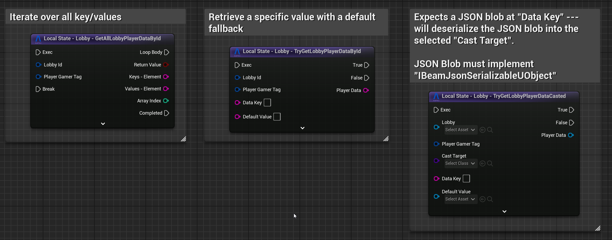
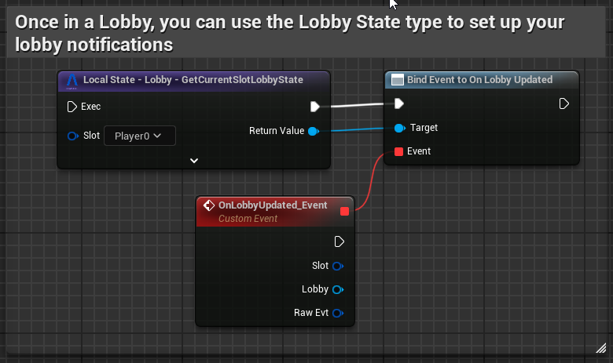

# Lobbies

Beamable's Lobby system can be used primarily for 2 cases:

- **Open/Closed Custom Lobbies/Rooms**: player-created custom rooms for room-based games
- **Resulting Matchmaking Matches**: matchmaking queues output lobbies with players in them at each matchmaking queue. See more in [Matchmaking](matchmaking.md)

Lobbies are rooms containing only [online players](../runtime-systems/connectivity.md), a set of arbitrary room properties, and per-player properties. There are a few rules you should be aware of:

- Each Non-Matchmaking Lobby has a **Host** and other Players
- Matchmaking Result Lobbies have no host; instead they disband once every player in them is offline.   

- **The Host Player**:
    - Becoming offline will disband a lobby (after a small delay)
    - Can edit global properties and any other player's properties
    - Can kick other players.   

- **Other Players**:
  	- Can **read** the entire lobby data but only **write** to their own state
    - Can leave the lobby
	- Will be removed from the lobby after becoming offline (after a small delay)

## Getting started - Open/Closed lobbies
This section describes how to set up and join manually created lobbies. Lobbies created via [Matchmaking](matchmaking.md) don't need this setup.

### Creating lobbies

Use the `Lobby - Create Open Lobby` operation to create an **_Open Lobby_**. This Lobby will be visible to all players in the realm. You can use the `Lobby - Refresh Lobbies` operation to fetch filtered paged lists of Open lobbies in a realm.

Use the `Lobby - Create Closed Lobby` operation to create a **_Closed Lobby_**. This Lobby is NOT visible to all players in the realm and can only be joined via its **Passcode**.

When in a [Party](parties.md), only the party leader is allowed to join a Lobby. Doing so will also bring all other party members into the Lobby with them. If the Lobby **MaxPlayer** count would be surpassed by the entire party joining, nobody can join.

### Leaving and kicking users
Once in a Lobby, any player can leave it by using the `Lobby - Leave Lobby` operation. By default, whenever a host leaves the lobby, Beamable will disband the lobby and notify all players in it. The Lobby's Host also has the ability to kick players via the `Lobby - Kick Player` operation.

Optionally, the host can be forced to transfer ownership before leaving a lobby.

### Dedicated servers
For games with dedicated servers, the `Lobby - Provision Game Server for Lobby` operation triggers [Game Server Federation](../federation/federated-game-server.md) to boot up a server instance for the game. If you need to differentiate between matchmaking lobbies and Open/Closed lobbies, you can verify whether the lobby has a host within the federation's logic to properly handle when and which game server to provision.

## Reading and writing to lobbies
For both Matchmaking lobbies and Open/Closed lobbies, the SDK exposes APIs to read/write lobby data that is synchronized between all players in the lobby.

Updating the Lobby's `Global Data` and any of its configurations can only be done by the Lobby's host (or a server in case of Matchmaking lobbies).

Updating individual player data in the lobby can be done by the Host (for any player). Non-Host players can only update their own properties but read ALL player's properties.

To read from `GlobalData` you can use any of the following nodes:

To read from a specific player's data, you can use any of these nodes:

## Synchronizing across clients
Beamable's Lobby system will automatically notify every player inside a lobby of relevant events. Once you're in a lobby, the SDK keeps track of your local state inside `UBeamLobbyState` (one per-`UserSlot`).

You can use `GetCurrentSlotLobbyState` to get the `UBeamLobbyState` and setup various **Delegates** in this object to respond to these events, normally updating your UI or custom system built on top of this subsystem.

Here is the list of events the SDK exposes:

- **OnKickedFromLobby**: received whenever a host removes a player from the lobby via `KickPlayerOperation`
	- Every player in the lobby receives this notification, including the host.   

- **OnLeftLobby**: received whenever a player leaves the lobby via `LeaveLobbyOperation`
	- Every remaining player in the lobby receives this notification.  

- **OnLobbyDisbanded**: received whenever the host player leaves
	- Every remaining player in the lobby receives this notification. The host does not receive it.  

- **OnLobbyUpdate**: fires whenever any property of the lobby changes via `CommitLobbyUpdateOperation`, `UpdatePlayerDataOperation`, or `UpdateSlotPlayerDataOperation`

## Lobby types and lobby schema
There are two types of lobbies:

- **Open** lobbies can be queried via `RefreshLobbies` and joined without the use of any passcode
- **Closed** lobbies are not visible to `RefreshLobbies` and expect to be joined via the generated passcode

Both lobby types have the same schema and are represented by the `ULobby` class. This class has several properties:

- **LobbyId**: the unique identifier for the Lobby
- **MatchType**: contains information about the `UBeamGameTypeContent` that is associated with the lobby
- **Name** and **Description**: are arbitrarily defined when the lobby is created. For matchmaking, these are empty
- **Host**: the host player's `FBeamGamerTag`. For matchmaking lobbies, there is no host
- **Restriction**: defines whether the lobby is **Open** or **Closed**
	- Can be changed — whenever it is changed to **Closed**, a new **Passcode** is generated
- **Passcode**: an auto-generated realm-scoped unique value that can be used to `JoinLobbyByPasscode`
	- This is filled on-creation and the passcode length has a minimum of 6 characters
- **MaxPlayers**: defines the maximum amount of players that can be in this lobby at the same time
	- When changing this via `CommitLobbyUpdateOperation`, if you have more players than the new **MaxPlayer** value, you'll get an error
- **Players**: a list of `ULobbyPlayer` containing data associated to each player in the lobby
	- **PlayerId**: the player's `FBeamGamerTag`
	- **Joined**: an ISO 8601 date-time string for when the player joined
	- **Tags**: an array of Key-Value pairs (allows duplicates)
- **Data**: an arbitrary data store that can be filled and updated by the host of the lobby
	- Can be filled via [Federations](../federation/federated-game-server.md) as well
- **Created**: an ISO 8601 date time string for when the Lobby was created

## Utilities for dedicated server games
The Lobby subsystem provides you with utilities that help you integrate Beamable into UE's Gameplay Framework.

- `Local State - Lobby - Open Level`: can be used in Game Clients to connect to a Game Server by extracting connection information (URL and Port) from the Lobby's Global Data
- `Local State - Lobby - Client - Prepare Login Options`: can be used in Game Clients to add Beamable's required parameters to the `FString Options` you pass to UE's default `Open Level` node
- `Local State - Lobby - Get Gamer Tag` and `Local State - Lobby - Get User Slot`: These nodes are meant to map UE constructs, such as `PlayerControllers` and `PlayerState` instances, to Beamable constructs like `GamerTag` and `UserSlots`; see their tooltips for the full mapping
- `Local State - Lobby - Get Lobby Id (by Gamer Tag)`: This returns the LobbyId containing the user of the given `GamerTag`
- `Local State - Lobby - Server - Get Lobby Id From CLArgs`: This is meant to help integrate with Game Server Orchestrators — see the [Real-Time Multiplayer Docs](../realtime-multiplayer/realtime-multiplayer-overview.md) for more information

