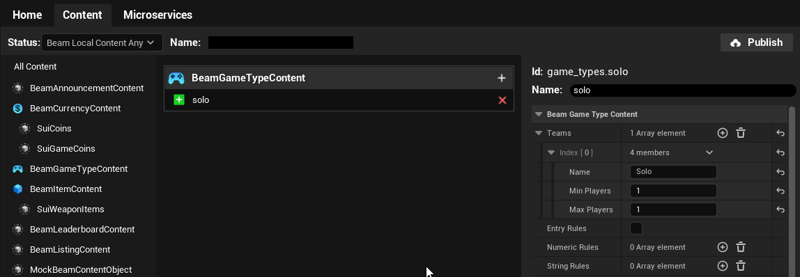
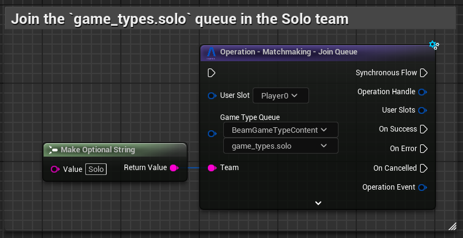
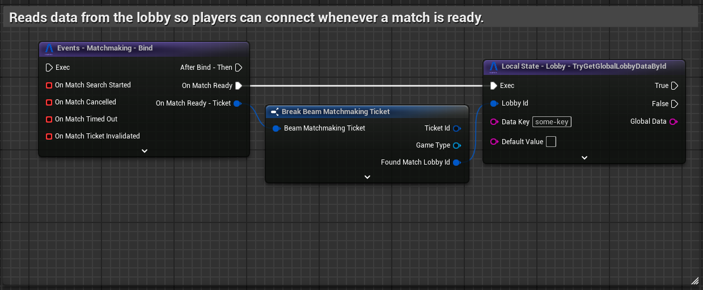
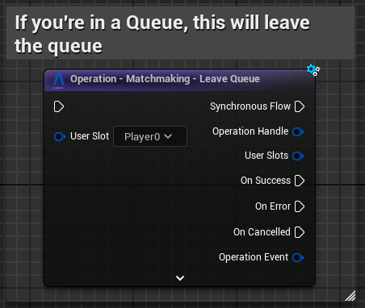

# Matchmaking

Beamable Matchmaking is a flexible system for connecting players together in online games. You can use it to:

- Create and manage matchmaking queues
- Defining match rules and team configurations
- Handling player matching logic based on stats and criteria
- Managing queue state and match found notifications
- Optional integration with game server provisioning

The Beamable SDK Matchmaking feature allows players to join a matchmaking queue (defined by a `UBeamGameTypeContent` instance), configure rules for matches to be made, receive notifications of progress and, optionally, provision a Game Server with a 3rd Party Game Server Orchestrator for the resulting match.

Once a match is found, the result is a [Lobby](../features/lobbies.md) containing all the players in the match that was found. **_If you are working on a dedicated server game, we highly recommend you read_**:

- [Dedicated Servers](../servers-and-builds/dedicated-servers.md)
- [Federated Game Servers](../federation/federated-game-server.md)
- [Hathora](../../samples/hathora-demo.md)

## Getting Started
To use `UBeamMatchmakingSubsystem` via blueprints (or C++), you'll need to:

- Use the [Content Window](content.md) to create a `Beam Game Type Content` with a single team with a Min/Max player count of 1.
- Publish that content to your realm.

### Joining a Queue
To join a queue, use the `Matchmaking - Try Join Queue` operation. It takes in the `created Beam Game Type Content` content you set up. 

### Responding to Match Found Event
Bind to the matchmaking events so you can respond to notifications regarding the queue you are in.
The semantics for each event are:

- `OnMatchSearching`: "I'm in the queue, but wasn't matched yet"
- `OnMatchRemoteSearchStarted`: "My [Party Leader](parties.md) has joined the queue for us"
- `OnMatchTimedOut`: "I was in the queue for too long without a match"
- `OnMatchReady`: "I got matched and my match is ready"
- `OnMatchCancelled`: "I, or my [Party Leader](parties.md), left the queue before the match was found"

### Leaving a Queue 
Use the `Matchmaking - Try Leave Queue` Operation to leave the queue in which you are. When using this, keep in mind that the ticket is only invalidated *after* the operation succeeds.

## Matchmaking Queues
Beamable's Matchmaking system depends on Beamable's [Content System](content.md) in order for you to define various matchmaking queues. Each Matchmaking queue is described by a `UBeamGameTypeContent`. This content type defines a few things about a queue:

- `TArray<FBeamMatchmakingTeamRules> Teams`: Defines the number of teams (one per entry in the array) and, for each of those teams, defines the number of players and a name.

!!! note "Dynamic Team Sizes"
	This is for fixed-team-size queues. For teams that are built *after* the match is made, you can use the resulting [Lobby](../features/lobbies.md)'s data and [Federated Game Servers](../federation/federated-game-server.md) to compute and store the dynamic team split.

- `FOptionalBeamStatComparisonRule EntryRules`: Optionally defines a set of [Stat](stats.md) comparison rules. Only players whose [Stats](stats.md) match those comparisons will be allowed into this queue.

!!! note "Gating on Rank"
	Failing to meet entry rule requirements will cause the Join Operation to fail --- so these can be used to gate queues on a player's account level or rank for example.

- `Numeric Rules` and `String Rules`: These are match grouping rules.
	- **Numeric Rules** tries to group players with a particular stat within certain delta range.
	- **String Rules** groups players whose values for a particular stat match a certain value.

!!! note "Grouping by WinRate"
	If you compute and store an Win Percentage value in a `Stat`, for example, you can tell the queue to group players that are closer in win-rate than others using **Numeric Rules**.

- `MaxWaitDurationSecs`: Defines how long the player can stay in the queue without being matched; after this time passes, the matchmaking fails and `OnMatchTimedOut` is triggered.
- `MatchingIntervalSecs`: Defines the ticking interval for the queue. Defaults to 10 seconds, which means that new sets of matches are produced every 10 seconds.
	- If the time it takes to tick a queue is longer than the value set here, the longer value becomes the new tick.
- `FederatedGameServerNamespace`: Defines a [Federation Id](../federation/federation.md#federation-id) for a [Federated Game Server](../federation/federated-game-server.md) federation.

## Lobby Subsystem Integration
The Matchmaking Subsystem works with the [Lobby Subsystem](../features/lobbies.md) by default. It does the following things:

- The `OnMatchReady` callback is ONLY invoked AFTER we've already fetched the match Lobby's data.
    - This means you can use the `Local State - Lobby` nodes to fetch information from the lobby directly on this event.
    - For example, when used with [Federated Game Server](../federation/federated-game-server.md), you just get the connection string from the global lobby property and be good to go.
- When joining a queue, you can optionally pass in a set of key/value pairs called `FBeamTag`. 
    - When a match gets made with that particular user/party, these tags end up inside the [Lobby](lobbies.md)'s per-player data.

### Party Subsystem Integration
The Matchmaking Subsystem works with the [Party Subsystem](parties.md) by default.

If your user is a [Party Leader](parties.md), you can join a queue and ALL players in your party will get into the queue with you. If you are not the Party leader, you cannot join the queue while in the party.

Every user in a party receives an `OnMatchRemoteSearchStarted` notification whenever the leader joins a queue. If the party leader leaves the queue or the party disbands, every user will receive the `OnMatchCancelled` notification so that they can respond to the change.

When joining a queue as the party leader and passing in `FBeamTag`, those tags are only for the party leader. If you need to gather data for every user, we recommend using [Federated Game Server](../federation/federated-game-server.md) and [Stats](stats.md) to get that data into the [Lobby](lobbies.md) instead.

## Match Found and Tickets
When you join a queue in Beamable's matchmaking, you get back a `FBeamMatchmakingTicket`. This ticket contains information about the entry onto the queue:

- **GameType** is the queue type.
- **GamerTagsInTicket** hold the list of players that are in the ticket.
- **SlotsInTicket** hold the list of local `FUserSlot` that are in the ticket (just the Owner Player, unless your game has multiple local players and matchmaking).
- **FoundMatchLobbyId** is only filled inside the `OnMatchReady` callback and has the id for the resulting [Lobby](lobbies.md) for the match. You can use this to retrieve data from the [Lobby Subsystem](lobbies.md) inside the `OnMatchReady` callback to get connection information and more.

If you want to understand a bit more about these tickets, we recommend taking a look at the source code of the `UBeamMatchmakingSubsystem` (it is pretty simple and should give you a lot more confidence in understanding the system).