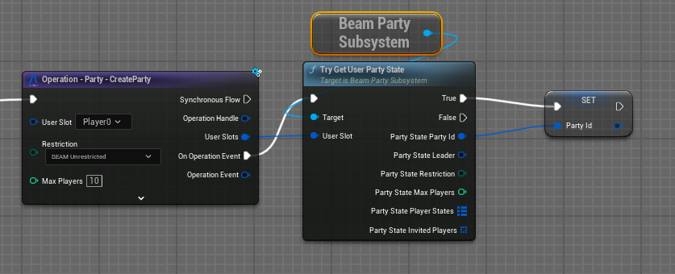
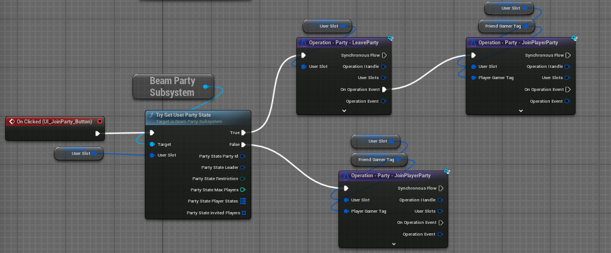
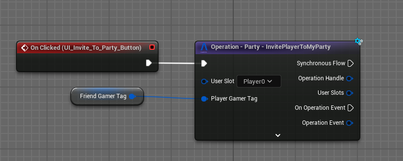
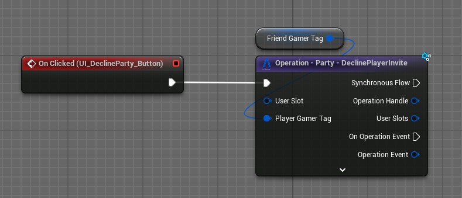
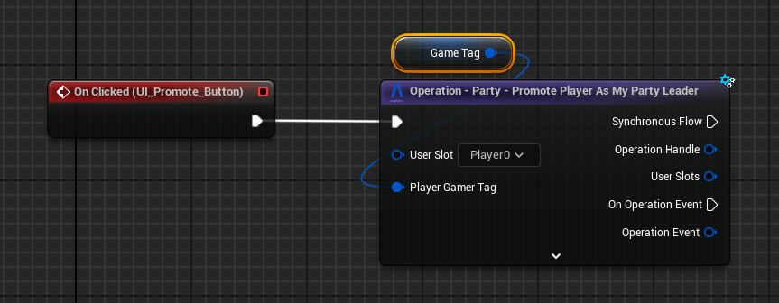
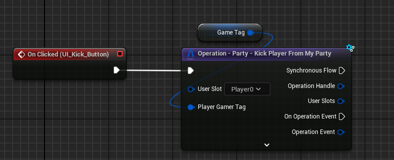
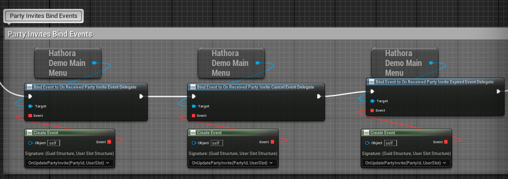
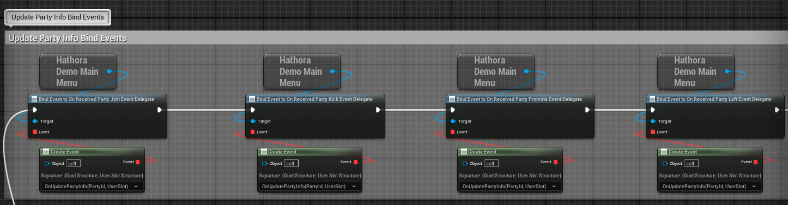
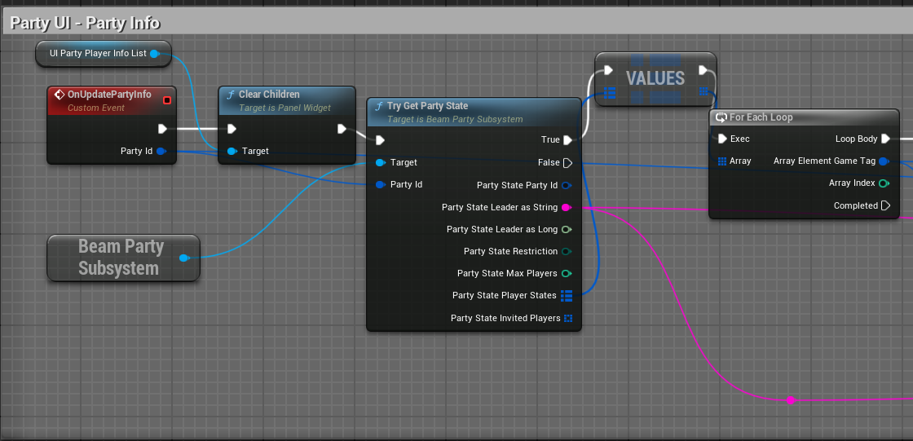

# Parties

Beamable's Party system provides a comprehensive set of tools for managing player groups in your game. This feature
enables players to create and join parties, manage invitations, and coordinate multiplayer experiences. Whether you're
developing a cooperative game, competitive multiplayer, or social gaming features, the Party system offers flexible
options for player collaboration and team organization.

The Beamable **Parties** feature supports various party management operations, including:

- Create
- Join
- Decline Invites

As party Leader you can:

- Invite a player
- Kick a player
- Promote a player to leader
- Cancel the invite

## Getting Started

This section will bring a simple case for a party system and show how to implement it using the Beamable's party subsystem.

To use the party system from Beamable, first you need to set up your environment with the PIE mode, which will allow you to play with multiple instances. This will help to understand the concepts and follow the guide.

With the multiplayer instances set we can start creating a Blueprint (BP) function that will do the basics operation of party.

### Creating a Party

1. Open your Level Blueprint (or some other BP)
2. Call the `Operation - Party - CreateParty`, It will create a party and put the user slot that called it inside the party.
3. Get the state of the current party that the user is part of.

???+ Warning "Unrestrict/InviteOnly Party Types"
    **Unrestrict**: Allows anyone to join the party without an invite. 
    **InviteOnly**: Only invited players can join the party.

### Joining a Party

1. Open your Level Blueprint (or some other BP)
2. Call the `TryGetUserPartyState` from the `BeamPartySubsystem`. If the player is already in a party, it will return true and you need to first remove the player from the party before joining another party. If you try to join directly to another party, it will return an error.
3. After verifying and removing the player from the party if necessary, you will call the operation `Operation - Party - JoinPlayerParty`.

???+ Warning "Join Unrestrict Party"
    If the party is the **unrestrict** type, it's possible to join without receiving an invite from another player just by calling the join operation.

### Inviting player (Leader Only)

1. Open your Level Blueprint (or some other BP)
2. Call the `Operation - Party - InvitePlayerToMyParty`, It will send a invite to a given FBeamGamerTag.

???+ Warning "Friends"
    It's **NOT** required to be a friend to receive/send a party invite.

### Declining Invites

1. Open your Level Blueprint (or some other BP)
2. Call the `Operation - Party - DeclinePlayerInvite`, It will remove the received invite from the invite list of the player.

### Canceling Invite (Leader Only)

1. Open your Level Blueprint (or some other BP)
2. Call the `Operation - Party - CancelPlayerPartyInvite`, It will cancel the invite sent to another player.

### Kicking a Player (Leader Only)

1. Open your Level Blueprint (or some other BP)
2. Call the `Operation - Party - Kick Player From My Party`, It will remove a player from the party.

### Promoting Player to Leader (Leader Only)

1. Open your Level Blueprint (or some other BP)
2. Call the `Operation - Party - Promote Player As My Party Leader`, It will promote another player as the party leader.

???+ Warning "Leader Leave the Party"
    When the leader leaves the party, it will automatically pick another player as the party leader.

## Events

The events in the party will be used to react to actions like received a invite, join a party, etc.

### Invite Events

The invite events will be used mostly to handle updates on the invite list, like showing a popup of an invite or updating the friend list with a new party invite.

### Party Events

The party events will be used to handle updates on the party, like if a player leaves/joins, we can update the visuals, etc.

### Party State Usage

In this case, we are iterating over the player states within the party. This can be used to populate the UI with the party's details.

