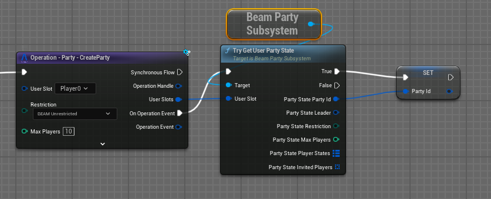
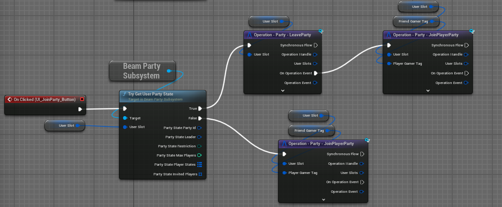
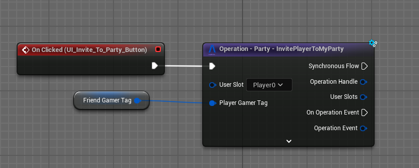
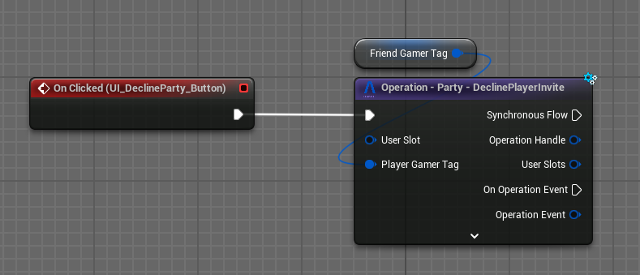
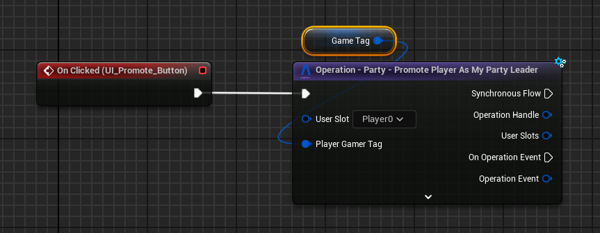
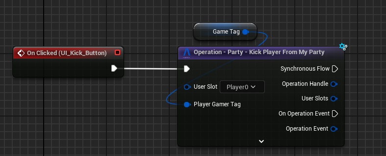
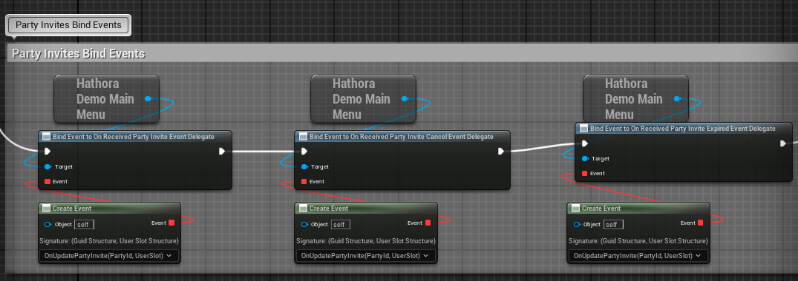
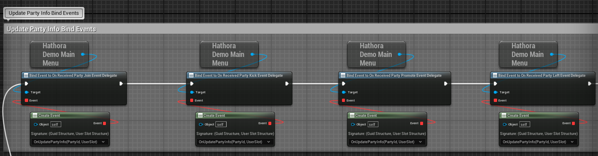
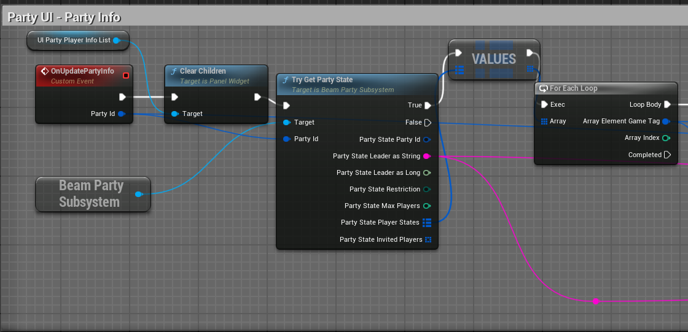

# Parties

Beamable's Party system provides a comprehensive set of tools for managing player groups in your game. Whether you're
developing a cooperative game, competitive multiplayer, or social gaming features, the Party system offers flexible
options for player collaboration and team organization.

The Beamable **Parties** feature supports various party management operations, including:

- Create
- Join
- Decline Invites

Party Leaders can:

- Invite a player
- Kick a player
- Promote a player to leader
- Cancel the invite

## Getting started

This section covers a simple party system case and shows how to implement it using Beamable's party subsystem.

To use the party system, first set up your environment with PIE mode, allowing you to play with multiple instances so that you can follow this guide.

With the multiplayer instances set, you can create a Blueprint (BP) function that will do the basic Party operations.

### Creating a party

1. Open your Level Blueprint (or some other BP)
2. Call `Operation - Party - CreateParty`. It will create a party and put the user slot that called it inside the party
3. Get the state of the current party that the user is party of

???+ Warning "Unrestrict/InviteOnly Party Types"
    **Unrestrict**: Allows anyone to join the party without an invite. 
    **InviteOnly**: Only invited players can join the party.

### Joining a party

1. Open your Level Blueprint (or some other BP)
2. Call `TryGetUserPartyState` from the `BeamPartySubsystem`
    - If the player is already in a party, it will return `true`
    - A player must be removed from their current party before joining another. Trying to join without doing so will return an error
3. After verifying and removing the player from their existing party if necessary, call the operation: `Operation - Party - JoinPlayerParty`

???+ Warning "Join Unrestricted Party"
    If the party type is `unrestrict`, you can join without receiving an invite from another player.

### Inviting players (leader only)

1. Open your Level Blueprint (or some other BP)
2. Call `Operation - Party - InvitePlayerToMyParty`. It will send an invite to a given `FBeamGamerTag`

???+ Warning "Friends"
    It is **NOT** required to be a friend to receive/send a party invite.

### Declining invites

1. Open your Level Blueprint (or some other BP)
2. Call `Operation - Party - DeclinePlayerInvite`. It will remove the received invite from the invite list of the player

### Canceling invite (leader only)

1. Open your Level Blueprint (or some other BP)
2. Call `Operation - Party - CancelPlayerPartyInvite`. It will cancel the invite sent to another player

### Kicking a player (leader only)

1. Open your Level Blueprint (or some other BP)
2. Call `Operation - Party - Kick Player From My Party`. It will remove a player from the party

### Promoting player to leader (leader only)

1. Open your Level Blueprint (or some other BP)
2. Call `Operation - Party - Promote Player As My Party Leader`. It will promote another player as the party leader

???+ Warning "Leader Leaving Party"
    When the leader leaves the party, another player will automatically be selected as the party leader.

## Events

Events in the party are used to react to actions such as receiving an invite or joining a party.

### Invite events

Invite events are used mostly to handle updates to the invite list, such as showing a popup for an invite or updating the friend list with a new party invite.

### Party events

Party Events are used to handle updates to the party, like updating visuals when players leave/join, for example.

### Party state usage

In this case, the example iterates over the player states within the party. This can be used to populate the UI with the party's details.

